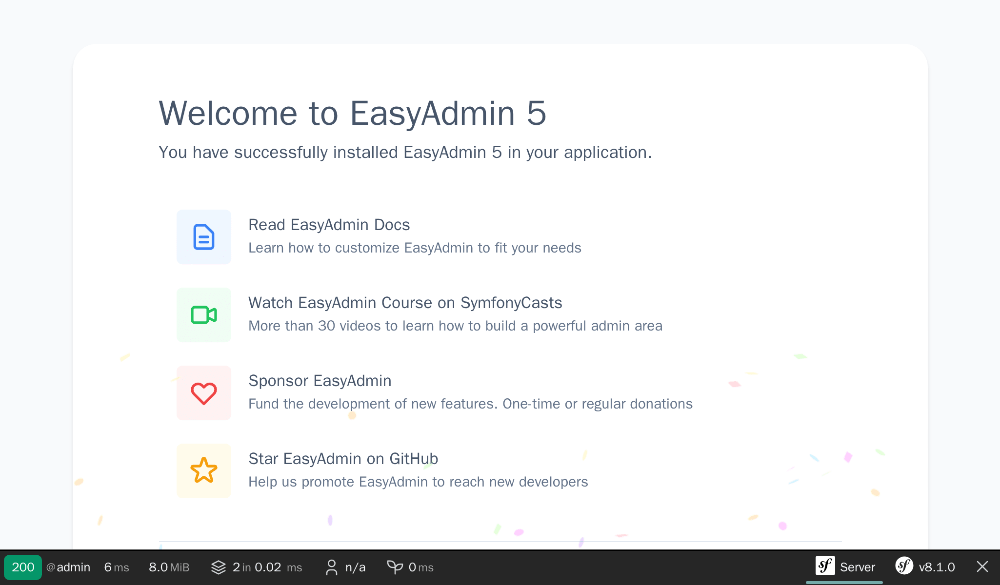

راه‌اندازی پشت صحنه‌ی مدیریتی
=========================================================

.. index::
    single: EasyAdmin
    single: Admin
    single: Backend

وظیفه مدیران پروژه، افزودن کنفرانس‌های آینده به پایگاه‌داده است. *پشت صحنه‌ی مدیریتی*، یک قسمت محافظت‌شده در وبسایت است که *مدیران پروژه* می‌توانند داده‌های وبسایت را مدیریت کرده، ارسال بازخوردها را تعدیل نموده و وظایفِ متعدد دیگری را انجام دهند.

چگونه می‌توانیم این بخش را به سرعت ایجاد کنیم؟ به کمک یک باندل که قادر به تولید پشت صحنه‌ی مدیریتی بر اساس مدل پروژه است. باندل EasyAdmin کاملاً برای این کار مناسب می باشد.

نصب وابستگی‌های بیشتر
-----------------------------------------

با اینکه بسته‌ی ``webapp`` به صورت خودکار بسته‌های خوب زیادی را اضافه کرد، برای برخی ویژگی‌های خاص‌تر، نیاز داریم که وابستگی‌های بیشتری اضافه کنیم. چگونه می‌توانیم وابستگی‌های بیشتری را اضافه کنیم؟ از طریق Composer. در کنار بسته‌های «معمولی» Composer، قصد داریم تا با دو نوع «ویژه» از این بسته‌ها کار کنیم:

* *کامپوننت‌های سیمفونی*: بسته‌هایی که ویژگی‌های مرکزی و انتزاع‌های سطح پایین که اکثر اپلیکیشن‌ها به آن احتیاج دارند را پیاده‌سازی می‌کنند (راه‌یابی، کنسول، کلاینت HTTP، mailer، نهان‌سازی و ...)؛

* *باندل‌های سیمفونی*: بسته‌هایی که ویژگی‌های سطح بالا را اضافه می‌کنند و ادغام با کتابخانه‌های شخص ثالث را فراهم می‌آورند (باندل‌ها اکثراً توسط جامعه‌ی سیمفونی ارائه می‌شوند).

بیایید EasyAdmin را به عنوان یک وابستگی پروژه اضافه کنیم:

.. code-block:: terminal

    $ symfony composer req "easycorp/easyadmin-bundle:^5"

*اسامی مستعار (Aliases)* از ویژگی‌های Composer نیستند، بلکه یک مفهوم هستند که توسط سیمفونی و برای راحتی شما مهیا شده‌اند. اسامی مستعار، میانبرهایی برای بسته‌های محبوب Composer هستند. یک ORM برای اپلیکیشن خود می‌خواهید؟ ``orm`` را نصب (require) کنید. می‌خواهید API توسعه دهید؟ ``api`` را نصب کنید. این اسامی مستعار به صورت خودکار به یک یا چند بسته‌ی معمولی Composer تبدیل می‌شوند. این اسامی براساس نظرات شخصی تیم مرکزی سیمفونی ساخته شده‌اند.

یک ویژگی شسته‌رفته‌ی دیگر این است که همواره می‌توانید از vendor ``symfony`` صرف نظر کنید. ``cache`` را به جای ``symfony/cache`` نصب کنید.

.. tip::

    آیا به خاطر دارید که قبلاً به یک افزونه‌ی Composer با عنوان ``symfony/flex`` اشاره کردیم؟ اسامی مستعار یکی از ویژگی‌های آن هستند.

پیکربندی EasyAdmin
---------------------------------

EasyAdmin به صورت خودکار، یک ناحیه‌ی مدیریتی برای اپلیکیشن شما بر اساس کنترلرهای مشخص تولید می‌کند.

برای شروع کار با EasyAdmin، بیایید یک «داشبورد مدیریت وب» تولید کنیم که مدخل اصلی برای مدیریت داده‌های وبسایت خواهد بود:

.. code-block:: terminal
    :class: answers(DashboardController||src/Controller/Admin/)

    $ symfony console make:admin:dashboard

پذیرفتن پاسخ‌های پیش‌فرض، کنترلر زیر را ایجاد می‌کند:

.. code-block:: php
    :caption: src/Controller/Admin/DashboardController.php
    :class: ignore

    namespace App\Controller\Admin;

    use EasyCorp\Bundle\EasyAdminBundle\Attribute\AdminDashboard;
    use EasyCorp\Bundle\EasyAdminBundle\Config\Dashboard;
    use EasyCorp\Bundle\EasyAdminBundle\Config\MenuItem;
    use EasyCorp\Bundle\EasyAdminBundle\Controller\AbstractDashboardController;
    use Symfony\Component\HttpFoundation\Response;

    #[AdminDashboard(routePath: '/admin', routeName: 'admin')]
    class DashboardController extends AbstractDashboardController
    {
        public function index(): Response
        {
            return parent::index();
        }

        public function configureDashboard(): Dashboard
        {
            return Dashboard::new()
                ->setTitle('Guestbook');
        }

        public function configureMenuItems(): iterable
        {
            yield MenuItem::linkToDashboard('Dashboard', 'fa fa-home');
            // yield MenuItem::linkTo(SomeCrudController::class, 'The Label', 'fas fa-list');
        }
    }

طبق قرارداد، تمام کنترلرهای مدیریت در فضای نام مخصوص خودشان یعنی ``App\Controller\Admin`` ذخیره می‌شوند.

به پشت صحنه‌ی مدیریتیِ تولیدشده در آدرس ``/admin`` که توسط attribute‌ی ``#[AdminDashboard]`` پیکربندی شده است دسترسی پیدا کنید؛ می‌توانید این URL را به هر چیزی که دوست دارید تغییر دهید:

بوم! ما یک پوسته‌ی واسط مدیریتیِ خوش‌ظاهر داریم که آماده‌ی سفارشی‌سازی بر اساس نیازهای ماست.

.. index::
    single: CRUD

گام بعدی، ایجاد کنترلرهایی برای مدیریت کنفرانس‌ها و کامنت‌هاست.

در کنترلر داشبورد، شاید متوجه متد ``configureMenuItems()`` شده باشید که دارای کامنتی درباره‌ی افزودن پیوند به «CRUDها» است. **CRUD** سرنامِ «Create, Read, Update, and Delete» (ایجاد، خواندن، به‌روزرسانی و حذف) است، یعنی چهار عملیات پایه‌ای که می‌خواهید روی هر موجودیتی انجام دهید. این دقیقاً همان چیزی است که می‌خواهیم یک مدیر برای ما انجام دهد؛ EasyAdmin حتی آن را با رسیدگی به جستجو و فیلترکردن، به سطح بالاتری می‌برد.

بیایید یک CRUD برای کنفرانس‌ها تولید کنیم:

.. code-block:: terminal
    :class: answers(1||src/Controller/Admin/||App\\Controller\\Admin)

    $ symfony console make:admin:crud

برای ایجاد یک واسط مدیریتی برای کنفرانس‌ها ``1`` را انتخاب کنید و برای سایر سوالات از پاسخ‌های پیش‌فرض استفاده کنید. فایل زیر باید تولید شود:

.. code-block:: php
    :caption: src/Controller/Admin/ConferenceCrudController.php
    :class: ignore

    namespace App\Controller\Admin;

    use App\Entity\Conference;
    use EasyCorp\Bundle\EasyAdminBundle\Controller\AbstractCrudController;

    class ConferenceCrudController extends AbstractCrudController
    {
        public static function getEntityFqcn(): string
        {
            return Conference::class;
        }

        /*
        public function configureFields(string $pageName): iterable
        {
            return [
                IdField::new('id'),
                TextField::new('title'),
                TextEditorField::new('description'),
            ];
        }
        */
    }

همین کار را برای کامنت‌ها انجام دهید:

.. code-block:: terminal
    :class: answers(0||src/Controller/Admin/||App\\Controller\\Admin)

    $ symfony console make:admin:crud

گام آخر، پیوند دادن CRUDهای مدیریت کنفرانس و کامنت به داشبورد است:

.. code-block:: diff
    :caption: patch_file

    --- i/src/Controller/Admin/DashboardController.php
    +++ w/src/Controller/Admin/DashboardController.php
    @@ -44,7 +44,8 @@ class DashboardController extends AbstractDashboardController

         public function configureMenuItems(): iterable
         {
    -        yield MenuItem::linkToDashboard('Dashboard', 'fa fa-home');
    -        // yield MenuItem::linkTo(SomeCrudController::class, 'The Label', 'fas fa-list');
    +        yield MenuItem::linkToRoute('Back to the website', 'fas fa-home', 'homepage');
    +        yield MenuItem::linkTo(ConferenceCrudController::class, 'Conferences', 'fas fa-map-marker-alt');
    +        yield MenuItem::linkTo(CommentCrudController::class, 'Comments', 'fas fa-comments');
         }
     }

ما متد ``configureMenuItems()`` را بازنویسی کردیم تا آیتم‌های منو را با آیکون‌های مرتبط برای کنفرانس‌ها و کامنت‌ها اضافه کنیم و یک پیوند بازگشت به صفحه‌ی اصلی وبسایت قرار دهیم. کلاس‌های ``ConferenceCrudController`` و ``CommentCrudController`` در همان فضای نام ``App\Controller\Admin`` داشبورد قرار دارند، بنابراین به هیچ بیانیه‌ی ``use`` اضافه‌ای نیاز ندارند.

EasyAdmin یک API برای تسهیل پیوند دادن به CRUDهای موجودیت از طریق متد ``MenuItem::linkTo()`` فراهم می‌کند که کلاس کنترلر CRUD را می‌گیرد.

صفحه‌ی اصلی داشبورد فعلاً خالی است. این جایی است که می‌توانید برخی آمار یا هر اطلاعات مرتبط دیگری را نمایش دهید. از آنجایی که چیز مهمی برای نمایش نداریم، بیایید به فهرست کنفرانس‌ها بازهدایت کنیم:

.. code-block:: diff
    :caption: patch_file

    --- i/src/Controller/Admin/DashboardController.php
    +++ w/src/Controller/Admin/DashboardController.php
    @@ -8,6 +8,7 @@ use EasyCorp\Bundle\EasyAdminBundle\Attribute\AdminDashboard;
     use EasyCorp\Bundle\EasyAdminBundle\Config\Dashboard;
     use EasyCorp\Bundle\EasyAdminBundle\Config\MenuItem;
     use EasyCorp\Bundle\EasyAdminBundle\Controller\AbstractDashboardController;
    +use EasyCorp\Bundle\EasyAdminBundle\Router\AdminUrlGenerator;
     use Symfony\Component\HttpFoundation\Response;

     #[AdminDashboard(routePath: '/admin', routeName: 'admin')]
    @@ -15,7 +16,10 @@ class DashboardController extends AbstractDashboardController
     {
         public function index(): Response
         {
    -        return parent::index();
    +        $routeBuilder = $this->container->get(AdminUrlGenerator::class);
    +        $url = $routeBuilder->setController(ConferenceCrudController::class)->generateUrl();
    +
    +        return $this->redirect($url);

             // Option 1. You can make your dashboard redirect to some common page of your backend
             //

هنگام نمایش روابط موجودیت‌ها (کنفرانس مرتبط با یک کامنت)، EasyAdmin تلاش می‌کند تا از یک نمایش رشته‌ای کنفرانس استفاده کند. به صورت پیش‌فرض، اگر موجودیت متد «جادویی» ``__toString()`` را تعریف نکرده باشد، از قراردادی استفاده می‌کند که نام موجودیت و کلید اصلی (مانند ``Conference #1``) را به کار می‌برد. برای معنادارتر کردن این نمایش، چنین متدی را به کلاس ``Conference`` اضافه کنید:

.. code-block:: diff
    :caption: patch_file

    --- i/src/Entity/Conference.php
    +++ w/src/Entity/Conference.php
    @@ -35,6 +35,11 @@ class Conference
             $this->comments = new ArrayCollection();
         }

    +    public function __toString(): string
    +    {
    +        return $this->city.' '.$this->year;
    +    }
    +
         public function getId(): ?int
         {
             return $this->id;

حالا می‌توانید کنفرانس‌ها را مستقیماً از پشت صحنه‌ی مدیریتی اضافه/ویرایش/حذف کنید. با آن بازی کنید و حداقل یک کنفرانس اضافه کنید.

.. figure:: screenshots/easy-admin.png
    :alt: /admin
    :align: center
    :figclass: with-browser

سفارشی‌سازی EasyAdmin
---------------------------------------------

پشت صحنه‌ی مدیریتیِ پیش‌فرض به خوبی کار می‌کند، اما می‌توان آن را به روش‌های زیادی سفارشی‌سازی کرد تا تجربه بهبود یابد. بیایید برای نشان‌دادن برخی امکانات، چند تغییر ساده روی موجودیت Comment انجام دهیم:

.. code-block:: diff
    :caption: patch_file

    --- i/src/Controller/Admin/CommentCrudController.php
    +++ w/src/Controller/Admin/CommentCrudController.php
    @@ -3,10 +3,17 @@
     namespace App\Controller\Admin;

     use App\Entity\Comment;
    +use EasyCorp\Bundle\EasyAdminBundle\Config\Crud;
    +use EasyCorp\Bundle\EasyAdminBundle\Config\Filters;
     use EasyCorp\Bundle\EasyAdminBundle\Controller\AbstractCrudController;
    +use EasyCorp\Bundle\EasyAdminBundle\Field\AssociationField;
    +use EasyCorp\Bundle\EasyAdminBundle\Field\DateTimeField;
    +use EasyCorp\Bundle\EasyAdminBundle\Field\EmailField;
     use EasyCorp\Bundle\EasyAdminBundle\Field\IdField;
    +use EasyCorp\Bundle\EasyAdminBundle\Field\TextareaField;
     use EasyCorp\Bundle\EasyAdminBundle\Field\TextEditorField;
     use EasyCorp\Bundle\EasyAdminBundle\Field\TextField;
    +use EasyCorp\Bundle\EasyAdminBundle\Filter\EntityFilter;

     class CommentCrudController extends AbstractCrudController
     {
    @@ -15,14 +22,43 @@ class CommentCrudController extends AbstractCrudController
             return Comment::class;
         }

    -    /*
    +    public function configureCrud(Crud $crud): Crud
    +    {
    +        return $crud
    +            ->setEntityLabelInSingular('Conference Comment')
    +            ->setEntityLabelInPlural('Conference Comments')
    +            ->setSearchFields(['author', 'text', 'email'])
    +            ->setDefaultSort(['createdAt' => 'DESC'])
    +        ;
    +    }
    +
    +    public function configureFilters(Filters $filters): Filters
    +    {
    +        return $filters
    +            ->add(EntityFilter::new('conference'))
    +        ;
    +    }
    +
         public function configureFields(string $pageName): iterable
         {
    -        return [
    -            IdField::new('id'),
    -            TextField::new('title'),
    -            TextEditorField::new('description'),
    -        ];
    +        yield AssociationField::new('conference');
    +        yield TextField::new('author');
    +        yield EmailField::new('email');
    +        yield TextareaField::new('text')
    +            ->hideOnIndex()
    +        ;
    +        yield TextField::new('photoFilename')
    +            ->onlyOnIndex()
    +        ;
    +
    +        $createdAt = DateTimeField::new('createdAt')->setFormTypeOptions([
    +            'years' => range(date('Y'), date('Y') + 5),
    +            'widget' => 'single_text',
    +        ]);
    +        if (Crud::PAGE_EDIT === $pageName) {
    +            yield $createdAt->setFormTypeOption('disabled', true);
    +        } else {
    +            yield $createdAt;
    +        }
         }
    -    */
     }

برای سفارشی‌سازی بخش ``Comment``، فهرست‌کردن صریح فیلدها در متد ``configureFields()`` به ما اجازه می‌دهد تا آن‌ها را به ترتیب دلخواه مرتب کنیم. برخی فیلدها بیشتر پیکربندی شده‌اند، مانند پنهان‌کردن فیلد متن در صفحه‌ی فهرست.

چند کامنت بدون عکس اضافه کنید. فعلاً تاریخ را به صورت دستی تنظیم کنید؛ در گامی بعدی، ستون ``createdAt`` را به صورت خودکار پر خواهیم کرد.

.. figure:: screenshots/easy-admin-comments.png
    :alt: /admin?crudAction=index&crudId=2bfa220&menuIndex=2&submenuIndex=-1
    :align: center
    :figclass: with-browser

متد ``configureFilters()`` تعریف می‌کند که کدام فیلترها در بالای فیلد جستجو نمایش داده شوند.

.. figure:: screenshots/easy-admin-filter.png
    :alt: /admin?crudAction=index&crudId=2bfa220&menuIndex=2&submenuIndex=-1
    :align: center
    :figclass: with-browser

این سفارشی‌سازی‌ها تنها معرفی کوچکی از امکاناتی است که EasyAdmin ارائه می‌دهد.

با پشت صحنه‌ی مدیریتی بازی کنید، مثلاً کامنت‌ها را بر اساس کنفرانس فیلتر کنید یا کامنت‌ها را بر اساس رایانامه جستجو کنید. تنها مشکل این است که هر کسی می‌تواند به پشت صحنه دسترسی پیدا کند. نگران نباشید، در گامی آینده آن را امن خواهیم کرد.

.. code-block:: terminal
    :class: hide

    $ symfony console dbal:run-sql "TRUNCATE conference RESTART IDENTITY CASCADE"

.. sidebar:: بیشتر بدانید

    * `مستندات EasyAdmin`_؛

    * `مرجع پیکربندی چارچوب سیمفونی`_؛

    * `متدهای جادویی PHP`_.

.. _`مستندات EasyAdmin`: https://symfony.com/bundles/EasyAdminBundle/4.x/index.html
.. _`مرجع پیکربندی چارچوب سیمفونی`: https://symfony.com/doc/current/reference/configuration/framework.html
.. _`متدهای جادویی PHP`: https://www.php.net/manual/en/language.oop5.magic.php
