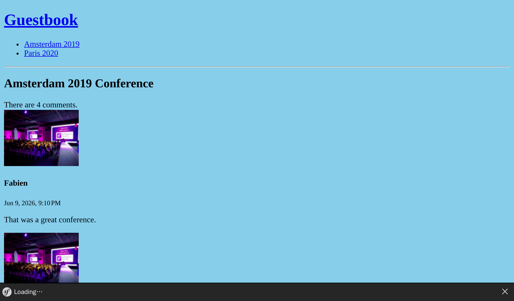

Gérer le cycle de vie des objets Doctrine
==========================================

Lors de la création d'un nouveau commentaire, ce serait bien si la date ``createdAt`` était automatiquement définie à la date et à l'heure courantes.

Doctrine a différentes façons de manipuler les objets et leurs propriétés pendant leur cycle de vie (avant la création de la ligne dans la base de données, après la mise à jour de la ligne, etc.).

Définir des *lifecycle callbacks*
----------------------------------

.. index::
    single: Doctrine;Lifecycle
    single: Attributes;ORM\\Entity
    single: Attributes;ORM\\HasLifecycleCallbacks
    single: Attributes;ORM\\PrePersist

Lorsque le comportement n'a besoin d'aucun service et ne doit être appliqué qu'à un seul type d'entité, définissez un callback dans la classe entité :

.. code-block:: diff
    :caption: patch_file

    --- i/src/Controller/Admin/CommentCrudController.php
    +++ w/src/Controller/Admin/CommentCrudController.php
    @@ -57,8 +57,6 @@ class CommentCrudController extends AbstractCrudController
             ]);
             if (Crud::PAGE_EDIT === $pageName) {
                 yield $createdAt->setFormTypeOption('disabled', true);
    -        } else {
    -            yield $createdAt;
             }
         }
     }
    --- i/src/Entity/Comment.php
    +++ w/src/Entity/Comment.php
    @@ -7,6 +7,7 @@ use Doctrine\DBAL\Types\Types;
     use Doctrine\ORM\Mapping as ORM;

     #[ORM\Entity(repositoryClass: CommentRepository::class)]
    +#[ORM\HasLifecycleCallbacks]
     class Comment
     {
         #[ORM\Id]
    @@ -86,6 +87,12 @@ class Comment
             return $this;
         }

    +    #[ORM\PrePersist]
    +    public function setCreatedAtValue(): void
    +    {
    +        $this->createdAt = new \DateTimeImmutable();
    +    }
    +
         public function getConference(): ?Conference
         {
             return $this->conference;

L'*événement* ``ORM\PrePersist`` est déclenché lorsque l'objet est enregistré dans la base de données pour la toute première fois. Lorsque cela se produit, la méthode ``setCreatedAtValue()`` est appelée et la date et l'heure courantes sont utilisées pour la valeur de la propriété ``createdAt``.

Ajouter des *slugs* aux conférences
------------------------------------

Les URLs des conférences n'ont pas de sens : ``/conference/1``. Plus important encore, ils dépendent d'un détail d'implémentation (la clé primaire de la base de données est révélée).

Pourquoi ne pas plutôt utiliser des URLs telles que ``/conference/paris-2020`` ? Ce serait plus joli. ``paris-2020``, c'est ce que l'on appelle le *slug* de la conférence.

.. index::
    single: Command;make:entity

Ajoutez une nouvelle propriété ``slug`` pour les conférences (une chaîne non nulle de 255 caractères) :

.. code-block:: terminal
    :class: answers(slug||string||255||no)

    $ symfony console make:entity Conference

.. index::
    single: Command;make:migration

Créez un fichier de migration pour ajouter la nouvelle colonne :

.. code-block:: terminal

    $ symfony console make:migration

.. index::
    single: Command;doctrine:migrations:migrate

Et exécutez cette nouvelle migration :

.. code-block:: terminal
    :class: ignore

    $ symfony console doctrine:migrations:migrate

Vous avez une erreur ? C'était prévu. Pourquoi ? Parce que nous avons demandé que le slug ne soit pas ``null``, et que les entrées existantes dans la base de données de la conférence obtiendront une valeur ``null`` lorsque la migration sera exécutée. Corrigeons cela en ajustant la migration :

.. code-block:: diff
    :caption: patch_file

    --- i/migrations/Version00000000000000.php
    +++ w/migrations/Version00000000000000.php
    @@ -20,7 +20,9 @@ final class Version00000000000000 extends AbstractMigration
         public function up(Schema $schema): void
         {
             // this up() migration is auto-generated, please modify it to your needs
    -        $this->addSql('ALTER TABLE conference ADD slug VARCHAR(255) NOT NULL');
    +        $this->addSql('ALTER TABLE conference ADD slug VARCHAR(255)');
    +        $this->addSql("UPDATE conference SET slug=CONCAT(LOWER(city), '-', year)");
    +        $this->addSql('ALTER TABLE conference ALTER COLUMN slug SET NOT NULL');
         }

         public function down(Schema $schema): void

L'astuce ici est d'ajouter la colonne et de lui permettre d'être ``null``, puis de définir une valeur non ``null`` pour le slug, et enfin, de changer la colonne de slug pour ne plus permettre ``null``.

.. note::

    Pour un projet réel, l'utilisation de ``CONCAT(LOWER(city), '-', year)`` peut ne pas suffire. Nous aurions alors besoin d'utiliser le "vrai" Slugger.

.. index::
    single: Command;doctrine:migrations:migrate

La migration devrait fonctionner maintenant :

.. code-block:: terminal
    :class: answers(y)

    $ symfony console doctrine:migrations:migrate

.. index::
    single: Attributes;ORM\\UniqueEntity
    single: Attributes;ORM\\Column
    single: Components;Validator

Étant donné que l'application utilisera bientôt les slugs pour trouver chaque conférence, ajustons l'entité Conference pour s'assurer que les valeurs des slugs soient uniques dans la base de données :

.. code-block:: diff
    :caption: patch_file

    --- i/src/Entity/Conference.php
    +++ w/src/Entity/Conference.php
    @@ -6,8 +6,10 @@ use App\Repository\ConferenceRepository;
     use Doctrine\Common\Collections\ArrayCollection;
     use Doctrine\Common\Collections\Collection;
     use Doctrine\ORM\Mapping as ORM;
    +use Symfony\Bridge\Doctrine\Validator\Constraints\UniqueEntity;

     #[ORM\Entity(repositoryClass: ConferenceRepository::class)]
    +#[UniqueEntity('slug')]
     class Conference
     {
         #[ORM\Id]
    @@ -30,7 +32,7 @@ class Conference
         #[ORM\OneToMany(targetEntity: Comment::class, mappedBy: 'conference', orphanRemoval: true)]
         private Collection $comments;

    -    #[ORM\Column(length: 255)]
    +    #[ORM\Column(length: 255, unique: true)]
         private ?string $slug = null;

         public function __construct()

.. index::
    single: Command;make:migration

Comme vous l'aurez deviné, nous devons exécuter la danse de la migration :

.. code-block:: terminal

    $ symfony console make:migration

.. index::
    single: Command;doctrine:migrations:migrate

.. code-block:: terminal
    :class: answers(y)

    $ symfony console doctrine:migrations:migrate

Générer des slugs
-------------------

.. index::
    single: Components;String
    single: Slug

Générer un slug qui se lit bien dans une URL (où tout ce qui n'est pas des caractères ASCII doit être encodé) est une tâche difficile, surtout pour les langues autres que l'anglais. Comment convertir ``é`` en ``e`` par exemple ?

Au lieu de réinventer la roue, utilisons le composant Symfony ``String``, qui facilite la manipulation des chaînes et fournit un slugger.

Dans la classe ``Conference``, ajoutez une méthode ``computeSlug()``, qui calcule le slug en fonction des données de la conférence :

.. code-block:: diff
    :caption: patch_file

    --- i/src/Entity/Conference.php
    +++ w/src/Entity/Conference.php
    @@ -7,6 +7,7 @@ use Doctrine\Common\Collections\ArrayCollection;
     use Doctrine\Common\Collections\Collection;
     use Doctrine\ORM\Mapping as ORM;
     use Symfony\Bridge\Doctrine\Validator\Constraints\UniqueEntity;
    +use Symfony\Component\String\Slugger\SluggerInterface;

     #[ORM\Entity(repositoryClass: ConferenceRepository::class)]
     #[UniqueEntity('slug')]
    @@ -50,6 +51,13 @@ class Conference
             return $this->id;
         }

    +    public function computeSlug(SluggerInterface $slugger): void
    +    {
    +        if (!$this->slug || '-' === $this->slug) {
    +            $this->slug = (string) $slugger->slug((string) $this)->lower();
    +        }
    +    }
    +
         public function getCity(): ?string
         {
             return $this->city;

La méthode ``computeSlug()`` ne calcule un slug que lorsque le slug courant est vide ou défini à la valeur spéciale ``-``. Pourquoi avons-nous besoin de cette valeur particulière ``-`` ? Parce que lors de l'ajout d'une conférence dans l'interface d'administration, le slug est nécessaire. Nous avons donc besoin d'une valeur non vide qui indique à l'application que nous voulons que le slug soit généré automatiquement.

Définir un *lifecycle callback* complexe
-----------------------------------------

.. index::
    single: Doctrine;Entity Listener

Comme pour la propriété ``createdAt``, la propriété ``slug`` doit être définie automatiquement à chaque fois que la conférence est mise à jour en appelant la méthode ``computeSlug()``.

Mais comme cette méthode dépend d'une implémentation de ``SluggerInterface``, nous ne pouvons pas ajouter un événement ``prePersist`` comme avant (nous n'avons pas la possibilité d'injecter le slugger).

Créez plutôt un listener d'entité Doctrine :

.. code-block:: php
    :caption: src/EntityListener/ConferenceEntityListener.php

    namespace App\EntityListener;

    use App\Entity\Conference;
    use Doctrine\ORM\Event\PrePersistEventArgs;
    use Doctrine\ORM\Event\PreUpdateEventArgs;
    use Symfony\Component\String\Slugger\SluggerInterface;

    class ConferenceEntityListener
    {
        public function __construct(
            private SluggerInterface $slugger,
        ) {
        }

        public function prePersist(Conference $conference, PrePersistEventArgs $event): void
        {
            $conference->computeSlug($this->slugger);
        }

        public function preUpdate(Conference $conference, PreUpdateEventArgs $event): void
        {
            $conference->computeSlug($this->slugger);
        }
    }

Notez que le slug est modifié lorsqu'une nouvelle conférence est créée (``prePersist()``) et lorsqu'elle est mise à jour (``preUpdate()``).

Configurer un service dans le conteneur
---------------------------------------

.. index::
    single: Components;Dependency Injection
    single: Dependency Injection

Jusqu'à présent, nous n'avons pas parlé d'un élément clé de Symfony, le *conteneur d'injection de dépendance*. Le conteneur est responsable de la gestion des *services* : leur création, et leur injection en cas de besoin.

Un *service* est un objet "global" qui fournit des fonctionnalités (par exemple un *mailer*, un *logger*, un *slugger*, etc.) contrairement aux *objets de données* (par exemple les instances d'entités Doctrine).

Vous interagissez rarement directement avec le conteneur car il injecte automatiquement des objets de service quand vous en avez besoin : par exemple, le conteneur injecte les objets en arguments du contrôleur lorsque vous les typez.

Si vous vous demandez comment le listener d'événement a été initialisé à l'étape précédente, vous avez maintenant la réponse : le conteneur. Lorsqu'une classe implémente des interfaces spécifiques, le conteneur sait que la classe doit être initialisée d'une certaine manière.

Dans ce cas précis, puisque notre classe n'implémente aucune interface et n'étend aucune autre classe, Symfony ne peux pas la configurer automatiquement. Utilisons un attribut pour l'aider :

.. code-block:: diff
    :caption: patch_file

    --- i/src/EntityListener/ConferenceEntityListener.php
    +++ w/src/EntityListener/ConferenceEntityListener.php
    @@ -3,10 +3,14 @@
     namespace App\EntityListener;

     use App\Entity\Conference;
    +use Doctrine\Bundle\DoctrineBundle\Attribute\AsEntityListener;
     use Doctrine\ORM\Event\PrePersistEventArgs;
     use Doctrine\ORM\Event\PreUpdateEventArgs;
    +use Doctrine\ORM\Events;
     use Symfony\Component\String\Slugger\SluggerInterface;

    +#[AsEntityListener(event: Events::prePersist, entity: Conference::class)]
    +#[AsEntityListener(event: Events::preUpdate, entity: Conference::class)]
     class ConferenceEntityListener
     {
         public function __construct(

.. note::

    Ne confondez pas les listeners d'événements Doctrine et ceux de Symfony. Même s'ils se ressemblent beaucoup, ils n'utilisent pas la même infrastructure en interne.

Utiliser des slugs dans l'application
-------------------------------------

Essayez d'ajouter d'autres conférences dans l'interface d'administration et changez la ville ou l'année d'une conférence existante ; le slug ne sera pas mis à jour sauf si vous utilisez la valeur spéciale ``-``.

.. index::
    single: Twig;for
    single: Twig;if
    single: Twig;path
    single: Attributes;Route

La dernière modification consiste à mettre à jour les contrôleurs et les modèles pour utiliser le ``slug`` de la conférence pour les routes, au lieu de son ``id``. Comme le paramètre de route n'est plus la clé primaire de l'entité, utilisez la syntaxe ``{slug:conference}`` pour indiquer à Symfony de récupérer la ``$conference`` en faisant correspondre sa propriété ``slug`` ; l'attribut ``#[MapEntity]`` n'est plus nécessaire :

.. code-block:: diff
    :caption: patch_file

    --- i/src/Controller/ConferenceController.php
    +++ w/src/Controller/ConferenceController.php
    @@ -5,7 +5,6 @@
     use App\Entity\Conference;
     use App\Repository\CommentRepository;
     use App\Repository\ConferenceRepository;
    -use Symfony\Bridge\Doctrine\Attribute\MapEntity;
     use Symfony\Bundle\FrameworkBundle\Controller\AbstractController;
     use Symfony\Component\HttpFoundation\Response;
     use Symfony\Component\HttpKernel\Attribute\MapQueryParameter;
    @@ -20,6 +20,6 @@ final class ConferenceController extends AbstractController
             ]);
         }

    -    #[Route('/conference/{id}', name: 'conference')]
    -    public function show(#[MapEntity] Conference $conference, CommentRepository $commentRepository, #[MapQueryParameter(options: ['min_range' => 0])] int $offset = 0): Response
    +    #[Route('/conference/{slug:conference}', name: 'conference')]
    +    public function show(Conference $conference, CommentRepository $commentRepository, #[MapQueryParameter(options: ['min_range' => 0])] int $offset = 0): Response
         {
    --- i/templates/base.html.twig
    +++ w/templates/base.html.twig
    @@ -16,7 +16,7 @@
                 <h1><a href="{{ path('homepage') }}">Guestbook</a></h1>
                 <ul>
                 
    -                <li><a href="{{ path('conference', { id: conference.id }) }}">{{ conference }}</a></li>
    +                <li><a href="{{ path('conference', { slug: conference.slug }) }}">{{ conference }}</a></li>
                 
                 </ul>
                 

    --- i/templates/conference/index.html.twig
    +++ w/templates/conference/index.html.twig
    @@ -8,7 +8,7 @@
         
             <h4>{{ conference }}</h4>
             

    -            <a href="{{ path('conference', { id: conference.id }) }}">View</a>
    +            <a href="{{ path('conference', { slug: conference.slug }) }}">View</a>
             

         
     
    --- i/templates/conference/show.html.twig
    +++ w/templates/conference/show.html.twig
    @@ -22,10 +22,10 @@
             

             
    -            <a href="{{ path('conference', { id: conference.id, offset: previous }) }}">Previous</a>
    +            <a href="{{ path('conference', { slug: conference.slug, offset: previous }) }}">Previous</a>
             
             
    -            <a href="{{ path('conference', { id: conference.id, offset: next }) }}">Next</a>
    +            <a href="{{ path('conference', { slug: conference.slug, offset: next }) }}">Next</a>
             
         
             
No comments have been posted yet for this conference.

L'accès à la page d'une conférence devrait maintenant se faire grâce à son slug :

.. sidebar:: Aller plus loin

    * Le `système d'événements Doctrine`_ (*lifecycle callbacks* et *listeners*, *entity listeners* et *lifecycle subscribers*) ;

    * La `documentation du composant String`_ ;

    * Le `conteneur de services`_ ;

    * La `cheat sheet des services de Symfony`_.

.. _`système d'événements Doctrine`: https://symfony.com/doc/current/doctrine/events.html
.. _`documentation du composant String`: https://symfony.com/doc/current/components/string.html
.. _`conteneur de services`: https://symfony.com/doc/current/service_container.html
.. _`cheat sheet des services de Symfony`: https://github.com/andreia/symfony-cheat-sheets/blob/master/Symfony4/services_en_42.pdf
