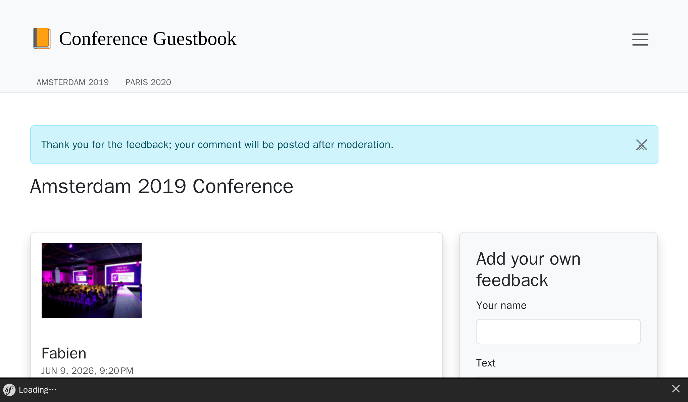
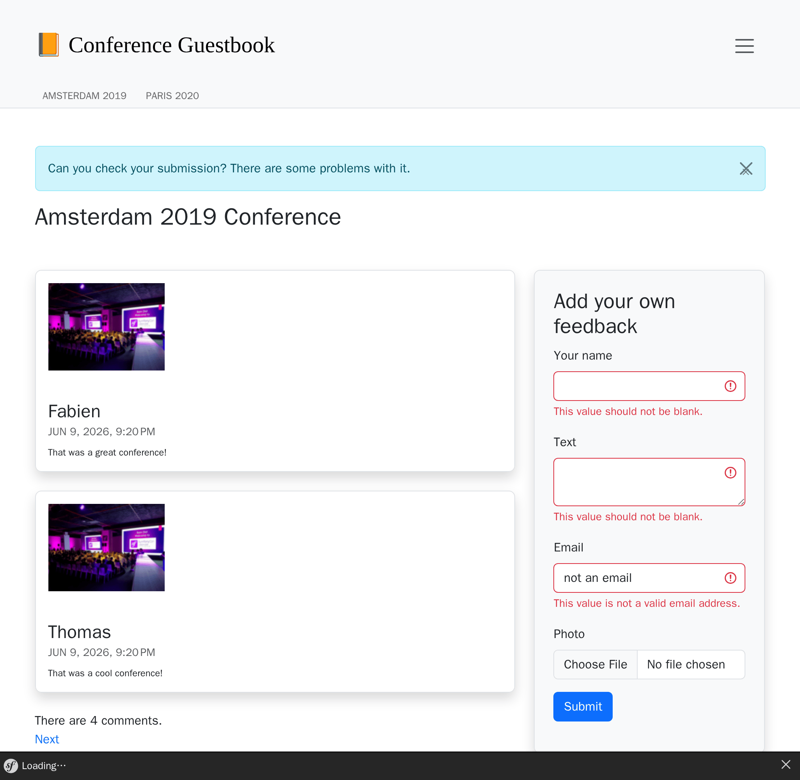

Notifiche per tutti
===================

L'applicazione Guestbook raccoglie i feedback sulle conferenze. Ma non siamo bravi a dare feedback ai nostri utenti.

Poiché i commenti sono moderati, probabilmente gli utenti non capiranno perché i loro commenti non vengono pubblicati immediatamente. Potrebbero anche re-inviarli pensando che ci siano stati dei problemi tecnici. Dare loro un feedback dopo aver inviato un commento sarebbe fantastico.

Inoltre, probabilmente dovremmo far loro sapere quando il commento è stato pubblicato. Chiediamo la loro email, quindi faremmo meglio ad usarla.

Ci sono molti modi per notificare gli utenti. L'e-mail è il primo mezzo a cui si potrebbe pensare, ma è anche possibile inviare notifiche nell'applicazione web. Potremmo anche pensare di inviare messaggi SMS, postare un messaggio su Slack o Telegram. Ci sono molte opzioni.

.. index::
    single: Components;Notifier
    single: Notifier

Il componente Notifier di Symfony implementa molte strategie di notifica.

Invio di notifiche tramite browser
----------------------------------

.. index::
    single: Flash Messages

Come primo passo, notifichiamo direttamente nel browser agli utenti che i commenti sono moderati dopo il loro invio:

.. code-block:: diff
    :caption: patch_file

    --- i/src/Controller/ConferenceController.php
    +++ w/src/Controller/ConferenceController.php
    @@ -16,6 +16,8 @@ use Symfony\Component\HttpFoundation\Response;
     use Symfony\Component\HttpKernel\Attribute\MapQueryParameter;
     use Symfony\Component\HttpKernel\Attribute\RateLimit;
     use Symfony\Component\Messenger\MessageBusInterface;
    +use Symfony\Component\Notifier\Notification\Notification;
    +use Symfony\Component\Notifier\NotifierInterface;
     use Symfony\Component\Routing\Attribute\Route;

     final class ConferenceController extends AbstractController
    @@ -45,7 +47,8 @@ final class ConferenceController extends AbstractController
             Request $request,
             Conference $conference,
             CommentRepository $commentRepository,
    +        NotifierInterface $notifier,
             #[Autowire('%photo_dir%')] string $photoDir,
             #[MapQueryParameter(options: ['min_range' => 0])] int $offset = 0,
         ): Response {
             $comment = new Comment();
    @@ -69,8 +72,14 @@ final class ConferenceController extends AbstractController
                 ];
                 $this->bus->dispatch(new CommentMessage($comment->getId(), $context));

    +            $notifier->send(new Notification('Thank you for the feedback; your comment will be posted after moderation.', ['browser']));
    +
                 return $this->redirectToRoute('conference', ['slug' => $conference->getSlug()]);
             }

    +        if ($form->isSubmitted()) {
    +            $notifier->send(new Notification('Can you check your submission? There are some problems with it.', ['browser']));
    +        }
    +
             $paginator = $commentRepository->getCommentPaginator($conference, $offset);

Il notificatore *invia* una *notifica* ai *destinatari* attraverso un *canale*.

Una notifica ha un oggetto, un contenuto facoltativo e un'importanza.

Una notifica viene inviata su uno o più canali a seconda della sua importanza. È possibile inviare notifiche urgenti via SMS e notifiche regolari, ad esempio, via e-mail.

Per le notifiche nel browser, non abbiamo destinatari.

.. index::
    single: Twig;for

La notifica nel browser utilizza *messaggi flash* tramite la sezione *notifiche*. Dobbiamo visualizzarli aggiornando il template della conferenza:

.. code-block:: diff
    :caption: patch_file

    --- i/templates/conference/show.html.twig
    +++ w/templates/conference/show.html.twig
    @@ -3,6 +3,13 @@
     Conference Guestbook - {{ conference }}

     
    +    
    +        

    +            {{ message }}
    +            <button type="button" class="btn-close" data-bs-dismiss="alert" aria-label="Close">&times;</button>
    +        

    +    
    +
         <h2 class="mb-5">
             {{ conference }} Conference
         </h2>

Gli utenti saranno ora informati che l'invio di commenti è moderato:

Come bonus aggiuntivo, abbiamo una bella notifica nella parte superiore del sito in caso di errori nel form:

.. tip::

    I messaggi Flash utilizzano il sistema di *sessione HTTP* come supporto di memorizzazione. La conseguenza principale è che la cache HTTP è disabilitata in quanto il sistema di sessione deve essere avviato per controllare la presenza di messaggi.

    Questo è il motivo per cui abbiamo aggiunto lo snippet dei messaggi flash nel template ``show.html.twig`` e non in quello di base, per non perdere la cache HTTP per la homepage.

Notificare gli amministratori via e-mail
----------------------------------------

Invece di avvisare l'amministratore che un commento è stato appena pubblicato, attraverso ``MailerInterface``, usiamo il componente Notifier nell'handler dei messaggi:

.. code-block:: diff
    :caption: patch_file

    --- i/src/MessageHandler/CommentMessageHandler.php
    +++ w/src/MessageHandler/CommentMessageHandler.php
    @@ -4,15 +4,15 @@ namespace App\MessageHandler;

     use App\ImageOptimizer;
     use App\Message\CommentMessage;
    +use App\Notification\CommentReviewNotification;
     use App\Repository\CommentRepository;
     use App\SpamChecker;
     use Doctrine\ORM\EntityManagerInterface;
     use Psr\Log\LoggerInterface;
    -use Symfony\Bridge\Twig\Mime\NotificationEmail;
     use Symfony\Component\DependencyInjection\Attribute\Autowire;
    -use Symfony\Component\Mailer\MailerInterface;
     use Symfony\Component\Messenger\Attribute\AsMessageHandler;
     use Symfony\Component\Messenger\MessageBusInterface;
    +use Symfony\Component\Notifier\NotifierInterface;
     use Symfony\Component\Workflow\WorkflowInterface;

     #[AsMessageHandler]
    @@ -24,8 +24,7 @@ class CommentMessageHandler
             private CommentRepository $commentRepository,
             private MessageBusInterface $bus,
             private WorkflowInterface $commentStateMachine,
    -        private MailerInterface $mailer,
    -        #[Autowire('%admin_email%')] private string $adminEmail,
    +        private NotifierInterface $notifier,
             private ImageOptimizer $imageOptimizer,
             #[Autowire('%photo_dir%')] private string $photoDir,
             private ?LoggerInterface $logger = null,
    @@ -50,13 +49,7 @@ class CommentMessageHandler
                 $this->entityManager->flush();
                 $this->bus->dispatch($message);
             } elseif ($this->commentStateMachine->can($comment, 'publish') || $this->commentStateMachine->can($comment, 'publish_ham')) {
    -            $this->mailer->send((new NotificationEmail())
    -                ->subject('New comment posted')
    -                ->htmlTemplate('emails/comment_notification.html.twig')
    -                ->from($this->adminEmail)
    -                ->to($this->adminEmail)
    -                ->context(['comment' => $comment])
    -            );
    +            $this->notifier->send(new CommentReviewNotification($comment), ...$this->notifier->getAdminRecipients());
             } elseif ($this->commentStateMachine->can($comment, 'optimize')) {
                 if ($comment->getPhotoFilename()) {
                     $this->imageOptimizer->resize($this->photoDir.'/'.$comment->getPhotoFilename());

Il metodo ``getAdminRecipients()`` restituisce i destinatari "amministratori" come configurato nelle impostazioni del Notifier; aggiorniamolo ora per aggiungere il nostro indirizzo email:

.. code-block:: diff
    :caption: patch_file

    --- i/config/packages/notifier.yaml
    +++ w/config/packages/notifier.yaml
    @@ -9,4 +9,4 @@ framework:
                 medium: ['email']
                 low: ['email']
             admin_recipients:
    -            - { email: admin@example.com }
    +            - { email: "%env(string:default:default_admin_email:ADMIN_EMAIL)%" }

Ora, creiamo la classe ``CommentReviewNotification``:

.. code-block:: php
    :caption: src/Notification/CommentReviewNotification.php

    namespace App\Notification;

    use App\Entity\Comment;
    use Symfony\Component\Notifier\Message\EmailMessage;
    use Symfony\Component\Notifier\Notification\EmailNotificationInterface;
    use Symfony\Component\Notifier\Notification\Notification;
    use Symfony\Component\Notifier\Recipient\EmailRecipientInterface;

    class CommentReviewNotification extends Notification implements EmailNotificationInterface
    {
        public function __construct(
            private Comment $comment,
        ) {
            parent::__construct('New comment posted');
        }

        public function asEmailMessage(EmailRecipientInterface $recipient, string $transport = null): ?EmailMessage
        {
            $message = EmailMessage::fromNotification($this, $recipient, $transport);
            $message->getMessage()
                ->htmlTemplate('emails/comment_notification.html.twig')
                ->context(['comment' => $this->comment])
            ;

            return $message;
        }
    }

Il metodo ``asEmailMessage()``, definito nell'interfaccia ``EmailNotificationInterface``, è opzionale, ma permette di personalizzare l'email.

Uno dei vantaggi nell'utilizzo del Notifier al posto del mailer, per inviare e-mail, è la separazione tra notifica e il "canale" utilizzato per inviarla. Come possiamo vedere, nulla dice esplicitamente che la notifica deve essere inviata via e-mail.

Il canale viene invece configurato nel file ``config/packages/notifier.yaml`` in funzione dell'*importanza* della notifica (predefinita a ``low``):

.. code-block:: yaml
    :caption: config/packages/notifier.yaml
    :class: ignore

    framework:
    notifier:
        channel_policy:
            # use chat/slack, chat/telegram, sms/twilio or sms/nexmo
            urgent: ['email']
            high: ['email']
            medium: ['email']
            low: ['email']

Abbiamo parlato dei canali ``email`` e ``browser``. Vediamone altri.

Chattare con gli amministratori
-------------------------------

.. index::
    single: Slack

Siamo onesti, aspettiamo tutti un feedback positivo. O almeno un feedback costruttivo. Se qualcuno pubblica un commento con parole come "grande" o "fantastico", potremmo volerli accettare più velocemente degli altri.

Per tali messaggi, vogliamo essere avvisati su un sistema di messaggistica istantanea come Slack o Telegram, in aggiunta alla normale posta elettronica.

.. index::
    single: Components;Notifier
    single: Notifier

Installare il supporto di Slack per Symfony Notifier:

.. code-block:: terminal

    $ symfony composer req slack-notifier

Per iniziare costruiamo il DSN per Slack. Ci occorre il token e l'identificativo del canale Slack a cui inviare i messaggi: ``slack://ACCESS_TOKEN@default?channel=CHANNEL``.

.. index::
    single: Command;secrets:set

Poiché il token di accesso deve essere riservato, salviamo il DSN per Slack nel portachiavi:

.. code-block:: terminal
    :class: answers(slack://ACCESS_TOKEN@default?channel=CHANNEL)

    $ symfony console secrets:set SLACK_DSN

Fare lo stesso per l'ambiente di produzione:

.. code-block:: terminal
    :class: answers(slack://ACCESS_TOKEN@default?channel=CHANNEL)

    $ symfony console secrets:set SLACK_DSN --env=prod

Aggiorniamo la classe di notifica per inviare i messaggi a seconda del contenuto del testo del commento (usiamo un'espressione regolare):

.. code-block:: diff
    :caption: patch_file

    --- i/src/Notification/CommentReviewNotification.php
    +++ w/src/Notification/CommentReviewNotification.php
    @@ -7,6 +7,7 @@ use Symfony\Component\Notifier\Message\EmailMessage;
     use Symfony\Component\Notifier\Notification\EmailNotificationInterface;
     use Symfony\Component\Notifier\Notification\Notification;
     use Symfony\Component\Notifier\Recipient\EmailRecipientInterface;
    +use Symfony\Component\Notifier\Recipient\RecipientInterface;

     class CommentReviewNotification extends Notification implements EmailNotificationInterface
     {
    @@ -26,4 +27,15 @@ class CommentReviewNotification extends Notification implements EmailNotificatio

             return $message;
         }
    +
    +    public function getChannels(RecipientInterface $recipient): array
    +    {
    +        if (preg_match('{\b(great|awesome)\b}i', $this->comment->getText())) {
    +            return ['email', 'chat/slack'];
    +        }
    +
    +        $this->importance(Notification::IMPORTANCE_LOW);
    +
    +        return ['email'];
    +    }
     }

Abbiamo anche cambiato l'importanza dei commenti "regolari" in quanto questo modifica leggermente il design dell'email.

È fatta! Inviando un commento con scritto "awesome" nel testo, dovremmo ricevere un messaggio su Slack.

Per quanto riguarda la posta elettronica, è possibile implementare l'interfaccia ``ChatNotificationInterface`` per cambiare il rendering predefinito dei messaggi Slack:

.. code-block:: diff
    :caption: patch_file

    --- i/src/Notification/CommentReviewNotification.php
    +++ w/src/Notification/CommentReviewNotification.php
    @@ -3,13 +3,18 @@
     namespace App\Notification;

     use App\Entity\Comment;
    +use Symfony\Component\Notifier\Bridge\Slack\Block\SlackDividerBlock;
    +use Symfony\Component\Notifier\Bridge\Slack\Block\SlackSectionBlock;
    +use Symfony\Component\Notifier\Bridge\Slack\SlackOptions;
    +use Symfony\Component\Notifier\Message\ChatMessage;
     use Symfony\Component\Notifier\Message\EmailMessage;
    +use Symfony\Component\Notifier\Notification\ChatNotificationInterface;
     use Symfony\Component\Notifier\Notification\EmailNotificationInterface;
     use Symfony\Component\Notifier\Notification\Notification;
     use Symfony\Component\Notifier\Recipient\EmailRecipientInterface;
     use Symfony\Component\Notifier\Recipient\RecipientInterface;

    -class CommentReviewNotification extends Notification implements EmailNotificationInterface
    +class CommentReviewNotification extends Notification implements EmailNotificationInterface, ChatNotificationInterface
     {
         public function __construct(
             private Comment $comment,
    @@ -28,6 +33,28 @@ class CommentReviewNotification extends Notification implements EmailNotificatio
             return $message;
         }

    +    public function asChatMessage(RecipientInterface $recipient, string $transport = null): ?ChatMessage
    +    {
    +        if ('slack' !== $transport) {
    +            return null;
    +        }
    +
    +        $message = ChatMessage::fromNotification($this, $recipient, $transport);
    +        $message->subject($this->getSubject());
    +        $message->options((new SlackOptions())
    +            ->iconEmoji('tada')
    +            ->iconUrl('https://guestbook.example.com')
    +            ->username('Guestbook')
    +            ->block((new SlackSectionBlock())->text($this->getSubject()))
    +            ->block(new SlackDividerBlock())
    +            ->block((new SlackSectionBlock())
    +                ->text(sprintf('%s (%s) says: %s', $this->comment->getAuthor(), $this->comment->getEmail(), $this->comment->getText()))
    +            )
    +        );
    +
    +        return $message;
    +    }
    +
         public function getChannels(RecipientInterface $recipient): array
         {
             if (preg_match('{\b(great|awesome)\b}i', $this->comment->getText())) {

È meglio, ma facciamo un passo avanti. Non sarebbe fantastico poter accettare o rifiutare un commento direttamente da Slack?

Modifichiamo la notifica per accettare l'URL di revisione e aggiungere due pulsanti nel messaggio Slack:

.. code-block:: diff
    :caption: patch_file

    --- i/src/Notification/CommentReviewNotification.php
    +++ w/src/Notification/CommentReviewNotification.php
    @@ -3,6 +3,7 @@
     namespace App\Notification;

     use App\Entity\Comment;
    +use Symfony\Component\Notifier\Bridge\Slack\Block\SlackActionsBlock;
     use Symfony\Component\Notifier\Bridge\Slack\Block\SlackDividerBlock;
     use Symfony\Component\Notifier\Bridge\Slack\Block\SlackSectionBlock;
     use Symfony\Component\Notifier\Bridge\Slack\SlackOptions;
    @@ -18,6 +19,7 @@ class CommentReviewNotification extends Notification implements EmailNotificatio
     {
         public function __construct(
             private Comment $comment,
    +        private string $reviewUrl,
         ) {
             parent::__construct('New comment posted');
         }
    @@ -50,6 +52,10 @@ class CommentReviewNotification extends Notification implements EmailNotificatio
                 ->block((new SlackSectionBlock())
                     ->text(sprintf('%s (%s) says: %s', $this->comment->getAuthor(), $this->comment->getEmail(), $this->comment->getText()))
                 )
    +            ->block((new SlackActionsBlock())
    +                ->button('Accept', $this->reviewUrl, 'primary')
    +                ->button('Reject', $this->reviewUrl.'?reject=1', 'danger')
    +            )
             );

             return $message;

Ora si tratta di seguire i cambiamenti a ritroso. Come primo passo aggiorniamo l'handler dei messaggi affinché includa l'URL di revisione:

.. code-block:: diff
    :caption: patch_file

    --- i/src/MessageHandler/CommentMessageHandler.php
    +++ w/src/MessageHandler/CommentMessageHandler.php
    @@ -49,7 +49,8 @@ class CommentMessageHandler
                 $this->entityManager->flush();
                 $this->bus->dispatch($message);
             } elseif ($this->commentStateMachine->can($comment, 'publish') || $this->commentStateMachine->can($comment, 'publish_ham')) {
    -            $this->notifier->send(new CommentReviewNotification($comment), ...$this->notifier->getAdminRecipients());
    +            $notification = new CommentReviewNotification($comment, $message->getReviewUrl());
    +            $this->notifier->send($notification, ...$this->notifier->getAdminRecipients());
             } elseif ($this->commentStateMachine->can($comment, 'optimize')) {
                 if ($comment->getPhotoFilename()) {
                     $this->imageOptimizer->resize($this->photoDir.'/'.$comment->getPhotoFilename());

Come si può vedere, l'URL di recensione dovrebbe essere parte del  commento, aggiungiamolo ora:

.. code-block:: diff
    :caption: patch_file

    --- i/src/Message/CommentMessage.php
    +++ w/src/Message/CommentMessage.php
    @@ -6,10 +6,16 @@ class CommentMessage
     {
         public function __construct(
             private int $id,
    +        private string $reviewUrl,
             private array $context = [],
         ) {
         }

    +    public function getReviewUrl(): string
    +    {
    +        return $this->reviewUrl;
    +    }
    +
         public function getId(): int
         {
             return $this->id;

Infine, aggiornare i controller per generare l'URL di revisione e passarlo al costruttore del commento:

.. code-block:: diff
    :caption: patch_file

    --- i/src/Controller/AdminController.php
    +++ w/src/Controller/AdminController.php
    @@ -12,6 +12,7 @@ use Symfony\Component\HttpKernel\HttpCache\StoreInterface;
     use Symfony\Component\HttpKernel\KernelInterface;
     use Symfony\Component\Messenger\MessageBusInterface;
     use Symfony\Component\Routing\Attribute\Route;
    +use Symfony\Component\Routing\Generator\UrlGeneratorInterface;
     use Symfony\Component\Workflow\WorkflowInterface;
     use Twig\Environment;

    @@ -42,7 +43,8 @@ class AdminController extends AbstractController
             $this->entityManager->flush();

             if ($accepted) {
    -            $this->bus->dispatch(new CommentMessage($comment->getId()));
    +            $reviewUrl = $this->generateUrl('review_comment', ['id' => $comment->getId()], UrlGeneratorInterface::ABSOLUTE_URL);
    +            $this->bus->dispatch(new CommentMessage($comment->getId(), $reviewUrl));
             }

             return new Response($this->twig->render('admin/review.html.twig', [
    --- i/src/Controller/ConferenceController.php
    +++ w/src/Controller/ConferenceController.php
    @@ -17,6 +17,7 @@ use Symfony\Component\Messenger\MessageBusInterface;
     use Symfony\Component\Notifier\Notification\Notification;
     use Symfony\Component\Notifier\NotifierInterface;
     use Symfony\Component\Routing\Attribute\Route;
    +use Symfony\Component\Routing\Generator\UrlGeneratorInterface;

     final class ConferenceController extends AbstractController
     {
    @@ -70,7 +71,8 @@ final class ConferenceController extends AbstractController
                     'referrer' => $request->headers->get('referer'),
                     'permalink' => $request->getUri(),
                 ];
    -            $this->bus->dispatch(new CommentMessage($comment->getId(), $context));
    +            $reviewUrl = $this->generateUrl('review_comment', ['id' => $comment->getId()], UrlGeneratorInterface::ABSOLUTE_URL);
    +            $this->bus->dispatch(new CommentMessage($comment->getId(), $reviewUrl, $context));

                 $notifier->send(new Notification('Thank you for the feedback; your comment will be posted after moderation.', ['browser']));

Disaccoppiare il codice significa fare cambiamenti in più parti, ma rende il codice più facile da testare, validare e riutilizzare.

Riproviamoci, il messaggio dovrebbe essere ora corretto:

.. image:: images/slack-message.png
    :align: center

Chiamate asincrone in tutto il progetto
---------------------------------------

Con le impostazioni predefinite le notifiche sono inviate in maniera asincrona, così come le email:

.. code-block:: yaml
    :caption: config/packages/messenger.yaml
    :emphasize-lines: 5,6
    :class: ignore

    framework:
        messenger:
            routing:
                Symfony\Component\Mailer\Messenger\SendEmailMessage: async
                Symfony\Component\Notifier\Message\ChatMessage: async
                Symfony\Component\Notifier\Message\SmsMessage: async

                # Route your messages to the transports
                App\Message\CommentMessage: async

Se avessimo disabilitato i mesasggi asincroni, avremmo avuto un leggero problema. Per ogni commento riceviamo un'e-mail e un messaggio Slack. Se il messaggio Slack è errato (id canale sbagliato, token sbagliato, ....), messenger riproverà tre volte prima scartare il messaggio. Ma siccome l'email viene inviata per prima, riceveremo tre email e nessun messaggio Slack.

Non appena tutto è asincrono, i messaggi diventano indipendenti. I messaggi SMS sono gia configurati come asincroni nel caso in cui volessimo essere avvisati sul telefono.

Notificare gli utenti via e-mail
--------------------------------

L'ultimo punto è quello di notificare gli utenti quando il loro commento è approvato. Che ne dite di implementarlo da soli?

.. sidebar:: Andare oltre

    * `Messaggi flash di Symfony`_.

.. _`Messaggi flash di Symfony`: https://symfony.com/doc/current/controller.html#flash-messages
