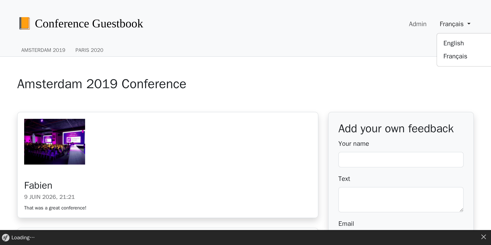
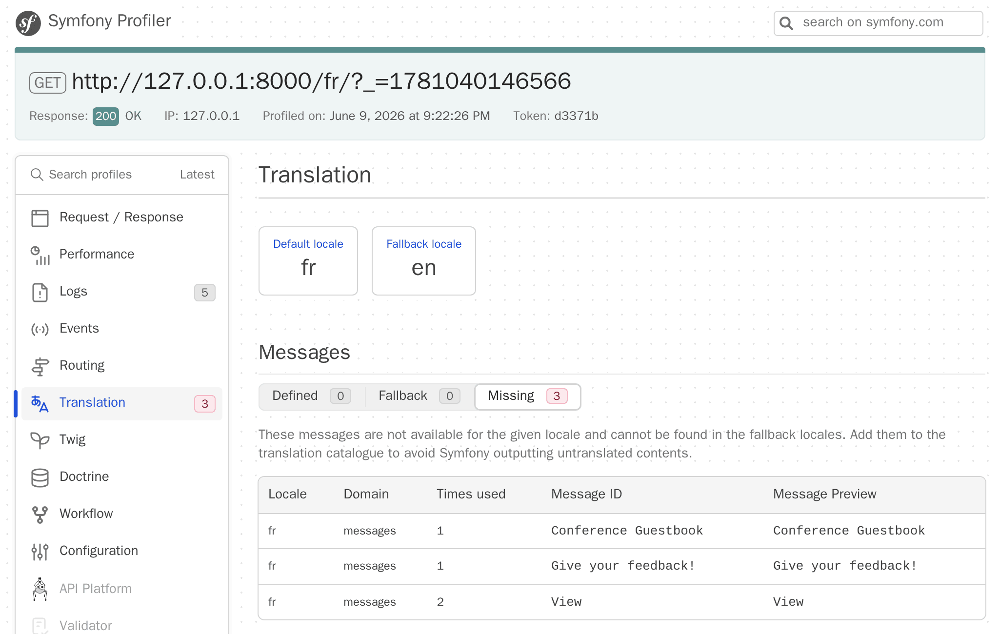
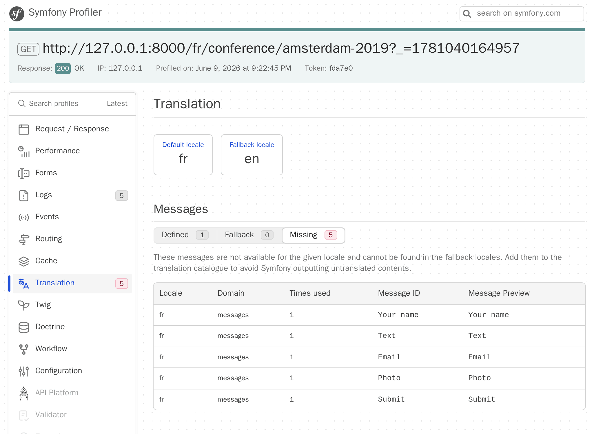

アプリケーションをローカライズする
===================================================

国際的な利用者のために、Symfony は国際化 (i18n) とローカライゼーション (l10n) を扱うことができるようになりました。アプリケーションのローカライズはインターフェースの翻訳だけではなく、複数形、日付と通貨のフォーマット、URL、そしてもっと多くのことにも関係します。

URLを国際化する
---------------------

.. index::
    single: Components;Routing
    single: Routing;Locale
    single: Routing;Requirements
    single: Attributes;Route

Webサイトを国際化するための最初のステップは、URLを国際化することです。Webサイトを翻訳する場合、HTTPキャッシュが適切に使われるように、URLはロケールごとに異なる必要があります。 (同じURLを使用してセッションにロケールを保存しないでください。)

特別な ``_locale`` ルートパラメータを使ってルートのロケールを参照します。

.. code-block:: diff
    :caption: patch_file
    :emphasize-lines: 8

    --- i/src/Controller/ConferenceController.php
    +++ w/src/Controller/ConferenceController.php
    @@ -28,7 +28,7 @@ final class ConferenceController extends AbstractController
         }

         #[Cache(smaxage: 3600)]
    -    #[Route('/', name: 'homepage')]
    +    #[Route('/{_locale}/', name: 'homepage')]
         public function index(ConferenceRepository $conferenceRepository): Response
         {
             return $this->render('conference/index.html.twig', [

ホームページ上で、URLに応じてロケールが内部的に設定されるようになりました。例えば ``/fr/`` というURLなら ``$request->getLocale()`` の戻り値は ``fr`` になります。

おそらくすべての有効なロケールにコンテンツを翻訳できないので、サポートするロケールのみに制限してください。

.. code-block:: diff
    :caption: patch_file
    :emphasize-lines: 8

    --- i/src/Controller/ConferenceController.php
    +++ w/src/Controller/ConferenceController.php
    @@ -28,7 +28,7 @@ final class ConferenceController extends AbstractController
         }

         #[Cache(smaxage: 3600)]
    -    #[Route('/{_locale}/', name: 'homepage')]
    +    #[Route('/{_locale<en|fr>}/', name: 'homepage')]
         public function index(ConferenceRepository $conferenceRepository): Response
         {
             return $this->render('conference/index.html.twig', [

各ルートのパラメータは ``<`` と ``>`` で囲まれた正規表現で制限されます。 ``homepage`` のルートは ``_locale`` パラメータが ``en`` か ``fr`` の時のみ一致します。 ``/es/`` の場合は、一致するルートがないので404ページが表示されます。

ほとんどすべてのルートで同じ要件を使用します。コンテナパラメーターに移動してみましょう。

.. code-block:: diff
    :caption: patch_file

    --- i/config/services.yaml
    +++ w/config/services.yaml
    @@ -9,5 +9,6 @@ parameters:
         admin_email: "%env(string:default:default_admin_email:ADMIN_EMAIL)%"
         default_base_url: 'http://127.0.0.1'
    +    app.supported_locales: 'en|fr'

     services:
         # default configuration for services in *this* file
    --- i/src/Controller/ConferenceController.php
    +++ w/src/Controller/ConferenceController.php
    @@ -28,7 +28,7 @@ final class ConferenceController extends AbstractController
         }

         #[Cache(smaxage: 3600)]
    -    #[Route('/{_locale<en|fr>}/', name: 'homepage')]
    +    #[Route('/{_locale<%app.supported_locales%>}/', name: 'homepage')]
         public function index(ConferenceRepository $conferenceRepository): Response
         {
             return $this->render('conference/index.html.twig', [

言語を追加するには ``app.supported_languages`` パラメータを更新します。

同じロケールのルートプレフィクスを他のURLに追加します。

.. code-block:: diff
    :caption: patch_file

    --- i/src/Controller/ConferenceController.php
    +++ w/src/Controller/ConferenceController.php
    @@ -38,7 +38,7 @@ final class ConferenceController extends AbstractController
         }

         #[Cache(smaxage: 3600)]
    -    #[Route('/conference_header', name: 'conference_header')]
    +    #[Route('/{_locale<%app.supported_locales%>}/conference_header', name: 'conference_header')]
         public function conferenceHeader(ConferenceRepository $conferenceRepository): Response
         {
             return $this->render('conference/header.html.twig', [
    @@ -46,8 +46,8 @@ final class ConferenceController extends AbstractController
             ]);
         }

         #[RateLimit('comment_submission', methods: ['POST'])]
    -    #[Route('/conference/{slug:conference}', name: 'conference')]
    +    #[Route('/{_locale<%app.supported_locales%>}/conference/{slug:conference}', name: 'conference')]
         public function show(
             Request $request,
             Conference $conference,

これでほぼ完了です。 ``/`` に一致するルートはもうありません。 ``/en/`` にリダイレクトさせるようにしましょう。

.. code-block:: diff
    :caption: patch_file

    --- i/src/Controller/ConferenceController.php
    +++ w/src/Controller/ConferenceController.php
    @@ -27,6 +27,12 @@ final class ConferenceController extends AbstractController
         ) {
         }

    +    #[Route('/')]
    +    public function indexNoLocale(): Response
    +    {
    +        return $this->redirectToRoute('homepage', ['_locale' => 'en']);
    +    }
    +
         #[Cache(smaxage: 3600)]
         #[Route('/{_locale<%app.supported_locales%>}/', name: 'homepage')]
         public function index(ConferenceRepository $conferenceRepository): Response

全てのメインルートがロケールを認識するようになりました。ページで生成されたURLは現在のロケールが自動的に付与されているので注意してください。

ロケールのスイッチャーを追加する
------------------------------------------------

.. index::
    single: Twig;path
    single: Twig;Locale

ユーザがデフォルトのロケール ``en`` から別のロケールに切り替えれるように、ヘッダーにスイッチャーを追加しましょう:

.. code-block:: diff
    :caption: patch_file

    --- i/templates/base.html.twig
    +++ w/templates/base.html.twig
    @@ -34,6 +34,16 @@
                                         Admin
                                     </a>
                                 </li>
    +<li class="nav-item dropdown">
    +    <a class="nav-link dropdown-toggle" href="#" id="dropdown-language" role="button"
    +        data-bs-toggle="dropdown" aria-haspopup="true" aria-expanded="false">
    +        English
    +    </a>
    +    <ul class="dropdown-menu dropdown-menu-right" aria-labelledby="dropdown-language">
    +        <li><a class="dropdown-item" href="{{ path('homepage', {_locale: 'en'}) }}">English</a></li>
    +        <li><a class="dropdown-item" href="{{ path('homepage', {_locale: 'fr'}) }}">Français</a></li>
    +    </ul>
    +</li>
                             </ul>
                         

                     

別のロケールに切り替えるには、 ``_locale`` ルートパラメータを ``path()`` 関数に明示的に渡します。

.. index::
    single: Twig;app.request
    single: Twig;locale_name

テンプレートを修正して、"English" とハードコードされたロケールではなく、現在のロケール名を表示するようにしましょう。

.. code-block:: diff
    :caption: patch_file

    --- i/templates/base.html.twig
    +++ w/templates/base.html.twig
    @@ -37,7 +37,7 @@
     <li class="nav-item dropdown">
         <a class="nav-link dropdown-toggle" href="#" id="dropdown-language" role="button"
             data-bs-toggle="dropdown" aria-haspopup="true" aria-expanded="false">
    -        English
    +        {{ app.request.locale|locale_name(app.request.locale) }}
         </a>
         <ul class="dropdown-menu dropdown-menu-right" aria-labelledby="dropdown-language">
             <li><a class="dropdown-item" href="{{ path('homepage', {_locale: 'en'}) }}">English</a></li>

``app`` は現在のリクエストへのアクセスを提供するグローバルなTwig変数です。ロケールを人間が読めるような文字列に置換するには、 Twigフィルターの ``locale_name`` を使います。

.. index::
    single: Components;String

ロケールによっては、ロケール名が常に大文字とは限りません。文字を適切に大文字にするには、Symfony StringコンポーネントとTwigで提供されているUnicode対応のフィルターが必要です。

.. code-block:: terminal

    $ symfony composer req twig/string-extra

.. index::
    single: Twig;u.title

.. code-block:: diff
    :caption: patch_file

    --- i/templates/base.html.twig
    +++ w/templates/base.html.twig
    @@ -37,7 +37,7 @@
     <li class="nav-item dropdown">
         <a class="nav-link dropdown-toggle" href="#" id="dropdown-language" role="button"
             data-bs-toggle="dropdown" aria-haspopup="true" aria-expanded="false">
    -        {{ app.request.locale|locale_name(app.request.locale) }}
    +        {{ app.request.locale|locale_name(app.request.locale)|u.title }}
         </a>
         <ul class="dropdown-menu dropdown-menu-right" aria-labelledby="dropdown-language">
             <li><a class="dropdown-item" href="{{ path('homepage', {_locale: 'en'}) }}">English</a></li>

これでスイッチャーを介してフランス語から英語に切り替えることができ、全体が良い感じにローカライズに対応しました。

インターフェースを翻訳する
---------------------------------------

.. index::
    single: Components;Translation
    single: Translation
    single: Twig;trans

大きなWebサイト上の文章を全て翻訳するのは面倒ですが、幸いなことに、今回作成しているWebサイトはほんの一握りのメッセージしかありません。ではホームページ上の全ての文章から始めましょう:

.. code-block:: diff
    :caption: patch_file

    --- i/templates/base.html.twig
    +++ w/templates/base.html.twig
    @@ -20,7 +20,7 @@
                 <nav class="navbar navbar-expand-xl navbar-light bg-light">
                     

                         <a class="navbar-brand me-4 pr-2" href="{{ path('homepage') }}">
    -                        &#128217; Conference Guestbook
    +                        &#128217; {{ 'Conference Guestbook'|trans }}
                         </a>

                         <button class="navbar-toggler border-0" type="button" data-bs-toggle="collapse" data-bs-target="#header-menu" aria-controls="navbarSupportedContent" aria-expanded="false" aria-label="Show/Hide navigation">
    --- i/templates/conference/index.html.twig
    +++ w/templates/conference/index.html.twig
    @@ -4,7 +4,7 @@

     
         <h2 class="mb-5">
    -        Give your feedback!
    +        {{ 'Give your feedback!'|trans }}
         </h2>

         
    @@ -21,7 +21,7 @@

                                 <a href="{{ path('conference', { slug: conference.slug }) }}"
                                    class="btn btn-sm btn-primary stretched-link">
    -                                View
    +                                {{ 'View'|trans }}
                                 </a>
                             

                         

Twigフィルター ``trans`` は入力値に対する現在のロケールへの翻訳を探します。翻訳が見つからない場合は ``config/packages/translation.yaml`` に設定されている *default locale* で翻訳します。

.. code-block:: yaml
    :class: ignore
    :emphasize-lines: 2

    framework:
        default_locale: en
        translator:
            default_path: '%kernel.project_dir%/translations'
            fallbacks:
                - en

Webデバッグツールバーの翻訳 "タブ" が赤くなっていることに注目してください:

.. figure:: screenshots/intl-wdt.png
    :alt: /fr/
    :align: center
    :figclass: with-browser

3つのメッセージがまだ未翻訳であることがわかります。

"タブ" をクリックして、Symfonyが翻訳を見つけられなかったメッセージを一覧表示します。

翻訳を提供する
---------------------

``config/packages/translation.yaml`` ですでに見ているかもしれませんが、翻訳データは ``translations/`` 配下に保存されています。これは自動的に作成されます。

手動でファイルを更新する代わりに、 ``translation:extract`` コマンドを使用します。

.. code-block:: terminal

    $ symfony console translation:extract fr --force --domain=messages

このコマンドは ``fr`` ロケール用の翻訳ファイルと ``messages`` ドメイン用の翻訳ファイルを生成します。 (``--force`` フラグを付けることで、既存ファイルを更新します)  ``messages`` ドメインには、検証やセキュリティエラーのようなSymfony自体から送られてくるものを除いた全ての **application** メッセージが含まれます。

``translations/messages+intl-icu.fr.xlf`` ファイルを編集して、フランス語にメッセージを翻訳しましょう。フランス語が喋れませんか？お手伝いします:

.. code-block:: diff
    :caption: patch_file
    :class: ignore

    --- i/translations/messages+intl-icu.fr.xlf
    +++ w/translations/messages+intl-icu.fr.xlf
    @@ -7,15 +7,15 @@
         <body>
           <trans-unit id="eOy4.6V" resname="Conference Guestbook">
             <source>Conference Guestbook</source>
    -        <target>__Conference Guestbook</target>
    +        <target>Livre d'Or pour Conferences</target>
           </trans-unit>
           <trans-unit id="LNAVleg" resname="Give your feedback!">
             <source>Give your feedback!</source>
    -        <target>__Give your feedback!</target>
    +        <target>Donnez votre avis !</target>
           </trans-unit>
           <trans-unit id="3Mg5pAF" resname="View">
             <source>View</source>
    -        <target>__View</target>
    +        <target>Sélectionner</target>
           </trans-unit>
         </body>
       </file>

.. code-block:: xml
    :caption: translations/messages+intl-icu.fr.xlf
    :class: hide

    <?xml version="1.0" encoding="utf-8"?>
    <xliff xmlns="urn:oasis:names:tc:xliff:document:1.2" version="1.2">
    <file source-language="en" target-language="fr" datatype="plaintext" original="file.ext">
        <header>
        <tool tool-id="symfony" tool-name="Symfony" />
        </header>
        <body>
        <trans-unit id="LNAVleg" resname="Give your feedback!">
            <source>Give your feedback!</source>
            <target>Donnez votre avis !</target>
        </trans-unit>
        <trans-unit id="3Mg5pAF" resname="View">
            <source>View</source>
            <target>Sélectionner</target>
        </trans-unit>
        <trans-unit id="eOy4.6V" resname="Conference Guestbook">
            <source>Conference Guestbook</source>
            <target>Livre d'Or pour Conferences</target>
        </trans-unit>
        </body>
    </file>
    </xliff>

全てのテンプレートを翻訳しませんが、もちろんしていただいても結構です:

.. figure:: screenshots/intl-translated.png
    :alt: /fr/
    :align: center
    :figclass: with-browser

フォームを翻訳する
---------------------------

.. index::
    single: Translation;Form
    single: Form;Translation

フォームのラベルはSymfonyの翻訳機能によって自動的に表示されます。カンファレンスページへ行き、Webデバッグツールバーの ``Translation`` タブをクリックすると、翻訳できる全てのラベルを見ることができます。

日付をローカライズする
---------------------------------

.. index::
    single: Localization
    single: Twig;format_datetime
    single: Twig;format_time
    single: Twig;format_date
    single: Twig;format_currency
    single: Twig;format_number

もしフランス語に切り替えて、いくつかコメントのついたカンファレンスページへ行った場合、コメントの日付が自動的にローカライズされているのに気づくでしょう。これはTwigフィルターの ``format_datetime`` を使っているためで、ロケールを考慮しています。 (``{{ comment.createdAt|format_datetime('medium', 'short') }}``)

ローカライゼーションは日付や時間 (``format_time``) 、通貨 (``format_currency``) 、数字 (``format_number``) や一般的なもの (パーセンテージ、持続時間、スペルなど) に対応しています。

複数形を翻訳する
------------------------

.. index::
    single: Translation;Plurals
    single: Translation;Conditions

翻訳における複数形の管理は、条件に基づいて翻訳を選択するというより一般的な問題の一つの使い方です。

カンファレンスページではコメント数を表示しています: ``There are 2 comments`` 。 コメントが1つであれば ``There are 1 comments`` と表示しますが、これは間違いです。テンプレートを変更して、翻訳可能な文章に換えましょう:

.. code-block:: diff
    :caption: patch_file

    --- i/templates/conference/show.html.twig
    +++ w/templates/conference/show.html.twig
    @@ -44,7 +44,7 @@
                             

                         

                     
    -                
There are {{ comments|length }} comments.

    +                
{{ 'nb_of_comments'|trans({count: comments|length}) }}

                     
                         <a href="{{ path('conference', { slug: conference.slug, offset: previous }) }}">Previous</a>
                     

このメッセージでは、もう1つの翻訳方法を使いました。英語版のメッセージをテンプレートに保つ代わりに、一意の識別子に置換しました。この方法は複雑で大量のテキストに適しています。

新しいメッセージを追加して、翻訳ファイルを更新します:

.. code-block:: diff
    :caption: patch_file

    --- i/translations/messages+intl-icu.fr.xlf
    +++ w/translations/messages+intl-icu.fr.xlf
    @@ -17,6 +17,10 @@
             <source>Conference Guestbook</source>
             <target>Livre d'Or pour Conferences</target>
         </trans-unit>
    +    <trans-unit id="Dg2dPd6" resname="nb_of_comments">
    +        <source>nb_of_comments</source>
    +        <target>{count, plural, =0 {Aucun commentaire.} =1 {1 commentaire.} other {# commentaires.}}</target>
    +    </trans-unit>
         </body>
     </file>
     </xliff>

英語の翻訳を提供する必要があるので、まだ作業は終わりません。 ``translations/messages+intl-icu.en.xlf`` ファイルを作成します:

.. code-block:: xml
    :caption: translations/messages+intl-icu.en.xlf
    :emphasize-lines: 10

    <?xml version="1.0" encoding="utf-8"?>
    <xliff xmlns="urn:oasis:names:tc:xliff:document:1.2" version="1.2">
      <file source-language="en" target-language="en" datatype="plaintext" original="file.ext">
        <header>
          <tool tool-id="symfony" tool-name="Symfony" />
        </header>
        <body>
          <trans-unit id="maMQz7W" resname="nb_of_comments">
            <source>nb_of_comments</source>
            <target>{count, plural, =0 {There are no comments.} one {There is one comment.} other {There are # comments.}}</target>
          </trans-unit>
        </body>
      </file>
    </xliff>

ファンクショナルテストを更新する
------------------------------------------------

URLやコンテンツの変更による、機能テストの更新を忘れないでください:

.. code-block:: diff
    :caption: patch_file

    --- i/tests/Controller/ConferenceControllerTest.php
    +++ w/tests/Controller/ConferenceControllerTest.php
    @@ -16,7 +16,7 @@ class ConferenceControllerTest extends WebTestCase
         public function testIndex(): void
         {
             $client = static::createClient();
    -        $client->request('GET', '/');
    +        $client->request('GET', '/en/');

             $this->assertResponseIsSuccessful();
             $this->assertSelectorTextContains('h2', 'Give your feedback');
    @@ -29,7 +29,7 @@ class ConferenceControllerTest extends WebTestCase
             $berlin = ConferenceFactory::createOne(['city' => 'Berlin', 'year' => '2021', 'isInternational' => false]);
             CommentFactory::createOne(['conference' => $berlin]);

    -        $client->request('GET', '/conference/berlin-2021');
    +        $client->request('GET', '/en/conference/berlin-2021');
             $client->submitForm('Submit', [
                 'comment[author]' => 'Fabien',
                 'comment[text]' => 'Some feedback from an automated functional test',
    @@ -50,7 +50,7 @@ class ConferenceControllerTest extends WebTestCase
             ConferenceFactory::createOne(['city' => 'Paris', 'year' => '2020', 'isInternational' => false]);
             CommentFactory::createOne(['conference' => $amsterdam]);

    -        $crawler = $client->request('GET', '/');
    +        $crawler = $client->request('GET', '/en/');

             $this->assertCount(2, $crawler->filter('h4'));

    @@ -59,6 +59,6 @@ class ConferenceControllerTest extends WebTestCase
             $this->assertPageTitleContains('Amsterdam');
             $this->assertResponseIsSuccessful();
             $this->assertSelectorTextContains('h2', 'Amsterdam 2019');
    -        $this->assertSelectorExists('div:contains("There are 1 comments")');
    +        $this->assertSelectorExists('div:contains("There is one comment")');
         }
     }

.. sidebar:: より深く学ぶために

    * `ICUフォーマッターを使ったメッセージの翻訳`_;

    * `Twig翻訳フィルターの利用`_.

.. _`ICUフォーマッターを使ったメッセージの翻訳`: https://symfony.com/doc/current/translation/message_format.html
.. _`Twig翻訳フィルターの利用`: https://symfony.com/doc/current/translation/templates.html#translation-filters
