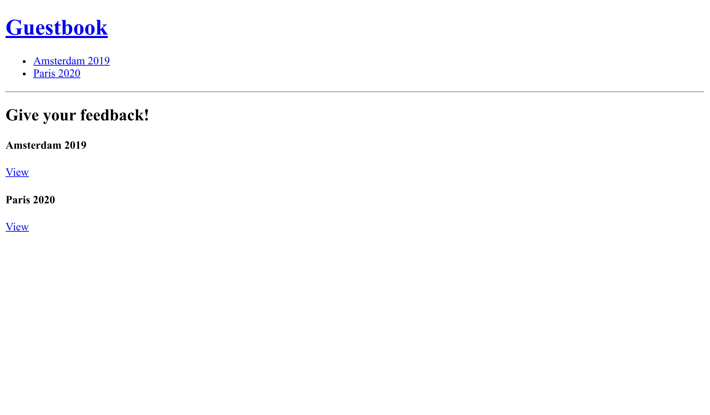

Luisteren naar events
=====================

De huidige lay-out mist een navigatiekopje om terug te gaan naar de homepage of om van de ene conferentie naar de volgende te gaan.

Een header toevoegen aan de website
-----------------------------------

.. index::
    single: Twig;for
    single: Twig;path

Alles wat op alle webpagina's moet worden weergegeven, zoals een header, moet deel uitmaken van de basislayout:

.. code-block:: diff
    :caption: patch_file

    --- i/templates/base.html.twig
    +++ w/templates/base.html.twig
    @@ -12,6 +12,15 @@
             
         </head>
         <body>
    +        <header>
    +            <h1><a href="{{ path('homepage') }}">Guestbook</a></h1>
    +            <ul>
    +            
    +                <li><a href="{{ path('conference', { id: conference.id }) }}">{{ conference }}</a></li>
    +            
    +            </ul>
    +            

    +        </header>
             
         </body>
     </html>

Het toevoegen van deze code aan de lay-out betekent dat alle templates die deze code uitbreiden een ``conferences`` variabele moeten definiëren, die moet worden aangemaakt en doorgegeven door hun controllers.

Omdat we maar twee controllers hebben, *zou* je het volgende kunnen doen (doe dit niet in je code, we leren binnenkort een betere manier om dit te doen):

.. code-block:: diff
    :class: ignore

    --- i/src/Controller/ConferenceController.php
    +++ w/src/Controller/ConferenceController.php
    @@ -21,11 +21,12 @@ final class ConferenceController extends AbstractController
         }

         #[Route('/conference/{id}', name: 'conference')]
    -    public function show(#[MapEntity] Conference $conference, CommentRepository $commentRepository, #[MapQueryParameter(options: ['min_range' => 0])] int $offset = 0): Response
    +    public function show(#[MapEntity] Conference $conference, CommentRepository $commentRepository, ConferenceRepository $conferenceRepository, #[MapQueryParameter(options: ['min_range' => 0])] int $offset = 0): Response
         {
             $paginator = $commentRepository->getCommentPaginator($conference, $offset);

             return $this->render('conference/show.html.twig', [
    +            'conferences' => $conferenceRepository->findAll(),
                 'conference' => $conference,
                 'comments' => $paginator,
                 'previous' => $offset - CommentRepository::COMMENTS_PER_PAGE,

Stel je voor dat je tientallen controllers moet updaten. En hetzelfde moet doen voor alle nieuwe. Dit is niet erg praktisch. Er moet een betere manier zijn.

Twig heeft het begrip globale variabelen. Een *globale variabele* is beschikbaar in alle gerenderde templates. Je kan ze definiëren in een configuratiebestand, maar het werkt alleen voor statische waarden. Om alle conferenties toe te voegen als een Twig global variable, gaan we een listener creëren.

Symfony events ontdekken
------------------------

.. index::
    single: Components;Event Dispatcher
    single: Event

Symfony heeft een ingebouwd Event Dispatcher component. Een dispatcher *verstuurt* bepaalde *events* op specifieke tijdstippen waar de *listeners* naar kunnen luisteren. Listeners haken in op de interne werking van het framework.

Sommige events staan je toe interactie te hebben met de levenscyclus van een HTTP-request. Gedurende de afhandeling van een request zorgt de dispatcher ervoor dat events worden afgevuurd als een request is aangemaakt, wanneer de controller op het punt staat om uitgevoerd te worden, als een antwoord klaar is om verzonden te worden of wanneer er een exception getriggerd word. Een *listener* kan naar één of meerdere events luisteren en een bepaalde logica uitvoeren op basis van de context van de gebeurtenis.

Events zijn goed gedefinïeerde uitbreidingspunten die het framework generieker en uitbreidbaar maken. In veel Symfony componenten zoals Security, Messenger, Workflow of Mailer worden ze intensief gebruikt.

Een ander ingebouwd voorbeeld van events en listeners in actie is de levenscyclus van een command: je kunt een listener aanmaken om code uit te voeren voordat *elk* command wordt uitgevoerd.

Elke package of bundle kan ook zijn eigen events afvuren om de code uitbreidbaar te maken.

Om te voorkomen dat je een configuratiebestand hebt dat beschrijft naar welke events een listener wil luisteren, voeg je het ``#[AsEventListener]`` attribuut toe op de listener-class of -methode. Hierdoor kunnen listeners automatisch geregistreerd worden in de Symfony dispatcher.

Een listener implementeren
--------------------------

.. index::
    single: Event;Listener
    single: Listener
    single: Command;make:listener

Dit moet nu gesneden koek zijn, gebruik de maker bundle om een listener te genereren:

.. code-block:: terminal
    :class: answers(Symfony\\Component\\HttpKernel\\Event\\ControllerEvent)

    $ symfony console make:listener TwigEventListener

Het commando vraagt je naar welk event je wil luisteren. Kies het ``Symfony\Component\HttpKernel\Event\ControllerEvent`` event, dat wordt afgevuurd vlak voordat de controller wordt opgeroepen. Het is het beste moment om de ``conferences`` globale variabele te injecteren zodat Twig er toegang toe heeft wanneer de controller de template rendert. Werk jouw listener als volgt bij:

.. code-block:: diff
    :caption: patch_file

    --- i/src/EventListener/TwigEventListener.php
    +++ w/src/EventListener/TwigEventListener.php
    @@ -2,14 +2,22 @@

     namespace App\EventListener;

    +use App\Repository\ConferenceRepository;
     use Symfony\Component\EventDispatcher\Attribute\AsEventListener;
     use Symfony\Component\HttpKernel\Event\ControllerEvent;
    +use Twig\Environment;

     final class TwigEventListener
     {
    +    public function __construct(
    +        private Environment $twig,
    +        private ConferenceRepository $conferenceRepository,
    +    ) {
    +    }
    +
         #[AsEventListener]
         public function onControllerEvent(ControllerEvent $event): void
         {
    -        // ...
    +        $this->twig->addGlobal('conferences', $this->conferenceRepository->findAll());
         }
     }

Nu kun je zoveel controllers toevoegen als je wil: de ``conferences``-variabele is altijd beschikbaar in Twig.

.. note::

    In een later stadium zullen we het hebben over een veel beter alternatief qua prestaties.

Sorteren van conferenties op jaar en stad
-----------------------------------------

Het sorteren van de conferentielijst op basis van het jaar kan het browsen vergemakkelijken. We zouden een custom methode kunnen maken om alle conferenties op te halen en te sorteren. In plaats daarvan gaan we de standaard implementatie van ``findAll()`` overschrijven om er zeker van te zijn dat de sortering overal wordt toegepast:

.. code-block:: diff
    :caption: patch_file

    --- i/src/Repository/ConferenceRepository.php
    +++ w/src/Repository/ConferenceRepository.php
    @@ -16,6 +16,11 @@ class ConferenceRepository extends ServiceEntityRepository
             parent::__construct($registry, Conference::class);
         }

    +    public function findAll(): array
    +    {
    +        return $this->findBy([], ['year' => 'ASC', 'city' => 'ASC']);
    +    }
    +
         //    /**
         //     * @return Conference[] Returns an array of Conference objects
         //     */

Aan het einde van deze stap moet de website er als volgt uitzien:

.. sidebar:: Verder gaan

    * De `Request-Response Flow`_ in Symfony toepassingen;

    * De `ingebouwde Symfony HTTP-events`_;

    * De `ingebouwde Symfony Console-events`_.

.. _`Request-Response Flow`: https://symfony.com/doc/current/components/http_kernel.html#the-workflow-of-a-request
.. _`ingebouwde Symfony HTTP-events`: https://symfony.com/doc/current/reference/events.html
.. _`ingebouwde Symfony Console-events`: https://symfony.com/doc/current/components/console/events.html
