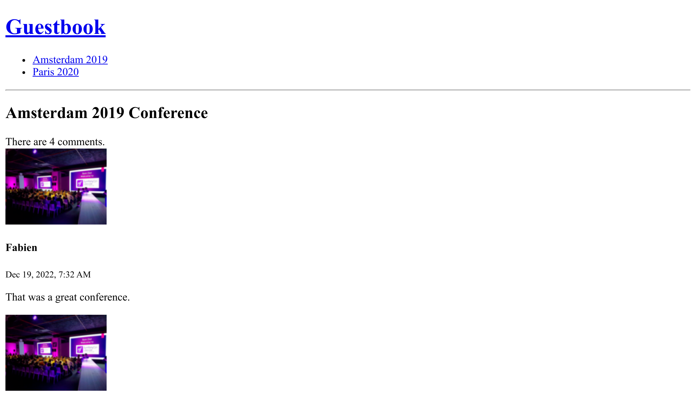

De lifecycle van Doctrine-objecten beheren
==========================================

Bij het maken van een nieuwe reactie zou het geweldig zijn als de ``createdAt``-datum automatisch op de huidige datum en tijd zou worden ingesteld.

Doctrine heeft verschillende manieren om objecten en hun properties te manipuleren tijdens hun lifecycle (voordat de rij in de database wordt aangemaakt, nadat de rij is bijgewerkt, ....).

Definiëren van lifecycle callbacks
-----------------------------------

.. index::
    single: Doctrine;Lifecycle
    single: Attributes;ORM\\Entity
    single: Attributes;ORM\\HasLifecycleCallbacks
    single: Attributes;ORM\\PrePersist

Wanneer het gedrag geen service nodig heeft en slechts op één soort entity moet worden toegepast, definieer dan een callback in de entity class:

.. code-block:: diff
    :caption: patch_file

    --- i/src/Controller/Admin/CommentCrudController.php
    +++ w/src/Controller/Admin/CommentCrudController.php
    @@ -57,8 +57,6 @@ class CommentCrudController extends AbstractCrudController
             ]);
             if (Crud::PAGE_EDIT === $pageName) {
                 yield $createdAt->setFormTypeOption('disabled', true);
    -        } else {
    -            yield $createdAt;
             }
         }
     }
    --- i/src/Entity/Comment.php
    +++ w/src/Entity/Comment.php
    @@ -7,6 +7,7 @@ use Doctrine\DBAL\Types\Types;
     use Doctrine\ORM\Mapping as ORM;

     #[ORM\Entity(repositoryClass: CommentRepository::class)]
    +#[ORM\HasLifecycleCallbacks]
     class Comment
     {
         #[ORM\Id]
    @@ -86,6 +87,12 @@ class Comment
             return $this;
         }

    +    #[ORM\PrePersist]
    +    public function setCreatedAtValue(): void
    +    {
    +        $this->createdAt = new \DateTimeImmutable();
    +    }
    +
         public function getConference(): ?Conference
         {
             return $this->conference;

Het ``ORM\PrePersist``-*event* wordt geactiveerd wanneer het object voor het eerst in de database wordt opgeslagen. Als dat gebeurt, wordt de ``setCreatedAtValue()``-methode aangeroepen en wordt de huidige datum en tijd gebruikt voor de waarde van het ``createdAt``-property.

Slugs toevoegen aan conferenties
--------------------------------

De URL's voor conferenties hebben momenteel geen betekenis: ``/conference/1``. Belangrijker nog, ze zijn afhankelijk van een implementatiedetail (de primaire sleutel in de database is openbaar).

Misschien kunnen we in plaats daarvan beter gebruik maken van URL's zoals ``/conference/paris-2020``? Dat zou er veel beter uitzien. ``paris-2020`` is wat we noemen de *slug* van de conferentie.

.. index::
    single: Command;make:entity

Voeg een nieuw ``slug``-property toe voor conferenties (een niet nullable string van 255 tekens):

.. code-block:: terminal
    :class: answers(slug||string||255||no)

    $ symfony console make:entity Conference

.. index::
    single: Command;make:migration

Maak een migratiebestand aan om de nieuwe kolom toe te voegen:

.. code-block:: terminal

    $ symfony console make:migration

.. index::
    single: Command;doctrine:migrations:migrate

En voer die nieuwe migratie uit:

.. code-block:: terminal
    :class: ignore

    $ symfony console doctrine:migrations:migrate

Krijg je een foutmelding? Dat is zoals verwacht. Waarom? Omdat we gevraagd hebben om de slug niet ``null`` te laten zijn, maar bestaande gegevens in de conferentiedatabase zullen een waarde van ``null`` krijgen wanneer de migratie wordt uitgevoerd. Laten we dat oplossen door de migratie aan te passen:

.. code-block:: diff
    :caption: patch_file

    --- i/migrations/Version00000000000000.php
    +++ w/migrations/Version00000000000000.php
    @@ -20,7 +20,9 @@ final class Version00000000000000 extends AbstractMigration
         public function up(Schema $schema): void
         {
             // this up() migration is auto-generated, please modify it to your needs
    -        $this->addSql('ALTER TABLE conference ADD slug VARCHAR(255) NOT NULL');
    +        $this->addSql('ALTER TABLE conference ADD slug VARCHAR(255)');
    +        $this->addSql("UPDATE conference SET slug=CONCAT(LOWER(city), '-', year)");
    +        $this->addSql('ALTER TABLE conference ALTER COLUMN slug SET NOT NULL');
         }

         public function down(Schema $schema): void

De truc hier is om de kolom toe te voegen en toe te laten dat deze ``null`` mag zijn. Vervolgens geef je de slug een waarde, om daarna weer toe te staan dat de kolom niet ``null`` mag zijn.

.. note::

    Voor een echt project is het gebruik van ``CONCAT(LOWER(city), '-', year)`` misschien niet genoeg. In dat geval zouden we de "echte" Slugger moeten gebruiken.

.. index::
    single: Command;doctrine:migrations:migrate

De migratie zou nu goed moeten verlopen:

.. code-block:: terminal
    :class: answers(y)

    $ symfony console doctrine:migrations:migrate

.. index::
    single: Attributes;ORM\\UniqueEntity
    single: Attributes;ORM\\Column
    single: Components;Validator

Omdat de applicatie binnenkort gebruik zal maken van slugs om elke conferentie te vinden, moeten we de conferentie-entiteit aanpassen om ervoor te zorgen dat de slugs uniek zijn in de database:

.. code-block:: diff
    :caption: patch_file

    --- i/src/Entity/Conference.php
    +++ w/src/Entity/Conference.php
    @@ -6,8 +6,10 @@ use App\Repository\ConferenceRepository;
     use Doctrine\Common\Collections\ArrayCollection;
     use Doctrine\Common\Collections\Collection;
     use Doctrine\ORM\Mapping as ORM;
    +use Symfony\Bridge\Doctrine\Validator\Constraints\UniqueEntity;

     #[ORM\Entity(repositoryClass: ConferenceRepository::class)]
    +#[UniqueEntity('slug')]
     class Conference
     {
         #[ORM\Id]
    @@ -30,7 +32,7 @@ class Conference
         #[ORM\OneToMany(targetEntity: Comment::class, mappedBy: 'conference', orphanRemoval: true)]
         private Collection $comments;

    -    #[ORM\Column(length: 255)]
    +    #[ORM\Column(length: 255, unique: true)]
         private ?string $slug = null;

         public function __construct()

.. index::
    single: Command;make:migration

Zoals je misschien al had geraden, moeten we de migratie-truc uitvoeren:

.. code-block:: terminal

    $ symfony console make:migration

.. index::
    single: Command;doctrine:migrations:migrate

.. code-block:: terminal
    :class: answers(y)

    $ symfony console doctrine:migrations:migrate

Slugs genereren
---------------

.. index::
    single: Components;String
    single: Slug

Het genereren van een slug die goed leesbaar is in een URL (waar alles behalve ASCII-tekens encoded moet worden), is een uitdagende taak. Vooral voor andere talen dan het Engels. Hoe converteer je ``é`` naar ``e`` bijvoorbeeld?

In plaats van het wiel opnieuw uit te vinden, gebruiken we de Symfony ``String`` component, die de manipulatie van strings makkelijker maakt en een *slugger* bevat.

Voeg een ``computeSlug()`` methode toe aan de ``Conference``-class die de slug baseert op de gegevens van de conferentie:

.. code-block:: diff
    :caption: patch_file

    --- i/src/Entity/Conference.php
    +++ w/src/Entity/Conference.php
    @@ -7,6 +7,7 @@ use Doctrine\Common\Collections\ArrayCollection;
     use Doctrine\Common\Collections\Collection;
     use Doctrine\ORM\Mapping as ORM;
     use Symfony\Bridge\Doctrine\Validator\Constraints\UniqueEntity;
    +use Symfony\Component\String\Slugger\SluggerInterface;

     #[ORM\Entity(repositoryClass: ConferenceRepository::class)]
     #[UniqueEntity('slug')]
    @@ -50,6 +51,13 @@ class Conference
             return $this->id;
         }

    +    public function computeSlug(SluggerInterface $slugger): void
    +    {
    +        if (!$this->slug || '-' === $this->slug) {
    +            $this->slug = (string) $slugger->slug((string) $this)->lower();
    +        }
    +    }
    +
         public function getCity(): ?string
         {
             return $this->city;

De ``computeSlug()``-methode bouwt alleen een slug op wanneer de huidige slug leeg is of gelijk is aan de speciale waarde ``-``. Waarom hebben we de speciale waarde ``-`` nodig? Omdat bij het toevoegen van een conferentie in de backend, de slug noodzakelijk is. We hebben dus een niet-lege waarde nodig die de applicatie vertelt dat we willen dat de slug automatisch gegenereerd wordt.

Een complexe lifecycle callback definiëren
-------------------------------------------

.. index::
    single: Doctrine;Entity Listener

Net als de ``createdAt``-property, moet de ``slug`` automatisch gegenereerd worden wanneer de conferentie wordt bijgewerkt, door middel van het aanroepen van de ``computeSlug`` methode.

Maar omdat deze methode afhankelijk is van een implementatie van ``SluggerInterface``, kunnen we geen ``prePersist``-event toevoegen zoals voorheen (we hebben geen manier om de slugger te injecteren).

Maak in plaats daarvan een Doctrine entity listener:

.. code-block:: php
    :caption: src/EntityListener/ConferenceEntityListener.php

    namespace App\EntityListener;

    use App\Entity\Conference;
    use Doctrine\ORM\Event\PrePersistEventArgs;
    use Doctrine\ORM\Event\PreUpdateEventArgs;
    use Symfony\Component\String\Slugger\SluggerInterface;

    class ConferenceEntityListener
    {
        public function __construct(
            private SluggerInterface $slugger,
        ) {
        }

        public function prePersist(Conference $conference, PrePersistEventArgs $event): void
        {
            $conference->computeSlug($this->slugger);
        }

        public function preUpdate(Conference $conference, PreUpdateEventArgs $event): void
        {
            $conference->computeSlug($this->slugger);
        }
    }

Merk op dat de slug wordt bijgewerkt wanneer er een nieuwe conferentie wordt aangemaakt ( ``prePersist()`` ) en wanneer deze wordt bijgewerkt ( ``preUpdate()`` ).

Een service in de container configureren
----------------------------------------

.. index::
    single: Components;Dependency Injection
    single: Dependency Injection

Tot nu toe hebben we het niet gehad over één belangrijk onderdeel van Symfony, de *dependency injection container*. De container is verantwoordelijk voor het beheer van de *services*: het creëren en injecteren van de *services* wanneer dat nodig is.

Een *service* is een "global" object dat functies biedt (bv. een mailer, een logger, een slugger, etc.) in tegenstelling tot *data-objecten* (bv. instanties van Doctrine-entity's).

Je hebt zelden direct interactie met de container, omdat deze automatisch service-objecten injecteert wanneer je ze nodig hebt: de container injecteert de objecten als argumenten van de controller wanneer je ze type-hint bijvoorbeeld.

Als je je afvroeg hoe de event listener in de vorige stap werd geregistreerd, dan heb je nu het antwoord: de container. Wanneer een class een aantal specifieke interfaces implementeert, dan weet de container dat de class op een bepaalde manier geregistreerd moet worden.

Omdat onze class geen enkele interface implementeert of gebruik maakt van een basis class, weet Symfony niet hoe deze automatisch geconfigureerd moet worden. We kunnen hier een attribute gebruiken om de Symfony container te laten weten hoe deze geïnitialiseerd moet worden:

.. code-block:: diff
    :caption: patch_file

    --- i/src/EntityListener/ConferenceEntityListener.php
    +++ w/src/EntityListener/ConferenceEntityListener.php
    @@ -3,10 +3,14 @@
     namespace App\EntityListener;

     use App\Entity\Conference;
    +use Doctrine\Bundle\DoctrineBundle\Attribute\AsEntityListener;
     use Doctrine\ORM\Event\PrePersistEventArgs;
     use Doctrine\ORM\Event\PreUpdateEventArgs;
    +use Doctrine\ORM\Events;
     use Symfony\Component\String\Slugger\SluggerInterface;

    +#[AsEntityListener(event: Events::prePersist, entity: Conference::class)]
    +#[AsEntityListener(event: Events::preUpdate, entity: Conference::class)]
     class ConferenceEntityListener
     {
         public function __construct(

.. note::

    Verwar Doctrine event listeners niet met Symfony listeners. Ook al lijken ze erg op elkaar, toch gebruiken ze niet dezelfde infrastructuur onder de motorkap.

Het gebruik van slugs in de applicatie
--------------------------------------

Probeer meer conferenties toe te voegen in de backend en verander de stad of het jaar van een bestaande conferentie; de slug zal niet worden bijgewerkt, behalve als je de speciale ``-``-waarde gebruikt.

.. index::
    single: Twig;for
    single: Twig;if
    single: Twig;path
    single: Attributes;Route

De laatste wijziging is het bijwerken van de controllers en de templates om de ``slug`` van de conferentie te gebruiken voor routes, in plaats van het ``id`` van de conferentie:

.. code-block:: diff
    :caption: patch_file

    --- i/src/Controller/ConferenceController.php
    +++ w/src/Controller/ConferenceController.php
    @@ -20,7 +20,7 @@ final class ConferenceController extends AbstractController
             ]);
         }

    -    #[Route('/conference/{id}', name: 'conference')]
    -    public function show(#[MapEntity] Conference $conference, CommentRepository $commentRepository, #[MapQueryParameter] int $offset = 0): Response
    +    #[Route('/conference/{slug}', name: 'conference')]
    +    public function show(#[MapEntity(mapping: ['slug' => 'slug'])] Conference $conference, CommentRepository $commentRepository, #[MapQueryParameter] int $offset = 0): Response
         {
             $offset = max(0, $offset);
    --- i/templates/base.html.twig
    +++ w/templates/base.html.twig
    @@ -16,7 +16,7 @@
                 <h1><a href="{{ path('homepage') }}">Guestbook</a></h1>
                 <ul>
                 
    -                <li><a href="{{ path('conference', { id: conference.id }) }}">{{ conference }}</a></li>
    +                <li><a href="{{ path('conference', { slug: conference.slug }) }}">{{ conference }}</a></li>
                 
                 </ul>
                 

    --- i/templates/conference/index.html.twig
    +++ w/templates/conference/index.html.twig
    @@ -8,7 +8,7 @@
         
             <h4>{{ conference }}</h4>
             

    -            <a href="{{ path('conference', { id: conference.id }) }}">View</a>
    +            <a href="{{ path('conference', { slug: conference.slug }) }}">View</a>
             

         
     
    --- i/templates/conference/show.html.twig
    +++ w/templates/conference/show.html.twig
    @@ -22,10 +22,10 @@
             

             
    -            <a href="{{ path('conference', { id: conference.id, offset: previous }) }}">Previous</a>
    +            <a href="{{ path('conference', { slug: conference.slug, offset: previous }) }}">Previous</a>
             
             
    -            <a href="{{ path('conference', { id: conference.id, offset: next }) }}">Next</a>
    +            <a href="{{ path('conference', { slug: conference.slug, offset: next }) }}">Next</a>
             
         
             
No comments have been posted yet for this conference.

De conferentiepagina's moeten nu aangeroepen worden via de slug:

.. sidebar:: Verder gaan

    * Het `Doctrine event system`_ (lifecycle callbacks en listeners, entity listeners en lifecycle subscribers);

    * De `String-component documentatie`_;

    * De `Service container`_;

    * De `Symfony Services Cheat Sheet`_ ).

.. _`Doctrine event system`: https://symfony.com/doc/current/doctrine/events.html
.. _`String-component documentatie`: https://symfony.com/doc/current/components/string.html
.. _`Service container`: https://symfony.com/doc/current/service_container.html
.. _`Symfony Services Cheat Sheet`: https://github.com/andreia/symfony-cheat-sheets/blob/master/Symfony4/services_en_42.pdf
