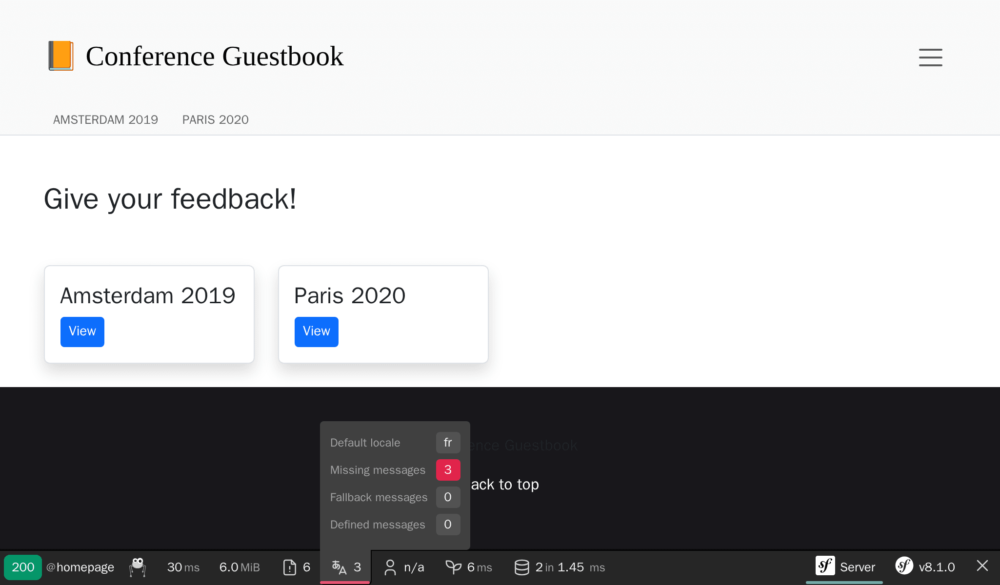
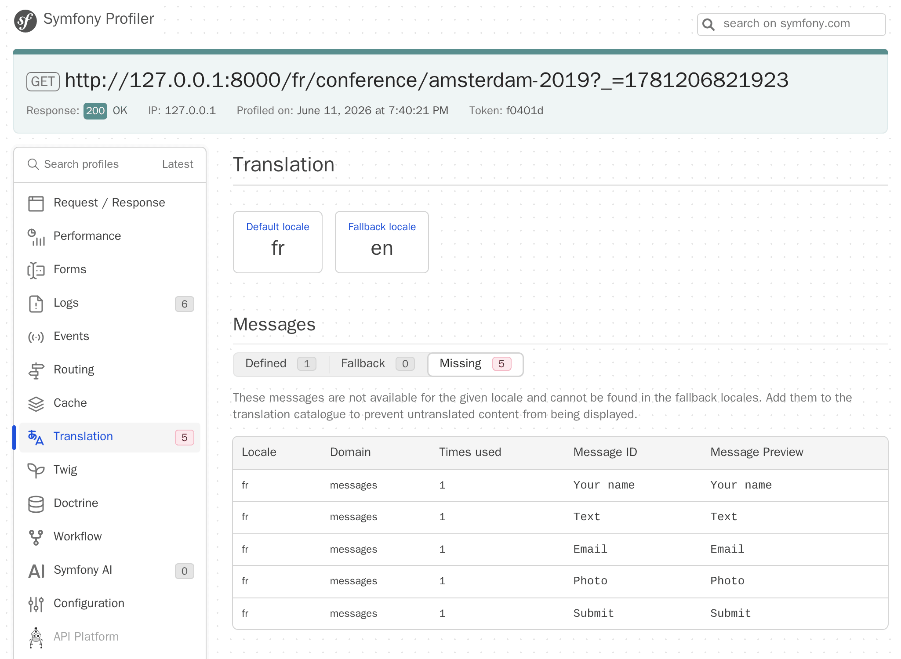

Een applicatie internationaliseren
==================================

Met een internationaal publiek is Symfony vrijwel vanaf het begin in staat geweest om de internationalisering (i18n) en lokalisatie (l10n) op een eenvoudige manier aan te pakken. Het lokaliseren van een applicatie gaat niet alleen over het vertalen van de interface, het gaat ook over meervouden, datum- en valutaopmaak, URL's, en meer.

URL's internationaliseren
-------------------------

.. index::
    single: Components;Routing
    single: Routing;Locale
    single: Routing;Requirements
    single: Attributes;Route

De eerste stap om de website te internationaliseren, is het internationaliseren van de URL's. Bij het vertalen van een website interface, moet de URL verschillend zijn per locale, om goed om te kunnen gaan met HTTP caches (gebruik nooit dezelfde URL en sla de locale op in de sessie).

Gebruik de speciale ``_locale`` routeparameter om te verwijzen naar de locale in routes:

.. code-block:: diff
    :caption: patch_file
    :emphasize-lines: 8

    --- i/src/Controller/ConferenceController.php
    +++ w/src/Controller/ConferenceController.php
    @@ -28,7 +28,7 @@ final class ConferenceController extends AbstractController
         }

         #[Cache(smaxage: 3600)]
    -    #[Route('/', name: 'homepage')]
    +    #[Route('/{_locale}/', name: 'homepage')]
         public function index(ConferenceRepository $conferenceRepository): Response
         {
             return $this->render('conference/index.html.twig', [

Op de homepage wordt de locale nu ingesteld op basis van de URL; bijvoorbeeld, op ``/fr/``, geeft ``$request->getLocale()`` nu ``fr`` terug.

Omdat je waarschijnlijk niet in staat zult zijn om de inhoud naar alle geldige locales te vertalen, beperk je je tot de locales die je wilt ondersteunen:

.. code-block:: diff
    :caption: patch_file
    :emphasize-lines: 8

    --- i/src/Controller/ConferenceController.php
    +++ w/src/Controller/ConferenceController.php
    @@ -28,7 +28,7 @@ final class ConferenceController extends AbstractController
         }

         #[Cache(smaxage: 3600)]
    -    #[Route('/{_locale}/', name: 'homepage')]
    +    #[Route('/{_locale<en|fr>}/', name: 'homepage')]
         public function index(ConferenceRepository $conferenceRepository): Response
         {
             return $this->render('conference/index.html.twig', [

Elke routeparameter kan worden beperkt door een regular expression tussen ``<`` ``>`` . De ``homepage`` route komt nu alleen nog maar overeen als de ``_locale`` parameter ``en`` of ``fr`` is. Probeer ``/es/`` op te vragen, je zou een 404 te zien moeten krijgen omdat er geen route overeenkomt.

Aangezien we dezelfde vereiste in bijna alle routes zullen gebruiken, verplaatsen we deze naar een containerparameter:

.. code-block:: diff
    :caption: patch_file

    --- i/config/services.yaml
    +++ w/config/services.yaml
    @@ -9,5 +9,6 @@ parameters:
         admin_email: "%env(string:default:default_admin_email:ADMIN_EMAIL)%"
         default_base_url: 'http://127.0.0.1'
    +    app.supported_locales: 'en|fr'

     services:
         # default configuration for services in *this* file
    --- i/src/Controller/ConferenceController.php
    +++ w/src/Controller/ConferenceController.php
    @@ -28,7 +28,7 @@ final class ConferenceController extends AbstractController
         }

         #[Cache(smaxage: 3600)]
    -    #[Route('/{_locale<en|fr>}/', name: 'homepage')]
    +    #[Route('/{_locale<%app.supported_locales%>}/', name: 'homepage')]
         public function index(ConferenceRepository $conferenceRepository): Response
         {
             return $this->render('conference/index.html.twig', [

Het toevoegen van een taal doen we door de ``app.supported_languages`` parameter bij te werken.

Voeg dezelfde locale route prefix toe aan de andere URLs:

.. code-block:: diff
    :caption: patch_file

    --- i/src/Controller/ConferenceController.php
    +++ w/src/Controller/ConferenceController.php
    @@ -38,7 +38,7 @@ final class ConferenceController extends AbstractController
         }

         #[Cache(smaxage: 3600)]
    -    #[Route('/conference_header', name: 'conference_header')]
    +    #[Route('/{_locale<%app.supported_locales%>}/conference_header', name: 'conference_header')]
         public function conferenceHeader(ConferenceRepository $conferenceRepository): Response
         {
             return $this->render('conference/header.html.twig', [
    @@ -46,9 +46,9 @@ final class ConferenceController extends AbstractController
             ]);
         }

         #[RateLimit('comment_submission', methods: ['POST'])]
    -    #[Route('/conference/{slug}', name: 'conference')]
    +    #[Route('/{_locale<%app.supported_locales%>}/conference/{slug}', name: 'conference')]
         public function show(
             Request $request,
             #[MapEntity(mapping: ['slug' => 'slug'])]
             Conference $conference,

We zijn bijna klaar. We hebben geen route meer die overeenkomt met ``/``. Laten we deze weer ondersteunen en omleiden naar ``/en/``:

.. code-block:: diff
    :caption: patch_file

    --- i/src/Controller/ConferenceController.php
    +++ w/src/Controller/ConferenceController.php
    @@ -27,6 +27,12 @@ final class ConferenceController extends AbstractController
         ) {
         }

    +    #[Route('/')]
    +    public function indexNoLocale(): Response
    +    {
    +        return $this->redirectToRoute('homepage', ['_locale' => 'en']);
    +    }
    +
         #[Cache(smaxage: 3600)]
         #[Route('/{_locale<%app.supported_locales%>}/', name: 'homepage')]
         public function index(ConferenceRepository $conferenceRepository): Response

Nu dat alle hoofdroutes voorzien zijn van de locale, zie je dat de gegenereerde URL's op de pagina's automatisch rekening houden met de huidige locale.

Een locale switcher toevoegen
-----------------------------

.. index::
    single: Twig;path
    single: Twig;Locale

Om gebruikers in staat te stellen van de standaard ``en`` locale naar een andere locale over te schakelen, voegen we bovenin een switcher toe:

.. code-block:: diff
    :caption: patch_file

    --- i/templates/base.html.twig
    +++ w/templates/base.html.twig
    @@ -34,6 +34,16 @@
                                         Admin
                                     </a>
                                 </li>
    +<li class="nav-item dropdown">
    +    <a class="nav-link dropdown-toggle" href="#" id="dropdown-language" role="button"
    +        data-bs-toggle="dropdown" aria-haspopup="true" aria-expanded="false">
    +        English
    +    </a>
    +    <ul class="dropdown-menu dropdown-menu-right" aria-labelledby="dropdown-language">
    +        <li><a class="dropdown-item" href="{{ path('homepage', {_locale: 'en'}) }}">English</a></li>
    +        <li><a class="dropdown-item" href="{{ path('homepage', {_locale: 'fr'}) }}">Français</a></li>
    +    </ul>
    +</li>
                             </ul>
                         

                     

Om over te schakelen naar een andere locale, geven we expliciet de ``_locale`` routeparameter door aan de ``path()`` functie.

.. index::
    single: Twig;app.request
    single: Twig;locale_name

Update de template om de huidige locale naam weer te geven in plaats van de hard-coded waarde "English":

.. code-block:: diff
    :caption: patch_file

    --- i/templates/base.html.twig
    +++ w/templates/base.html.twig
    @@ -37,7 +37,7 @@
     <li class="nav-item dropdown">
         <a class="nav-link dropdown-toggle" href="#" id="dropdown-language" role="button"
             data-bs-toggle="dropdown" aria-haspopup="true" aria-expanded="false">
    -        English
    +        {{ app.request.locale|locale_name(app.request.locale) }}
         </a>
         <ul class="dropdown-menu dropdown-menu-right" aria-labelledby="dropdown-language">
             <li><a class="dropdown-item" href="{{ path('homepage', {_locale: 'en'}) }}">English</a></li>

``app`` is een globale Twig-variabele die toegang geeft tot de huidige request. Om de locale om te zetten naar een menselijk leesbare string, gebruiken we de Twig-filter ``locale_name``.

.. index::
    single: Components;String

Afhankelijk van de locale wordt de localenaam niet altijd met een hoofdletter geschreven. Om op de juiste manier om te gaan met hoofdletters, hebben we een filter nodig die Unicode-bewust is, zoals de Symfony String-component en de Twig-implementatie ervan:

.. code-block:: terminal

    $ symfony composer req twig/string-extra

.. index::
    single: Twig;u.title

.. code-block:: diff
    :caption: patch_file

    --- i/templates/base.html.twig
    +++ w/templates/base.html.twig
    @@ -37,7 +37,7 @@
     <li class="nav-item dropdown">
         <a class="nav-link dropdown-toggle" href="#" id="dropdown-language" role="button"
             data-bs-toggle="dropdown" aria-haspopup="true" aria-expanded="false">
    -        {{ app.request.locale|locale_name(app.request.locale) }}
    +        {{ app.request.locale|locale_name(app.request.locale)|u.title }}
         </a>
         <ul class="dropdown-menu dropdown-menu-right" aria-labelledby="dropdown-language">
             <li><a class="dropdown-item" href="{{ path('homepage', {_locale: 'en'}) }}">English</a></li>

Je kunt nu wisselen van Frans naar Engels en de hele interface past zich netjes aan:

.. figure:: screenshots/intl-switcher.png
    :alt: /fr/conference/amsterdam-2019
    :align: center
    :figclass: with-browser

Vertalen van de interface
-------------------------

.. index::
    single: Components;Translation
    single: Translation
    single: Twig;trans

Het vertalen van elke zin op een grote website is een hele klus, maar gelukkig hebben we maar een handvol berichten op onze website. Laten we beginnen met alle zinnen op de homepage:

.. code-block:: diff
    :caption: patch_file

    --- i/templates/base.html.twig
    +++ w/templates/base.html.twig
    @@ -20,7 +20,7 @@
                 <nav class="navbar navbar-expand-xl navbar-light bg-light">
                     

                         <a class="navbar-brand me-4 pr-2" href="{{ path('homepage') }}">
    -                        &#128217; Conference Guestbook
    +                        &#128217; {{ 'Conference Guestbook'|trans }}
                         </a>

                         <button class="navbar-toggler border-0" type="button" data-bs-toggle="collapse" data-bs-target="#header-menu" aria-controls="navbarSupportedContent" aria-expanded="false" aria-label="Show/Hide navigation">
    --- i/templates/conference/index.html.twig
    +++ w/templates/conference/index.html.twig
    @@ -4,7 +4,7 @@

     
         <h2 class="mb-5">
    -        Give your feedback!
    +        {{ 'Give your feedback!'|trans }}
         </h2>

         
    @@ -21,7 +21,7 @@

                                 <a href="{{ path('conference', { slug: conference.slug }) }}"
                                    class="btn btn-sm btn-primary stretched-link">
    -                                View
    +                                {{ 'View'|trans }}
                                 </a>
                             

                         

De ``trans`` Twig-filter zoekt een vertaling van de gegeven invoer naar de huidige locale. Indien niet gevonden, valt het terug naar de *standaard locale* zoals geconfigureerd in ``config/packages/translation.yaml``:

.. code-block:: yaml
    :class: ignore
    :emphasize-lines: 2

    framework:
        default_locale: en
        translator:
            default_path: '%kernel.project_dir%/translations'
            fallbacks:
                - en

Merk op dat het vertaling "tabblad" van de web debug toolbar rood is geworden:

Het vertelt ons dat er 3 berichten nog niet vertaald zijn.

Klik op de "tab" om alle berichten te tonen waarvoor Symfony geen vertaling heeft gevonden:

.. figure:: screenshots/intl-profiler.png
    :alt: /_profiler/64282d?panel=translation
    :align: center
    :figclass: with-browser

Vertalingen ondersteunen
------------------------

Zoals je misschien al gezien hebt in ``config/packages/translation.yaml``, worden vertalingen opgeslagen in een ``translations/`` hoofdmap, die automatisch voor ons is aangemaakt.

In plaats van de vertaalbestanden met de hand aan te maken, gebruik je het ``translation:extract`` commando:

.. code-block:: terminal

    $ symfony console translation:extract fr --force --domain=messages

Dit commando genereert een vertaalbestand ( ``--force`` vlag) voor de ``fr`` locale en het ``messages`` domein. Het ``messages`` domein bevat alle **applicatie** berichten, behalve degene die uit Symfony zelf komen zoals validatie of beveiligingsfouten.

Bewerk het ``translations/messages+intl-icu.fr.xlf`` bestand en vertaal de berichten in het Frans. Spreek je geen Frans? Laat me je helpen:

.. code-block:: diff
    :caption: patch_file
    :class: ignore

    --- i/translations/messages+intl-icu.fr.xlf
    +++ w/translations/messages+intl-icu.fr.xlf
    @@ -7,15 +7,15 @@
         <body>
           <trans-unit id="eOy4.6V" resname="Conference Guestbook">
             <source>Conference Guestbook</source>
    -        <target>__Conference Guestbook</target>
    +        <target>Livre d'Or pour Conferences</target>
           </trans-unit>
           <trans-unit id="LNAVleg" resname="Give your feedback!">
             <source>Give your feedback!</source>
    -        <target>__Give your feedback!</target>
    +        <target>Donnez votre avis !</target>
           </trans-unit>
           <trans-unit id="3Mg5pAF" resname="View">
             <source>View</source>
    -        <target>__View</target>
    +        <target>Sélectionner</target>
           </trans-unit>
         </body>
       </file>

.. code-block:: xml
    :caption: translations/messages+intl-icu.fr.xlf
    :class: hide

    <?xml version="1.0" encoding="utf-8"?>
    <xliff xmlns="urn:oasis:names:tc:xliff:document:1.2" version="1.2">
    <file source-language="en" target-language="fr" datatype="plaintext" original="file.ext">
        <header>
        <tool tool-id="symfony" tool-name="Symfony" />
        </header>
        <body>
        <trans-unit id="LNAVleg" resname="Give your feedback!">
            <source>Give your feedback!</source>
            <target>Donnez votre avis !</target>
        </trans-unit>
        <trans-unit id="3Mg5pAF" resname="View">
            <source>View</source>
            <target>Sélectionner</target>
        </trans-unit>
        <trans-unit id="eOy4.6V" resname="Conference Guestbook">
            <source>Conference Guestbook</source>
            <target>Livre d'Or pour Conferences</target>
        </trans-unit>
        </body>
    </file>
    </xliff>

Merk op dat we niet alle templates zullen vertalen, maar voel je vrij om dit wel te doen:

.. figure:: screenshots/intl-translated.png
    :alt: /fr/
    :align: center
    :figclass: with-browser

Vertalen van formulieren
------------------------

.. index::
    single: Translation;Form
    single: Form;Translation

Formulierlabels worden door Symfony automatisch weergegeven door middel van het vertaalsysteem. Ga naar een conferentiepagina en klik op het "Vertaling" tabblad van de web debug toolbar; je zou alle labels die beschikbaar zijn voor vertaling moeten zien:

Lokaliseren van datums
----------------------

.. index::
    single: Localization
    single: Twig;format_datetime
    single: Twig;format_time
    single: Twig;format_date
    single: Twig;format_currency
    single: Twig;format_number

Als je overschakelt naar Frans en een conferentiepagina met reacties bezoekt, zul je zien dat de datum van de reacties automatisch gelokaliseerd zijn. Dit werkt omdat we de Twig ``format_datetime`` filter gebruikt hebben, die op de hoogte is van locales (``{{ comment.createdAt|format_datetime('medium', 'short') }}``).

De lokalisatie werkt voor datums, tijden (``format_time``), valuta (``format_currency``) en getallen (``format_number``) in het algemeen (procenten, duurtijden, spelling, ....).

Vertalen van meervouden
-----------------------

.. index::
    single: Translation;Plurals
    single: Translation;Conditions

Het vertalen van meervouden is een voorbeeld van een algemener probleem, waarbij je een vertaling moet selecteren op basis van een voorwaarde.

Op een conferentiepagina tonen we het aantal reacties: ``There are 2 comments`` . Voor 1 reactie tonen we foutief ``There are 1 comments``. Wijzig de template zodat de zin om te zetten is in een vertaalbaar bericht:

.. code-block:: diff
    :caption: patch_file

    --- i/templates/conference/show.html.twig
    +++ w/templates/conference/show.html.twig
    @@ -44,7 +44,7 @@
                             

                         

                     
    -                
There are {{ comments|length }} comments.

    +                
{{ 'nb_of_comments'|trans({count: comments|length}) }}

                     
                         <a href="{{ path('conference', { slug: conference.slug, offset: previous }) }}">Previous</a>
                     

Voor deze boodschap hebben we een andere vertaalstrategie gebruikt. In plaats van de Engelse versie in de template te behouden, hebben we deze vervangen door een unieke identifier. Die strategie werkt beter voor complexe en grote hoeveelheden tekst.

Update het vertaalbestand door het nieuwe bericht toe te voegen:

.. code-block:: diff
    :caption: patch_file

    --- i/translations/messages+intl-icu.fr.xlf
    +++ w/translations/messages+intl-icu.fr.xlf
    @@ -17,6 +17,10 @@
             <source>Conference Guestbook</source>
             <target>Livre d'Or pour Conferences</target>
         </trans-unit>
    +    <trans-unit id="Dg2dPd6" resname="nb_of_comments">
    +        <source>nb_of_comments</source>
    +        <target>{count, plural, =0 {Aucun commentaire.} =1 {1 commentaire.} other {# commentaires.}}</target>
    +    </trans-unit>
         </body>
     </file>
     </xliff>

We zijn nog niet klaar, omdat we nu de Engelse vertaling nog moeten ondersteunen. Maak het ``translations/messages+intl-icu.en.xlf`` bestand aan:

.. code-block:: xml
    :caption: translations/messages+intl-icu.en.xlf
    :emphasize-lines: 10

    <?xml version="1.0" encoding="utf-8"?>
    <xliff xmlns="urn:oasis:names:tc:xliff:document:1.2" version="1.2">
      <file source-language="en" target-language="en" datatype="plaintext" original="file.ext">
        <header>
          <tool tool-id="symfony" tool-name="Symfony" />
        </header>
        <body>
          <trans-unit id="maMQz7W" resname="nb_of_comments">
            <source>nb_of_comments</source>
            <target>{count, plural, =0 {There are no comments.} one {There is one comment.} other {There are # comments.}}</target>
          </trans-unit>
        </body>
      </file>
    </xliff>

Functionele tests bijwerken
---------------------------

Vergeet niet om de functionele tests bij te werken door URL's en inhoudelijke wijzigingen over te nemen:

.. code-block:: diff
    :caption: patch_file

    --- i/tests/Controller/ConferenceControllerTest.php
    +++ w/tests/Controller/ConferenceControllerTest.php
    @@ -16,7 +16,7 @@ class ConferenceControllerTest extends WebTestCase
         public function testIndex(): void
         {
             $client = static::createClient();
    -        $client->request('GET', '/');
    +        $client->request('GET', '/en/');

             $this->assertResponseIsSuccessful();
             $this->assertSelectorTextContains('h2', 'Give your feedback');
    @@ -29,7 +29,7 @@ class ConferenceControllerTest extends WebTestCase
             $berlin = ConferenceFactory::createOne(['city' => 'Berlin', 'year' => '2021', 'isInternational' => false]);
             CommentFactory::createOne(['conference' => $berlin]);

    -        $client->request('GET', '/conference/berlin-2021');
    +        $client->request('GET', '/en/conference/berlin-2021');
             $client->submitForm('Submit', [
                 'comment[author]' => 'Fabien',
                 'comment[text]' => 'Some feedback from an automated functional test',
    @@ -50,7 +50,7 @@ class ConferenceControllerTest extends WebTestCase
             ConferenceFactory::createOne(['city' => 'Paris', 'year' => '2020', 'isInternational' => false]);
             CommentFactory::createOne(['conference' => $amsterdam]);

    -        $crawler = $client->request('GET', '/');
    +        $crawler = $client->request('GET', '/en/');

             $this->assertCount(2, $crawler->filter('h4'));

    @@ -59,6 +59,6 @@ class ConferenceControllerTest extends WebTestCase
             $this->assertPageTitleContains('Amsterdam');
             $this->assertResponseIsSuccessful();
             $this->assertSelectorTextContains('h2', 'Amsterdam 2019');
    -        $this->assertSelectorExists('div:contains("There are 1 comments")');
    +        $this->assertSelectorExists('div:contains("There is one comment")');
         }
     }

.. sidebar:: Verder gaan

    * `Berichten vertalen met behulp van de ICU-formattering`_;

    * `Twig vertaalfilters gebruiken`_.

.. _`Berichten vertalen met behulp van de ICU-formattering`: https://symfony.com/doc/current/translation/message_format.html
.. _`Twig vertaalfilters gebruiken`: https://symfony.com/doc/current/translation/templates.html#translation-filters
