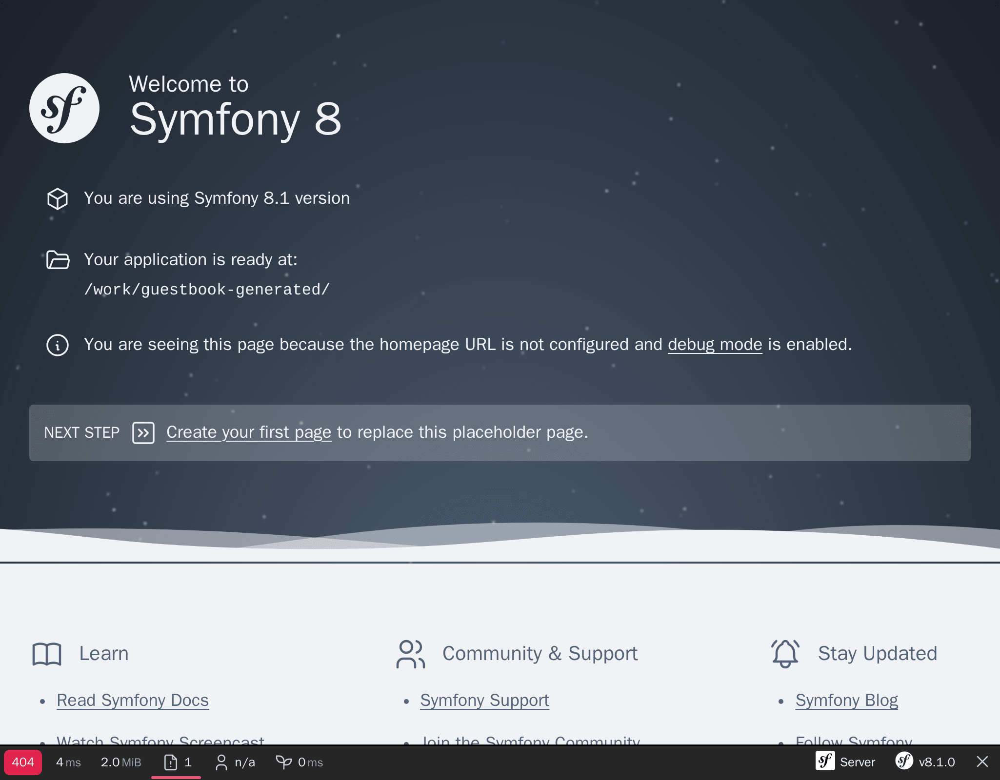

Problemen oplossen
==================

Een project opzetten betekent ook de juiste tools hebben om problemen te kunnen oplossen. Gelukkig zijn er al goede helpers beschikbaar via de ``webapp`` package.

De Symfony debugging-tools ontdekken
------------------------------------

.. index::
    single: Components;Profiler
    single: Profiler
    single: Web Profiler
    single: Web Debug Toolbar

Om te beginnen bespaart de Symfony Profiler je tijd wanneer je een probleem moet doorgronden.

Als je een kijkje neemt op de homepage, zou je een toolbar onderaan het scherm moeten zien:

Het eerste wat je misschien opvalt is de **404** in het rood. Onthoud dat deze pagina slechts een placeholder is, omdat we nog geen homepage hebben gedefinieerd. Ook al is het een mooie standaardpagina, het blijft wel een foutpagina. De HTTP-statuscode is daarom dus 404 en niet 200. Dankzij de web debug toolbar beschik je meteen over deze informatie.

Als je op het kleine uitroepteken klikt, krijg je de "echte" foutmelding te zien in de logs van de Symfony profiler. Als je de stack-trace wil bekijken, klik dan op de "Exception" link in het linker menu.

Wanneer er een probleem is met jouw code, zie je een foutpagina zoals de volgende, die je alles geeft wat je nodig hebt om het probleem te begrijpen en vinden waar het ontstaat:

.. figure:: screenshots/exception.png
    :alt: //
    :align: center
    :figclass: with-browser

Neem de tijd om rond te klikken door de informatie van de Symfony-profiler.

.. index::
    single: Symfony CLI;server:log

Logs zijn ook heel nuttig tijdens het debuggen. Symfony heeft een handig commando om alle logs (van de webserver, PHP en jouw applicatie) te volgen:

.. code-block:: terminal
    :class: ignore

    $ symfony server:log

Laten we een klein experiment doen. Open ``public/index.php`` en maak de PHP-code daar bewust stuk (voeg bijvoorbeeld foobar midden in de code toe). Ververs de pagina in de browser en bekijk de log stream:

.. code-block:: text
    :class: ignore

    Dec 21 10:04:59 |DEBUG| PHP    PHP Parse error:  syntax error, unexpected 'use' (T_USE) in public/index.php on line 5 path="/usr/bin/php7.42" php="7.42.0"
    Dec 21 10:04:59 |ERROR| SERVER GET  (500) / ip="127.0.0.1"

De output is mooi gekleurd zodat fouten snel te herkennen zijn.

De Symfony-omgevingen begrijpen
-------------------------------

.. index::
    single: Symfony Environments

Aangezien de Symfony Profiler enkel nuttig is tijdens ontwikkeling, willen we voorkomen dat deze in productie geïnstalleerd wordt. Standaard installeert Symfony deze alleen voor de ``dev`` en ``test`` omgevingen.

Symfony heeft verschillende *omgevingen*. Standaard zijn er drie omgevingen ingebouwd: ``dev`` , ``prod`` en ``test``, maar je kan er zo veel toevoegen als je wilt. Alle omgevingen delen dezelfde code, maar kunnen verschillende *configuraties* hebben.

Zo zijn bijvoorbeeld alle debugging tools ingeschakeld in de ``dev`` omgeving. In de ``prod``-omgeving wordt de applicatie dan weer geoptimaliseerd om te presteren.

Je kan overschakelen van de ene omgeving naar de andere door de omgevingsvariabele ``APP_ENV`` aan te passen.

Toen je een deployment uitvoerde naar Platform.sh, werd de omgeving (opgeslagen in ``APP_ENV`` ) automatisch overgeschakeld naar ``prod``.

Omgevingsconfiguraties beheren
------------------------------

.. index::
    single: Environment Variables
    single: .env
    single: .env.local

``APP_ENV`` kan worden ingesteld door gebruik te maken van de "gebruikelijke" omgevingsvariabelen in jouw terminal:

.. code-block:: terminal
    :class: ignore

    $ export APP_ENV=dev

Om waarden zoals de ``APP_ENV`` in te stellen op productieservers heeft het gebruik van echte omgevingsvariabelen de voorkeur. Maar op ontwikkelmachines is het lastig om omgevingsvariabelen te onderhouden. Je kan ze daarom ook via een ``.env``-bestand beheren.

Een standaard ``.env``-bestand werd automatisch voor je gegenereerd bij het aanmaken van het project:

.. code-block:: text
    :caption: .env
    :class: ignore

    ###> symfony/framework-bundle ###
    APP_ENV=dev
    APP_SECRET=c2927f273163f7225a358e3a1bbbed8a
    #TRUSTED_PROXIES=127.0.0.1,127.0.0.2
    #TRUSTED_HOSTS='^localhost|example\.com$'
    ###< symfony/framework-bundle ###

.. tip::

    Elke package kan omgevingsvariabelen aan dit bestand toevoegen via het Symfony Flex-recipe.

Het ``.env``-bestand wordt toegevoegd aan de repository en bevat de *standaardwaarden* van de productieomgeving. Je kan deze waarden overschrijven door een ``.env.local``-bestand toe te voegen. Dit bestand mag niet worden gecommit en is daarom al in het ``.gitignore``-bestand opgenomen.

Bewaar nooit geheime of gevoelige data in deze bestanden. We bekijken het beheer van secrets in een volgende stap.

Jouw IDE configureren
---------------------

In de ontwikkelomgeving, wanneer een exception wordt getriggerd, geeft Symfony een pagina weer met de melding en de stack trace. Bij de weergave van een bestandspad wordt een link toegevoegd die het bestand op de juiste lijn in jouw favoriete IDE opent. Om van deze functie te profiteren, moet je jouw IDE configureren. Symfony ondersteunt veel IDE's out of the box; ik gebruik Visual Studio Code voor dit project:

.. code-block:: diff
    :caption: patch_file

    --- i/php.ini
    +++ w/php.ini
    @@ -6,3 +6,4 @@ session.gc_probability=0
     session.use_strict_mode=On
     realpath_cache_ttl=3600
     zend.detect_unicode=Off
    +xdebug.file_link_format=vscode://file/%f:%l

Gekoppelde bestanden zijn niet beperkt tot fouten. De controller in de web debug toolbar wordt bijvoorbeeld klikbaar na het configureren van de IDE.

Problemen oplossen in productie
-------------------------------

.. index::
    single: Platform.sh;Remote Logs
    single: Platform.sh;SSH
    single: Symfony CLI;cloud:logs
    single: Symfony CLI;cloud:ssh

Het debuggen van productieservers is altijd lastiger. Zo heb je bijvoorbeeld geen toegang tot de Symfony-profiler. Logs zijn minder uitgebreid, maar het volgen van logs is mogelijk:

.. code-block:: terminal
    :class: ignore

    $ symfony cloud:logs --tail

Je kan zelfs met de webcontainer verbinden via SSH:

.. code-block:: terminal
    :class: ignore

    $ symfony cloud:ssh

Maak je geen zorgen, je kan niet snel iets stuk maken. Het grootste deel van het bestandssysteem is alleen-lezen. Je kan geen hotfix maken in productie. Later in het boek leer je een veel betere manier om dit te doen.

.. sidebar:: Verder gaan

    * `SymfonyCasts tutorial over omgevingen en configuratiebestanden`_;

    * `SymfonyCasts tutorial over omgevingsvariabelen`_;

    * `SymfonyCasts Web Debug Toolbar en Profiler tutorial`_;

    * `Beheer van meerdere .env-bestanden`_ in Symfony-toepassingen.

.. _`SymfonyCasts tutorial over omgevingen en configuratiebestanden`: https://symfonycasts.com/screencast/symfony-fundamentals/environment-config-files
.. _`SymfonyCasts tutorial over omgevingsvariabelen`: https://symfonycasts.com/screencast/symfony-fundamentals/environment-variables
.. _`SymfonyCasts Web Debug Toolbar en Profiler tutorial`: https://symfonycasts.com/screencast/symfony/debug-toolbar-profiler
.. _`Beheer van meerdere .env-bestanden`: https://symfony.com/doc/current/configuration.html#managing-multiple-env-files
