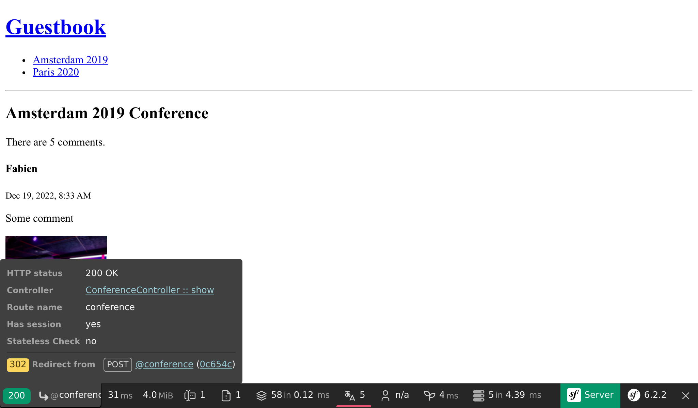

Przyjmowanie informacji zwrotnych za pomocą formularzy
=======================================================

.. index::
    single: Components;Form
    single: Form

Czas pozwolić naszym uczestnikom wyrazić swoją opinię na temat konferencji. Będą oni dodawać swoje komentarze poprzez *formularz HTML* .

Generowanie klasy formularza (ang. form type)
---------------------------------------------

.. index::
    single: Command;make:form

Użyj Maker Bundle, aby wygenerować klasę formularza:

.. code-block:: terminal

    $ symfony console make:form CommentType Comment

.. code-block:: text
    :class: ignore
    :emphasize-lines: 1

     created: src/Form/CommentType.php

      Success!

     Next: Add fields to your form and start using it.
     Find the documentation at https://symfony.com/doc/current/forms.html

Klasa ``App\Form\CommentType`` definiuje formularz dla encji ``App\Entity\Comment``:

.. code-block:: php
    :caption: src/Form/CommentType.php
    :class: ignore

    namespace App\Form;

    use App\Entity\Comment;
    use Symfony\Component\Form\AbstractType;
    use Symfony\Component\Form\FormBuilderInterface;
    use Symfony\Component\OptionsResolver\OptionsResolver;

    class CommentType extends AbstractType
    {
        public function buildForm(FormBuilderInterface $builder, array $options): void
        {
            $builder
                ->add('author')
                ->add('text')
                ->add('email')
                ->add('createdAt')
                ->add('photoFilename')
                ->add('conference')
            ;
        }

        public function configureOptions(OptionsResolver $resolver): void
        {
            $resolver->setDefaults([
                'data_class' => Comment::class,
            ]);
        }
    }

Klasa formularza (ang. `form type`_) opisuje *pola formularza* związane z modelem. Wykonuje konwersję danych pomiędzy przesłanymi danymi a właściwościami klasy modelu. Domyślnie Symfony używa metadanych z encji ``Comment`` – takich jak metadane Doctrine – aby odgadnąć konfigurację każdego pola. Na przykład, właściwość typu ``text`` renderowane jest jako pole ``textarea`` ponieważ wykorzystuje większą kolumnę w bazie danych.

Wyświetlanie formularza
------------------------

Aby wyświetlić formularz użytkownikowi, utwórz go w kontrolerze i przekaż do szablonu:

.. code-block:: diff
    :caption: patch_file
    :emphasize-lines: 20,30

    --- i/src/Controller/ConferenceController.php
    +++ w/src/Controller/ConferenceController.php
    @@ -2,8 +2,10 @@

     namespace App\Controller;

    +use App\Entity\Comment;
     use App\Entity\Conference;
    +use App\Form\CommentType;
     use App\Repository\CommentRepository;
     use App\Repository\ConferenceRepository;
     use Symfony\Bridge\Doctrine\Attribute\MapEntity;
     use Symfony\Bundle\FrameworkBundle\Controller\AbstractController;
    @@ -23,6 +25,9 @@ final class ConferenceController extends AbstractController
         #[Route('/conference/{slug}', name: 'conference')]
         public function show(#[MapEntity(mapping: ['slug' => 'slug'])] Conference $conference, CommentRepository $commentRepository, #[MapQueryParameter] int $offset = 0): Response
         {
    +        $comment = new Comment();
    +        $form = $this->createForm(CommentType::class, $comment);
    +
             $offset = max(0, $offset);
             $paginator = $commentRepository->getCommentPaginator($conference, $offset);

    @@ -31,6 +36,7 @@ final class ConferenceController extends AbstractController
                 'comments' => $paginator,
                 'previous' => $offset - CommentRepository::COMMENTS_PER_PAGE,
                 'next' => min(count($paginator), $offset + CommentRepository::COMMENTS_PER_PAGE),
    +            'comment_form' => $form,
             ]);
         }
     }

Nigdy nie powinno się tworzyć instancji klasy formularza (ang. form type) bezpośrednio. Zamiast tego, wykorzystaj metodę ``createForm()``. Metoda ta jest częścią ``AbstractController`` i ułatwia tworzenie formularzy.

.. index::
    single: Twig;form

W celu wyświetlenia formularza w szablonie można skorzystać z funkcji ``form`` biblioteki Twig:

.. code-block:: diff
    :caption: patch_file
    :emphasize-lines: 10

    --- i/templates/conference/show.html.twig
    +++ w/templates/conference/show.html.twig
    @@ -30,4 +30,8 @@
         
             
No comments have been posted yet for this conference.

         
    +
    +    <h2>Add your own feedback</h2>
    +
    +    {{ form(comment_form) }}
     

Podczas odświeżania strony konferencji w przeglądarce zwróć uwagę, że każde pole formularza pokazuje właściwy widżet HTML (dobrany na podstawie modelu):

.. figure:: screenshots/form.png
    :alt: /conference/amsterdam-2019
    :align: center
    :figclass: with-browser

Funkcja ``form()`` generuje formularz HTML na podstawie wszystkich informacji zdefiniowanych w klasie formularza (ang. form type). Dodaje również ``enctype=multipart/form-data`` do elementu ``<form>`` zgodnie z wymaganiami pola wgrywania plików. Co więcej, funkcja ta zadba o wyświetlanie komunikatów o błędach, gdy żądanie zawiera błędy. Wszystko można dostosować poprzez nadpisanie domyślnych szablonów, ale nie będzie nam to potrzebne w tym projekcie.

Dostosowywanie klasy formularza (ang. form type)
------------------------------------------------

Nawet jeśli pola formularza są konfigurowane na podstawie ich odpowiednika modelu, można dostosować domyślną konfigurację bezpośrednio w klasie formularza (ang. form type):

.. code-block:: diff
    :caption: patch_file

    --- i/src/Form/CommentType.php
    +++ w/src/Form/CommentType.php
    @@ -6,26 +6,32 @@ use App\Entity\Comment;
     use App\Entity\Conference;
     use Symfony\Bridge\Doctrine\Form\Type\EntityType;
     use Symfony\Component\Form\AbstractType;
    +use Symfony\Component\Form\Extension\Core\Type\EmailType;
    +use Symfony\Component\Form\Extension\Core\Type\FileType;
    +use Symfony\Component\Form\Extension\Core\Type\SubmitType;
     use Symfony\Component\Form\FormBuilderInterface;
     use Symfony\Component\OptionsResolver\OptionsResolver;
    +use Symfony\Component\Validator\Constraints\Image;

     class CommentType extends AbstractType
     {
         public function buildForm(FormBuilderInterface $builder, array $options): void
         {
             $builder
    -            ->add('author')
    +            ->add('author', null, [
    +                'label' => 'Your name',
    +            ])
                 ->add('text')
    -            ->add('email')
    -            ->add('createdAt', null, [
    -                'widget' => 'single_text',
    +            ->add('email', EmailType::class)
    +            ->add('photo', FileType::class, [
    +                'required' => false,
    +                'mapped' => false,
    +                'constraints' => [
    +                    new Image(maxSize: '1024k')
    +                ],
                 ])
    -            ->add('photoFilename')
    -            ->add('conference', EntityType::class, [
    -                'class' => Conference::class,
    -                'choice_label' => 'id',
    -            ])
    -        ;
    +            ->add('submit', SubmitType::class)
    +       ;
         }

         public function configureOptions(OptionsResolver $resolver): void

Zauważ, że dodaliśmy przycisk wyślij (ang. submit) (który pozwala nam używać prostego wyrażenia ``{{ form(comment_form) }}`` w szablonie).

Niektóre pola nie mogą być automatycznie konfigurowane, tak jak to ma miejsce w przypadku pola ``photoFilename``. Encja ``Comment`` musi tylko zapisać nazwę pliku zdjęcia, ale formularz musi zająć się wgraniem pliku. Do obsługi tego przypadku dodaliśmy pole o nazwie ``photo``, które nie jest ``mapowane`` do żadnej właściwości w ``Comment`` . Będziemy zarządzać nim ręcznie, aby zaimplementować określone schematy działań (np. przechowywanie przesłanego zdjęcia na dysku).

Zmodyfikowaliśmy również domyślną etykietę dla niektórych pól, aby zademonstrować możliwości dostosowywania.

.. figure:: screenshots/form-customized.png
    :alt: /conference/amsterdam-2019
    :align: center
    :figclass: with-browser

Walidacja modeli
----------------

Klasa formularza (ang. form type) konfiguruje renderowanie formularza na frontendzie (poprzez niektóre walidacje HTML5). Oto wygenerowany formularz HTML:

.. code-block:: html
    :class: ignore

    <form name="comment_form" method="post" enctype="multipart/form-data">
        

            

                <label for="comment_form_author" class="required">Your name</label>
                <input type="text" id="comment_form_author" name="comment_form[author]" required="required" maxlength="255" />
            

            

                <label for="comment_form_text" class="required">Text</label>
                <textarea id="comment_form_text" name="comment_form[text]" required="required"></textarea>
            

            

                <label for="comment_form_email" class="required">Email</label>
                <input type="email" id="comment_form_email" name="comment_form[email]" required="required" />
            

            

                <label for="comment_form_photo">Photo</label>
                <input type="file" id="comment_form_photo" name="comment_form[photo]" />
            

            

                <button type="submit" id="comment_form_submit" name="comment_form[submit]">Submit</button>
            

            <input type="hidden" id="comment_form__token" name="comment_form[_token]" value="DwqsEanxc48jofxsqbGBVLQBqlVJ_Tg4u9-BL1Hjgac" />
        

    </form>

Formularz wykorzystuje pole typu ``email`` do przekazania adresu e-mail komentującego i czyni większość pól wymaganymi (ang. ``required``). Zauważ też, że występuje tutaj ukryte pole ``_token``, które jest częścią mechanizmu chroniącego przed `atakami CSRF`_.

Jeśli jednak przesłanie formularza omija walidację HTML (przy użyciu klienta HTTP, który nie egzekwuje tych zasad walidacji jak np. cURL), nieprawidłowe dane mogą trafić na serwer.

Musimy dodać również ograniczenia walidacji (ang. validation constraints) dotyczące walidacji modelu danych ``Comment``:

.. code-block:: diff
    :caption: patch_file

    --- i/src/Entity/Comment.php
    +++ w/src/Entity/Comment.php
    @@ -5,6 +5,7 @@ namespace App\Entity;
     use App\Repository\CommentRepository;
     use Doctrine\DBAL\Types\Types;
     use Doctrine\ORM\Mapping as ORM;
    +use Symfony\Component\Validator\Constraints as Assert;

     #[ORM\Entity(repositoryClass: CommentRepository::class)]
     #[ORM\HasLifecycleCallbacks]
    @@ -16,12 +17,16 @@ class Comment
         private ?int $id = null;

         #[ORM\Column(length: 255)]
    +    #[Assert\NotBlank]
         private ?string $author = null;

         #[ORM\Column(type: Types::TEXT)]
    +    #[Assert\NotBlank]
         private ?string $text = null;

         #[ORM\Column(length: 255)]
    +    #[Assert\NotBlank]
    +    #[Assert\Email]
         private ?string $email = null;

         #[ORM\Column]

Obsługa formularza
-------------------

Napisany przez nas do tej pory kod jest wystarczający do wyświetlenia formularza.

Powinniśmy teraz zająć się przesyłaniem formularzy i zapisaniem dostarczonych przez nie danych do bazy danych w kontrolerze:

.. code-block:: diff
    :caption: patch_file

    --- i/src/Controller/ConferenceController.php
    +++ w/src/Controller/ConferenceController.php
    @@ -7,8 +7,10 @@ use App\Entity\Conference;
     use App\Form\CommentType;
     use App\Repository\CommentRepository;
     use App\Repository\ConferenceRepository;
    +use Doctrine\ORM\EntityManagerInterface;
     use Symfony\Bridge\Doctrine\Attribute\MapEntity;
     use Symfony\Bundle\FrameworkBundle\Controller\AbstractController;
    +use Symfony\Component\HttpFoundation\Request;
     use Symfony\Component\HttpFoundation\Response;
     use Symfony\Component\HttpKernel\Attribute\MapQueryParameter;
     use Symfony\Component\Routing\Attribute\Route;
    @@ -14,6 +15,11 @@ use Symfony\Component\Routing\Attribute\Route;

     final class ConferenceController extends AbstractController
     {
    +    public function __construct(
    +        private EntityManagerInterface $entityManager,
    +    ) {
    +    }
    +
         #[Route('/', name: 'homepage')]
         public function index(ConferenceRepository $conferenceRepository): Response
         {
    @@ -24,10 +30,19 @@ final class ConferenceController extends AbstractController
         }

         #[Route('/conference/{slug}', name: 'conference')]
    -    public function show(#[MapEntity(mapping: ['slug' => 'slug'])] Conference $conference, CommentRepository $commentRepository, #[MapQueryParameter] int $offset = 0): Response
    +    public function show(Request $request, #[MapEntity(mapping: ['slug' => 'slug'])] Conference $conference, CommentRepository $commentRepository, #[MapQueryParameter] int $offset = 0): Response
         {
             $comment = new Comment();
             $form = $this->createForm(CommentType::class, $comment);
    +        $form->handleRequest($request);
    +        if ($form->isSubmitted() && $form->isValid()) {
    +            $comment->setConference($conference);
    +
    +            $this->entityManager->persist($comment);
    +            $this->entityManager->flush();
    +
    +            return $this->redirectToRoute('conference', ['slug' => $conference->getSlug()]);
    +        }

             $offset = max(0, $offset);
             $paginator = $commentRepository->getCommentPaginator($conference, $offset);

Zwróć uwagę, że obiekt ``Request`` jest teraz wstrzykiwany do kontrolera, ponieważ formularz potrzebuje go do zbadania przesłanych danych za pomocą ``handleRequest()``.

Po wysłaniu formularza, obiekt ``Comment`` jest aktualizowany zgodnie z przesłanymi danymi.

Konferencja musi być taka sama jak ta z adresu URL (usunęliśmy ją z formularza).

Jeśli formularz nie jest poprawny, wyświetlamy stronę, ale formularz będzie teraz zawierał przesłane wartości i komunikaty o błędach, tak aby można je było wyświetlić z powrotem użytkownikowi.

Spróbuj użyć formularza. Powinien działać dobrze, a dane powinny zostać zapisane w bazie danych (sprawdź w panelu administracyjnym). Jest jednak jeden problem: zdjęcia. Zapis zdjęć jeszcze nie działa, ponieważ nie dodaliśmy jego obsługi w kontrolerze.

Przesyłanie plików
--------------------

Przesłane zdjęcia powinny być przechowywane na dysku lokalnym, w publicznym katalogu dostępnym dla frontendu, abyśmy mogli je wyświetlić na stronie konferencji. Będziemy je przechowywać w katalogu ``public/uploads/photos``.

.. index::
    single: Attribute;Autowire
    single: Autowire

Ponieważ nie chcemy na stałe przechowywać ścieżki katalogu w kodzie, potrzebujemy sposobu na przechowywanie jej globalnie w konfiguracji. Kontener Symfony może oprócz usług, przechowywać również *parametry*, które są wartościami skalarnymi pomagającymi konfigurować usługi:

.. code-block:: diff
    :caption: patch_file

    --- i/config/services.yaml
    +++ w/config/services.yaml
    @@ -4,6 +4,7 @@
     # Put parameters here that don't need to change on each machine where the app is deployed
     # https://symfony.com/doc/current/best_practices.html#use-parameters-for-application-configuration
     parameters:
    +    photo_dir: "%kernel.project_dir%/public/uploads/photos"

     services:
         # default configuration for services in *this* file

Widzieliśmy już, jak usługi są automatycznie wstrzykiwane do konstruktora w postaci argumentów. W przypadku parametrów kontenera możemy je jawnie wstrzyknąć za pomocą atrybutu ``Autowire``.

Teraz mamy wszystko, co musimy wiedzieć, aby zaimplementować logikę potrzebną do przechowywania przesłanego pliku w miejscu docelowym:

.. code-block:: diff
    :caption: patch_file

    --- i/src/Controller/ConferenceController.php
    +++ w/src/Controller/ConferenceController.php
    @@ -9,7 +9,8 @@ use App\Repository\CommentRepository;
     use App\Repository\ConferenceRepository;
     use Doctrine\ORM\EntityManagerInterface;
     use Symfony\Bridge\Doctrine\Attribute\MapEntity;
     use Symfony\Bundle\FrameworkBundle\Controller\AbstractController;
    +use Symfony\Component\DependencyInjection\Attribute\Autowire;
     use Symfony\Component\HttpFoundation\Request;
     use Symfony\Component\HttpFoundation\Response;
     use Symfony\Component\Routing\Attribute\Route;
    @@ -29,13 +30,24 @@ final class ConferenceController extends AbstractController
         }

         #[Route('/conference/{slug}', name: 'conference')]
    -    public function show(Request $request, #[MapEntity(mapping: ['slug' => 'slug'])] Conference $conference, CommentRepository $commentRepository, #[MapQueryParameter] int $offset = 0): Response
    -    {
    +    public function show(
    +        Request $request,
    +        #[MapEntity(mapping: ['slug' => 'slug'])]
    +        Conference $conference,
    +        CommentRepository $commentRepository,
    +        #[Autowire('%photo_dir%')] string $photoDir,
    +        #[MapQueryParameter] int $offset = 0,
    +    ): Response {
             $comment = new Comment();
             $form = $this->createForm(CommentType::class, $comment);
             $form->handleRequest($request);
             if ($form->isSubmitted() && $form->isValid()) {
                 $comment->setConference($conference);
    +            if ($photo = $form['photo']->getData()) {
    +                $filename = bin2hex(random_bytes(6)).'.'.$photo->guessExtension();
    +                $photo->move($photoDir, $filename);
    +                $comment->setPhotoFilename($filename);
    +            }

                 $this->entityManager->persist($comment);
                 $this->entityManager->flush();

Aby zarządzać przesyłanymi zdjęciami, tworzymy losową nazwę pliku. Następnie przenosimy przesłany plik do jego ostatecznej lokalizacji (katalogu zdjęć). Wreszcie umieszczamy nazwę pliku w obiekcie Comment.

Spróbuj przesłać plik PDF zamiast zdjęcia. Zobacz, jak działają komunikaty o błędach. Projekt jest w tej chwili dość brzydki, ale nie martw się, wszystko wypięknieje za chwilę, kiedy będziemy pracować nad wyglądem naszej aplikacji. Zmienimy wtedy jedną linię konfiguracji, aby ostylować wszystkie elementy formularza.

Debugowanie formularzy
----------------------

Jeśli formularz został wysłany, a coś nie działa całkiem dobrze, użyj panelu „Form” w Symfony Profiler. Zawiera informacje o formularzu, wszystkich jego opcjach, przesłanych danych i sposobie ich konwersji wewnętrznej. Jeśli formularz zawiera jakieś błędy, zostaną one również wymienione.

Typowy przepływ pracy (ang. workflow) z formularzami przebiega w ten sposób:

* Formularz jest wyświetlany na stronie;

* Użytkownik przesyła formularz za pośrednictwem żądania POST;

* Serwer przekierowuje użytkownika na inną stronę lub tę samą stronę.

Ale w jaki sposób można uzyskać dostęp do profilera prawidłowego żądania? Ponieważ strona jest natychmiast przekierowywana, nigdy nie widzimy paska narzędzi do debugowania dla żądania POST. Nie ma problemu: na przekierowanej stronie należy najechać na lewą, zieloną część z napisem „200”. Zobaczysz wtedy przekierowanie „302” z linkiem do profilu (w nawiasie).

Kliknij na niego, aby uzyskać dostęp do profilu żądania POST i przejdź do panelu "Form":

.. code-block:: terminal
    :class: hide

    $ rm -rf var/cache

.. figure:: screenshots/form-profiler.png
    :alt: /_profiler/450aa5
    :align: center
    :figclass: with-browser

Wyświetlanie załadowanych zdjęć w panelu administracyjnym
-------------------------------------------------------------

Panel administracyjny wyświetla obecnie nazwę pliku zdjęcia, ale chcemy zobaczyć rzeczywiste zdjęcie:

.. code-block:: diff
    :caption: patch_file

    --- i/src/Controller/Admin/CommentCrudController.php
    +++ w/src/Controller/Admin/CommentCrudController.php
    @@ -10,6 +10,7 @@ use EasyCorp\Bundle\EasyAdminBundle\Field\AssociationField;
     use EasyCorp\Bundle\EasyAdminBundle\Field\DateTimeField;
     use EasyCorp\Bundle\EasyAdminBundle\Field\EmailField;
     use EasyCorp\Bundle\EasyAdminBundle\Field\IdField;
    +use EasyCorp\Bundle\EasyAdminBundle\Field\ImageField;
     use EasyCorp\Bundle\EasyAdminBundle\Field\TextareaField;
     use EasyCorp\Bundle\EasyAdminBundle\Field\TextEditorField;
     use EasyCorp\Bundle\EasyAdminBundle\Field\TextField;
    @@ -47,7 +48,9 @@ class CommentCrudController extends AbstractCrudController
             yield TextareaField::new('text')
                 ->hideOnIndex()
             ;
    -        yield TextField::new('photoFilename')
    +        yield ImageField::new('photoFilename')
    +            ->setBasePath('/uploads/photos')
    +            ->setLabel('Photo')
                 ->onlyOnIndex()
             ;

Wykluczanie załadowanych zdjęć z Gita
----------------------------------------

Nie zatwierdzaj (ang. commit) jeszcze zmian! Nie chcemy przechowywać przesłanych obrazów w repozytorium Git. Dodaj katalog ``/public/uploads`` do pliku ``.gitignore``:

.. code-block:: diff
    :caption: patch_file

    --- i/.gitignore
    +++ w/.gitignore
    @@ -1,3 +1,4 @@
    +/public/uploads

     ###> symfony/framework-bundle ###
     /.env.local

Przechowywanie przesłanych plików na serwerach produkcyjnych
--------------------------------------------------------------

Ostatnim zagadnieniem jest przechowywanie przesłanych plików na serwerach produkcyjnych. Dlaczego mielibyśmy robić coś specjalnego? Ponieważ większość nowoczesnych platform chmurowych używa – z różnych powodów – kontenerów tylko do odczytu. Upsun nie jest wyjątkiem.

Nie wszystko jest w trybie tylko do odczytu w projekcie Symfony. Bardzo staramy się umieścić jak najwięcej rzeczy w pamięci podręcznej podczas budowania kontenera (podczas fazy rozgrzewania <ang. warmup>), ale Symfony nadal musi być w stanie zapisać gdzieś zrzuty pamięci podręcznej użytkownika, logi, sesje, jeśli są one przechowywane w systemie plików, i wiele więcej.

Spójrz na plik ``.upsun/config.yaml``. W katalogu ``var/`` jest już zasób (ang. *mount*) z prawami zapisu. Katalog ``var/`` jest jedynym katalogiem, w którym Symfony dokonuje zapisu (zrzuty pamięci podręcznej, logi, …).

Stwórzmy nowy zasób (ang. mount) dla przesłanych zdjęć:

.. code-block:: diff
    :caption: patch_file

    --- i/.upsun/config.yaml
    +++ w/.upsun/config.yaml
    @@ -41,6 +41,7 @@ applications:
             mounts:
                 "/var/cache": { source: instance, source_path: var/cache }
                 "/var/share": { source: storage, source_path: var/share }
    +            "/public/uploads": { source: storage, source_path: uploads }

             relationships:

Możesz teraz wdrożyć (ang. deploy) kod, a zdjęcia będą przechowywane w katalogu ``public/uploads/``, tak jak w naszej lokalnej wersji.

.. sidebar:: Idąc dalej

    * `Samouczek SymfonyCasts – formularze`_;

    * Jak `dostosować renderowanie formularza Symfony w HTML`_;

    * `Walidacja formularzy Symfony`_;

    * `Klasa formularza Symfony (ang. form type) – dokument referencyjny`_;

    * `Dokumentacja FlysystemBundle`_, który zapewnia integrację z wieloma dostawcami przestrzeni w chmurze, takimi jak AWS S3, Azure i Google Cloud Storage;

    * `Parametry konfiguracji Symfony`_.

    * `Reguły walidacji Symfony`_;

    * `Ściągawka Symfony Form`_.

.. _`atakami CSRF`: https://owasp.org/www-community/attacks/csrf
.. _`form type`: https://symfony.com/doc/current/forms.html#form-types
.. _`Samouczek SymfonyCasts – formularze`: https://symfonycasts.com/screencast/symfony-forms
.. _`dostosować renderowanie formularza Symfony w HTML`: https://symfony.com/doc/current/form/form_customization.html
.. _`Walidacja formularzy Symfony`: https://symfony.com/doc/current/forms.html#validating-forms
.. _`Klasa formularza Symfony (ang. form type) – dokument referencyjny`: https://symfony.com/doc/current/reference/forms/types.html
.. _`Dokumentacja FlysystemBundle`: https://github.com/thephpleague/flysystem-bundle/blob/master/docs/1-getting-started.md
.. _`Parametry konfiguracji Symfony`: https://symfony.com/doc/current/configuration.html#configuration-parameters
.. _`Reguły walidacji Symfony`: https://symfony.com/doc/current/validation.html#basic-constraints
.. _`Ściągawka Symfony Form`: https://github.com/andreia/symfony-cheat-sheets/blob/master/Symfony2/how_symfony2_forms_works_en.pdf
