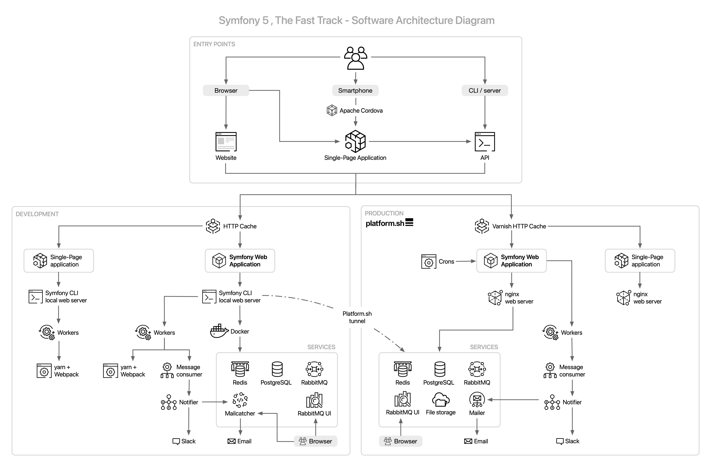

Przedstawienie projektu
=======================

Musimy znaleźć projekt, nad którym będziemy pracować. Jest to spore wyzwanie, ponieważ musimy znaleźć projekt wystarczająco duży, aby dokładnie omówić Symfony, ale jednocześnie na tyle mały, abyście się nie znudzili wdrażając podobne funkcje więcej niż raz.

Wyłonienie projektu
--------------------

Ponieważ książka zostanie opublikowana podczas SymfonyCon Amsterdam, byłoby fajnie, gdyby nasz projekt w jakiś sposób był związany z Symfony i konferencjami. Co myślisz o `księdze gości`_? `Livre d'or <https://fr.wikipedia.org/wiki/Livre_d%27or>`_, jak mówimy po francusku. Odczuwam przyjemną nostalgię tworząc księgę gości w 2019 roku!

Trafiony-zatopiony. Projekt będzie polegał na zbieraniu informacji na temat konferencji: lista konferencji na stronie głównej, osobna strona dla każdej konferencji, mnóstwo miłych komentarzy. Komentarz składa się z krótkiego tekstu i opcjonalnego zdjęcia wykonanego podczas konferencji. Przypuszczam, że właśnie wypisałem całą specyfikację, której potrzebujemy, aby zacząć.

*Projekt* będzie zawierał kilka *aplikacji*. Klasyczna aplikacja internetowa z frontendem w HTML, API i SPA dla telefonów komórkowych. Co Ty na to?

Nauka przez praktykę
---------------------

Najlepiej się uczyć, ćwicząc. Kropka. Czytanie książki o Symfony jest przyjemne, ale kodowanie aplikacji na własnym komputerze podczas lektury jest o wiele lepsze. Ta książka jest wyjątkowa również z innego powodu. Napisałem ją w taki sposób, abyś podążając przez kolejne rozdziały, osiągał/a takie same rezultaty, jak ja, kiedy po raz pierwszy kodowałem tę aplikację.

Książka zawiera cały kod, który musisz napisać, i wszystkie polecenia, które musisz wykonać, aby uzyskać ostateczny projekt. Nie pominąłem żadnego kawałka kodu i podałem wszystkie polecenia. Jest to możliwe, ponieważ nowoczesne aplikacje napisane w Symfony nie wymagają zbyt dużo bazowego kodu. Większość kodu, który napiszemy razem, dotyczy *logiki biznesowej* projektu. Reszta jest w większości zautomatyzowana lub zostanie wygenerowana automatycznie.

Schemat infrastruktury
----------------------

Nawet jeśli pomysł wydaje się prosty, nie zamierzamy budować projektu w stylu "Hello World". Nie ograniczymy się do PHP i bazy danych.

Celem jest stworzenie projektu, w którym rozwiążemy niektóre problemy, z jakimi spotykasz się w codziennym życiu. Jakie? Przyjrzyj się końcowej infrastrukturze projektu:

Jedną z największych korzyści płynących z zastosowania frameworka jest niewielka ilość kodu potrzebna do napisania takiego projektu:

* 20 klas PHP w katalogu ``src/`` dla aplikacji internetowej;

* 550 znaczących linii kodu PHP (ang. Logical Lines of Code, LLOC) zgodnie z danymi wskazanymi przez `PHPLOC`_;

* 40 linii dostosowujących konfigurację podzielonych na trzy pliki (przy użyciu atrybutów i YAML), do skonfigurowania części backendowej projektu;

* 20 linii konfiguracji infrastruktury lokalnej (Docker);

* 100 linii konfiguracji infrastruktury produkcyjnej (Upsun);

* 5 zdefiniowanych zmiennych środowiskowych.

Czas na wyzwanie!

Skąd pobrać kod źródłowy projektu?
---------------------------------------

Trzymając się stylistyki lat 90., mógłbym stworzyć płytę CD zawierającą kod źródłowy i Ci ją udostępnić, prawda? Zamiast tego staromodnego podejścia wykorzystamy jednak repozytorium Git.

.. index::
    single: Project;Git Repository
    single: Git;clone

Sklonuj (ang. clone) `repozytorium księgi gości`_ na swój komputer:

.. code-block:: terminal
    :class: ignore

    $ symfony new --version=8.1-1 --book guestbook

To repozytorium zawiera cały kod tej książki.

Zauważ, że używamy ``symfony new`` zamiast ``git clone``. Polecenie ``symfony new`` robi więcej niż tylko klonowanie repozytorium (hostowanego na GitHubie w ramach organizacji ``the-fast-track``: ``https://github.com/the-fast-track/book-6.2-1``). Uruchamia również serwer WWW, kontenery, migruje bazę danych, uzupełnia bazę testowymi danymi (ang. fixtures), itp. Po uruchomieniu tego polecenia, strona internetowa powinna być uruchomiona i gotowa do użycia.

Kod z repozytorium jest identyczny z kodem w książce (użyj dokładnego adresu URL repozytorium podanego powyżej). Ręczne wprowadzanie zmian opisywanych w kolejnych rozdziałach do kodu źródłowego w repozytorium jest prawie niemożliwe. Próbowałem tego w przeszłości, ale nie udało mi się. Tak się po prostu nie da. Szczególnie w przypadku książek, które opowiadają historię tworzenia strony internetowej. Ponieważ każdy rozdział zależy od poprzednich, zmiana może wpłynąć na wszystkie kolejne rozdziały.

Dobrą wiadomością jest to, że repozytorium Git dla tej książki jest nie ręcznie, lecz *automatycznie generowane* na podstawie jej zawartości. Dokładnie tak! Lubię wszystko automatyzować, więc istnieje skrypt, którego zadaniem jest przejście książki i stworzenie repozytorium Git na jej podstawie. Ma to pewną nieoczekiwaną konsekwencję: podczas aktualizacji książki skrypt zawiedzie, jeśli zmiany są niespójne lub jeśli zapomnę o zaktualizowniu niektórych instrukcji. To istne BDD - Book Driven Development!

Nawigowanie po kodzie źródłowym
----------------------------------

Co więcej, repozytorium to nie tylko ostateczna wersja kodu na gałęzi ``main``. Skrypt wykonuje instrukcje przedstawione w książce i zatwierdza zmiany (ang. commit) na końcu każdej sekcji. Dodatkowo każda zmiana w repozytorium jest odpowiednio oznaczona (ang. tag) nazwą etapu, którego dotyczy - co ułatwi Ci przeglądanie kodu. Ładnie, prawda?

.. index::
    single: Git;checkout

Jeżeli chcesz, możesz zobaczyć cały kod, jaki powstał w danym etapie, poprzez przełączenie się (ang. checkout) na odpowiedni znacznik (ang. tag). Na przykład, jeśli chcesz przeczytać i przetestować kod na końcu etapu 10, wykonaj następujące czynności:

.. code-block:: terminal
    :class: ignore

    $ symfony book:checkout 10

Podobnie jak w przypadku klonowania repozytorium, nie używamy komendy ``git checkout`` ale ``symfony book:checkout``. Polecenie to sprawia, że niezależnie od stanu, w jakim jest Twój projekt, pliki zmieniają się do wersji zgodnej z etapem, który wskazujesz, a strona jest nadal w pełni funkcjonalna. **Uwaga! Wszystkie dotychczasowe dane, kod i kontenery są usuwane w trakcie tej operacji.**

Możesz również przełączyć się na konkretny podetap:

.. code-block:: terminal
    :class: ignore

    $ symfony book:checkout 10.2

Ponownie, gorąco polecam samodzielne kodowanie, ale jeśli utkniesz, zawsze możesz porównać swój kod z zawartym w książce.

.. index::
    single: Git;diff

Nie wiesz, czy Twój kod jest poprawny w podetapie 10.2? Sprawdź listę zmian (ang. diff):

.. code-block:: terminal
    :class: ignore

    $ git diff step-10-1...step-10-2

    # And for the very first substep of a step:
    $ git diff step-9...step-10-1

.. index::
    single: Git;log

Chcesz wiedzieć, kiedy plik został utworzony lub zmodyfikowany?

.. code-block:: terminal
    :class: ignore

    $ git log -- src/Controller/ConferenceController.php

Możesz również przeglądać listy zmian (ang. diffs), znaczniki (ang. tags) i konkretne zatwierdzenia (ang. commit) bezpośrednio na GitHub. Jest to świetny sposób na skopiowanie/wklejenie kodu, jeśli czytasz papierową książkę!

.. _`PHPLOC`: https://github.com/sebastianbergmann/phploc
.. _`księdze gości`: https://en.wikipedia.org/wiki/Guestbook
.. _`repozytorium księgi gości`: https://github.com/the-fast-track/book-5.0-1
