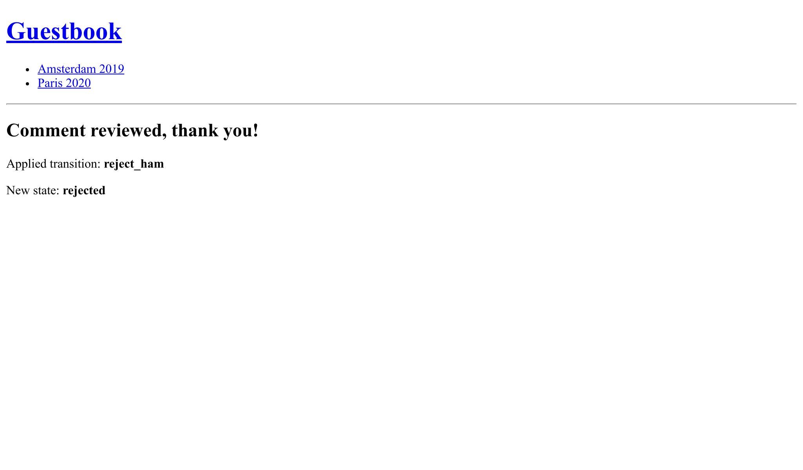

Wysyłanie e-maili do administratorów
======================================

.. index::
    single: Components;Mailer
    single: Mailer
    single: Emails

W celu zapewnienia wysokiej jakości informacji zwrotnej, administracja musi moderować wszystkie komentarze. Kiedy komentarz jest w stanie ``ham`` lub ``potential_spam``, *wiadomość e-mail* powinna zostać wysłana do administratorów z dwoma linkami: jednym do zaakceptowania komentarza, a drugim do jego odrzucenia.

Ustawianie e-maila dla konta administracyjnego
----------------------------------------------

Aby zapisać adres e-mail konta administracyjnego, użyj parametru kontenera. Dla celów demonstracyjnych, pozwalamy również na ustawienie go za pomocą zmiennej środowiskowej (nie powinna być potrzebna w "prawdziwym życiu"):

.. code-block:: diff
    :caption: patch_file

    --- a/config/services.yaml
    +++ b/config/services.yaml
    @@ -5,6 +5,8 @@
     # https://symfony.com/doc/current/best_practices.html#use-parameters-for-application-configuration
     parameters:
         photo_dir: "%kernel.project_dir%/public/uploads/photos"
    +    default_admin_email: admin@example.com
    +    admin_email: "%env(string:default:default_admin_email:ADMIN_EMAIL)%"

     services:
         # default configuration for services in *this* file

Zmienna środowiskowa może zostać "przetworzona" przed użyciem. W tym przypadku, używamy procesora ``default``, aby zwrócić domyślnie wartość parametru ``default_admin_email``, jeśli zmienna środowiskowa ``ADMIN_EMAIL`` nie istnieje.

Wysyłanie powiadomień e-mail
------------------------------

Aby wysłać wiadomość e-mail, możesz wybrać pomiędzy kilkoma abstrakcjami klasy ``Email``; od klasy najniższego poziomu ``Message`` do najwyższego poziomu ``NotificationEmail``. Prawdopodobnie najczęściej skorzystasz z klasy ``Email``, ale ``NotificationEmail`` jest idealnym wyborem dla wewnętrznych wiadomości e-mail.

Przy obsłudze wiadomości zastąpmy reguły automatycznej walidacji:

.. code-block:: diff
    :caption: patch_file

    --- a/src/MessageHandler/CommentMessageHandler.php
    +++ b/src/MessageHandler/CommentMessageHandler.php
    @@ -7,6 +7,9 @@ use App\Repository\CommentRepository;
     use App\SpamChecker;
     use Doctrine\ORM\EntityManagerInterface;
     use Psr\Log\LoggerInterface;
    +use Symfony\Bridge\Twig\Mime\NotificationEmail;
    +use Symfony\Component\DependencyInjection\Attribute\Autowire;
    +use Symfony\Component\Mailer\MailerInterface;
     use Symfony\Component\Messenger\Attribute\AsMessageHandler;
     use Symfony\Component\Messenger\MessageBusInterface;
     use Symfony\Component\Workflow\WorkflowInterface;
    @@ -20,6 +23,8 @@ class CommentMessageHandler
             private CommentRepository $commentRepository,
             private MessageBusInterface $bus,
             private WorkflowInterface $commentStateMachine,
    +        private MailerInterface $mailer,
    +        #[Autowire('%admin_email%')] private string $adminEmail,
             private ?LoggerInterface $logger = null,
         ) {
         }
    @@ -42,8 +47,13 @@ class CommentMessageHandler
                 $this->entityManager->flush();
                 $this->bus->dispatch($message);
             } elseif ($this->commentStateMachine->can($comment, 'publish') || $this->commentStateMachine->can($comment, 'publish_ham')) {
    -            $this->commentStateMachine->apply($comment, $this->commentStateMachine->can($comment, 'publish') ? 'publish' : 'publish_ham');
    -            $this->entityManager->flush();
    +            $this->mailer->send((new NotificationEmail())
    +                ->subject('New comment posted')
    +                ->htmlTemplate('emails/comment_notification.html.twig')
    +                ->from($this->adminEmail)
    +                ->to($this->adminEmail)
    +                ->context(['comment' => $comment])
    +            );
             } elseif ($this->logger) {
                 $this->logger->debug('Dropping comment message', ['comment' => $comment->getId(), 'state' => $comment->getState()]);
             }

``MailerInterface`` jest kluczowym interfejsem pozwalającym na wysyłanie e-maili metodą ``send()``.

Aby wysłać wiadomość e-mail, potrzebujemy nadawcy (nagłówka ``From``/``Sender``). Zamiast ustawiać go bezpośrednio w instancji klasy ``Email``, zdefiniuj ją globalnie:

.. code-block:: diff
    :caption: patch_file

    --- a/config/packages/mailer.yaml
    +++ b/config/packages/mailer.yaml
    @@ -1,3 +1,5 @@
     framework:
         mailer:
             dsn: '%env(MAILER_DSN)%'
    +        envelope:
    +            sender: "%admin_email%"

Rozszerzanie szablonu powiadomienia e-mail (ang. notification email template)
-----------------------------------------------------------------------------

.. index::
    single: Twig;extends
    single: Twig;block
    single: Twig;url

Szablon powiadomienia e-mail dziedziczy po domyślnym szablonie powiadomienia e-mail, który jest dostarczany wraz z Symfony:

.. code-block:: html+twig
    :caption: templates/emails/comment_notification.html.twig

    

    
        Author: {{ comment.author }} 
        Email: {{ comment.email }} 
        State: {{ comment.state }} 

        

            {{ comment.text }}
        

    

    
        <spacer size="16"></spacer>
        <button href="{{ url('review_comment', { id: comment.id }) }}">Accept</button>
        <button href="{{ url('review_comment', { id: comment.id, reject: true }) }}">Reject</button>
    

Szablon nadpisuje kilka bloków, aby dostosować treść wiadomości e-mail i dodać kilka odnośników, które pozwalają administracji zaakceptować lub odrzucić komentarz. Każdy argument trasy (ang. route argument), który nie jest poprawnym parametrem trasy (ang. route parameter) jest dodawany jako element łańcucha zapytań (adres URL odrzucenia wygląda tak ``/admin/comment/review/42?reject=true``).

Domyślny szablon``NotificationEmail`` używa `Inky`_ zamiast HTML do projektowania wiadomości e-mail. Jest on pomocny w tworzeniu responsywnych wiadomości e-mail, które są kompatybilne z wszystkimi popularnymi klientami poczty elektronicznej.

W celu zapewnienia maksymalnej kompatybilności z czytnikami e-mail, podstawowy layout powiadomień domyślnie zawiera wszystkie arkusze stylów (poprzez pakiet CSS inliner).

Te dwie funkcje są częścią opcjonalnych rozszerzeń biblioteki Twig, które należy zainstalować:

.. code-block:: terminal

    $ symfony composer req "twig/cssinliner-extra:^3" "twig/inky-extra:^3"

Generowanie bezwzględnych adresów URL wewnątrz polecenia (ang. command)
--------------------------------------------------------------------------

.. index::
    single: Twig;Link
    single: Link

W wiadomościach e-mail generuj adresy URL wykorzystując funkcję ``url()`` zamiast ``path()``, jako że potrzebujesz bezwzględnych adresów (z protokołem i hostem).

E-mail jest wysyłany za pomocą obsługi wiadomości (ang. message handler) z poziomu konsoli. Generowanie bezwzględnych adresów URL z poziomu przeglądarki jest łatwiejsze, ponieważ znamy protokół i domenę strony, co nie ma miejsca w przypadku wywołania z poziomu konsoli.

Zdefiniuj nazwę domeny i protokół do użycia:

.. code-block:: diff
    :caption: patch_file

    --- a/config/services.yaml
    +++ b/config/services.yaml
    @@ -7,6 +7,8 @@ parameters:
         photo_dir: "%kernel.project_dir%/public/uploads/photos"
         default_admin_email: admin@example.com
         admin_email: "%env(string:default:default_admin_email:ADMIN_EMAIL)%"
    +    default_base_url: 'http://127.0.0.1'
    +    router.request_context.base_url: '%env(default:default_base_url:SYMFONY_DEFAULT_ROUTE_URL)%'

     services:
         # default configuration for services in *this* file

Zmienna środowiskowa ``SYMFONY_DEFAULT_ROUTE_HOST`` jest lokalnie automatycznie ustawiana podczas korzystania z ``symfony`` CLI i ustalana na podstawie konfiguracji na Upsun.

Wiązanie trasy (ang. route) z kontrolerem
------------------------------------------

Trasa ``review_comment`` jeszcze nie istnieje, stwórzmy kontroler administracyjny, który ją obsłuży:

.. code-block:: php
    :caption: src/Controller/AdminController.php

    namespace App\Controller;

    use App\Entity\Comment;
    use App\Message\CommentMessage;
    use Doctrine\ORM\EntityManagerInterface;
    use Symfony\Bundle\FrameworkBundle\Controller\AbstractController;
    use Symfony\Component\HttpFoundation\Request;
    use Symfony\Component\HttpFoundation\Response;
    use Symfony\Component\Messenger\MessageBusInterface;
    use Symfony\Component\Routing\Annotation\Route;
    use Symfony\Component\Workflow\WorkflowInterface;
    use Twig\Environment;

    class AdminController extends AbstractController
    {
        public function __construct(
            private Environment $twig,
            private EntityManagerInterface $entityManager,
            private MessageBusInterface $bus,
        ) {
        }

        #[Route('/admin/comment/review/{id}', name: 'review_comment')]
        public function reviewComment(Request $request, Comment $comment, WorkflowInterface $commentStateMachine): Response
        {
            $accepted = !$request->query->get('reject');

            if ($commentStateMachine->can($comment, 'publish')) {
                $transition = $accepted ? 'publish' : 'reject';
            } elseif ($commentStateMachine->can($comment, 'publish_ham')) {
                $transition = $accepted ? 'publish_ham' : 'reject_ham';
            } else {
                return new Response('Comment already reviewed or not in the right state.');
            }

            $commentStateMachine->apply($comment, $transition);
            $this->entityManager->flush();

            if ($accepted) {
                $this->bus->dispatch(new CommentMessage($comment->getId()));
            }

            return new Response($this->twig->render('admin/review.html.twig', [
                'transition' => $transition,
                'comment' => $comment,
            ]));
        }
    }

Adres URL recenzji komentarza rozpoczyna się od ``/admin/`` w celu zabezpieczenia go zaporą sieciową zdefiniowaną w poprzednim kroku. Aby uzyskać dostęp do tego zasobu, administracja musi być uwierzytelniona.

Zamiast tworzyć instancję ``Response``, użyliśmy metody-skrótu ``render()`` dostarczanej przez klasę bazową kontrolera ``AbstractController``.

.. index::
    single: Twig;extends
    single: Twig;block

Po zakończeniu weryfikacji, krótki szablon podziękuje administracji za jej ciężką pracę:

.. code-block:: html+twig
    :caption: templates/admin/review.html.twig

    

    
        <h2>Comment reviewed, thank you!</h2>

        
Applied transition: <strong>{{ transition }}</strong>

        
New state: <strong>{{ comment.state }}</strong>

    

Wykorzystanie Mail Catcher
--------------------------

.. index::
    single: Docker;Mail Catcher

Zamiast używać "prawdziwego" serwera SMTP lub zewnętrznego dostawcy do wysyłania wiadomości e-mail, użyjmy narzędzia Mail Catcher zapewnianego przez serwer SMTP, który wiadomości e-mail odbiera, ale nie dostarcza, tylko udostępnia poprzez interfejs WWW. Na szczęście Symfony automatycznie skonfigurowało dla nas taki łapacz poczty:

.. code-block:: yaml
    :caption: docker-compose.override.yml
    :class: ignore

    services:
    ###> symfony/mailer ###
      mailer:
        image: schickling/mailcatcher
        ports: [1025, 1080]
    ###< symfony/mailer ###

Dostęp do panelu poczty (ang. webmail)
---------------------------------------

.. index::
    single: Symfony CLI;open:local:webmail

Możesz otworzyć panel poczty z terminala:

.. code-block:: terminal
    :class: ignore

    $ symfony open:local:webmail

albo z poziomu paska narzędzi do debugowania:

.. figure:: screenshots/webmail-wdt.png
    :alt: /
    :align: center
    :figclass: with-browser

Prześlij komentarz. W interfejsie panelu poczty (ang. webmail) powinna pojawić się nowa wiadomość e-mail:

.. figure:: screenshots/webmail.png
    :alt: /
    :align: center
    :figclass: with-browser

Kliknij na tytuł wiadomości e-mail w interfejsie i zaakceptuj lub odrzuć komentarz, jeśli uznasz to za stosowne:

Sprawdź logi poleceniem ``server:log``, jeśli coś nie działa zgodnie z oczekiwaniami.

Zarządzanie długo działającymi skryptami (ang. long-running scripts)
------------------------------------------------------------------------

Posiadanie długo działających skryptów wiąże się z zachowaniami, których powinno się być świadomym. W przeciwieństwie do modelu PHP używanego dla HTTP, gdzie każde żądanie zaczyna się od czystego stanu, przetwarzanie wiadomości działa w tle w sposób ciągły. Każda obsługa komunikatu dziedziczy bieżący stan, w tym pamięć podręczną. Aby uniknąć jakichkolwiek problemów z Doctrine, wszystkie menadżery encji (ang. entity manager) są automatycznie czyszczone po przetworzeniu wiadomości. Sprawdź, czy twoje własne usługi wymagają tego samego, czy też nie.

Asynchroniczne wysyłanie wiadomości e-mail
--------------------------------------------

Wysłanie e-mail poprzez obsługę wiadomości (ang. message handler) może zająć trochę czasu. Może nawet rzucić wyjątek. W przypadku rzucenia wyjątku podczas obsługi wiadomości, zostanie podjęta próba przetworzenia jej ponownie, ale zamiast próbować ponownie ją przetworzyć (ang. consume), lepiej byłoby po prostu spróbować ponownie wysłać wiadomość e-mail.

Wiemy już, jak to zrobić: wyślij wiadomość e-mail na szynę (ang. bus).

Instancja ``MailerInterface`` wykonuje za nas ciężką pracę: gdy szyna jest zdefiniowana, przesyła (ang. dispatches) na nią wiadomości e-mail zamiast je wysyłać. Nie są wymagane żadne zmiany w naszym kodzie.

Szyna wysyła już e-mail asynchronicznie, zgodnie z domyślną konfiguracją Messengera:

.. code-block:: yaml
    :caption: config/packages/messenger.yaml
    :emphasize-lines: 4
    :class: ignore

    framework:
        messenger:
            routing:
                Symfony\Component\Mailer\Messenger\SendEmailMessage: async
                Symfony\Component\Notifier\Message\ChatMessage: async
                Symfony\Component\Notifier\Message\SmsMessage: async

                # Route your messages to the transports
                App\Message\CommentMessage: async

Możemy używać tej samej metody transportu do przesyłania komentarzy i wiadomości e-mail, ale wcale nie musi tak być. Możesz zdecydować się na użycie innego transportu do zarządzania np. wiadomościami o różnych priorytetach. Korzystanie z różnych  środków transportu pozwala również na wykorzystanie różnych maszyn robotników (ang. workers) obsługujących różne rodzaje komunikatów. Rozwiązanie to jest elastyczne i zależy tylko od Ciebie.

Testowanie wiadomości e-mail
-----------------------------

Istnieje wiele sposobów testowania wiadomości e-mail.

Możesz napisać testy jednostkowe, jeśli napiszesz osobną klasę dla każdego typu wiadomości e-mail (np. poprzez rozszerzenie ``Email`` lub ``TemplatedEmail``).

Jednak najczęstszymi testami, które napiszesz, są testy funkcjonalne, sprawdzające wyzwalanie wysyłania poczty przez niektóre działania, oraz prawdopodobnie testy dotyczące treści tych wiadomości e-mail, jeśli są dynamiczne.

Symfony dostarcza asercje (ang. assertions), które ułatwiają takie testy. Przykładowy test, który ilustruje różne możliwości:

.. code-block:: php
    :class: ignore

    public function testMailerAssertions()
    {
        $client = static::createClient();
        $client->request('GET', '/');

        $this->assertEmailCount(1);
        $event = $this->getMailerEvent(0);
        $this->assertEmailIsQueued($event);

        $email = $this->getMailerMessage(0);
        $this->assertEmailHeaderSame($email, 'To', 'fabien@example.com');
        $this->assertEmailTextBodyContains($email, 'Bar');
        $this->assertEmailAttachmentCount($email, 1);
    }

Asercje (ang. assertions) te działają zarówno dla e-maili wysyłanych synchronicznie jak i asynchronicznie.

Wysyłanie wiadomości e-mail poprzez Upsun
-------------------------------------------------

.. index::
    single: Upsun;Emails
    single: Upsun;Mailer
    single: Upsun;SMTP
    single: Emails

Nie ma konfiguracji przeznaczonej dla Upsun. Wszystkie konta posiadają domyślnie konto Sendgrid, które jest automatycznie używane do wysyłania wiadomości e-mail.

.. index::
    single: Symfony CLI;cloud:env:info

.. note::

    Dla naszego bezpieczeństwa e-maile *nie* są domyślnie wysyłane na gałęziach innych niż ``master``. Włącz SMTP, jeśli wiesz, co robisz:

    .. code-block:: terminal

        $ symfony cloud:env:info enable_smtp on

.. sidebar:: Idąc dalej

    * `Samouczek SymfonyCasts Mailer`_;

    * `Dokumentacja szablonów Inky;`_

    * `Procesory zmiennych środowiskowych`_;

    * `Dokumentacja Symfony Framework Mailer`_;

    * `Dokumentacja Upsun dotycząca e-maili`_.

.. _`Inky`: https://get.foundation/emails/docs/inky.html
.. _`Samouczek SymfonyCasts Mailer`: https://symfonycasts.com/screencast/mailer
.. _`Dokumentacja szablonów Inky;`: https://get.foundation/emails/docs/inky.html
.. _`Procesory zmiennych środowiskowych`: https://symfony.com/doc/current/configuration/env_var_processors.html
.. _`Dokumentacja Symfony Framework Mailer`: https://symfony.com/doc/current/mailer.html
.. _`Dokumentacja Upsun dotycząca e-maili`: https://symfony.com/doc/current/cloud/services/emails.html
