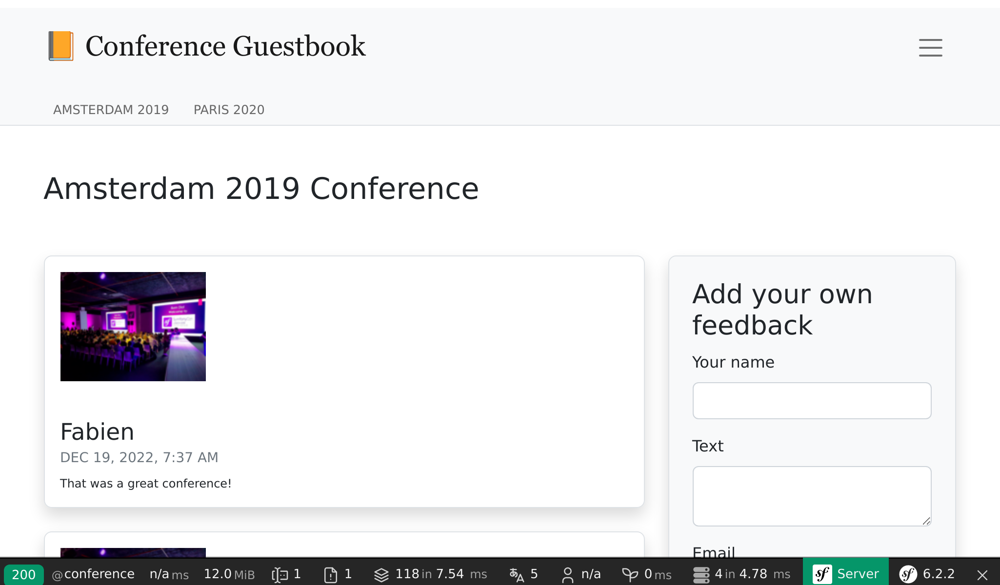
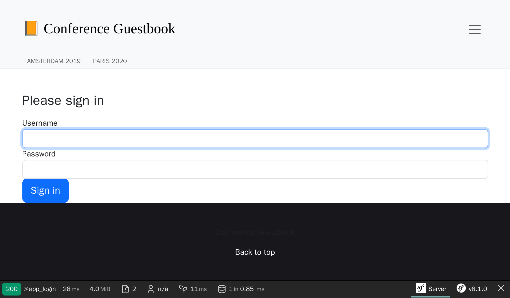

Stylizacja interfejsu użytkownika
=================================

.. index::
    single: AssetMapper
    single: Components;AssetMapper
    single: Stylesheet

Nie poświęciliśmy jeszcze czasu na wygląd interfejsu użytkownika. Aby stylizować jak profesjonalista, użyjemy nowoczesnego stosu opartego na *AssetMapperze*, komponencie Symfony, który zarządza naszymi zasobami od pierwszego kroku tej książki.

AssetMapper przyjmuje nowoczesne standardy webowe: pliki JavaScript i CSS są serwowane bez zmian i łączone ze sobą za pomocą *importmapy*, pozwalając przeglądarce ładować natywne *moduły ES* bezpośrednio. Żadnego bundlera, żadnego kroku budowania, żadnego Node.js.

Zajrzyj do pliku ``importmap.php`` w katalogu głównym projektu: opisuje on pakiety JavaScript używane przez aplikację. Funkcja Twig ``importmap()`` wywoływana w ``templates/base.html.twig`` udostępnia je przeglądarce.

Wykorzystanie Bootstrap
-----------------------

.. index::
    single: Bootstrap

Aby zacząć od dobrych ustawień domyślnych i zbudować responsywną witrynę, framework CSS taki jak `Bootstrap`_ może bardzo pomóc. Zainstaluj go jako pakiet importmapy:

.. code-block:: terminal

    $ symfony console importmap:require bootstrap bootstrap/dist/css/bootstrap.min.css

Polecenie rejestruje pakiet w ``importmap.php`` i pobiera go (oraz jego zależność ``@popperjs/core``) do ``assets/vendor/``; aplikacja nie zależy od CDN-a w czasie działania.

Zaimportuj Bootstrap w głównym punkcie wejściowym JavaScript (usunęliśmy też domyślny komunikat powitalny):

.. code-block:: diff
    :caption: patch_file

    --- i/assets/app.js
    +++ w/assets/app.js
    @@ -5,6 +5,6 @@ import './stimulus_bootstrap.js';
      * This file will be included onto the page via the importmap() Twig function,
      * which should already be in your base.html.twig.
      */
    +import 'bootstrap';
    +import 'bootstrap/dist/css/bootstrap.min.css';
     import './styles/app.css';
    -
    -console.log('This log comes from assets/app.js - welcome to AssetMapper! 🎉');

Zwróć uwagę, że ``app.css`` jest importowany *po* stylach Bootstrap, aby nasze dostosowania miały pierwszeństwo.

System formularzy Symfony obsługuje Bootstrap natywnie za pomocą specjalnego motywu, włącz go:

.. code-block:: yaml
    :caption: config/packages/twig.yaml

    twig:
        form_themes: ['bootstrap_5_layout.html.twig']

Stylizacja HTML
---------------

Jesteśmy teraz gotowi, aby ostylować aplikację. Pobierz i rozpakuj archiwum w katalogu głównym projektu:

.. code-block:: terminal

    $ php -r "copy('https://symfony.com/uploads/assets/guestbook-8.1.zip', 'guestbook-8.1.zip');"
    $ unzip -o guestbook-8.1.zip
    $ rm guestbook-8.1.zip

Zajrzyj do szablonów, możesz nauczyć się jednej czy dwóch sztuczek dotyczących Twiga.

Serwowanie zasobów
------------------

.. index::
    single: AssetMapper;asset-map:compile

Nie ma nic do zbudowania: odśwież stronę, a zmiany są widoczne na żywo. W środowisku deweloperskim AssetMapper serwuje pliki zasobów bezpośrednio.

Poświęć chwilę, aby odkryć zmiany wizualne. Obejrzyj nowy wygląd w przeglądarce.

.. figure:: screenshots/design-homepage.png
    :alt: /
    :align: center
    :figclass: with-browser

Wygenerowany formularz logowania jest teraz również ostylowany, ponieważ Maker bundle domyślnie używa klas CSS Bootstrap:

W produkcji Upsun automatycznie uruchamia polecenie ``asset-map:compile`` w fazie budowania: wszystkie zasoby są kopiowane do ``public/assets/`` z hashem wersji w nazwach plików, co umożliwia bezpieczne, długoterminowe buforowanie HTTP.

.. sidebar:: Idąc dalej

    * `Dokumentacja komponentu AssetMapper`_;

    * `Specyfikacja importmap`_;

    * `Dokumentacja Bootstrap`_.

.. _`Bootstrap`: https://getbootstrap.com/
.. _`Dokumentacja komponentu AssetMapper`: https://symfony.com/doc/current/frontend/asset_mapper.html
.. _`Specyfikacja importmap`: https://html.spec.whatwg.org/multipage/webappapis.html#import-maps
.. _`Dokumentacja Bootstrap`: https://getbootstrap.com/docs/
