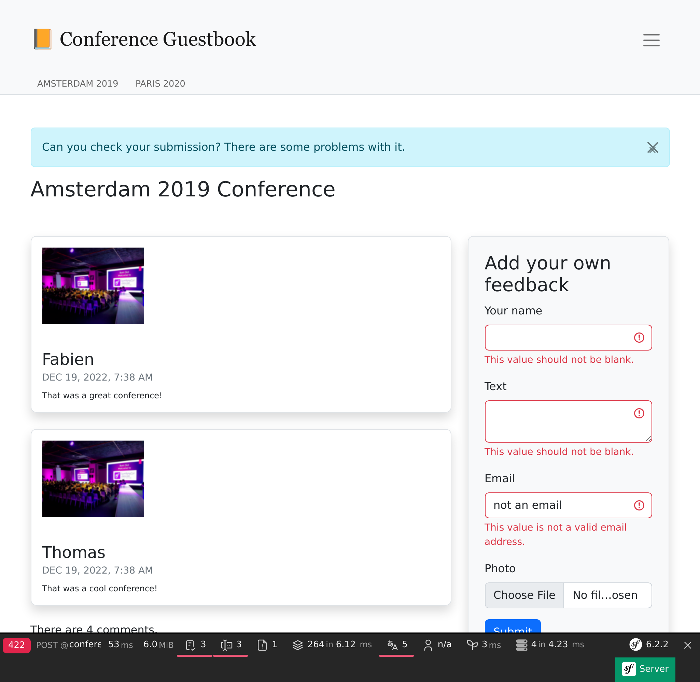

Powiadamianie na wszystkie możliwe sposoby
===========================================

Aplikacja księgi gości zbiera opinie na temat konferencji. Ale nie jesteśmy najlepsi w przekazywaniu informacji zwrotnych naszym użytkownikom.

Ponieważ komentarze są moderowane, nie są publikowane natychmiast – ale ich autorzy mogą tego nie rozumieć. Mogliby nawet dodać je ponownie myśląc, że występują jakieś problemy techniczne. Wyświetlenie im informacji zwrotnej po zamieszczeniu komentarza to doskonały pomysł.

Prawdopodobnie powinniśmy również powiadomić ich, gdy komentarz zostanie opublikowany. Prosiliśmy o adres e-mail, więc dajmy im znać.

Istnieje wiele sposobów powiadamiania użytkowników. Email jest pierwszym medium, o którym możesz pomyśleć, ale możesz również zastosować powiadomienia w ramach naszej aplikacji. Możemy nawet pomyśleć o wysyłaniu wiadomości SMS, wysyłaniu wiadomości na Slacku lub Telegramie. Istnieje wiele różnych opcji.

.. index::
    single: Components;Notifier
    single: Notifier

Komponent Symfony Notifier implementuje wiele strategii wysyłania powiadomień.

Wysyłanie powiadomień w przeglądarce
---------------------------------------

.. index::
    single: Flash Messages

Pierwszym krokiem jest poinformowanie użytkowników, że komentarze są moderowane bezpośrednio w przeglądarce po ich zgłoszeniu:

.. code-block:: diff
    :caption: patch_file

    --- i/src/Controller/ConferenceController.php
    +++ w/src/Controller/ConferenceController.php
    @@ -16,6 +16,8 @@ use Symfony\Component\HttpFoundation\Response;
     use Symfony\Component\HttpKernel\Attribute\MapQueryParameter;
     use Symfony\Component\HttpKernel\Attribute\RateLimit;
     use Symfony\Component\Messenger\MessageBusInterface;
    +use Symfony\Component\Notifier\Notification\Notification;
    +use Symfony\Component\Notifier\NotifierInterface;
     use Symfony\Component\Routing\Attribute\Route;

     final class ConferenceController extends AbstractController
    @@ -45,7 +47,8 @@ final class ConferenceController extends AbstractController
             Request $request,
             Conference $conference,
             CommentRepository $commentRepository,
    +        NotifierInterface $notifier,
             #[Autowire('%photo_dir%')] string $photoDir,
             #[MapQueryParameter(options: ['min_range' => 0])] int $offset = 0,
         ): Response {
             $comment = new Comment();
    @@ -69,8 +72,14 @@ final class ConferenceController extends AbstractController
                 ];
                 $this->bus->dispatch(new CommentMessage($comment->getId(), $context));

    +            $notifier->send(new Notification('Thank you for the feedback; your comment will be posted after moderation.', ['browser']));
    +
                 return $this->redirectToRoute('conference', ['slug' => $conference->getSlug()]);
             }

    +        if ($form->isSubmitted()) {
    +            $notifier->send(new Notification('Can you check your submission? There are some problems with it.', ['browser']));
    +        }
    +
             $paginator = $commentRepository->getCommentPaginator($conference, $offset);

Notifier *wysyła powiadomienie* (ang. sends notification) do *odbiorców* (ang. recipients) za pośrednictwem *kanału* (ang. channel).

Powiadomienie zawiera temat, opcjonalną treść oraz priorytet.

Powiadomienie jest wysyłane na jednym lub wielu kanałach w zależności od jego priorytetu. Możesz wysyłać pilne powiadomienia SMS-em lub zwykłym e-mailem.

Dla powiadomień w przeglądarce nie mamy odbiorców.

.. index::
    single: Twig;for

Powiadomienie w przeglądarce wykorzystuje *wiadomości błyskawiczne* (ang. flash messages) poprzez sekcję *powiadomień*. Aby je wyświetlić, musimy zaktualizować szablon konferencji:

.. code-block:: diff
    :caption: patch_file

    --- i/templates/conference/show.html.twig
    +++ w/templates/conference/show.html.twig
    @@ -3,6 +3,13 @@
     Conference Guestbook - {{ conference }}

     
    +    
    +        

    +            {{ message }}
    +            <button type="button" class="btn-close" data-bs-dismiss="alert" aria-label="Close">&times;</button>
    +        

    +    
    +
         <h2 class="mb-5">
             {{ conference }} Conference
         </h2>

Użytkownicy zostaną teraz powiadomieni, że ich komentarz jest moderowany:

.. figure:: screenshots/form-success-notification.png
    :alt: /conference/amsterdam-2019
    :align: center
    :figclass: with-browser

W ramach bonusu mamy ładne powiadomienie na górze strony, jeśli wystąpi błąd w formularzu:

.. tip::

    Wiadomości błyskawiczne (ang. flash messages) są przechowywane w ramach systemu *sesji HTTP*. Główną konsekwencją takiego rozwiązania jest to, że pamięć podręczna HTTP musi być wyłączona, ponieważ system sesji musi zostać uruchomiony, aby sprawdzać wiadomości do wyświetlenia.

    Jest to powód, dla którego dodaliśmy fragment kodu wiadomości błyskawicznej (ang. flash message) w szablonie ``show.html.twig``, a nie w bazowym, ponieważ utracilibyśmy kopię strony głównej zapisaną w pamięci podręcznej przeglądarki.

Powiadamianie osób administrujących poprzez wiadomość e-mail
----------------------------------------------------------------

Zamiast wysyłania wiadomości e-mail poprzez ``MailerInterface`` w celu powiadomienia osoby korzystającej z konta administracyjnego o wysłaniu komentarza, użyj komponentu Notifier do obsługi wiadomości:

.. code-block:: diff
    :caption: patch_file

    --- i/src/MessageHandler/CommentMessageHandler.php
    +++ w/src/MessageHandler/CommentMessageHandler.php
    @@ -4,15 +4,15 @@ namespace App\MessageHandler;

     use App\ImageOptimizer;
     use App\Message\CommentMessage;
    +use App\Notification\CommentReviewNotification;
     use App\Repository\CommentRepository;
     use App\SpamChecker;
     use Doctrine\ORM\EntityManagerInterface;
     use Psr\Log\LoggerInterface;
    -use Symfony\Bridge\Twig\Mime\NotificationEmail;
     use Symfony\Component\DependencyInjection\Attribute\Autowire;
    -use Symfony\Component\Mailer\MailerInterface;
     use Symfony\Component\Messenger\Attribute\AsMessageHandler;
     use Symfony\Component\Messenger\MessageBusInterface;
    +use Symfony\Component\Notifier\NotifierInterface;
     use Symfony\Component\Workflow\WorkflowInterface;

     #[AsMessageHandler]
    @@ -24,8 +24,7 @@ class CommentMessageHandler
             private CommentRepository $commentRepository,
             private MessageBusInterface $bus,
             private WorkflowInterface $commentStateMachine,
    -        private MailerInterface $mailer,
    -        #[Autowire('%admin_email%')] private string $adminEmail,
    +        private NotifierInterface $notifier,
             private ImageOptimizer $imageOptimizer,
             #[Autowire('%photo_dir%')] private string $photoDir,
             private ?LoggerInterface $logger = null,
    @@ -50,13 +49,7 @@ class CommentMessageHandler
                 $this->entityManager->flush();
                 $this->bus->dispatch($message);
             } elseif ($this->commentStateMachine->can($comment, 'publish') || $this->commentStateMachine->can($comment, 'publish_ham')) {
    -            $this->mailer->send((new NotificationEmail())
    -                ->subject('New comment posted')
    -                ->htmlTemplate('emails/comment_notification.html.twig')
    -                ->from($this->adminEmail)
    -                ->to($this->adminEmail)
    -                ->context(['comment' => $comment])
    -            );
    +            $this->notifier->send(new CommentReviewNotification($comment), ...$this->notifier->getAdminRecipients());
             } elseif ($this->commentStateMachine->can($comment, 'optimize')) {
                 if ($comment->getPhotoFilename()) {
                     $this->imageOptimizer->resize($this->photoDir.'/'.$comment->getPhotoFilename());

Metoda ``getAdminRecipients()`` zwraca adresy kont administracyjnych zgodnie z konfiguracją komponentu Notifier; zaktualizuj ją teraz, aby dodać własny adres e-mail:

.. code-block:: diff
    :caption: patch_file

    --- i/config/packages/notifier.yaml
    +++ w/config/packages/notifier.yaml
    @@ -9,4 +9,4 @@ framework:
                 medium: ['email']
                 low: ['email']
             admin_recipients:
    -            - { email: admin@example.com }
    +            - { email: "%env(string:default:default_admin_email:ADMIN_EMAIL)%" }

Teraz stwórz klasę ``CommentReviewNotification``:

.. code-block:: php
    :caption: src/Notification/CommentReviewNotification.php

    namespace App\Notification;

    use App\Entity\Comment;
    use Symfony\Component\Notifier\Message\EmailMessage;
    use Symfony\Component\Notifier\Notification\EmailNotificationInterface;
    use Symfony\Component\Notifier\Notification\Notification;
    use Symfony\Component\Notifier\Recipient\EmailRecipientInterface;

    class CommentReviewNotification extends Notification implements EmailNotificationInterface
    {
        public function __construct(
            private Comment $comment,
        ) {
            parent::__construct('New comment posted');
        }

        public function asEmailMessage(EmailRecipientInterface $recipient, string $transport = null): ?EmailMessage
        {
            $message = EmailMessage::fromNotification($this, $recipient, $transport);
            $message->getMessage()
                ->htmlTemplate('emails/comment_notification.html.twig')
                ->context(['comment' => $this->comment])
            ;

            return $message;
        }
    }

Metoda ``asEmailMessage()`` z ``EmailNotificationInterface`` jest opcjonalna i pozwala na personalizację wiadomości e-mail.

Jedną z korzyści płynących z zastosowania komponentu Notifier (zamiast komponentu Mailer) do wysyłania wiadomości e-mail jest to, że oddziela on powiadomienie od "kanału" wykorzystywanego do jego wysyłania. Jak możesz zobaczyć, nic nie mówi wprost, że powiadomienie powinno być wysłane pocztą elektroniczną.

Zamiast tego, kanał jest skonfigurowany w ``config/packages/notifier.yaml`` w zależności od *znaczenia* powiadomienia (domyślnie ``low``):

.. code-block:: yaml
    :caption: config/packages/notifier.yaml
    :class: ignore

    framework:
    notifier:
        channel_policy:
            # use chat/slack, chat/telegram, sms/twilio or sms/nexmo
            urgent: ['email']
            high: ['email']
            medium: ['email']
            low: ['email']

Rozmawialiśmy o kanałach ``browser`` i ``email``. Zobaczmy kilka innych, bardziej wyrafinowanych rozwiązań.

Rozmowy z administracją
------------------------

.. index::
    single: Slack

Bądźmy szczerzy, wszyscy czekamy na pozytywne opinie albo przynajmniej na konstruktywną krytykę. Jeśli ktoś umieści komentarz ze słowami takimi jak "świetnie" lub "super", możemy chcieć zaakceptować go szybciej niż inne.

W przypadku takich wiadomości chcemy być powiadamiani przez komunikator, taki jak Slack lub Telegram, niezależnie od wiadomości e-mail.

.. index::
    single: Components;Notifier
    single: Notifier

Zainstaluj wsparcie Slack dla Symfony Notifier:

.. code-block:: terminal

    $ symfony composer req slack-notifier

Aby rozpocząć, skomponuj Slack DSN z tokenem dostępu i identyfikatorem kanału Slack, na którym chcesz wysyłać wiadomości: ``slack://ACCESS_TOKEN@default?channel=CHANNEL``.

.. index::
    single: Command;secrets:set

Ponieważ token dostępu jest daną wrażliwą, należy przechowywać Slack DSN w sejfie:

.. code-block:: terminal
    :class: answers(slack://ACCESS_TOKEN@default?channel=CHANNEL)

    $ symfony console secrets:set SLACK_DSN

Zrób to samo dla środowiska produkcyjnego:

.. code-block:: terminal
    :class: answers(slack://ACCESS_TOKEN@default?channel=CHANNEL)

    $ symfony console secrets:set SLACK_DSN --env=prod

Zaktualizuj klasę powiadomień, aby wiadomości były przekierowywane w zależności od treści komentarza (przy pomocy prostego wyrażenia regularnego):

.. code-block:: diff
    :caption: patch_file

    --- i/src/Notification/CommentReviewNotification.php
    +++ w/src/Notification/CommentReviewNotification.php
    @@ -7,6 +7,7 @@ use Symfony\Component\Notifier\Message\EmailMessage;
     use Symfony\Component\Notifier\Notification\EmailNotificationInterface;
     use Symfony\Component\Notifier\Notification\Notification;
     use Symfony\Component\Notifier\Recipient\EmailRecipientInterface;
    +use Symfony\Component\Notifier\Recipient\RecipientInterface;

     class CommentReviewNotification extends Notification implements EmailNotificationInterface
     {
    @@ -26,4 +27,15 @@ class CommentReviewNotification extends Notification implements EmailNotificatio

             return $message;
         }
    +
    +    public function getChannels(RecipientInterface $recipient): array
    +    {
    +        if (preg_match('{\b(great|awesome)\b}i', $this->comment->getText())) {
    +            return ['email', 'chat/slack'];
    +        }
    +
    +        $this->importance(Notification::IMPORTANCE_LOW);
    +
    +        return ['email'];
    +    }
     }

Zmieniliśmy również priorytet "normalnych" komentarzy, ponieważ nieznacznie poprawia to wygląd wiadomości e-mail.

I gotowe! Wyślij komentarz zawierający słowo "awesome", wiadomość powinna pojawić się na Slacku.

Domyślne renderowanie wiadomości na Slacku też możesz nadpisać, podobnie jak w przypadku poczty elektronicznej, jeśli zaimplementujesz ``ChatNotificationInterface``.

.. code-block:: diff
    :caption: patch_file

    --- i/src/Notification/CommentReviewNotification.php
    +++ w/src/Notification/CommentReviewNotification.php
    @@ -3,13 +3,18 @@
     namespace App\Notification;

     use App\Entity\Comment;
    +use Symfony\Component\Notifier\Bridge\Slack\Block\SlackDividerBlock;
    +use Symfony\Component\Notifier\Bridge\Slack\Block\SlackSectionBlock;
    +use Symfony\Component\Notifier\Bridge\Slack\SlackOptions;
    +use Symfony\Component\Notifier\Message\ChatMessage;
     use Symfony\Component\Notifier\Message\EmailMessage;
    +use Symfony\Component\Notifier\Notification\ChatNotificationInterface;
     use Symfony\Component\Notifier\Notification\EmailNotificationInterface;
     use Symfony\Component\Notifier\Notification\Notification;
     use Symfony\Component\Notifier\Recipient\EmailRecipientInterface;
     use Symfony\Component\Notifier\Recipient\RecipientInterface;

    -class CommentReviewNotification extends Notification implements EmailNotificationInterface
    +class CommentReviewNotification extends Notification implements EmailNotificationInterface, ChatNotificationInterface
     {
         public function __construct(
             private Comment $comment,
    @@ -28,6 +33,28 @@ class CommentReviewNotification extends Notification implements EmailNotificatio
             return $message;
         }

    +    public function asChatMessage(RecipientInterface $recipient, string $transport = null): ?ChatMessage
    +    {
    +        if ('slack' !== $transport) {
    +            return null;
    +        }
    +
    +        $message = ChatMessage::fromNotification($this, $recipient, $transport);
    +        $message->subject($this->getSubject());
    +        $message->options((new SlackOptions())
    +            ->iconEmoji('tada')
    +            ->iconUrl('https://guestbook.example.com')
    +            ->username('Guestbook')
    +            ->block((new SlackSectionBlock())->text($this->getSubject()))
    +            ->block(new SlackDividerBlock())
    +            ->block((new SlackSectionBlock())
    +                ->text(sprintf('%s (%s) says: %s', $this->comment->getAuthor(), $this->comment->getEmail(), $this->comment->getText()))
    +            )
    +        );
    +
    +        return $message;
    +    }
    +
         public function getChannels(RecipientInterface $recipient): array
         {
             if (preg_match('{\b(great|awesome)\b}i', $this->comment->getText())) {

Jest dobrze, ale może być jeszcze lepiej. Czy nie byłoby wspaniale móc zaakceptować lub odrzucić komentarz bezpośrednio ze Slacka?

Zmień powiadomienie w taki sposób, aby przyjmowało adres recenzji i dodaj dwa przyciski w wiadomości na Slacku:

.. code-block:: diff
    :caption: patch_file

    --- i/src/Notification/CommentReviewNotification.php
    +++ w/src/Notification/CommentReviewNotification.php
    @@ -3,6 +3,7 @@
     namespace App\Notification;

     use App\Entity\Comment;
    +use Symfony\Component\Notifier\Bridge\Slack\Block\SlackActionsBlock;
     use Symfony\Component\Notifier\Bridge\Slack\Block\SlackDividerBlock;
     use Symfony\Component\Notifier\Bridge\Slack\Block\SlackSectionBlock;
     use Symfony\Component\Notifier\Bridge\Slack\SlackOptions;
    @@ -18,6 +19,7 @@ class CommentReviewNotification extends Notification implements EmailNotificatio
     {
         public function __construct(
             private Comment $comment,
    +        private string $reviewUrl,
         ) {
             parent::__construct('New comment posted');
         }
    @@ -50,6 +52,10 @@ class CommentReviewNotification extends Notification implements EmailNotificatio
                 ->block((new SlackSectionBlock())
                     ->text(sprintf('%s (%s) says: %s', $this->comment->getAuthor(), $this->comment->getEmail(), $this->comment->getText()))
                 )
    +            ->block((new SlackActionsBlock())
    +                ->button('Accept', $this->reviewUrl, 'primary')
    +                ->button('Reject', $this->reviewUrl.'?reject=1', 'danger')
    +            )
             );

             return $message;

Teraz musimy zaktualizować poprzednio wykonane zmiany. Najpierw zmodyfikuj obsługę wiadomości, aby przekazać adres recenzji:

.. code-block:: diff
    :caption: patch_file

    --- i/src/MessageHandler/CommentMessageHandler.php
    +++ w/src/MessageHandler/CommentMessageHandler.php
    @@ -49,7 +49,8 @@ class CommentMessageHandler
                 $this->entityManager->flush();
                 $this->bus->dispatch($message);
             } elseif ($this->commentStateMachine->can($comment, 'publish') || $this->commentStateMachine->can($comment, 'publish_ham')) {
    -            $this->notifier->send(new CommentReviewNotification($comment), ...$this->notifier->getAdminRecipients());
    +            $notification = new CommentReviewNotification($comment, $message->getReviewUrl());
    +            $this->notifier->send($notification, ...$this->notifier->getAdminRecipients());
             } elseif ($this->commentStateMachine->can($comment, 'optimize')) {
                 if ($comment->getPhotoFilename()) {
                     $this->imageOptimizer->resize($this->photoDir.'/'.$comment->getPhotoFilename());

Jak widać, adres URL recenzji powinien być częścią wiadomości z komentarzem, dodajmy go teraz:

.. code-block:: diff
    :caption: patch_file

    --- i/src/Message/CommentMessage.php
    +++ w/src/Message/CommentMessage.php
    @@ -6,10 +6,16 @@ class CommentMessage
     {
         public function __construct(
             private int $id,
    +        private string $reviewUrl,
             private array $context = [],
         ) {
         }

    +    public function getReviewUrl(): string
    +    {
    +        return $this->reviewUrl;
    +    }
    +
         public function getId(): int
         {
             return $this->id;

Na koniec zaktualizuj kontrolery, aby wygenerować adres recenzji, i przekaż go w konstruktorze wiadomości z komentarzem:

.. code-block:: diff
    :caption: patch_file

    --- i/src/Controller/AdminController.php
    +++ w/src/Controller/AdminController.php
    @@ -12,6 +12,7 @@ use Symfony\Component\HttpKernel\HttpCache\StoreInterface;
     use Symfony\Component\HttpKernel\KernelInterface;
     use Symfony\Component\Messenger\MessageBusInterface;
     use Symfony\Component\Routing\Attribute\Route;
    +use Symfony\Component\Routing\Generator\UrlGeneratorInterface;
     use Symfony\Component\Workflow\WorkflowInterface;
     use Twig\Environment;

    @@ -42,7 +43,8 @@ class AdminController extends AbstractController
             $this->entityManager->flush();

             if ($accepted) {
    -            $this->bus->dispatch(new CommentMessage($comment->getId()));
    +            $reviewUrl = $this->generateUrl('review_comment', ['id' => $comment->getId()], UrlGeneratorInterface::ABSOLUTE_URL);
    +            $this->bus->dispatch(new CommentMessage($comment->getId(), $reviewUrl));
             }

             return new Response($this->twig->render('admin/review.html.twig', [
    --- i/src/Controller/ConferenceController.php
    +++ w/src/Controller/ConferenceController.php
    @@ -17,6 +17,7 @@ use Symfony\Component\Messenger\MessageBusInterface;
     use Symfony\Component\Notifier\Notification\Notification;
     use Symfony\Component\Notifier\NotifierInterface;
     use Symfony\Component\Routing\Attribute\Route;
    +use Symfony\Component\Routing\Generator\UrlGeneratorInterface;

     final class ConferenceController extends AbstractController
     {
    @@ -70,7 +71,8 @@ final class ConferenceController extends AbstractController
                     'referrer' => $request->headers->get('referer'),
                     'permalink' => $request->getUri(),
                 ];
    -            $this->bus->dispatch(new CommentMessage($comment->getId(), $context));
    +            $reviewUrl = $this->generateUrl('review_comment', ['id' => $comment->getId()], UrlGeneratorInterface::ABSOLUTE_URL);
    +            $this->bus->dispatch(new CommentMessage($comment->getId(), $reviewUrl, $context));

                 $notifier->send(new Notification('Thank you for the feedback; your comment will be posted after moderation.', ['browser']));

Oddzielenie kodu oznacza zmiany w większej liczbie miejsc, ale ułatwia jego testowanie, zrozumienie i ponowne użycie.

Spróbuj jeszcze raz, wiadomość powinna być teraz w dobrej formie:

.. image:: images/slack-message.png
    :align: center

Asynchroniczność w obrębie tablicy
-------------------------------------

Powiadomienia są domyślnie wysyłane asynchronicznie, podobnie jak e-maile:

.. code-block:: yaml
    :caption: config/packages/messenger.yaml
    :emphasize-lines: 5,6
    :class: ignore

    framework:
        messenger:
            routing:
                Symfony\Component\Mailer\Messenger\SendEmailMessage: async
                Symfony\Component\Notifier\Message\ChatMessage: async
                Symfony\Component\Notifier\Message\SmsMessage: async

                # Route your messages to the transports
                App\Message\CommentMessage: async

Gdybyśmy mieli wyłączyć wiadomości asynchroniczne, mielibyśmy mały problem. Z każdym dodanym komentarzem otrzymujemy wiadomość e-mail i wiadomość na Slacku. Jeśli wystąpi błąd przy wysyłaniu wiadomości na Slacku (błędny identyfikator kanału, błędny token…), Messenger będzie próbował ponowić wysyłkę trzy razy zanim zostanie ona odrzucona. Ale ponieważ wiadomość e-mail zostanie wysłana jako pierwsza, otrzymamy trzy wiadomości e-mail i żadnych wiadomości na Slacku.

Kiedy wszystkie operacje są asynchroniczne, komunikaty stają się niezależne. Wiadomości SMS są już skonfigurowane jako asynchroniczne na wypadek, gdybyś chciał otrzymywać powiadomienia na swoim telefonie.

Powiadamianie użytkowników za pomocą poczty elektronicznej
-------------------------------------------------------------

Ostatnim zadaniem jest powiadomienie użytkowników o zatwierdzeniu ich komentarza. Pozwól, że pozostawię implementację Tobie.

.. sidebar:: Idąc dalej

    * `Wiadomości flash w Symfony`_.

.. _`Wiadomości flash w Symfony`: https://symfony.com/doc/current/controller.html#flash-messages
