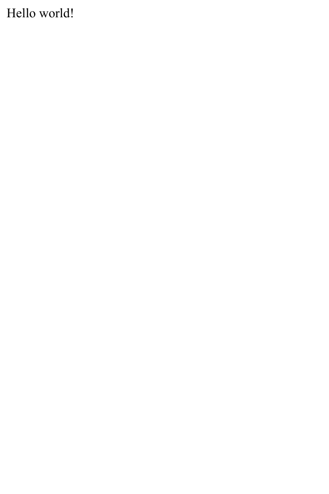
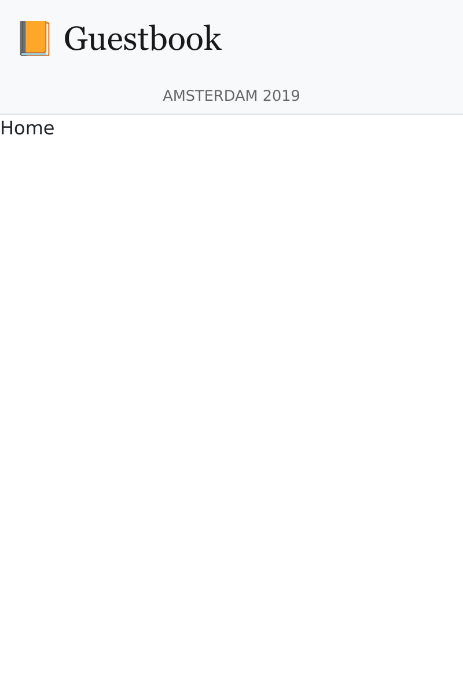
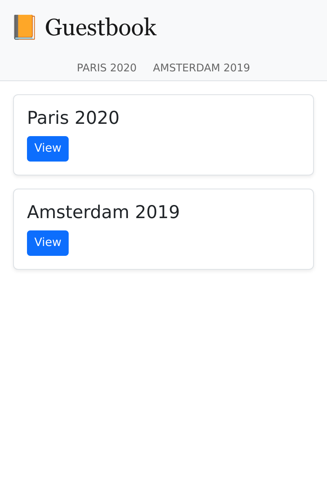

Budowa aplikacji jednostronicowej (ang. single-page application, SPA)
=====================================================================

.. index::
    single: SPA
    single: Mobile

Większość komentarzy zostanie dodana podczas trwania konferencji, na którą część uczestników nie zabierze laptopa, ale prawdopodobnie będą mieć ze sobą smartfon. A gdyby tak utworzyć aplikację mobilną pozwalającą szybko sprawdzić komentarze z konferencji?

Jednym ze sposobów na stworzenie takiej aplikacji mobilnej jest zbudowanie aplikacji jednostronicowej (SPA) opartej o JavaScript. SPA działa lokalnie, może korzystać z lokalnej pamięci masowej, może wysłać żądanie (ang. request) do zdalnego API HTTP i może wykorzystać mechanizmy service workers do stworzenia niemalże natywnego doświadczenia.

Tworzenie aplikacji
-------------------

Do stworzenia aplikacji mobilnej wykorzystamy `Preact`_ i **Symfony Encore**. **Preact** jest małym i efektywnym frameworkiem, dobrze pasującym do SPA dla księgi gości.

Aby zarówno strona internetowa, jak i SPA były spójne, wykorzystamy ponownie arkusze stylów Sass naszej strony internetowej w aplikacji mobilnej.

Utwórz aplikację SPA w katalogu ``spa`` i skopiuj arkusze stylów strony internetowej:

.. code-block:: terminal

    $ mkdir -p spa/src spa/public spa/assets/styles
    $ cp assets/styles/*.scss spa/assets/styles/
    $ cd spa

.. note::

    Stworzyliśmy katalog ``public``, ponieważ będziemy głównie używać SPA poprzez przeglądarkę. Mogliśmy go nazwać ``build``, gdybyśmy chcieli zbudować tylko aplikację mobilną.

Dodatkowo, dodaj plik ``.gitignore``:

.. code-block:: text
    :caption: .gitignore

    /node_modules/
    /public/
    /npm-debug.log
    # used later by Cordova
    /app/

Utwórz plik ``package.json`` (odpowiednik ``composer.json`` dla JavaScript):

.. code-block:: terminal

    $ npm init -y

Teraz dodaj kilka wymaganych zależności:

.. code-block:: terminal

    $ npm install @symfony/webpack-encore @babel/core @babel/preset-env babel-preset-preact preact html-webpack-plugin bootstrap

Ostatnim krokiem w konfiguracji jest utworzenie pliku konfiguracyjnego Webpack Encore:

.. code-block:: javascript
    :caption: webpack.config.js
    :emphasize-lines: 8,11

    const Encore = require('@symfony/webpack-encore');
    const HtmlWebpackPlugin = require('html-webpack-plugin');

    Encore
        .setOutputPath('public/')
        .setPublicPath('/')
        .cleanupOutputBeforeBuild()
        .addEntry('app', './src/app.js')
        .enablePreactPreset()
        .enableSingleRuntimeChunk()
        .addPlugin(new HtmlWebpackPlugin({ template: 'src/index.ejs', alwaysWriteToDisk: true }))
    ;

    module.exports = Encore.getWebpackConfig();

Tworzenie szablonu głównego SPA
---------------------------------

Czas na utworzenie początkowego szablonu, w którym Preact będzie renderował aplikację:

.. code-block:: html
    :caption: src/index.ejs
    :emphasize-lines: 12

    <!DOCTYPE html>
    <html>
    <head>
        <meta http-equiv="Content-Type" content="text/html; charset=utf-8" />
        <meta http-equiv="X-UA-Compatible" content="IE=edge" />
        <meta name="msapplication-tap-highlight" content="no" />
        <meta name="viewport" content="user-scalable=no, initial-scale=1, maximum-scale=1, minimum-scale=1, width=device-width" />

        <title>Conference Guestbook application</title>
    </head>
    <body>
        

    </body>
    </html>

Element ``
`` to miejsce, w którym aplikacja będzie renderowana przez JavaScript. Oto pierwsza wersja kodu, która wyświetla widok "Hello World":

.. code-block:: text
    :caption: src/app.js
    :emphasize-lines: 3,11

    import {h, render} from 'preact';

    function App() {
        return (
            

                Hello world!
            

        )
    }

    render(<App />, document.getElementById('app'));

Ostatnia linia rejestruje funkcję ``App()`` na elemencie ``#app`` strony HTML.

Wszystko jest już gotowe!

Uruchomienie SPA w przeglądarce
--------------------------------

.. index::
    single: Symfony CLI;server:start
    single: Symfony CLI;server:stop

Ponieważ aplikacja ta jest niezależna od głównej strony internetowej, musimy uruchomić kolejny serwer WWW:

.. code-block:: terminal
    :class: hide

    $ symfony server:stop

.. code-block:: terminal

    $ symfony server:start -d --passthru=index.html

Flaga ``--passthru`` mówi serwerowi WWW, aby przekazywał wszystkie żądania HTTP do  pliku ``public/index.html`` (jest to domyślny katalog główny serwera WWW). Strona ta jest zarządzana przez aplikację Preact i otrzymuje stronę do renderowania poprzez historię "przeglądarki".

Aby skompilować pliki CSS **i JavaScript**, uruchom ``npm``:

.. code-block:: terminal

    $ ./node_modules/.bin/encore dev

Otwórz SPA w przeglądarce:

.. code-block:: terminal
    :class: ignore

    $ symfony open:local

I spójrz na naszą SPA „hello world”:

Dodanie routera do obsługi stanu aplikacji
-------------------------------------------

Obecnie SPA nie jest w stanie obsługiwać różnych stron. Aby zaimplementować kilka stron, potrzebujemy routera, tak jak w przypadku Symfony. Użyjemy **preact-router**. Pobiera adres URL jako wejście i dopasowuje komponent Preact, który ma wyświetlić.

Zainstaluj preact-router:

.. code-block:: terminal

    $ npm install preact-router

Utwórz stronę główną (*komponent Preact*):

.. code-block:: text
    :caption: src/pages/home.js

    import {h} from 'preact';

    export default function Home() {
        return (
            
Home

        );
    };

I kolejną stronę dla konferencji:

.. code-block:: text
    :caption: src/pages/conference.js

    import {h} from 'preact';

    export default function Conference() {
        return (
            
Conference

        );
    };

Zamień ``div`` "Hello World" na komponent ``Router``:

.. code-block:: diff
    :caption: patch_file
    :emphasize-lines: 15,17,20-23

    --- a/src/app.js
    +++ b/src/app.js
    @@ -1,9 +1,22 @@
     import {h, render} from 'preact';
    +import {Router, Link} from 'preact-router';
    +
    +import Home from './pages/home';
    +import Conference from './pages/conference';

     function App() {
         return (
             

    -            Hello world!
    +            <header>
    +                <Link href="/">Home</Link>
    +                 
    +                <Link href="/conference/amsterdam2019">Amsterdam 2019</Link>
    +            </header>
    +
    +            <Router>
    +                <Home path="/" />
    +                <Conference path="/conference/:slug" />
    +            </Router>
             

         )
     }

Przebuduj aplikację:

.. code-block:: terminal

    $ ./node_modules/.bin/encore dev

Jeśli odświeżysz aplikację w przeglądarce, możesz teraz kliknąć na "Home" i odnośniki do konferencji. Zauważ, że adres URL przeglądarki i przyciski "wstecz/dalej" przeglądarki działają tak, jak tego oczekujemy.

Stylowanie SPA
--------------

Jeśli chodzi o stronę internetową, dodajmy kompilator Sass:

.. code-block:: terminal

    $ npm install node-sass sass-loader

Włącz kompilator Sass w Webpacku i dodaj referencję do arkusza stylów:

.. code-block:: diff
    :caption: patch_file

    --- a/src/app.js
    +++ b/src/app.js
    @@ -1,3 +1,5 @@
    +import '../assets/styles/app.scss';
    +
     import {h, render} from 'preact';
     import {Router, Link} from 'preact-router';

    --- a/webpack.config.js
    +++ b/webpack.config.js
    @@ -7,6 +7,7 @@ Encore
         .cleanupOutputBeforeBuild()
         .addEntry('app', './src/app.js')
         .enablePreactPreset()
    +    .enableSassLoader()
         .enableSingleRuntimeChunk()
         .addPlugin(new HtmlWebpackPlugin({ template: 'src/index.ejs', alwaysWriteToDisk: true }))
     ;

Możemy teraz zaktualizować aplikację, aby móc korzystać z arkuszy stylów:

.. code-block:: diff
    :caption: patch_file

    --- a/src/app.js
    +++ b/src/app.js
    @@ -9,10 +9,20 @@ import Conference from './pages/conference';
     function App() {
         return (
             

    -            <header>
    -                <Link href="/">Home</Link>
    -                 
    -                <Link href="/conference/amsterdam2019">Amsterdam 2019</Link>
    +            <header className="header">
    +                <nav className="navbar navbar-light bg-light">
    +                    

    +                        <Link className="navbar-brand mr-4 pr-2" href="/">
    +                            &#128217; Guestbook
    +                        </Link>
    +                    

    +                </nav>
    +
    +                <nav className="bg-light border-bottom text-center">
    +                    <Link className="nav-conference" href="/conference/amsterdam2019">
    +                        Amsterdam 2019
    +                    </Link>
    +                </nav>
                 </header>

                 <Router>

Ponownie przebuduj aplikację:

.. code-block:: terminal

    $ ./node_modules/.bin/encore dev

Teraz możesz cieszyć się w pełni ostylowaną SPA:

Pobieranie danych z API
-----------------------

Struktura aplikacji Preact została już utworzona: Preact Router obsługuje stany stron – wliczając w to parametr ze slugiem konferencji – a główny arkusz stylów aplikacji jest używany do stylowania SPA.

Aby SPA była dynamiczna, musimy pobrać dane z API poprzez połączenia HTTP.

Skonfiguruj Webpack, aby udostępnić zmienną środowiskową punktu końcowego (ang. endpoint) API:

.. code-block:: diff
    :caption: patch_file

    --- a/webpack.config.js
    +++ b/webpack.config.js
    @@ -1,3 +1,4 @@
    +const webpack = require('webpack');
     const Encore = require('@symfony/webpack-encore');
     const HtmlWebpackPlugin = require('html-webpack-plugin');

    @@ -10,6 +11,9 @@ Encore
         .enableSassLoader()
         .enableSingleRuntimeChunk()
         .addPlugin(new HtmlWebpackPlugin({ template: 'src/index.ejs', alwaysWriteToDisk: true }))
    +    .addPlugin(new webpack.DefinePlugin({
    +        'ENV_API_ENDPOINT': JSON.stringify(process.env.API_ENDPOINT),
    +    }))
     ;

     module.exports = Encore.getWebpackConfig();

Zmienna środowiskowa``API_ENDPOINT`` powinna wskazywać na serwer strony internetowej, na którym znajduje się punkt końcowy (ang. endpoint) API pod ``/api``. Skonfigurujemy go prawidłowo, kiedy niebawem uruchomimy ``npm``.

Utwórz plik ``api.js``, który obsłuży pobieranie danych z API:

.. code-block:: text
    :caption: src/api/api.js

    function fetchCollection(path) {
        return fetch(ENV_API_ENDPOINT + path).then(resp => resp.json()).then(json => json['hydra:member']);
    }

    export function findConferences() {
        return fetchCollection('api/conferences');
    }

    export function findComments(conference) {
        return fetchCollection('api/comments?conference='+conference.id);
    }

Teraz można dostosować nagłówek i główny komponent:

.. code-block:: diff
    :caption: patch_file

    --- a/src/app.js
    +++ b/src/app.js
    @@ -2,11 +2,23 @@ import '../assets/styles/app.scss';

     import {h, render} from 'preact';
     import {Router, Link} from 'preact-router';
    +import {useState, useEffect} from 'preact/hooks';

    +import {findConferences} from './api/api';
     import Home from './pages/home';
     import Conference from './pages/conference';

     function App() {
    +    const [conferences, setConferences] = useState(null);
    +
    +    useEffect(() => {
    +        findConferences().then((conferences) => setConferences(conferences));
    +    }, []);
    +
    +    if (conferences === null) {
    +        return 
Loading...
;
    +    }
    +
         return (
             

                 <header className="header">
    @@ -19,15 +31,17 @@ function App() {
                     </nav>

                     <nav className="bg-light border-bottom text-center">
    -                    <Link className="nav-conference" href="/conference/amsterdam2019">
    -                        Amsterdam 2019
    -                    </Link>
    +                    {conferences.map((conference) => (
    +                        <Link className="nav-conference" href={'/conference/'+conference.slug}>
    +                            {conference.city} {conference.year}
    +                        </Link>
    +                    ))}
                     </nav>
                 </header>

                 <Router>
    -                <Home path="/" />
    -                <Conference path="/conference/:slug" />
    +                <Home path="/" conferences={conferences} />
    +                <Conference path="/conference/:slug" conferences={conferences} />
                 </Router>
             

         )
    --- a/src/pages/home.js
    +++ b/src/pages/home.js
    @@ -1,7 +1,28 @@
     import {h} from 'preact';
    +import {Link} from 'preact-router';
    +
    +export default function Home({conferences}) {
    +    if (!conferences) {
    +        return 
No conferences yet
;
    +    }

    -export default function Home() {
         return (
    -        
Home

    +        

    +            {conferences.map((conference)=> (
    +                

    +                    

    +                        

    +                            <h4 className="font-weight-light">
    +                                {conference.city} {conference.year}
    +                            </h4>
    +                        

    +
    +                        <Link className="btn btn-sm btn-primary stretched-link" href={'/conference/'+conference.slug}>
    +                            View
    +                        </Link>
    +                    

    +                

    +            ))}
    +        

         );
    -};
    +}

Na koniec, Preact Router przekazuje symbol zastępczy (ang. placeholder) "slug" do komponentu Conference jako atrybut. Użyj go do wyświetlania właściwej konferencji i jej komentarzy, ponownie korzystając z API i przystosuj renderowanie do korzystania z danych API:

.. code-block:: diff
    :caption: patch_file

    --- a/src/pages/conference.js
    +++ b/src/pages/conference.js
    @@ -1,7 +1,48 @@
     import {h} from 'preact';
    +import {findComments} from '../api/api';
    +import {useState, useEffect} from 'preact/hooks';
    +
    +function Comment({comments}) {
    +    if (comments !== null && comments.length === 0) {
    +        return 
No comments yet
;
    +    }
    +
    +    if (!comments) {
    +        return 
Loading...
;
    +    }
    +
    +    return (
    +        

    +            {comments.map(comment => (
    +                

    +                    

    +                        {!comment.photoFilename ? '' : (
    +                            <a href={ENV_API_ENDPOINT+'uploads/photos/'+comment.photoFilename} target="_blank">
    +                                
    +                            </a>
    +                        )}
    +                    

    +
    +                    <h5 className="font-weight-light mt-3 mb-0">{comment.author}</h5>
    +                    
{comment.text}

    +                

    +            ))}
    +        

    +    );
    +}
    +
    +export default function Conference({conferences, slug}) {
    +    const conference = conferences.find(conference => conference.slug === slug);
    +    const [comments, setComments] = useState(null);
    +
    +    useEffect(() => {
    +        findComments(conference).then(comments => setComments(comments));
    +    }, [slug]);

    -export default function Conference() {
         return (
    -        
Conference

    +        

    +            <h4>{conference.city} {conference.year}</h4>
    +            <Comment comments={comments} />
    +        

         );
    -};
    +}

SPA musi teraz znać adres URL do naszego API, dzięki zmiennej środowiskowej ``API_ENDPOINT``. Ustaw ją na adres URL serwera WWW API (działający w katalogu ``..``):

.. code-block:: terminal

    $ API_ENDPOINT=`symfony var:export SYMFONY_PROJECT_DEFAULT_ROUTE_URL --dir=..` ./node_modules/.bin/encore dev

Możesz też uruchomić w tle:

.. code-block:: terminal

    $ API_ENDPOINT=`symfony var:export SYMFONY_PROJECT_DEFAULT_ROUTE_URL --dir=..` symfony run -d --watch=webpack.config.js ./node_modules/.bin/encore dev --watch

Aplikacja w przeglądarce powinna teraz działać poprawnie:

.. figure:: screenshots/spa-conference-final.png
    :alt: /conference/amsterdam-2019
    :align: center
    :figclass: with-browser spa

Wow! Mamy teraz w pełni funkcjonalną SPA z routerem i prawdziwymi danymi. Moglibyśmy rozwinąć aplikację Preact dalej, jeśli chcemy, ale na tą chwilę działa świetnie.

Wdrażanie SPA w środowisku produkcyjnym
-----------------------------------------

.. index::
    single: Upsun;Multi-Applications

Upsun pozwala na wdrażanie wielu aplikacji w jednym projekcie. Dodanie kolejnej aplikacji można wykonać poprzez utworzenie pliku ``.platform.app.yaml`` w dowolnym podkatalogu. Utwórz taki plik w katalogu ``spa/`` o nazwie ``spa``:

.. code-block:: yaml
    :caption: .upsun/config.yaml
    :emphasize-lines: 1

    name: spa

    type: nodejs:18

    size: S

    build:
        flavor: none

    web:
        commands:
            start: sleep
        locations:
            "/":
                root: "public"
                index:
                    - "index.html"
                scripts: false
                expires: 10m

    hooks:
        build: |
            set -x -e

            curl -fs https://get.symfony.com/cloud/configurator | bash

            NODE_VERSION=18 node-build

.. index::
    single: Upsun;Routes

Edytuj plik ``.platform/routes.yaml`` w celu przekierowania subdomeny ``spa.`` do aplikacji ``spa`` przechowywanej w katalogu głównym projektu:

.. code-block:: terminal

    $ cd ../

.. code-block:: diff
    :caption: patch_file
    :emphasize-lines: 4,5

    --- a/.platform/routes.yaml
    +++ b/.platform/routes.yaml
    @@ -1,2 +1,5 @@
     "https://{all}/": { type: upstream, upstream: "varnish:http", cache: { enabled: false } }
     "http://{all}/": { type: redirect, to: "https://{all}/" }
    +
    +"https://spa.{all}/": { type: upstream, upstream: "spa:http" }
    +"http://spa.{all}/": { type: redirect, to: "https://spa.{all}/" }

Konfigurowanie CORS dla SPA
---------------------------

.. index::
    single: CORS
    single: Cross-Origin Resource Sharing

Wdrożony teraz kod nie zadziała, gdyż żądanie do API zostałoby zablokowane przez przeglądarkę. Musimy wyraźnie zezwolić SPA na dostęp do API. Pobierz bieżącą nazwę domeny, w której znajduje się Twoja aplikacja:

.. code-block:: terminal

    $ symfony cloud:env:url --pipe --primary

Zdefiniuj zmienną środowiskową ``CORS_ALLOW_ORIGIN``:

.. code-block:: terminal

    $ symfony cloud:variable:create --sensitive=1 --level=project -y --name=env:CORS_ALLOW_ORIGIN --value="^`symfony cloud:env:url --pipe --primary | sed 's#/$##' | sed 's#https://#https://spa.#'`$"

Jeśli twoja domena to ``https://master-5szvwec-hzhac461b3a6o.eu-5.platformsh.site/``, komenda ``sed`` przekonwertuje ją do ``https://spa.master-5szvwec-hzhac461b3a6o.eu-5.platformsh.site``.

Musimy również ustawić zmienną środowiskową ``API_ENDPOINT``:

.. code-block:: terminal

    $ symfony cloud:variable:create --sensitive=1 --level=project -y --name=env:API_ENDPOINT --value=`symfony cloud:env:url --pipe --primary`

Zatwierdź (ang. commit) i wdróż (ang. deploy) zmiany:

.. code-block:: terminal
    :class: ignore

    $ git add .
    $ git commit -a -m'Add the SPA application'
    $ symfony cloud:deploy

Uzyskaj dostęp do SPA w przeglądarce, przekazując nazwę aplikacji w parametrze:

.. code-block:: terminal
    :class: ignore

    $ symfony cloud:url -1 --app=spa

Używanie narzędzia Cordova do budowy aplikacji na smartfony
-------------------------------------------------------------

.. index::
    single: SPA;Cordova
    single: Apache Cordova
    single: Cordova

**Apache Cordova** jest narzędziem budującym wieloplatformowe aplikacje na smartfony. I dobra wiadomość jest taka, że może skorzystać z właśnie stworzonej przez nas SPA.

Zainstaluj Cordovę:

.. code-block:: terminal

    $ cd spa
    $ npm install cordova

.. note::

    Musisz również zainstalować Android SDK. Ta sekcja wspomina tylko o Androidzie, ale Cordova działa na wszystkich platformach mobilnych, w tym iOS.

Stwórz strukturę katalogów aplikacji:

.. code-block:: terminal
    :class: answers(n)

    $ ./node_modules/.bin/cordova create app

I wygeneruj aplikację dla systemu Android:

.. code-block:: terminal
    :class: ignore

    $ cd app
    $ ~/.npm/bin/cordova platform add android
    $ cd ..

To wszystko, czego potrzebujesz. Teraz możesz zbudować pliki produkcyjne i przenieść je do Cordovy:

.. code-block:: terminal

    $ API_ENDPOINT=`symfony var:export SYMFONY_PROJECT_DEFAULT_ROUTE_URL --dir=..` ./node_modules/.bin/encore production
    $ rm -rf app/www
    $ mkdir -p app/www
    $ cp -R public/ app/www

Uruchom aplikację na smartfonie lub emulatorze:

.. code-block:: terminal
    :class: ignore

    $ ./node_modules/.bin/cordova run android

.. sidebar:: Idąc dalej

    * `Oficjalna strona Preact`_;

    * `Oficjalna strona internetowa Cordovy`_.

.. _`Preact`: https://preactjs.com/
.. _`Oficjalna strona Preact`: https://preactjs.com/
.. _`Oficjalna strona internetowa Cordovy`: https://cordova.apache.org/
