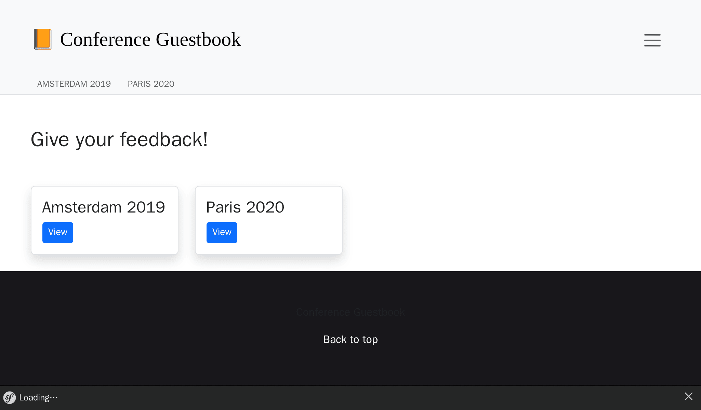
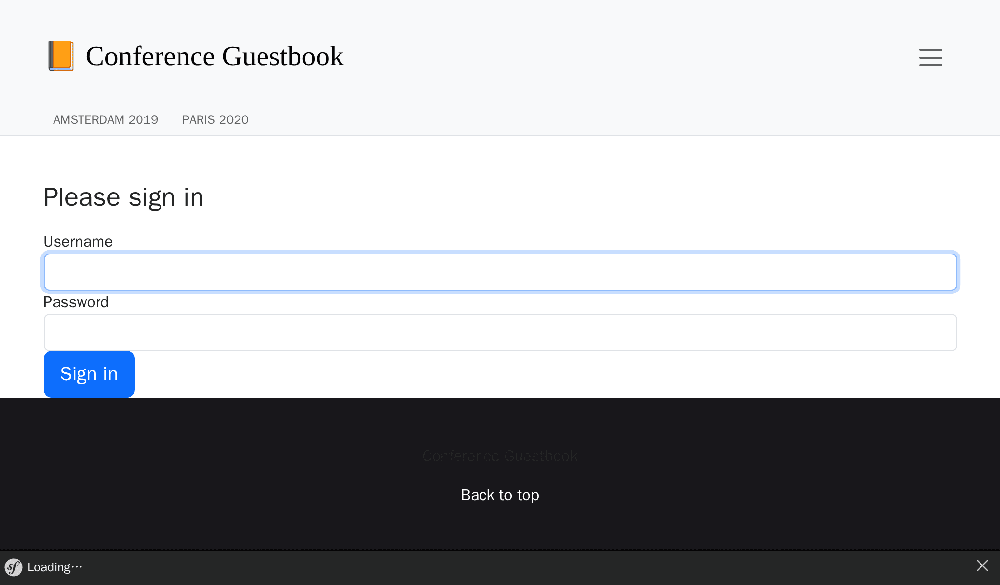

Стилизация пользовательского интерфейса
=======================================

.. index::
    single: AssetMapper
    single: Components;AssetMapper
    single: Stylesheet

Мы совсем не уделяли времени дизайну пользовательского интерфейса. Чтобы оформить его профессионально, мы будем использовать современный стек на основе *AssetMapper* — компонента Symfony, который управляет нашими ресурсами с самого первого шага этой книги.

AssetMapper опирается на современные веб-стандарты: файлы JavaScript и CSS отдаются как есть и связываются между собой через *importmap*, позволяя браузеру напрямую загружать нативные *ES-модули*. Ни сборщика, ни этапа сборки, ни Node.js.

Загляните в файл ``importmap.php`` в корне проекта: он описывает JavaScript-пакеты, используемые приложением. Twig-функция ``importmap()``, вызываемая в ``templates/base.html.twig``, делает их доступными браузеру.

Использование Bootstrap
-----------------------

.. index::
    single: Bootstrap

Чтобы начать с хороших настроек по умолчанию и создать отзывчивый сайт, CSS-фреймворк вроде `Bootstrap`_ может сильно помочь. Установите его как пакет importmap:

.. code-block:: terminal

    $ symfony console importmap:require bootstrap bootstrap/dist/css/bootstrap.min.css

Команда регистрирует пакет в ``importmap.php`` и скачивает его (вместе с зависимостью ``@popperjs/core``) в ``assets/vendor/``; во время работы приложение не зависит ни от какого CDN.

Импортируйте Bootstrap в главной точке входа JavaScript (заодно мы убрали приветственное сообщение по умолчанию):

.. code-block:: diff
    :caption: patch_file

    --- i/assets/app.js
    +++ w/assets/app.js
    @@ -5,6 +5,6 @@ import './stimulus_bootstrap.js';
      * This file will be included onto the page via the importmap() Twig function,
      * which should already be in your base.html.twig.
      */
    +import 'bootstrap';
    +import 'bootstrap/dist/css/bootstrap.min.css';
     import './styles/app.css';
    -
    -console.log('This log comes from assets/app.js - welcome to AssetMapper! 🎉');

Обратите внимание, что ``app.css`` импортируется *после* стилей Bootstrap, чтобы наши настройки имели приоритет.

У форм в Symfony есть встроенная поддержка Bootstrap со специальной темой, включите её:

.. code-block:: yaml
    :caption: config/packages/twig.yaml

    twig:
        form_themes: ['bootstrap_5_layout.html.twig']

Стилизация HTML-шаблона
-----------------------

Теперь всё готово, чтобы непосредственно перейти к оформлению внешнего вида приложения. Скачайте и распакуйте архив в корневой директории проекта:

.. code-block:: terminal

    $ php -r "copy('https://symfony.com/uploads/assets/guestbook-8.1.zip', 'guestbook-8.1.zip');"
    $ unzip -o guestbook-8.1.zip
    $ rm guestbook-8.1.zip

Посмотрите на шаблоны — возможно, вы узнаете пару трюков о Twig.

Раздача ресурсов
----------------

.. index::
    single: AssetMapper;asset-map:compile

Собирать нечего: обновите страницу — и изменения уже на месте. В режиме разработки AssetMapper отдаёт файлы ресурсов напрямую.

Остановитесь на минутку и изучите изменения внешнего вида. Посмотрите на новый дизайн в браузере.

.. figure:: screenshots/design-conference.png
    :alt: /conference/amsterdam-2019
    :align: center
    :figclass: with-browser

Теперь ранее сгенерированная форма входа имеет оформление, потому что бандл Maker по умолчанию использует CSS-классы из Bootstrap:

В продакшене Upsun автоматически запускает команду ``asset-map:compile`` на этапе сборки: все ресурсы копируются в ``public/assets/`` с хешем версии в имени файла, что обеспечивает безопасное долговременное HTTP-кеширование.

.. sidebar:: Двигаемся дальше

    * `Документация компонента AssetMapper`_;

    * `Спецификация importmap`_;

    * `Документация Bootstrap`_.

.. _`Bootstrap`: https://getbootstrap.com/
.. _`Документация компонента AssetMapper`: https://symfony.com/doc/current/frontend/asset_mapper.html
.. _`Спецификация importmap`: https://html.spec.whatwg.org/multipage/webappapis.html#import-maps
.. _`Документация Bootstrap`: https://getbootstrap.com/docs/
