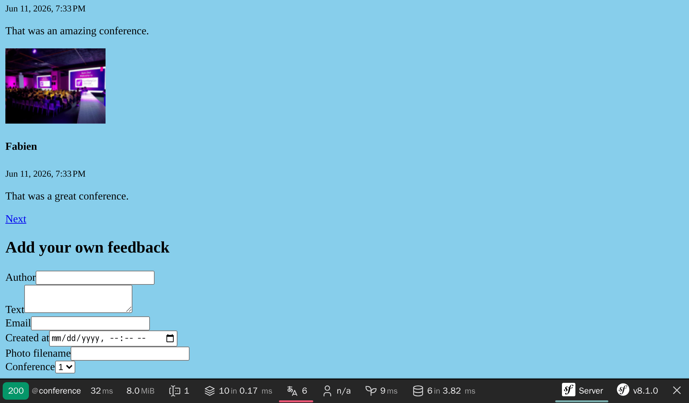

Отримання відгуків за допомогою форм
====================================================================

.. index::
    single: Components;Form
    single: Form

Час дозволити нашим відвідувачам залишати відгуки про конференції. Вони зможуть додавати свої коментарі за допомогою *HTML-форми*.

Генерування типу форми
------------------------------------------

.. index::
    single: Command;make:form

Використовуйте бандл Maker для генерування класу форми:

.. code-block:: terminal

    $ symfony console make:form CommentType Comment

.. code-block:: text
    :class: ignore
    :emphasize-lines: 1

     created: src/Form/CommentType.php

      Success!

     Next: Add fields to your form and start using it.
     Find the documentation at https://symfony.com/doc/current/forms.html

Клас ``App\Form\CommentType`` визначає форму для сутності ``App\Entity\Comment``:

.. code-block:: php
    :caption: src/Form/CommentType.php
    :class: ignore

    namespace App\Form;

    use App\Entity\Comment;
    use Symfony\Component\Form\AbstractType;
    use Symfony\Component\Form\FormBuilderInterface;
    use Symfony\Component\OptionsResolver\OptionsResolver;

    class CommentType extends AbstractType
    {
        public function buildForm(FormBuilderInterface $builder, array $options): void
        {
            $builder
                ->add('author')
                ->add('text')
                ->add('email')
                ->add('createdAt')
                ->add('photoFilename')
                ->add('conference')
            ;
        }

        public function configureOptions(OptionsResolver $resolver): void
        {
            $resolver->setDefaults([
                'data_class' => Comment::class,
            ]);
        }
    }

`Тип форми`_ описує *поля форми*, пов'язані з моделлю. Він виконує перетворення даних між представленими даними й властивостями класу моделі. За замовчуванням Symfony використовує метадані з сутності ``Comment`` (як-от метадані Doctrine) для визначення конфігурації кожного поля. Наприклад, поле ``text`` відмальовується як ``textarea``, оскільки воно використовує більший стовпчик у базі даних.

Відображення форми
-----------------------------------

Щоб відобразити форму користувачеві, створіть форму в контролері та передайте її до шаблону:

.. code-block:: diff
    :caption: patch_file
    :emphasize-lines: 19,29

    --- i/src/Controller/ConferenceController.php
    +++ w/src/Controller/ConferenceController.php
    @@ -2,7 +2,9 @@

     namespace App\Controller;

    +use App\Entity\Comment;
     use App\Entity\Conference;
    +use App\Form\CommentType;
     use App\Repository\CommentRepository;
     use App\Repository\ConferenceRepository;
     use Symfony\Bundle\FrameworkBundle\Controller\AbstractController;
    @@ -23,6 +25,9 @@ final class ConferenceController extends AbstractController
         #[Route('/conference/{slug:conference}', name: 'conference')]
         public function show(Conference $conference, CommentRepository $commentRepository, #[MapQueryParameter] int $offset = 0): Response
         {
    +        $comment = new Comment();
    +        $form = $this->createForm(CommentType::class, $comment);
    +
             $offset = max(0, $offset);
             $paginator = $commentRepository->getCommentPaginator($conference, $offset);

    @@ -31,6 +36,7 @@ final class ConferenceController extends AbstractController
                 'comments' => $paginator,
                 'previous' => $offset - CommentRepository::COMMENTS_PER_PAGE,
                 'next' => min(count($paginator), $offset + CommentRepository::COMMENTS_PER_PAGE),
    +            'comment_form' => $form,
             ]);
         }
     }

Ніколи не слід створювати екземпляр типу форми безпосередньо. Натомість використовуйте метод ``createForm()``. Цей метод є частиною ``AbstractController`` і полегшує створення форм.

.. index::
    single: Twig;form

Відображення форми в шаблоні можна здійснити за допомогою функції Twig ``form``:

.. code-block:: diff
    :caption: patch_file
    :emphasize-lines: 10

    --- i/templates/conference/show.html.twig
    +++ w/templates/conference/show.html.twig
    @@ -30,4 +30,8 @@
         
             
No comments have been posted yet for this conference.

         
    +
    +    <h2>Add your own feedback</h2>
    +
    +    {{ form(comment_form) }}
     

Після оновлення сторінки конференції в браузері, зверніть увагу, що кожне поле форми використовує правильний HTML-елемент (тип даних є похідним від моделі)

Функція ``form()`` генерує HTML-форму на основі інформації, що визначена в типі форми. Вона також додає атрибут ``enctype=multipart/form-data`` до тегу ``<form>``, як цього вимагає поле для завантаження файлу. Навіть більше, вона піклується про  відображення повідомлень, коли відправлені дані містять помилки. Все можна налаштувати, перевизначивши шаблони за замовчуванням, але для цього проекту вони нам не знадобляться.

Кастомізація типу форми
--------------------------------------------

Не зважаючи на те, що поля форми налаштовані на основі моделі-аналога, ви можете налаштувати конфігурацію за замовчуванням безпосередньо в класі типу форми:

.. code-block:: diff
    :caption: patch_file

    --- i/src/Form/CommentType.php
    +++ w/src/Form/CommentType.php
    @@ -6,26 +6,32 @@ use App\Entity\Comment;
     use App\Entity\Conference;
     use Symfony\Bridge\Doctrine\Form\Type\EntityType;
     use Symfony\Component\Form\AbstractType;
    +use Symfony\Component\Form\Extension\Core\Type\EmailType;
    +use Symfony\Component\Form\Extension\Core\Type\FileType;
    +use Symfony\Component\Form\Extension\Core\Type\SubmitType;
     use Symfony\Component\Form\FormBuilderInterface;
     use Symfony\Component\OptionsResolver\OptionsResolver;
    +use Symfony\Component\Validator\Constraints\Image;

     class CommentType extends AbstractType
     {
         public function buildForm(FormBuilderInterface $builder, array $options): void
         {
             $builder
    -            ->add('author')
    +            ->add('author', null, [
    +                'label' => 'Your name',
    +            ])
                 ->add('text')
    -            ->add('email')
    -            ->add('createdAt', null, [
    -                'widget' => 'single_text',
    +            ->add('email', EmailType::class)
    +            ->add('photo', FileType::class, [
    +                'required' => false,
    +                'mapped' => false,
    +                'constraints' => [
    +                    new Image(maxSize: '1024k')
    +                ],
                 ])
    -            ->add('photoFilename')
    -            ->add('conference', EntityType::class, [
    -                'class' => Conference::class,
    -                'choice_label' => 'id',
    -            ])
    -        ;
    +            ->add('submit', SubmitType::class)
    +       ;
         }

         public function configureOptions(OptionsResolver $resolver): void

Зверніть увагу, що ми додали кнопку відправки форми (це дозволяє нам використовувати простий вираз ``{{ form(comment_form) }}`` у шаблоні).

Деякі поля не можна налаштувати автоматично, як-от ``photoFilename``. Сутність ``Comment`` має зберегти лише ім'я файлу фотографії, але форма має також подбати про завантаження файлу. Щоб впоратися з цим завданням, ми додали поле з назвою ``photo`` як поле з відключеною опцією ``mapped``: воно не буде зіставлено ні з однією властивістю сутності ``Comment``. Ми будемо керувати ним вручну, щоб реалізувати певну логіку (як-от збереження завантаженої фотографії на диск).

Як приклад кастомізації, ми також змінили мітку за замовчуванням, для деяких полів.

.. figure:: screenshots/form-customized.png
    :alt: /conference/amsterdam-2019
    :align: center
    :figclass: with-browser

Валідація моделей
---------------------------------

Тип форми налаштовує зовнішню відмальовку форми (використовуючи валідацію HTML5). Ось згенерована HTML форма:

.. code-block:: html
    :class: ignore

    <form name="comment_form" method="post" enctype="multipart/form-data">
        

            

                <label for="comment_form_author" class="required">Your name</label>
                <input type="text" id="comment_form_author" name="comment_form[author]" required="required" maxlength="255" />
            

            

                <label for="comment_form_text" class="required">Text</label>
                <textarea id="comment_form_text" name="comment_form[text]" required="required"></textarea>
            

            

                <label for="comment_form_email" class="required">Email</label>
                <input type="email" id="comment_form_email" name="comment_form[email]" required="required" />
            

            

                <label for="comment_form_photo">Photo</label>
                <input type="file" id="comment_form_photo" name="comment_form[photo]" />
            

            

                <button type="submit" id="comment_form_submit" name="comment_form[submit]">Submit</button>
            

            <input type="hidden" id="comment_form__token" name="comment_form[_token]" value="DwqsEanxc48jofxsqbGBVLQBqlVJ_Tg4u9-BL1Hjgac" />
        

    </form>

Форма використовує поле з типом ``email`` для введення електронної пошти й додає атрибут ``required`` для більшості полів. Зверніть увагу, що форма також містить приховане поле ``_token``, що використовується для захисту форми від `CSRF-атак`_.

Але якщо відправка форми проходить без HTML-валідації (за допомогою HTTP-клієнта, який не застосовує правила перевірки, як-от cURL), невалідні дані можуть потрапити на сервер.

Нам також потрібно додати деякі обмеження (правила) валідації до моделі даних ``Comment``':

.. code-block:: diff
    :caption: patch_file

    --- i/src/Entity/Comment.php
    +++ w/src/Entity/Comment.php
    @@ -5,6 +5,7 @@ namespace App\Entity;
     use App\Repository\CommentRepository;
     use Doctrine\DBAL\Types\Types;
     use Doctrine\ORM\Mapping as ORM;
    +use Symfony\Component\Validator\Constraints as Assert;

     #[ORM\Entity(repositoryClass: CommentRepository::class)]
     #[ORM\HasLifecycleCallbacks]
    @@ -16,12 +17,16 @@ class Comment
         private ?int $id = null;

         #[ORM\Column(length: 255)]
    +    #[Assert\NotBlank]
         private ?string $author = null;

         #[ORM\Column(type: Types::TEXT)]
    +    #[Assert\NotBlank]
         private ?string $text = null;

         #[ORM\Column(length: 255)]
    +    #[Assert\NotBlank]
    +    #[Assert\Email]
         private ?string $email = null;

         #[ORM\Column]

Обробка форми
-------------------------

Коду, що ми написали, достатньо для відображення форми.

Тепер нам необхідно реалізувати обробку даних форми та зберегти інформацію до бази даних у контролері:

.. code-block:: diff
    :caption: patch_file

    --- i/src/Controller/ConferenceController.php
    +++ w/src/Controller/ConferenceController.php
    @@ -7,7 +7,9 @@ use App\Entity\Conference;
     use App\Form\CommentType;
     use App\Repository\CommentRepository;
     use App\Repository\ConferenceRepository;
    +use Doctrine\ORM\EntityManagerInterface;
     use Symfony\Bundle\FrameworkBundle\Controller\AbstractController;
    +use Symfony\Component\HttpFoundation\Request;
     use Symfony\Component\HttpFoundation\Response;
     use Symfony\Component\HttpKernel\Attribute\MapQueryParameter;
     use Symfony\Component\Routing\Attribute\Route;
    @@ -14,6 +15,11 @@ use Symfony\Component\Routing\Attribute\Route;

     final class ConferenceController extends AbstractController
     {
    +    public function __construct(
    +        private EntityManagerInterface $entityManager,
    +    ) {
    +    }
    +
         #[Route('/', name: 'homepage')]
         public function index(ConferenceRepository $conferenceRepository): Response
         {
    @@ -24,10 +30,19 @@ final class ConferenceController extends AbstractController
         }

         #[Route('/conference/{slug:conference}', name: 'conference')]
    -    public function show(Conference $conference, CommentRepository $commentRepository, #[MapQueryParameter] int $offset = 0): Response
    +    public function show(Request $request, Conference $conference, CommentRepository $commentRepository, #[MapQueryParameter] int $offset = 0): Response
         {
             $comment = new Comment();
             $form = $this->createForm(CommentType::class, $comment);
    +        $form->handleRequest($request);
    +        if ($form->isSubmitted() && $form->isValid()) {
    +            $comment->setConference($conference);
    +
    +            $this->entityManager->persist($comment);
    +            $this->entityManager->flush();
    +
    +            return $this->redirectToRoute('conference', ['slug' => $conference->getSlug()]);
    +        }

             $offset = max(0, $offset);
             $paginator = $commentRepository->getCommentPaginator($conference, $offset);

Зверніть увагу, що об'єкт ``Request`` тепер впроваджується в контролер, оскільки форма потребує його для дослідження поданих даних за допомогою ``handleRequest()``.

Після відправки форми, сутність ``Comment`` оновлюється відповідно до поданих даних.

Конференція має бути такою ж, як і та, що вказана в URL-адресі (ми видалили її з форми).

Якщо форма невалідна, ми відображаємо сторінку, але тепер форма буде містити подані значення і повідомлення про помилки, щоб їх можна було відобразити користувачеві.

Спробуйте заповнити й відправити форму. Вона має працювати правильно, а дані мають зберігатися в базі даних (перевірте це в панелі керування). Однак є одна проблема: фотографії. Вони не зберігаються, оскільки ми ще не обробляли їх у контролері.

Завантаження файлів
-------------------------------------

Завантажені фотографії слід зберігати на локальному диску, в місці до якого є доступ з фронтенду, щоб ми могли відображати їх на сторінці конференції. Ми будемо зберігати їх у каталозі ``public/uploads/photos``.

.. index::
    single: Attribute;Autowire
    single: Autowire

Оскільки ми не хочемо жорстко вказувати шлях до каталогу в коді, нам потрібен спосіб зберегти його глобально в конфігурації. Контейнер Symfony може зберігати *параметри* додатково до служб, які є скалярами, що допомагають налаштовувати служби:

.. code-block:: diff
    :caption: patch_file

    --- i/config/services.yaml
    +++ w/config/services.yaml
    @@ -4,6 +4,7 @@
     # Put parameters here that don't need to change on each machine where the app is deployed
     # https://symfony.com/doc/current/best_practices.html#use-parameters-for-application-configuration
     parameters:
    +    photo_dir: "%kernel.project_dir%/public/uploads/photos"

     services:
         # default configuration for services in *this* file

Ми вже бачили, як сервіси автоматично впроваджуються в аргументи конструктора. Що стосується параметрів контейнера, ми можемо явно впровадити їх за допомогою атрибута ``Autowire``.

Тепер у нас є все, що нам потрібно знати, щоб реалізувати логіку, необхідну для збереження завантаженого файлу в кінцевому пункті призначення:

.. code-block:: diff
    :caption: patch_file

    --- i/src/Controller/ConferenceController.php
    +++ w/src/Controller/ConferenceController.php
    @@ -9,6 +9,7 @@ use App\Repository\CommentRepository;
     use App\Repository\ConferenceRepository;
     use Doctrine\ORM\EntityManagerInterface;
     use Symfony\Bundle\FrameworkBundle\Controller\AbstractController;
    +use Symfony\Component\DependencyInjection\Attribute\Autowire;
     use Symfony\Component\HttpFoundation\Request;
     use Symfony\Component\HttpFoundation\Response;
     use Symfony\Component\Routing\Attribute\Route;
    @@ -29,13 +30,23 @@ final class ConferenceController extends AbstractController
         }

         #[Route('/conference/{slug:conference}', name: 'conference')]
    -    public function show(Request $request, Conference $conference, CommentRepository $commentRepository, #[MapQueryParameter] int $offset = 0): Response
    -    {
    +    public function show(
    +        Request $request,
    +        Conference $conference,
    +        CommentRepository $commentRepository,
    +        #[Autowire('%photo_dir%')] string $photoDir,
    +        #[MapQueryParameter] int $offset = 0,
    +    ): Response {
             $comment = new Comment();
             $form = $this->createForm(CommentType::class, $comment);
             $form->handleRequest($request);
             if ($form->isSubmitted() && $form->isValid()) {
                 $comment->setConference($conference);
    +            if ($photo = $form['photo']->getData()) {
    +                $filename = bin2hex(random_bytes(6)).'.'.$photo->guessExtension();
    +                $photo->move($photoDir, $filename);
    +                $comment->setPhotoFilename($filename);
    +            }

                 $this->entityManager->persist($comment);
                 $this->entityManager->flush();

Щоб керувати завантаженням фотографій, ми створюємо випадкове ім'я для файлу. Потім переміщуємо завантажений файл у його кінцеве місце розташування (каталог фотографій). Нарешті, ми зберігаємо ім'я файлу в об'єкті Comment.

Спробуйте завантажити PDF-файл замість фотографії. Ви маєте побачити повідомлення про помилки в дії. Дизайн на даний момент досить потворний, але не хвилюйтеся, все стане красивим за кілька кроків, коли ми будемо працювати над дизайном веб-сайту. Для форм, ми змінимо всього один рядок конфігурації, щоб стилізувати всі елементи.

Налагодження форм
---------------------------------

Коли форма відправлена й щось працює не так, як потрібно, використовуйте панель "Form" Symfony Profiler. Він надає вам інформацію про форму, всі її параметри, відправлені дані й про те, як вони перетворюються всередині. Якщо форма містить якісь помилки, вони також будуть відображені.

Порядок взаємодії з формою, як правило, виглядає наступним чином:

* Форма відображається на сторінці;

* Користувач відправляє форму за допомогою POST-запиту;

* Сервер перенаправляє користувача на іншу або ту саму сторінку.

Але як ви можете отримати доступ до профілювальника в разі успішної відправки запиту? Оскільки сторінка негайно перенаправляється, ми ніколи не побачимо панель інструментів веб-налагодження для POST-запиту. Немає проблем: на перенаправленій сторінці наведіть курсор на зелену область зліва, з надписом "200". Ви маєте побачити перенаправлення "302" із посиланням на профіль (у дужках).

.. figure:: screenshots/form-wdt.png
    :alt: /conference/amsterdam-2019
    :align: center
    :figclass: with-browser

Натисніть на нього, щоб відкрити профіль POST-запиту, та перейдіть до панелі "Form":

.. code-block:: terminal
    :class: hide

    $ rm -rf var/cache

.. figure:: screenshots/form-profiler.png
    :alt: /_profiler/450aa5
    :align: center
    :figclass: with-browser

Відображення завантажених фотографій у панелі керування
---------------------------------------------------------------------------------------------------------

Наразі в панелі керування відображається ім’я файлу, але ми хочемо бачити саме фотографію:

.. code-block:: diff
    :caption: patch_file

    --- i/src/Controller/Admin/CommentCrudController.php
    +++ w/src/Controller/Admin/CommentCrudController.php
    @@ -10,6 +10,7 @@ use EasyCorp\Bundle\EasyAdminBundle\Field\AssociationField;
     use EasyCorp\Bundle\EasyAdminBundle\Field\DateTimeField;
     use EasyCorp\Bundle\EasyAdminBundle\Field\EmailField;
     use EasyCorp\Bundle\EasyAdminBundle\Field\IdField;
    +use EasyCorp\Bundle\EasyAdminBundle\Field\ImageField;
     use EasyCorp\Bundle\EasyAdminBundle\Field\TextareaField;
     use EasyCorp\Bundle\EasyAdminBundle\Field\TextEditorField;
     use EasyCorp\Bundle\EasyAdminBundle\Field\TextField;
    @@ -47,7 +48,9 @@ class CommentCrudController extends AbstractCrudController
             yield TextareaField::new('text')
                 ->hideOnIndex()
             ;
    -        yield TextField::new('photoFilename')
    +        yield ImageField::new('photoFilename')
    +            ->setBasePath('/uploads/photos')
    +            ->setLabel('Photo')
                 ->onlyOnIndex()
             ;

Виключення завантажених фотографій з Git
-------------------------------------------------------------------------

Не фіксуйте зміни! Ми не хочемо зберігати завантажені зображення у Git-репозиторії. Додайте каталог ``/public/uploads`` у файл ``.gitignore``:

.. code-block:: diff
    :caption: patch_file

    --- i/.gitignore
    +++ w/.gitignore
    @@ -1,3 +1,4 @@
    +/public/uploads

     ###> symfony/framework-bundle ###
     /.env.local

Зберігання завантажених файлів на продакшн-серверах
-------------------------------------------------------------------------------------------------

Останнім кроком є зберігання завантажених файлів на продакшн-серверах. Чому необхідно робити щось особливе? Тому що більшість сучасних хмарних платформ використовують контейнери тільки для читання, з різних причин. Upsun не є винятком.

В проекті Symfony не всі ресурси доступні лише для читання. Ми намагаємося згенерувати якомога більше кешу при створенні контейнера (під час фази розігрівання кешу), але Symfony все одно має мати можливість записувати кеш користувачів, журнали, сеанси, якщо вони зберігаються в файловій системі тощо.

Погляньте на файл ``.upsun/config.yaml``, там вже є доступна для запису *точка монтування* для каталогу ``var/``. Каталог ``var/`` є єдиним каталогом, у який Symfony записує дані (кеші, журнали, ...).

Створімо нову точку монтування для завантажених фотографій:

.. code-block:: diff
    :caption: patch_file

    --- i/.upsun/config.yaml
    +++ w/.upsun/config.yaml
    @@ -41,6 +41,7 @@ applications:
             mounts:
                 "/var/cache": { source: instance, source_path: var/cache }
                 "/var/share": { source: storage, source_path: var/share }
    +            "/public/uploads": { source: storage, source_path: uploads }

             relationships:

Тепер ви можете розгорнути код, і фотографії зберігатимуться у каталозі ``public/uploads/``, як у нашій локальній версії.

.. sidebar:: Йдемо далі

    * `Навчальний посібник SymfonyCasts: форми`_;

    * Як `кастомізувати відмальовку форм Symfony в HTML`_;

    * `Валідація форм Symfony`_;

    * `Типи полів форм Symfony`_;

    * `Документація по FlysystemBundle`_, який забезпечує інтеграцію з кількома постачальниками хмарних сховищ, як-от AWS S3, Azure й Google Cloud Storage;

    * `Параметри конфігурації Symfony`_.

    * `Обмеження (правила) Symfony Validation`_;

    * `Шпаргалка по Symfony Form`_.

.. _`CSRF-атак`: https://owasp.org/www-community/attacks/csrf
.. _`Тип форми`: https://symfony.com/doc/current/forms.html#form-types
.. _`Навчальний посібник SymfonyCasts: форми`: https://symfonycasts.com/screencast/symfony-forms
.. _`кастомізувати відмальовку форм Symfony в HTML`: https://symfony.com/doc/current/form/form_customization.html
.. _`Валідація форм Symfony`: https://symfony.com/doc/current/forms.html#validating-forms
.. _`Типи полів форм Symfony`: https://symfony.com/doc/current/reference/forms/types.html
.. _`Документація по FlysystemBundle`: https://github.com/thephpleague/flysystem-bundle/blob/master/docs/1-getting-started.md
.. _`Параметри конфігурації Symfony`: https://symfony.com/doc/current/configuration.html#configuration-parameters
.. _`Обмеження (правила) Symfony Validation`: https://symfony.com/doc/current/validation.html#basic-constraints
.. _`Шпаргалка по Symfony Form`: https://github.com/andreia/symfony-cheat-sheets/blob/master/Symfony2/how_symfony2_forms_works_en.pdf
