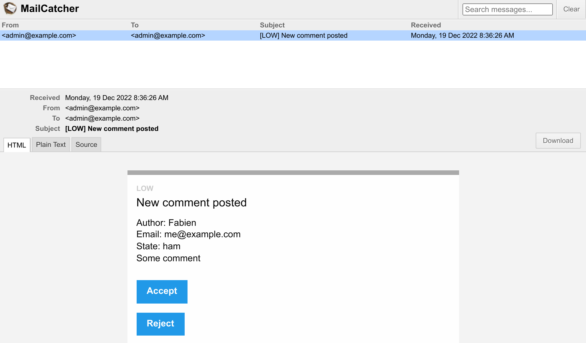

Відправка електронної пошти адміністраторам
===================================================================================

.. index::
    single: Components;Mailer
    single: Mailer
    single: Emails

Щоб забезпечити високу якість відгуків, адміністратор має модерувати всі коментарі. Коли коментар знаходиться у стані ``ham`` або ``potential_spam``, адміністратору слід відправити *електронний лист* з двома посиланнями: одне щоб прийняти коментар, а інше щоб відхилити його.

Встановлення адреси електронної пошти адміністратора
----------------------------------------------------------------------------------------------------

Щоб зберегти адресу електронної пошти адміністратора, використовуйте параметр контейнера. З метою демонстрації ми також дозволимо встановити її за допомогою змінної середовища (це не знадобиться у "реальному житті"):

.. code-block:: diff
    :caption: patch_file

    --- a/config/services.yaml
    +++ b/config/services.yaml
    @@ -5,6 +5,8 @@
     # https://symfony.com/doc/current/best_practices.html#use-parameters-for-application-configuration
     parameters:
         photo_dir: "%kernel.project_dir%/public/uploads/photos"
    +    default_admin_email: admin@example.com
    +    admin_email: "%env(string:default:default_admin_email:ADMIN_EMAIL)%"

     services:
         # default configuration for services in *this* file

Змінна середовища може бути "оброблена" перед її використанням. Тут ми використовуємо процесор ``default``, щоб повернутися до значення параметра ``default_admin_email``, якщо змінної середовища ``ADMIN_EMAIL`` не існує.

Відправка повідомлення електронної пошти
-----------------------------------------------------------------------------

Щоб надіслати електронний лист, ви можете вибирати між кількома абстракціями класу ``Email``; від ``Message``, найнижчого рівня, до ``NotificationEmail``, найвищого. Ви, ймовірно, найчастіше будете використовувати клас ``Email``, але ``NotificationEmail`` — це ідеальний вибір для внутрішньої електронної пошти.

Замінімо логіку автоматичної перевірки в обробнику повідомлень:

.. code-block:: diff
    :caption: patch_file

    --- a/src/MessageHandler/CommentMessageHandler.php
    +++ b/src/MessageHandler/CommentMessageHandler.php
    @@ -7,6 +7,9 @@ use App\Repository\CommentRepository;
     use App\SpamChecker;
     use Doctrine\ORM\EntityManagerInterface;
     use Psr\Log\LoggerInterface;
    +use Symfony\Bridge\Twig\Mime\NotificationEmail;
    +use Symfony\Component\DependencyInjection\Attribute\Autowire;
    +use Symfony\Component\Mailer\MailerInterface;
     use Symfony\Component\Messenger\Attribute\AsMessageHandler;
     use Symfony\Component\Messenger\MessageBusInterface;
     use Symfony\Component\Workflow\WorkflowInterface;
    @@ -20,6 +23,8 @@ class CommentMessageHandler
             private CommentRepository $commentRepository,
             private MessageBusInterface $bus,
             private WorkflowInterface $commentStateMachine,
    +        private MailerInterface $mailer,
    +        #[Autowire('%admin_email%')] private string $adminEmail,
             private ?LoggerInterface $logger = null,
         ) {
         }
    @@ -42,8 +47,13 @@ class CommentMessageHandler
                 $this->entityManager->flush();
                 $this->bus->dispatch($message);
             } elseif ($this->commentStateMachine->can($comment, 'publish') || $this->commentStateMachine->can($comment, 'publish_ham')) {
    -            $this->commentStateMachine->apply($comment, $this->commentStateMachine->can($comment, 'publish') ? 'publish' : 'publish_ham');
    -            $this->entityManager->flush();
    +            $this->mailer->send((new NotificationEmail())
    +                ->subject('New comment posted')
    +                ->htmlTemplate('emails/comment_notification.html.twig')
    +                ->from($this->adminEmail)
    +                ->to($this->adminEmail)
    +                ->context(['comment' => $comment])
    +            );
             } elseif ($this->logger) {
                 $this->logger->debug('Dropping comment message', ['comment' => $comment->getId(), 'state' => $comment->getState()]);
             }

``MailerInterface`` — це основна точка входу, вона дозволяє відправляти електронні листи за допомогою методу ``send()``

Щоб відправити електронний лист, нам потрібен відправник (заголовок ``From``/``Sender``). Замість того щоб встановлювати його явно в екземплярі Email, визначте його глобально:

.. code-block:: diff
    :caption: patch_file

    --- a/config/packages/mailer.yaml
    +++ b/config/packages/mailer.yaml
    @@ -1,3 +1,5 @@
     framework:
         mailer:
             dsn: '%env(MAILER_DSN)%'
    +        envelope:
    +            sender: "%admin_email%"

Розширення шаблону повідомлення електронної пошти
----------------------------------------------------------------------------------------------

.. index::
    single: Twig;extends
    single: Twig;block
    single: Twig;url

Шаблон повідомлення електронної пошти успадковується від шаблону повідомлення електронної пошти за замовчуванням, який поставляється разом із Symfony:

.. code-block:: html+twig
    :caption: templates/emails/comment_notification.html.twig

    

    
        Author: {{ comment.author }} 
        Email: {{ comment.email }} 
        State: {{ comment.state }} 

        

            {{ comment.text }}
        

    

    
        <spacer size="16"></spacer>
        <button href="{{ url('review_comment', { id: comment.id }) }}">Accept</button>
        <button href="{{ url('review_comment', { id: comment.id, reject: true }) }}">Reject</button>
    

Шаблон перевизначає кілька блоків, щоб налаштувати електронний лист і додати деякі посилання, які дозволяють адміністратору прийняти або відхилити коментар. Будь-який аргумент маршруту, який не є валідним параметром маршруту, додається як елемент рядка запиту (URL-адреса відхилення виглядає як ``/admin/comment/review/42?reject=true``).

Шаблон ``NotificationEmail`` за замовчуванням використовує `Inky`_ замість HTML для розмітки електронних листів. Це допомагає створювати адаптивні електронні листи, сумісні з усіма популярними поштовими клієнтами.

Для максимальної сумісності з програмами-читачами електронної пошти, базовий макет повідомлень вбудовує всі таблиці стилів (за допомогою пакету CSS inliner) за замовчуванням.

Ці дві функції є частиною додаткових розширень Twig, які необхідно встановити:

.. code-block:: terminal

    $ symfony composer req "twig/cssinliner-extra:^3" "twig/inky-extra:^3"

Генерування абсолютних URL-адрес у команді Symfony
------------------------------------------------------------------------------------

.. index::
    single: Twig;Link
    single: Link

В електронних листах генеруйте URL-адреси за допомогою ``url()`` замість ``path()``, оскільки вам потрібні абсолютні шляхи (зі схемою і хостом).

Електронний лист відправляється з обробника повідомлень у контексті консолі. Генерувати абсолютні URL-адреси у веб-контексті простіше, оскільки ми знаємо схему та домен поточної сторінки. Це не стосується контексту консолі.

Визначте доменне ім’я та схему для явного використання:

.. code-block:: diff
    :caption: patch_file

    --- a/config/services.yaml
    +++ b/config/services.yaml
    @@ -7,6 +7,8 @@ parameters:
         photo_dir: "%kernel.project_dir%/public/uploads/photos"
         default_admin_email: admin@example.com
         admin_email: "%env(string:default:default_admin_email:ADMIN_EMAIL)%"
    +    default_base_url: 'http://127.0.0.1'
    +    router.request_context.base_url: '%env(default:default_base_url:SYMFONY_DEFAULT_ROUTE_URL)%'

     services:
         # default configuration for services in *this* file

Змінна середовища ``SYMFONY_DEFAULT_ROUTE_URL`` автоматично встановлюються локально під час використання ``symfony`` CLI й визначаються на основі конфігурації у Upsun.

Підключення маршруту до контролера
-----------------------------------------------------------------

Маршрут ``review_comment`` ще не існує, створімо адміністративний контролер для його обробки:

.. code-block:: php
    :caption: src/Controller/AdminController.php

    namespace App\Controller;

    use App\Entity\Comment;
    use App\Message\CommentMessage;
    use Doctrine\ORM\EntityManagerInterface;
    use Symfony\Bundle\FrameworkBundle\Controller\AbstractController;
    use Symfony\Component\HttpFoundation\Request;
    use Symfony\Component\HttpFoundation\Response;
    use Symfony\Component\Messenger\MessageBusInterface;
    use Symfony\Component\Routing\Annotation\Route;
    use Symfony\Component\Workflow\WorkflowInterface;
    use Twig\Environment;

    class AdminController extends AbstractController
    {
        public function __construct(
            private Environment $twig,
            private EntityManagerInterface $entityManager,
            private MessageBusInterface $bus,
        ) {
        }

        #[Route('/admin/comment/review/{id}', name: 'review_comment')]
        public function reviewComment(Request $request, Comment $comment, WorkflowInterface $commentStateMachine): Response
        {
            $accepted = !$request->query->get('reject');

            if ($commentStateMachine->can($comment, 'publish')) {
                $transition = $accepted ? 'publish' : 'reject';
            } elseif ($commentStateMachine->can($comment, 'publish_ham')) {
                $transition = $accepted ? 'publish_ham' : 'reject_ham';
            } else {
                return new Response('Comment already reviewed or not in the right state.');
            }

            $commentStateMachine->apply($comment, $transition);
            $this->entityManager->flush();

            if ($accepted) {
                $this->bus->dispatch(new CommentMessage($comment->getId()));
            }

            return new Response($this->twig->render('admin/review.html.twig', [
                'transition' => $transition,
                'comment' => $comment,
            ]));
        }
    }

URL-адреса перевірки коментаря починається з ``/admin/``, щоб захистити його за допомогою брандмауера, визначеного на попередньому кроці. Адміністратору необхідно пройти аутентифікацію, щоб отримати доступу до цього ресурсу.

Замість створення екземпляра ``Response``, ми використовували ``render()``, метод швидкого доступу, що надається базовим класом контролера ``AbstractController``.

.. index::
    single: Twig;extends
    single: Twig;block

Коли перевірка завершена, адміністратор бачить повідомлення з подякою за його копітку роботу, за допомогою короткого шаблону:

.. code-block:: html+twig
    :caption: templates/admin/review.html.twig

    

    
        <h2>Comment reviewed, thank you!</h2>

        
Applied transition: <strong>{{ transition }}</strong>

        
New state: <strong>{{ comment.state }}</strong>

    

Використання Mail Catcher
-------------------------------------

.. index::
    single: Docker;Mail Catcher

Замість того щоб використовувати "реальний" SMTP-сервер чи стороннього постачальника для відправки електронних листів, використовуймо засіб перехоплення пошти. Перехоплювач надає SMTP-сервер, який не доставляє електронні листи, але натомість робить їх доступними через веб-інтерфейс: На щастя Symfony вже автоматично налаштував для нас засіб перехоплення пошти:

.. code-block:: yaml
    :caption: docker-compose.override.yml
    :class: ignore

    services:
    ###> symfony/mailer ###
      mailer:
        image: schickling/mailcatcher
        ports: [1025, 1080]
    ###< symfony/mailer ###

Доступ до веб-служби електронної пошти
-----------------------------------------------------------------------

.. index::
    single: Symfony CLI;open:local:webmail

Ви можете відкрити веб-службу електронної пошти з термінала:

.. code-block:: terminal
    :class: ignore

    $ symfony open:local:webmail

Або з панелі інструментів веб-налагодження:

.. figure:: screenshots/webmail-wdt.png
    :alt: /
    :align: center
    :figclass: with-browser

Відправте коментар, ви маєте отримати електронний лист в інтерфейсі веб-служби електронної пошти:

Натисніть на заголовок електронного листа в інтерфейсі та прийміть або відхиліть коментар на ваш розсуд:

.. figure:: screenshots/webmail-rejected.png
    :alt: /
    :align: center
    :figclass: with-browser

Перевірте журнали за допомогою ``server:log``, якщо це не працює належним чином.

Керування довго виконуваними сценаріями
---------------------------------------------------------------------------

Наявність довго виконуваних сценаріїв супроводжується поведінкою, про яку ви маєте знати. На відміну від моделі PHP, що використовується для HTTP, де кожен запит починається з чистого стану, споживач повідомлення працює безперервно у фоновому режимі. Кожна обробка повідомлення успадковує поточний стан, включаючи кеш пам'яті. Щоб уникнути будь-яких проблем із Doctrine, її менеджери сутностей автоматично очищаються після обробки повідомлення. Ви маєте перевірити, чи потрібно вашим власним сервісам робити те ж саме чи ні.

Відправка електронних листів асинхронно
---------------------------------------------------------------------------

Відправка електронного листа, відправленого в обробник повідомлень, може зайняти деякий час. Може навіть статися виняток. У разі виникнення винятку, під час обробки повідомлення, воно буде відправлено повторно. Але замість того щоб намагатися повторно опрацювати повідомлення коментаря, було б краще просто повторити спробу відправки електронного листа.

Ми вже знаємо, як це зробити: відправити повідомлення електронної пошти до шини.

Екземпляр ``MailerInterface`` виконує копітку роботу: коли шина визначена, він направляє повідомлення електронної пошти до неї, а не відправляє їх. Жодні зміни у вашому коді не потрібні.

Шина вже відправляє електронний лист асинхронно відповідно до конфігурації Messenger за замовчуванням:

.. code-block:: yaml
    :caption: config/packages/messenger.yaml
    :emphasize-lines: 4
    :class: ignore

    framework:
        messenger:
            routing:
                Symfony\Component\Mailer\Messenger\SendEmailMessage: async
                Symfony\Component\Notifier\Message\ChatMessage: async
                Symfony\Component\Notifier\Message\SmsMessage: async

                # Route your messages to the transports
                App\Message\CommentMessage: async

Навіть якщо ми використовуємо той самий транспорт для повідомлень коментарів і повідомлень електронної пошти, це не обов'язково має бути так. Наприклад, ви можете використовувати інший транспорт для керування різними пріоритетами повідомлень. Використання різних типів транспорту також дає вам можливість мати різні робочі комп'ютери, які обробляють різні види повідомлень. Це дуже гнучко і залежить тільки від вас.

Тестування електронних листів
--------------------------------------------------------

Існує багато способів тестування електронних листів.

Ви можете написати модульні тести, якщо напишете клас для кожного електронного листа (наприклад, наслідуючи ``Email`` або ``TemplatedEmail``).

Однак найбільш поширені тести, які ви будете писати, — це функціональні тести, які перевіряють, чи призводять певні дії до відправки електронного листа, і, ймовірно, тести на вміст електронних листів, якщо вони динамічні.

Symfony постачається із твердженнями що полегшують таке тестування, ось приклад тесту, який демонструє деякі можливості:

.. code-block:: php
    :class: ignore

    public function testMailerAssertions()
    {
        $client = static::createClient();
        $client->request('GET', '/');

        $this->assertEmailCount(1);
        $event = $this->getMailerEvent(0);
        $this->assertEmailIsQueued($event);

        $email = $this->getMailerMessage(0);
        $this->assertEmailHeaderSame($email, 'To', 'fabien@example.com');
        $this->assertEmailTextBodyContains($email, 'Bar');
        $this->assertEmailAttachmentCount($email, 1);
    }

Ці твердження працюють, коли електронні листи відправляються синхронно або асинхронно.

Відправка електронних листів у Upsun
---------------------------------------------------------------------

.. index::
    single: Upsun;Emails
    single: Upsun;Mailer
    single: Upsun;SMTP
    single: Emails

Для Upsun немає конкретної конфігурації. Всі облікові записи поставляються з обліковим записом SendGrid, який автоматично використовується для відправки електронних листів.

.. index::
    single: Symfony CLI;cloud:env:info

.. note::

    Про всяк випадок, електронні листи за замовчуванням відправляються *лише* у гілці ``master``. Увімкніть SMTP явно в гілках, які не є ``master``, якщо ви знаєте, що робите:

    .. code-block:: terminal

        $ symfony cloud:env:info enable_smtp on

.. sidebar:: Йдемо далі

    * `Навчальний посібник SymfonyCasts: Mailer`_;

    * `Документація по шаблонізатору Inky`_;

    * `Процесори змінних середовища`_;

    * `Документація по Symfony Framework Mailer`_;

    * `Документація по роботі з електронною поштою у Upsun`_.

.. _`Inky`: https://get.foundation/emails/docs/inky.html
.. _`Навчальний посібник SymfonyCasts: Mailer`: https://symfonycasts.com/screencast/mailer
.. _`Документація по шаблонізатору Inky`: https://get.foundation/emails/docs/inky.html
.. _`Процесори змінних середовища`: https://symfony.com/doc/current/configuration/env_var_processors.html
.. _`Документація по Symfony Framework Mailer`: https://symfony.com/doc/current/mailer.html
.. _`Документація по роботі з електронною поштою у Upsun`: https://symfony.com/doc/current/cloud/services/emails.html
