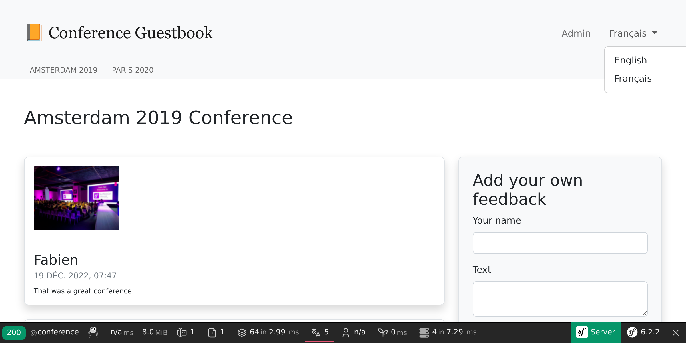
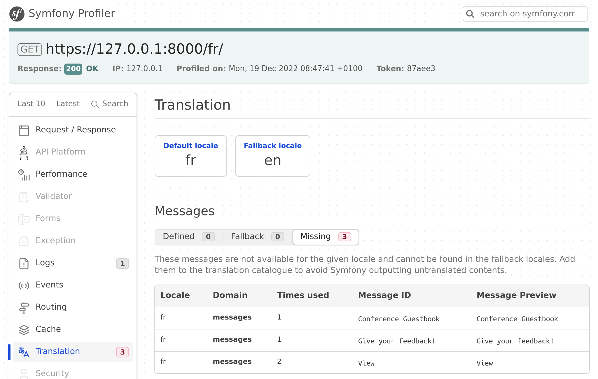
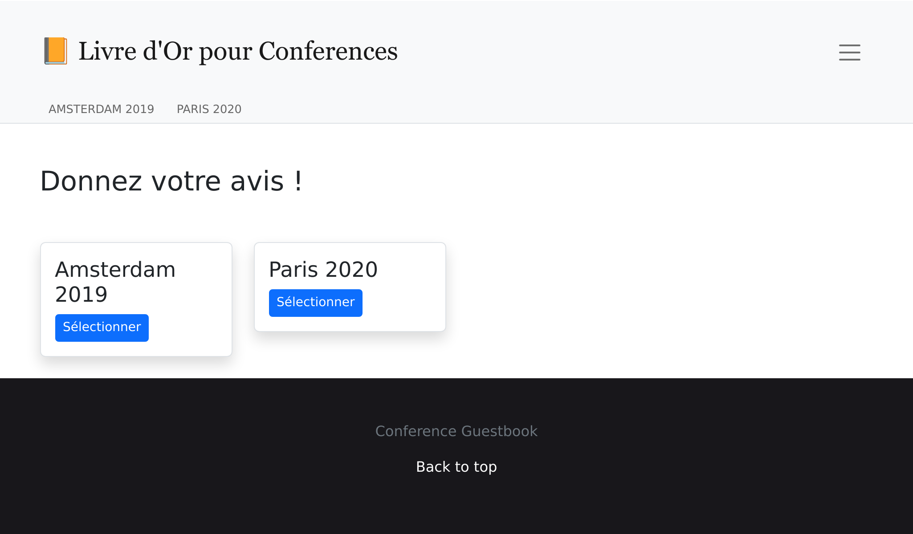

Локалізація застосунку
===========================================

Завдяки міжнародній аудиторії, Symfony, як ніколи раніше, може обробляти інтернаціоналізацію (i18n) і локалізацію (l10n) з коробки. Локалізація застосунку — це не тільки переклад інтерфейсу, але й множини, форматування дати й валюти, URL-адрес тощо.

Інтернаціоналізація URL-адрес
-----------------------------------------------------

.. index::
    single: Components;Routing
    single: Routing;Locale
    single: Routing;Requirements
    single: Attributes;Route

Першим кроком до інтернаціоналізації веб-сайту є інтернаціоналізація URL-адрес. При перекладі інтерфейсу веб-сайту URL-адреса має відрізнятися залежно від локалі, щоб ладнати з кешами HTTP (ніколи не використовуйте ту саму URL-адресу й не зберігайте локаль у сесії).

Використовуйте спеціальний параметр маршруту ``_locale``, щоб посилатися на локаль у маршрутах:

.. code-block:: diff
    :caption: patch_file
    :emphasize-lines: 8

    --- i/src/Controller/ConferenceController.php
    +++ w/src/Controller/ConferenceController.php
    @@ -28,7 +28,7 @@ final class ConferenceController extends AbstractController
         }

         #[Cache(smaxage: 3600)]
    -    #[Route('/', name: 'homepage')]
    +    #[Route('/{_locale}/', name: 'homepage')]
         public function index(ConferenceRepository $conferenceRepository): Response
         {
             return $this->render('conference/index.html.twig', [

На головній сторінці локаль тепер встановлюється зсередини залежно від URL-адреси; наприклад, якщо ви перейдете до ``/fr/`` — ``$request->getLocale()`` повертає ``fr``.

Оскільки ви, ймовірно, не зможете перекласти вміст у всіх допустимих локалях, обмежтеся тими, які ви хочете підтримувати:

.. code-block:: diff
    :caption: patch_file
    :emphasize-lines: 8

    --- i/src/Controller/ConferenceController.php
    +++ w/src/Controller/ConferenceController.php
    @@ -28,7 +28,7 @@ final class ConferenceController extends AbstractController
         }

         #[Cache(smaxage: 3600)]
    -    #[Route('/{_locale}/', name: 'homepage')]
    +    #[Route('/{_locale<en|fr>}/', name: 'homepage')]
         public function index(ConferenceRepository $conferenceRepository): Response
         {
             return $this->render('conference/index.html.twig', [

Кожен параметр маршруту може бути обмежений регулярним виразом всередині ``<`` ``>``. Маршрут ``homepage`` зараз збігається тільки тоді, коли параметром ``_locale`` є ``en`` чи ``fr``. Спробуйте перейти до ``/es/``, ви маєте отримати 404, оскільки жоден маршрут не збігається.

Оскільки ми будемо використовувати ту саму вимогу майже у всіх маршрутах, перемістімо її в параметр контейнера:

.. code-block:: diff
    :caption: patch_file

    --- i/config/services.yaml
    +++ w/config/services.yaml
    @@ -9,5 +9,6 @@ parameters:
         admin_email: "%env(string:default:default_admin_email:ADMIN_EMAIL)%"
         default_base_url: 'http://127.0.0.1'
    +    app.supported_locales: 'en|fr'

     services:
         # default configuration for services in *this* file
    --- i/src/Controller/ConferenceController.php
    +++ w/src/Controller/ConferenceController.php
    @@ -28,7 +28,7 @@ final class ConferenceController extends AbstractController
         }

         #[Cache(smaxage: 3600)]
    -    #[Route('/{_locale<en|fr>}/', name: 'homepage')]
    +    #[Route('/{_locale<%app.supported_locales%>}/', name: 'homepage')]
         public function index(ConferenceRepository $conferenceRepository): Response
         {
             return $this->render('conference/index.html.twig', [

Додавання мови можна здійснити шляхом оновлення параметру ``app.supported_languages``.

Додайте той самий префікс маршруту локалі до інших URL-адрес:

.. code-block:: diff
    :caption: patch_file

    --- i/src/Controller/ConferenceController.php
    +++ w/src/Controller/ConferenceController.php
    @@ -38,7 +38,7 @@ final class ConferenceController extends AbstractController
         }

         #[Cache(smaxage: 3600)]
    -    #[Route('/conference_header', name: 'conference_header')]
    +    #[Route('/{_locale<%app.supported_locales%>}/conference_header', name: 'conference_header')]
         public function conferenceHeader(ConferenceRepository $conferenceRepository): Response
         {
             return $this->render('conference/header.html.twig', [
    @@ -46,9 +46,9 @@ final class ConferenceController extends AbstractController
             ]);
         }

         #[RateLimit('comment_submission', methods: ['POST'])]
    -    #[Route('/conference/{slug}', name: 'conference')]
    +    #[Route('/{_locale<%app.supported_locales%>}/conference/{slug}', name: 'conference')]
         public function show(
             Request $request,
             #[MapEntity(mapping: ['slug' => 'slug'])]
             Conference $conference,

Ми вже майже завершили. У нас більше немає маршруту, який збігається з ``/``. Додаймо його назад і зробімо перенаправлення на ``/en/``:

.. code-block:: diff
    :caption: patch_file

    --- i/src/Controller/ConferenceController.php
    +++ w/src/Controller/ConferenceController.php
    @@ -27,6 +27,12 @@ final class ConferenceController extends AbstractController
         ) {
         }

    +    #[Route('/')]
    +    public function indexNoLocale(): Response
    +    {
    +        return $this->redirectToRoute('homepage', ['_locale' => 'en']);
    +    }
    +
         #[Cache(smaxage: 3600)]
         #[Route('/{_locale<%app.supported_locales%>}/', name: 'homepage')]
         public function index(ConferenceRepository $conferenceRepository): Response

Тепер, коли всі основні маршрути враховують особливості локалі, зверніть увагу, що створені URL-адреси на сторінках автоматично враховують поточну локаль.

Додавання перемикача локалі
----------------------------------------------------

.. index::
    single: Twig;path
    single: Twig;Locale

Щоб дозволити користувачам перемикатися з локалі за замовчуванням ``en`` на іншу, додаймо перемикач у шапку:

.. code-block:: diff
    :caption: patch_file

    --- i/templates/base.html.twig
    +++ w/templates/base.html.twig
    @@ -34,6 +34,16 @@
                                         Admin
                                     </a>
                                 </li>
    +<li class="nav-item dropdown">
    +    <a class="nav-link dropdown-toggle" href="#" id="dropdown-language" role="button"
    +        data-bs-toggle="dropdown" aria-haspopup="true" aria-expanded="false">
    +        English
    +    </a>
    +    <ul class="dropdown-menu dropdown-menu-right" aria-labelledby="dropdown-language">
    +        <li><a class="dropdown-item" href="{{ path('homepage', {_locale: 'en'}) }}">English</a></li>
    +        <li><a class="dropdown-item" href="{{ path('homepage', {_locale: 'fr'}) }}">Français</a></li>
    +    </ul>
    +</li>
                             </ul>
                         

                     

Для перемикання на іншу локаль ми явно передаємо параметр маршруту ``_locale`` у функцію ``path()``.

.. index::
    single: Twig;app.request
    single: Twig;locale_name

Оновіть шаблон, щоб відобразити ім'я поточної локалі замість жорстко закодованого "English":

.. code-block:: diff
    :caption: patch_file

    --- i/templates/base.html.twig
    +++ w/templates/base.html.twig
    @@ -37,7 +37,7 @@
     <li class="nav-item dropdown">
         <a class="nav-link dropdown-toggle" href="#" id="dropdown-language" role="button"
             data-bs-toggle="dropdown" aria-haspopup="true" aria-expanded="false">
    -        English
    +        {{ app.request.locale|locale_name(app.request.locale) }}
         </a>
         <ul class="dropdown-menu dropdown-menu-right" aria-labelledby="dropdown-language">
             <li><a class="dropdown-item" href="{{ path('homepage', {_locale: 'en'}) }}">English</a></li>

``app`` — це глобальна змінна Twig, яка дає доступ до поточного запиту. Щоб перетворити локаль у читабельний рядок, ми використовуємо фільтр Twig ``locale_name``.

.. index::
    single: Components;String

Залежно від локалі, ім'я локалі не завжди пишеться з великої літери. Щоб належним чином прописувати фрази, нам потрібен фільтр, який враховує Unicode, як це передбачено компонентом Symfony String і його реалізацією Twig:

.. code-block:: terminal

    $ symfony composer req twig/string-extra

.. index::
    single: Twig;u.title

.. code-block:: diff
    :caption: patch_file

    --- i/templates/base.html.twig
    +++ w/templates/base.html.twig
    @@ -37,7 +37,7 @@
     <li class="nav-item dropdown">
         <a class="nav-link dropdown-toggle" href="#" id="dropdown-language" role="button"
             data-bs-toggle="dropdown" aria-haspopup="true" aria-expanded="false">
    -        {{ app.request.locale|locale_name(app.request.locale) }}
    +        {{ app.request.locale|locale_name(app.request.locale)|u.title }}
         </a>
         <ul class="dropdown-menu dropdown-menu-right" aria-labelledby="dropdown-language">
             <li><a class="dropdown-item" href="{{ path('homepage', {_locale: 'en'}) }}">English</a></li>

Тепер ви можете перемикатися з французької на англійську за допомогою перемикача і весь інтерфейс досить добре адаптується:

Переклад інтерфейсу
-------------------------------------

.. index::
    single: Components;Translation
    single: Translation
    single: Twig;trans

Переклад кожної окремої фрази на великому веб-сайті може бути виснажливим, але, на щастя, на нашому веб-сайті є тільки кілька повідомлень. Почнімо з усіх фраз на головній сторінці:

.. code-block:: diff
    :caption: patch_file

    --- i/templates/base.html.twig
    +++ w/templates/base.html.twig
    @@ -20,7 +20,7 @@
                 <nav class="navbar navbar-expand-xl navbar-light bg-light">
                     

                         <a class="navbar-brand me-4 pr-2" href="{{ path('homepage') }}">
    -                        &#128217; Conference Guestbook
    +                        &#128217; {{ 'Conference Guestbook'|trans }}
                         </a>

                         <button class="navbar-toggler border-0" type="button" data-bs-toggle="collapse" data-bs-target="#header-menu" aria-controls="navbarSupportedContent" aria-expanded="false" aria-label="Show/Hide navigation">
    --- i/templates/conference/index.html.twig
    +++ w/templates/conference/index.html.twig
    @@ -4,7 +4,7 @@

     
         <h2 class="mb-5">
    -        Give your feedback!
    +        {{ 'Give your feedback!'|trans }}
         </h2>

         
    @@ -21,7 +21,7 @@

                                 <a href="{{ path('conference', { slug: conference.slug }) }}"
                                    class="btn btn-sm btn-primary stretched-link">
    -                                View
    +                                {{ 'View'|trans }}
                                 </a>
                             

                         

Фільтр Twig ``trans`` шукає переклад даного значення в поточній локалі. Якщо його не знайдено, він повертає значення *локалі за замовчуванням*, як це налаштовано в ``config/packages/translation.yaml``:

.. code-block:: yaml
    :class: ignore
    :emphasize-lines: 2

    framework:
        default_locale: en
        translator:
            default_path: '%kernel.project_dir%/translations'
            fallbacks:
                - en

Зверніть увагу, що "вкладка" перекладу на панелі інструментів веб-налагодження стала червоною:

.. figure:: screenshots/intl-wdt.png
    :alt: /fr/
    :align: center
    :figclass: with-browser

Це говорить нам про те, що 3 повідомлення ще не перекладені.

Натисніть на "вкладку", щоб вивести список всіх повідомлень, для яких Symfony не знайшов перекладу:

Надання перекладів
-----------------------------------

Як ви могли бачити в ``config/packages/translation.yaml``, переклади зберігаються в кореневому каталозі ``translations/``, який було створено для нас автоматично.

Замість того щоб створювати файли перекладу вручну, використовуйте команду ``translation:extract``:

.. code-block:: terminal

    $ symfony console translation:extract fr --force --domain=messages

Ця команда генерує файл перекладу (прапорець ``--force``) для локалі ``fr`` і домену ``messages``. Домен ``messages`` (містить всі повідомлення **застосунку**, за винятком тих, які надходять від самого Symfony, наприклад, помилки валідації чи безпеки.

Відредагуйте файл ``translations/messages+intl-icu.fr.xlf`` і перекладіть повідомлення на французьку мову. Ви не розмовляєте французькою? Дозвольте мені допомогти вам:

.. code-block:: diff
    :caption: patch_file
    :class: ignore

    --- i/translations/messages+intl-icu.fr.xlf
    +++ w/translations/messages+intl-icu.fr.xlf
    @@ -7,15 +7,15 @@
         <body>
           <trans-unit id="eOy4.6V" resname="Conference Guestbook">
             <source>Conference Guestbook</source>
    -        <target>__Conference Guestbook</target>
    +        <target>Livre d'Or pour Conferences</target>
           </trans-unit>
           <trans-unit id="LNAVleg" resname="Give your feedback!">
             <source>Give your feedback!</source>
    -        <target>__Give your feedback!</target>
    +        <target>Donnez votre avis !</target>
           </trans-unit>
           <trans-unit id="3Mg5pAF" resname="View">
             <source>View</source>
    -        <target>__View</target>
    +        <target>Sélectionner</target>
           </trans-unit>
         </body>
       </file>

.. code-block:: xml
    :caption: translations/messages+intl-icu.fr.xlf
    :class: hide

    <?xml version="1.0" encoding="utf-8"?>
    <xliff xmlns="urn:oasis:names:tc:xliff:document:1.2" version="1.2">
    <file source-language="en" target-language="fr" datatype="plaintext" original="file.ext">
        <header>
        <tool tool-id="symfony" tool-name="Symfony" />
        </header>
        <body>
        <trans-unit id="LNAVleg" resname="Give your feedback!">
            <source>Give your feedback!</source>
            <target>Donnez votre avis !</target>
        </trans-unit>
        <trans-unit id="3Mg5pAF" resname="View">
            <source>View</source>
            <target>Sélectionner</target>
        </trans-unit>
        <trans-unit id="eOy4.6V" resname="Conference Guestbook">
            <source>Conference Guestbook</source>
            <target>Livre d'Or pour Conferences</target>
        </trans-unit>
        </body>
    </file>
    </xliff>

Зверніть увагу, що ми не будемо перекладати всі шаблони, але не соромтеся робити це:

Переклад форм
-------------------------

.. index::
    single: Translation;Form
    single: Form;Translation

Мітки форм автоматично відображаються Symfony, за допомогою системи перекладу. Перейдіть на сторінку конференції й натисніть на вкладку "Translation" на панелі інструментів веб-налагодження; ви маєте побачити всі мітки, що готові до перекладу:

.. figure:: screenshots/intl-form-profiler.png
    :alt: /_profiler/64282d?panel=translation
    :align: center
    :figclass: with-browser

Локалізація дат
-----------------------------

.. index::
    single: Localization
    single: Twig;format_datetime
    single: Twig;format_time
    single: Twig;format_date
    single: Twig;format_currency
    single: Twig;format_number

Якщо ви перемкнете на французьку мову й перейдете на веб-сторінку конференції, що містить деякі коментарі — ви помітите, що дати коментарів автоматично локалізуються. Це працює, тому що ми використовували фільтр Twig ``format_datetime``, який враховує особливості локалі (``{{ comment.createdAt|format_datetime('medium', 'short') }}``).

Локалізація працює для дат, часу (``format_time``), валют (``format_currency``) і чисел (``format_number``) загалом (відсотки, тривалість, пропис, ...).

Переклад множини
-------------------------------

.. index::
    single: Translation;Plurals
    single: Translation;Conditions

Управління множинами в перекладах є одним із основних джерел більш загальної проблеми вибору перекладу на основі умови.

На сторінці конференції ми відображаємо кількість коментарів: ``There are 2 comments``. Для 1 коментаря ми відображаємо ``There are 1 comments``, що неправильно. Змініть шаблон для перетворення речення в повідомлення, що перекладається:

.. code-block:: diff
    :caption: patch_file

    --- i/templates/conference/show.html.twig
    +++ w/templates/conference/show.html.twig
    @@ -44,7 +44,7 @@
                             

                         

                     
    -                
There are {{ comments|length }} comments.

    +                
{{ 'nb_of_comments'|trans({count: comments|length}) }}

                     
                         <a href="{{ path('conference', { slug: conference.slug, offset: previous }) }}">Previous</a>
                     

Для цього повідомлення ми використовували іншу стратегію перекладу. Замість того щоб зберегти англійську версію в шаблоні, ми замінили її унікальним ідентифікатором. Ця стратегія краще працює для складних і великих обсягів тексту.

Оновіть файл перекладу, додавши нове повідомлення:

.. code-block:: diff
    :caption: patch_file

    --- i/translations/messages+intl-icu.fr.xlf
    +++ w/translations/messages+intl-icu.fr.xlf
    @@ -17,6 +17,10 @@
             <source>Conference Guestbook</source>
             <target>Livre d'Or pour Conferences</target>
         </trans-unit>
    +    <trans-unit id="Dg2dPd6" resname="nb_of_comments">
    +        <source>nb_of_comments</source>
    +        <target>{count, plural, =0 {Aucun commentaire.} =1 {1 commentaire.} other {# commentaires.}}</target>
    +    </trans-unit>
         </body>
     </file>
     </xliff>

Ми ще не закінчили, оскільки тепер нам потрібно надати переклад на англійську мову. Створіть файл ``translations/messages+intl-icu.en.xlf``:

.. code-block:: xml
    :caption: translations/messages+intl-icu.en.xlf
    :emphasize-lines: 10

    <?xml version="1.0" encoding="utf-8"?>
    <xliff xmlns="urn:oasis:names:tc:xliff:document:1.2" version="1.2">
      <file source-language="en" target-language="en" datatype="plaintext" original="file.ext">
        <header>
          <tool tool-id="symfony" tool-name="Symfony" />
        </header>
        <body>
          <trans-unit id="maMQz7W" resname="nb_of_comments">
            <source>nb_of_comments</source>
            <target>{count, plural, =0 {There are no comments.} one {There is one comment.} other {There are # comments.}}</target>
          </trans-unit>
        </body>
      </file>
    </xliff>

Оновлення функціональних тестів
------------------------------------------------------------

Не забудьте оновити функціональні тести, щоб врахувати зміни URL-адрес і змісту:

.. code-block:: diff
    :caption: patch_file

    --- i/tests/Controller/ConferenceControllerTest.php
    +++ w/tests/Controller/ConferenceControllerTest.php
    @@ -16,7 +16,7 @@ class ConferenceControllerTest extends WebTestCase
         public function testIndex(): void
         {
             $client = static::createClient();
    -        $client->request('GET', '/');
    +        $client->request('GET', '/en/');

             $this->assertResponseIsSuccessful();
             $this->assertSelectorTextContains('h2', 'Give your feedback');
    @@ -29,7 +29,7 @@ class ConferenceControllerTest extends WebTestCase
             $berlin = ConferenceFactory::createOne(['city' => 'Berlin', 'year' => '2021', 'isInternational' => false]);
             CommentFactory::createOne(['conference' => $berlin]);

    -        $client->request('GET', '/conference/berlin-2021');
    +        $client->request('GET', '/en/conference/berlin-2021');
             $client->submitForm('Submit', [
                 'comment[author]' => 'Fabien',
                 'comment[text]' => 'Some feedback from an automated functional test',
    @@ -50,7 +50,7 @@ class ConferenceControllerTest extends WebTestCase
             ConferenceFactory::createOne(['city' => 'Paris', 'year' => '2020', 'isInternational' => false]);
             CommentFactory::createOne(['conference' => $amsterdam]);

    -        $crawler = $client->request('GET', '/');
    +        $crawler = $client->request('GET', '/en/');

             $this->assertCount(2, $crawler->filter('h4'));

    @@ -59,6 +59,6 @@ class ConferenceControllerTest extends WebTestCase
             $this->assertPageTitleContains('Amsterdam');
             $this->assertResponseIsSuccessful();
             $this->assertSelectorTextContains('h2', 'Amsterdam 2019');
    -        $this->assertSelectorExists('div:contains("There are 1 comments")');
    +        $this->assertSelectorExists('div:contains("There is one comment")');
         }
     }

.. sidebar:: Йдемо далі

    * `Переклад повідомлень з використанням форматувальника ICU`_;

    * `Використання фільтрів перекладу Twig`_.

.. _`Переклад повідомлень з використанням форматувальника ICU`: https://symfony.com/doc/current/translation/message_format.html
.. _`Використання фільтрів перекладу Twig`: https://symfony.com/doc/current/translation/templates.html#translation-filters
