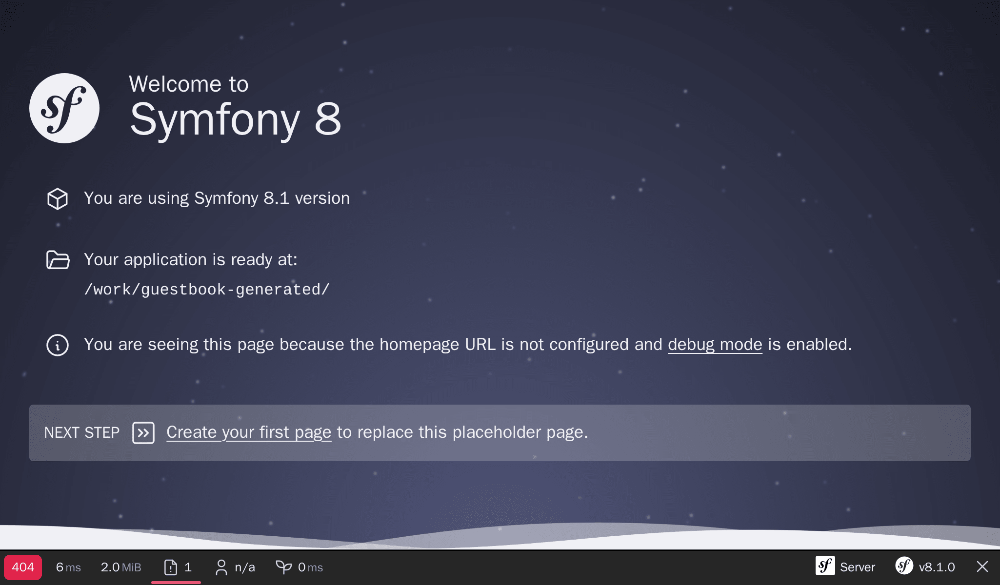

Перехід від нуля до продакшн
====================================================

Мені подобається рухатися швидко. Я хочу, щоб наш маленький проект було реалізовано якомога швидше. По типу, прямо зараз. В продакшн. Оскільки ми ще нічого не розробили, почнемо з розгортання приємної та простої сторінки "Under construction". Вам це сподобається!

Витратьте трохи часу, щоб знайти в інтернеті ідеальне, старомодне й  анімоване зображення з надписом "Under construction". Ось `те`_ яке я збираюся використовувати:

.. image:: images/under-construction.gif
    :align: center

Я ж казав, це буде дуже весело.

Ініціалізація проекту
-----------------------------------------

Створіть новий проект Symfony за допомогою інструменту ``symfony`` CLI, який ми попередньо встановили разом:

.. code-block:: terminal

    $ symfony new guestbook --version=8.1 --php=8.5 --webapp --docker --upsun
    $ cd guestbook

Ця команда є тонкою обгорткою над ``Composer``, яка полегшує створення проектів Symfony. Вона використовує `скелет проекту`_, що включає мінімальний набір залежностей; компоненти Symfony, які необхідні практично для будь-якого проекту: консольний інструмент і абстракція HTTP, які необхідні для створення веб-застосунків.

Оскільки ми створюємо повнофункціональний веб-застосунок, ми додали кілька опцій, які полегшать наше життя:

* ``--webapp``: за замовчуванням створюється закстосунок із найменшою кількістю можливих залежностей. Для більшості веб-проектів рекомендується використовувати пакет ``webapp``. Він містить більшість пакетів, необхідних для "сучасних" веб-застосунків. Пакет ``webapp`` додає безліч пакетів Symfony, включаючи Symfony Messenger і PostgreSQL за допомогою Doctrine.

* ``--docker``: ми будемо використовувати Docker на вашому локальному комп'ютері для управління сервісами, як-от PostgreSQL. Цей параметр умикає Docker, щоб Symfony автоматично додавав сервіси Docker на основі необхідних пакетів (як-от сервіс PostgreSQL під час додавання ORM чи засіб перехоплення пошти під час додавання Symfony Mailer).

* ``--cloud``: якщо ви хочете розгорнути свій проект у Upsun, цей параметр автоматично генерує розумну конфігурацію Upsun. Platformm.sh є кращим і найпростішим способом розгортання тестових, проміжних і продакшн середовищ Symfony у хмарі.

Якщо ви поглянете на репозиторій проекту skeleton на GitHub, то помітите, що він майже порожній. Просто файл ``composer.json``. Але у каталозі ``гостьової книги`` повно файлів. Як це можливо? Відповідь знаходиться у пакеті ``symfony/flex``. Symfony Flex — це плагін Composer, який підключається до процесу встановлення. Коли він виявляє пакет, для якого у нього є *рецепт*, він виконує його.

Основною точкою входу рецепту Symfony є це файл маніфесту, який описує операції, які необхідно виконати для автоматичної реєстрації пакету в застосунку Symfony. Вам не обов'язково читати файл README, щоб встановити пакет у Symfony. Автоматизація є ключовою особливістю Symfony.

Оскільки Git встановлений на нашому комп'ютері, команда ``symfony new`` також створила для нас Git-репозиторій і додала першу фіксацію.

Погляньте на структуру каталогів:

.. code-block:: text
    :class: ignore

    ├── bin/
    ├── composer.json
    ├── composer.lock
    ├── config/
    ├── public/
    ├── src/
    ├── symfony.lock
    ├── var/
    └── vendor/

Каталог ``bin/`` містить основну точку входу CLI: ``console``. Ви будете використовувати її постійно.

Каталог ``config/`` складається з набору всіх необхідних конфігураційних файлів. Один файл на пакет. Ви майже не будете змінювати їх, довіряючи значенням за замовчуванням. Це, майже завжди, правильне рішення.

Каталог ``public/`` є кореневим каталогом веб-застосунку, а сценарій ``index.php`` є основною точкою входу для всіх динамічних HTTP-ресурсів.

Каталог ``src/`` міститиме весь код, який ви напишете; саме там ви будете проводити більшу частину свого часу. За замовчуванням, усі класи в цьому каталозі використовують простір імен PHP ``App``. Це ваш дім. Ваш код. Ваша бізнес-логіка. Symfony це майже не торкається.

Каталог ``var/`` містить кеш, журнали та файли, згенеровані застосунком в процесі роботи. Ви можете його не чіпати. Це єдиний каталог, що має бути доступним для запису в продакшн.

Каталог ``vendor/`` містить всі пакети, що були встановлені за допомогою Composer, включаючи сам Symfony. Це наша секретна зброя, щоб бути більш продуктивними. Не будемо знову винаходити колесо. Краще перекладемо складну роботу на існуючі бібліотеки. Каталогом управляє Composer. Не чіпайте його ніколи.

Це все, що вам потрібно знати на даний момент.

Створення публічних ресурсів
------------------------------------------------------

Все, що знаходиться в каталозі ``public/``, доступно через браузер. Наприклад, якщо ви перемістите ваш анімований GIF-файл (назвіть його ``under-construction.gif``) у новий каталог ``public/images/``, він стане доступним за адресою: ``https://localhost/images/under-construction.gif``.

Завантажте моє GIF-зображення тут:

.. code-block:: terminal

    $ mkdir public/images/
    $ php -r "copy('https://clipartmag.com/images/website-under-construction-image-6.gif', 'public/images/under-construction.gif');"

Запуск локального веб-сервера
-------------------------------------------------------

.. index::
    single: Symfony CLI;server:start

``Symfony`` CLI  поставляється з веб-сервером, який оптимізовано для розробки. Ви не здивуєтеся, якщо я скажу, що він чудово працює із Symfony. Однак ніколи не використовуйте його у продакшн.

З каталогу проекту, запустіть веб-сервер у фоновому режимі (прапорець ``-d``):

.. code-block:: terminal

    $ symfony server:start -d

Сервер запустився на першому доступному порту, починаючи з 8000. Для швидкого переходу на веб-сайт, відкрийте його в веб-браузері за посиланням із CLI:

.. code-block:: terminal
    :class: ignore

    $ symfony open:local

У вашому веб-браузері за замовчуванням має відкритися нова вкладка, де відображається щось подібне до наступного:

.. tip::

    Щоб усунути неполадки, запустіть ``symfony server:log``; Ця команда виводитиме останні записи журналів веб-сервера, PHP та вашого застосунку, в режимі реального часу.

Перейдіть до ``/images/under-construction.gif``. Виглядає так само?

.. index::
    single: Git;add
    single: Git;commit

Задоволені? Зафіксуймо нашу роботу:

.. code-block:: terminal
    :class: ignore

    $ git add public/images
    $ git commit -m'Add the under construction image'

Підготовка до продакшн
------------------------------------------

.. index::
    single: Upsun;Initialization

Як щодо розгортання нашої роботи у продакшн? Я знаю, у нас ще навіть немає відповідної HTML-сторінки, для того щоб вітати наших користувачів. Але мати можливість побачити невелике зображення з надписом "Under construction", на продакшн-сервері, було б значним кроком вперед. Ви знаєте цей девіз: *розгортайте якомога раніше і частіше*.

Ви можете розмістити цей застосунок у будь-якого провайдера, що підтримує PHP... тобто, майже у всіх хостинг-провайдерів. Однак перевірте кілька речей: нам потрібна остання версія PHP і можливість розміщення сервісів, таких як база даних, черга тощо.

Я зробив свій вибір, це буде `Upsun`_. Він забезпечує всім необхідним, і допомагає фінансувати розробку Symfony.

.. index::
    single: Symfony CLI;project:init

Оскільки ми використовували параметр ``--cloud`` під час створення проекту, Upsun вже було ініціалізовано кількома файлами, необхідними для Upsun, а саме ``.platform/services.yaml``, ``. platform/routes.yaml`` і ``.platform.app.yaml``.

Перехід до продакшн
------------------------------------

.. index::
    single: Symfony CLI;cloud:project:create
    single: Symfony CLI;cloud:deploy

Час розгортати?

Створіть новий віддалений проект у Upsun:

.. code-block:: terminal

    $ symfony cloud:project:create --title="Guestbook" --plan=development

Ця команда робить дуже багато:

* При першому запуску цієї команди, виконайте аутентифікацію за допомогою облікового запису Upsun, якщо це ще не зроблено.

* Це розмістить новий проект у Upsun (ви отримуєте 30 днів *безкоштовно* для першого створеного проекту).

Нарешті, розгортаємо:

.. code-block:: terminal

    $ symfony cloud:push

Код розгортається автоматично, кожен раз, коли ви відправляєте зміни до Git-репозиторія. Після виконання команди, проект буде доступний за унікальним доменним іменем, яке можна використовувати для доступу до нього.

.. index::
    single: Symfony CLI;cloud:url

Перевірте, щоб все працювало правильно:

.. code-block:: terminal
    :class: ignore

    $ symfony cloud:url -1

Ви маєте отримати помилку 404, але переглядаючи ``/images/under-construction.gif``, ви побачите результат нашої роботи.

Зверніть увагу, що ви не побачите гарну, стандартну сторінку Symfony в Upsun. Чому? Незабаром ви дізнаєтеся, що Symfony підтримує кілька середовищ, а Upsun автоматично розгортає код у продакшн-середовищі.

.. index::
    single: Symfony CLI;cloud:project:delete

.. tip::

    Якщо ви хочете видалити проект у Upsun, використовуйте команду ``cloud:project:delete``.

.. sidebar:: Йдемо далі

    * Репозиторії для `офіційних рецептів Symfony`_ та `рецептів, що надаються спільнотою`_, де ви можете розмістити власні рецепти;

    * `Локальний веб-сервер Symfony`_;

    * `Документація по Upsun`_.

.. _`те`: http://clipartmag.com/images/website-under-construction-image-6.gif
.. _`скелет проекту`: https://github.com/symfony/skeleton
.. _`Upsun`:     https://platform.sh/marketplace/symfony/?utm_source=symfony-cloud-sign-up&utm_medium=backlink&utm_campaign=Symfony-Cloud-sign-up&utm_content=symfony-book
.. _`офіційних рецептів Symfony`: https://github.com/symfony/recipes
.. _`рецептів, що надаються спільнотою`: https://github.com/symfony/recipes-contrib
.. _`Локальний веб-сервер Symfony`: https://symfony.com/doc/current/setup/symfony_server.html
.. _`Документація по Upsun`: https://docs.platform.sh/guides/symfony.html?utm_source=symfony-cloud-sign-up&utm_medium=backlink&utm_campaign=Symfony-Cloud-sign-up&utm_content=symfony-book
