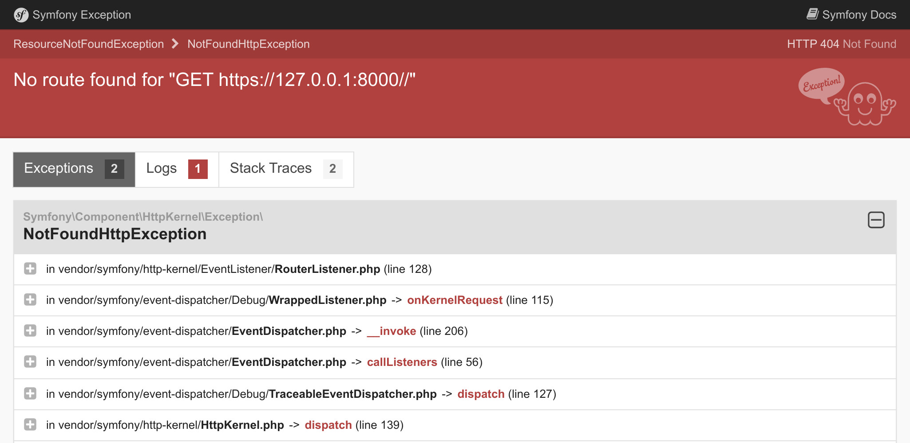

Вирішення проблем
=================================

Налаштування проекту також передбачає наявність правильних інструментів для налагодження. На щастя, багато хороших помічників уже включено в пакет ``webapp``.

Дослідження інструментів налагодження Symfony
--------------------------------------------------------------------------------

.. index::
    single: Components;Profiler
    single: Profiler
    single: Web Profiler
    single: Web Debug Toolbar

Почнемо з того, що Symfony Profiler заощаджує час, коли вам потрібно знайти першопричину проблеми.

Якщо ви поглянете на головну сторінку, ви побачите панель інструментів у нижній частині екрана:

.. figure:: screenshots/wdt.png
    :alt: /
    :align: center
    :figclass: with-browser

Перше, що ви можете помітити, це **404** червоного кольору. Пам'ятайте, що ця сторінка є "заглушкою", оскільки ми ще не визначили головну сторінку. Навіть якщо сторінка за замовчуванням, яка вітає вас, прекрасна, це все-таки сторінка помилки. Отже, правильний код статусу HTTP — 404, а не 200. Завдяки панелі інструментів веб-налагодження ви одразу отримуєте цю інформацію.

Якщо ви натиснете на маленький знак оклику, то побачите "справжнє" повідомлення про виняток, як частину запису у журналі профілювальника Symfony. Якщо ви хочете побачити трасування стеку, натисніть на посилання "Exception" у меню зліва.

Щоразу, коли виникає проблема з вашим кодом, ви побачите сторінку винятку, як показано нижче, яка дає вам все необхідне, щоб зрозуміти проблему і те, звідки вона походить:

Знайдіть трохи часу, щоб ознайомитися з інформацією, що надає профайлер Symfony, натискаючи по різних посиланнях.

.. index::
    single: Symfony CLI;server:log

Журнали також дуже корисні в сеансах налагодження. Symfony має зручну команду для відстеження останніх записів всіх журналів (з веб-сервера, PHP і вашого застосунку):

.. code-block:: terminal
    :class: ignore

    $ symfony server:log

Проведімо маленький експеримент. Відкрийте ``public/index.php`` і зламайте там PHP-код (додайте foobar в середину коду, наприклад). Оновіть сторінку в браузері та спостерігайте за потоком журналу:

.. code-block:: text
    :class: ignore

    Dec 21 10:04:59 |DEBUG| PHP    PHP Parse error:  syntax error, unexpected 'use' (T_USE) in public/index.php on line 5 path="/usr/bin/php7.42" php="7.42.0"
    Dec 21 10:04:59 |ERROR| SERVER GET  (500) / ip="127.0.0.1"

Вихідні дані мають яскраве забарвлення, щоб привернути вашу увагу до помилок.

Розуміння середовищ Symfony
---------------------------------------------

.. index::
    single: Symfony Environments

Оскільки Symfony Profiler корисний лише під час розробки, ми хочемо уникнути його встановлення у продакшн. За замовчуванням Symfony автоматично встановив його лише для середовищ ``dev`` та ``test``.

Symfony підтримує поняття *середовища*. За замовчуванням, є вбудована підтримка трьох: ``dev``, ``prod`` та ``test``, але ви можете додати скільки завгодно. Усі середовища використовують той самий код, але представляють різні *конфігурації*.

Наприклад, усі інструменти налагодження включені в середовищі ``dev``.  У ``prod`` застосунок оптимізований для максимальної продуктивності.

Перехід від одного середовища до іншого можна здійснити, змінивши змінну середовища ``APP_ENV``.

Коли ви розгорнули у Upsun, середовище (зберігається в ``APP_ENV``) було автоматично перемкнене на ``prod``.

Управління конфігураціями середовища
----------------------------------------------------------------------

.. index::
    single: Environment Variables
    single: .env
    single: .env.local

``APP_ENV`` можна встановити, використовуючи "реальні" змінні середовища у вашому терміналі:

.. code-block:: terminal
    :class: ignore

    $ export APP_ENV=dev

Використання реальних змінних середовища є кращим способом  для встановлення таких значень, як ``APP_ENV`` на продакшн-серверах. Але у середовищі для розробки, необхідність встановлення великої кількості змінних середовища може бути занадто громіздким рішенням. Натомість їх можна визначити у файлі ``.env``

Актуальний файл ``.env`` було згенеровано автоматично, під час створення проекту:

.. code-block:: text
    :caption: .env
    :class: ignore

    ###> symfony/framework-bundle ###
    APP_ENV=dev
    APP_SECRET=c2927f273163f7225a358e3a1bbbed8a
    #TRUSTED_PROXIES=127.0.0.1,127.0.0.2
    #TRUSTED_HOSTS='^localhost|example\.com$'
    ###< symfony/framework-bundle ###

.. tip::

    Будь-який пакет може додати до цього файлу більше змінних середовища завдяки рецепту, який використовує Symfony Flex.

Файл ``.env`` зафіксований у репозиторії та описує значення *за замовчуванням* з продакшн. Ви можете перевизначити ці значення, створивши файл ``.env.local``. Цей файл не повинен відстежуватися, тому він ігнорується, що зазначено у файлі ``.gitignore``.

Ніколи не зберігайте в цих файлах таємні чи чутливі значення. Ми побачимо, як керувати конфіденційними даними на іншому кроці.

Налаштування IDE
----------------------------

У середовищі розробки, при виникненні винятку, Symfony відображає сторінку з повідомленням про виняток та трасування його стеку. При відображенні шляху до файлу, він додає посилання, яке відкриває файл на потрібному рядку у вашому улюбленому IDE. Щоб скористатися цією функцією, необхідно налаштувати IDE. Symfony підтримує безліч IDE з коробки; я використовую Visual Studio Code для цього проекту:

.. code-block:: diff
    :caption: patch_file

    --- i/php.ini
    +++ w/php.ini
    @@ -6,3 +6,4 @@ session.gc_probability=0
     session.use_strict_mode=On
     realpath_cache_ttl=3600
     zend.detect_unicode=Off
    +xdebug.file_link_format=vscode://file/%f:%l

Зв'язування файлів не обмежуються лише винятками. Наприклад, контролер на панелі інструментів веб-налагодження, також, стає доступним для натискання після налаштування IDE.

Налагодження у продакшн
--------------------------------------------

.. index::
    single: Upsun;Remote Logs
    single: Upsun;SSH
    single: Symfony CLI;cloud:logs
    single: Symfony CLI;cloud:ssh

Налагодження продакшн-серверів завжди складніше. Наприклад, у вас немає доступу до профілювальника Symfony. Журнали менш детальні. Але перегляд останніх записів, все ж, можливий:

.. code-block:: terminal
    :class: ignore

    $ symfony cloud:logs --tail

Ви навіть можете підключитися до веб-контейнеру через SSH:

.. code-block:: terminal
    :class: ignore

    $ symfony cloud:ssh

Не хвилюйтеся, досить не легко буде щось зламати. Більша частина файлової системи доступна лише для читання. Ви не зможете вносити "гарячі" зміни безпосередньо в продакшн. Але ви дізнаєтеся набагато кращий спосіб, пізніше, у цій книзі.

.. sidebar:: Йдемо далі

    * `Навчальний посібник SymfonyCasts: середовища та конфігураційні файли`_;

    * `Навчальний посібник SymfonyCasts: змінні середовища`_;

    * `Навчальний посібник SymfonyCasts: панель інструментів веб-налагодження і профілювальник`_;

    * `Управління кількома файлами .env`_ у застосунках Symfony.

.. _`Навчальний посібник SymfonyCasts: середовища та конфігураційні файли`: https://symfonycasts.com/screencast/symfony-fundamentals/environment-config-files
.. _`Навчальний посібник SymfonyCasts: змінні середовища`: https://symfonycasts.com/screencast/symfony-fundamentals/environment-variables
.. _`Навчальний посібник SymfonyCasts: панель інструментів веб-налагодження і профілювальник`: https://symfonycasts.com/screencast/symfony/debug-toolbar-profiler
.. _`Управління кількома файлами .env`: https://symfony.com/doc/current/configuration.html#managing-multiple-env-files
