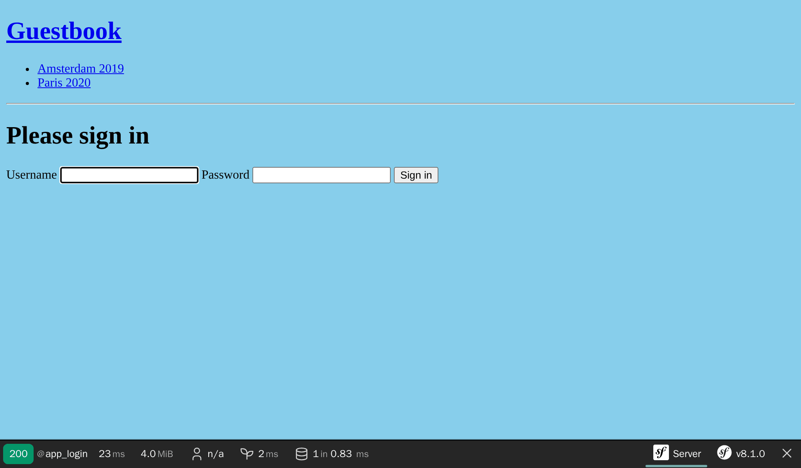

保护管理后台
==================

.. index::
    single: Components;Security
    single: Security

管理后台的界面应该只能让信任的人来访问。可以用 Symfony 的 Security 组件把网站的这个区域保护起来。

定义 User 实体
------------------

虽然参会人员不能在网站上创建他们自己的账号，但我们要为管理员开发一套完备的认证系统。所以我们只会有一个用户，那就是网站管理员。

第一步是定义 ``User`` 实体类。为了避免混淆，我们把它命名为 ``Admin``。

为了把 ``Admin`` 实体整合到 Security 组件的认证系统，该实体需要满足一些条件。比如，它需要一个 ``password`` 属性。

.. index::
    single: Command;make:user

使用量身定做的 ``make:user`` 命令来创建 ``Admin`` 实体，而不是用传统的 ``make:entity`` 命令：

.. code-block:: terminal
    :class: answers(yes||username||yes)

    $ symfony console make:user Admin

回答命令行交互模式下的问题：我们想要用 Doctrine 来存储管理员（选择 ``yes``），使用 ``username`` 属性作为管理员的独一显示名，每个用户需要有密码（选择 ``yes``）。

命令生成的类文件里包含的方法有 ``getRoles()``、``eraseCredentials()`` 以及其它一些，这些方法都会被 Symfony 的认证系统调用。

如果你要 ``Admin`` 类里增加更多属性，请用 ``make:entity``。

这个命令除了生成 ``Admin`` 实体，它也更新了安全配置文件，将这个实体类接入到认证系统：

.. code-block:: diff
    :class: ignore
    :emphasize-lines: 11,12,20

    --- i/config/packages/security.yaml
    +++ w/config/packages/security.yaml
    @@ -5,14 +5,18 @@ security:
             Symfony\Component\Security\Core\User\PasswordAuthenticatedUserInterface: 'auto'
         # https://symfony.com/doc/current/security.html#loading-the-user-the-user-provider
         providers:
    -        users_in_memory: { memory: null }
    +        # used to reload user from session & other features (e.g. switch_user)
    +        app_user_provider:
    +            entity:
    +                class: App\Entity\Admin
    +                property: username
         firewalls:
             dev:
                 pattern: ^/(_(profiler|wdt)|css|images|js)/
                 security: false
             main:
                 lazy: true
    -            provider: users_in_memory
    +            provider: app_user_provider

                 # activate different ways to authenticate
                 # https://symfony.com/doc/current/security.html#the-firewall

我们让 Symfony 来选择对密码进行哈希的最优算法（这个选择会随时间改变）。

是时候生成一个数据库结构迁移文件，并且更新数据库结构了：

.. code-block:: terminal

    $ symfony console make:migration
    $ symfony console doctrine:migrations:migrate -n

为管理员生成一个密码
------------------------------

.. index::
    single: Security;Password Hashes

我们不会去开发一个专用的系统用于管理员的账号创建。再说一遍，我们这里只会有一个管理员。它的账号名就叫 ``admin``，并且我们需要生成密码哈希。

.. index::
    single: Command;security:hash-password

选一个你想要的密码，然后运行以下的命令来生成密码哈希：

.. code-block:: terminal
    :class: answers(admin)

    $ symfony console security:hash-password

.. code-block:: text
    :class: ignore
    :emphasize-lines: 11

    Symfony Password Hash Utility
    =============================

     Type in your password to be hashed:
     >

     ------------------ ---------------------------------------------------------------------------------------------------
      Key                Value
     ------------------ ---------------------------------------------------------------------------------------------------
      Hasher used        Symfony\Component\PasswordHasher\Hasher\MigratingPasswordHasher
      Password hash      $argon2id$v=19$m=65536,t=4,p=1$BQG+jovPcunctc30xG5PxQ$TiGbx451NKdo+g9vLtfkMy4KjASKSOcnNxjij4gTX1s
     ------------------ ---------------------------------------------------------------------------------------------------

     ! [NOTE] Self-salting hasher used: the hasher generated its own built-in salt.

     [OK] Password hashing succeeded

创建一个管理员
---------------------

.. index::
    single: Command;dbal:run-sql

用 SQL 语句插入一个管理员用户：

.. code-block:: terminal

    $ symfony console dbal:run-sql "INSERT INTO admin (id, username, roles, password) \
      VALUES (nextval('admin_id_seq'), 'admin', '[\"ROLE_ADMIN\"]', \
      '\$argon2id\$v=19\$m=65536,t=4,p=1\$BQG+jovPcunctc30xG5PxQ\$TiGbx451NKdo+g9vLtfkMy4KjASKSOcnNxjij4gTX1s')"

请注意密码那一列里，我们对 ``$`` 符号进行了转义；对每个 ``$`` 都进行转义！

配置认证系统
------------------

.. index::
    single: Command;make:security:form-login
    single: Security;Authenticator
    single: Security;Form Login
    single: Login
    single: Logout

现在我们既然有了管理员用户，就可以去保护起后台了。Symfony 支持几种认证策略。让我们用经典而且流行的 *表单认证系统*。

运行 ``make:security:form-login`` 命令来更新安全方面的配置，生成一个登录页模板，并且创建一个 *认证器*：

.. code-block:: terminal
    :class: answers(SecurityController||yes)

    $ symfony console make:security:form-login

将控制器类命名为 ``SecurityController``，并且生成一个 ``/logout`` 路径（选择 ``yes``）。

这个命令会更新安全配置，将生成的类接入认证系统：

.. code-block:: diff
    :class: ignore
    :emphasize-lines: 9

    --- i/config/packages/security.yaml
    +++ w/config/packages/security.yaml
    @@ -15,7 +15,15 @@ security:
                 security: false
             main:
                 lazy: true
    -            provider: users_in_memory
    +            provider: app_user_provider
    +            form_login:
    +                login_path: app_login
    +                check_path: app_login
    +                enable_csrf: true
    +            logout:
    +                path: app_logout
    +                # where to redirect after logout
    +                # target: app_any_route

                 # activate different ways to authenticate
                 # https://symfony.com/doc/current/security.html#the-firewall

.. index::
    single: Command;debug:router
    single: Routing;Debug
    single: Debug;Routing

.. tip::

    我是如何记住 EasyAdmin 路由的名字叫 ``admin`` 的（正如在 ``App\Controller\Admin\DashboardController`` 里所配置的）？其实我并不记得。你可以看一下控制器文件，但你可以运行下面这个命令，它会展示路由名和路径之间的关联：

    .. code-block:: terminal

        $ symfony console debug:router

增加授权访问控制的规则
---------------------------------

.. index::
    single: Security;Authorization
    single: Security;Access Control

一个安全系统由两部分组成：*认证* 和 *授权*。当创建一个管理员时，我们给了它 ``ROLE_ADMIN`` 的角色。让我们来限定 ``/admin`` 路径下的区域只能允许拥有该角色的用户才能访问，我们是通过在 ``access_control`` 下增加一条规则来实现的：

.. code-block:: diff
    :emphasize-lines: 8

    --- i/config/packages/security.yaml
    +++ w/config/packages/security.yaml
    @@ -34,7 +34,7 @@ security:
         # Easy way to control access for large sections of your site
         # Note: Only the *first* access control that matches will be used
         access_control:
    -        # - { path: ^/admin, roles: ROLE_ADMIN }
    +        - { path: ^/admin, roles: ROLE_ADMIN }
             # - { path: ^/profile, roles: ROLE_USER }

     when@test:

``access_control`` 下的规则通过正则表达式来限制访问。当用户尝试访问的 URL 以 ``/admin`` 开头时，安全系统会检查这个登录的用户是否有 ``ROLE_ADMIN`` 这个角色。

通过登录表单认证
------------------------

现在如果你试着进入后台，你会被重定向到登录页面，并被要求录入账户名和密码：

账户名是 ``admin``，密码就是你之前选择的明文密码。如果你不做修改地复制了我的 SQL 命令，那么密码就是 ``admin``。

注意，EasyAdmin 自动识别出了 Symfony 的认证系统：

.. figure:: screenshots/easy-admin-secured.png
    :alt: /admin/
    :align: center
    :figclass: with-browser

试着点击“退出”链接。完成了！后台被充分地保护起来了。

.. index::
    single: Command;make:registration-form

.. note::

    如果想要一个功能完备的表单认证系统，去看一下 ``make:registration-form`` 命令。

.. sidebar:: 深入学习

    * `Symfony 安全方面的文档`_；

    * `SymfonyCasts 安全方面的教程`_；

    * 在 Symfony 应用中 `如何构建一个登录表单`_；

    * `Symfony 安全系统速查表`_。

.. _`Symfony 安全方面的文档`: https://symfony.com/doc/current/security.html
.. _`SymfonyCasts 安全方面的教程`: https://symfonycasts.com/screencast/symfony-security
.. _`如何构建一个登录表单`: https://symfony.com/doc/current/security/form_login_setup.html
.. _`Symfony 安全系统速查表`: https://github.com/andreia/symfony-cheat-sheets/blob/master/Symfony4/security_en_44.pdf
