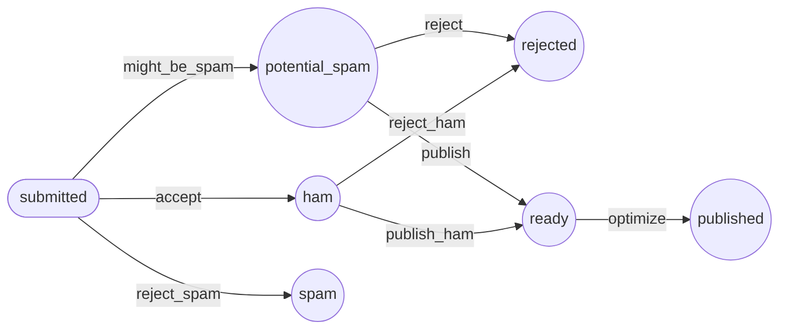

用 Workflow 进行决策
=========================

.. index::
    single: Components;Workflow
    single: Workflow

让模型拥有状态是很常见的。目前评论的状态只由垃圾信息检查器来决定。如果我们要加入更多的决策因素，那该怎么做？

在垃圾信息检查器判别之后，我们可能想要让网站管理员来管理所有评论。这个流程看上去可能是这样的：

* 当用户提交评论时，我们把它的初始状态设为 ``submitted``；

* 然后垃圾信息检查器来分析这条评论，把它的状态转为 ``potential_spam``、``ham`` 或 ``rejected`` 中的一个；

* 如果评论不是 ``rejected`` 状态，那需要等待管理员根据它的内容质量来决定，是把它切换到 ``published`` 还是 ``rejected``。

实现这个逻辑并不复杂，但你可以想到，不断增加类似的规则会大幅提高复杂度。我们可以使用 Symfony 的 Workflow 组件，而不是自己实现它。

.. code-block:: terminal

    $ symfony composer req workflow

描述工作流（Workflow）
-----------------------------

可以在 ``config/packages/workflow.yaml`` 文件中描述评论的处理流程：

.. code-block:: yaml
    :caption: config/packages/workflow.yaml
    :emphasize-lines: 3,4,9,11

    framework:
        workflows:
            comment:
                type: state_machine
                audit_trail:
                    enabled: "%kernel.debug%"
                marking_store:
                    type: 'method'
                    property: 'state'
                supports:
                    - App\Entity\Comment
                initial_marking: submitted
                places:
                    - submitted
                    - ham
                    - potential_spam
                    - spam
                    - rejected
                    - published
                transitions:
                    accept:
                        from: submitted
                        to:   ham
                    might_be_spam:
                        from: submitted
                        to:   potential_spam
                    reject_spam:
                        from: submitted
                        to:   spam
                    publish:
                        from: potential_spam
                        to:   published
                    reject:
                        from: potential_spam
                        to:   rejected
                    publish_ham:
                        from: ham
                        to:   published
                    reject_ham:
                        from: ham
                        to:   rejected

.. index::
    single: Command;workflow:dump

为了验证这个流程，可以生成一个示意图：

.. code-block:: terminal

    $ symfony console workflow:dump comment --dump-format=mermaid

.. note::

    ``dot`` 命令是 `Graphviz`_ 工具的一部分。

使用工作流
---------------

在消息处理器里用工作流来代替当前逻辑：

.. code-block:: diff
    :caption: patch_file

    --- i/src/MessageHandler/CommentMessageHandler.php
    +++ w/src/MessageHandler/CommentMessageHandler.php
    @@ -6,7 +6,10 @@ use App\Message\CommentMessage;
     use App\Repository\CommentRepository;
     use App\SpamChecker;
     use Doctrine\ORM\EntityManagerInterface;
    +use Psr\Log\LoggerInterface;
     use Symfony\Component\Messenger\Attribute\AsMessageHandler;
    +use Symfony\Component\Messenger\MessageBusInterface;
    +use Symfony\Component\Workflow\WorkflowInterface;

     #[AsMessageHandler]
     class CommentMessageHandler
    @@ -15,6 +18,9 @@ class CommentMessageHandler
             private EntityManagerInterface $entityManager,
             private SpamChecker $spamChecker,
             private CommentRepository $commentRepository,
    +        private MessageBusInterface $bus,
    +        private WorkflowInterface $commentStateMachine,
    +        private ?LoggerInterface $logger = null,
         ) {
         }

    @@ -25,12 +31,18 @@ class CommentMessageHandler
                 return;
             }

    -        if (2 === $this->spamChecker->getSpamScore($comment, $message->getContext())) {
    -            $comment->setState('spam');
    -        } else {
    -            $comment->setState('published');
    +        if ($this->commentStateMachine->can($comment, 'accept')) {
    +            $score = $this->spamChecker->getSpamScore($comment, $message->getContext());
    +            $transition = match ($score) {
    +                2 => 'reject_spam',
    +                1 => 'might_be_spam',
    +                default => 'accept',
    +            };
    +            $this->commentStateMachine->apply($comment, $transition);
    +            $this->entityManager->flush();
    +            $this->bus->dispatch($message);
    +        } elseif ($this->logger) {
    +            $this->logger->debug('Dropping comment message', ['comment' => $comment->getId(), 'state' => $comment->getState()]);
             }
    -
    -        $this->entityManager->flush();
         }
     }

新的逻辑是这样：

* 如果消息里的评论可以进行名为 ``accept`` 的状态迁移，就检查是否为垃圾信息；

* 根据结果来选择要应用的状态迁移；

* 调用 ``apply()`` 方法来更新评论，它会调用评论的 ``setState()`` 方法。

* 调用 ``flush()`` 方法来把更新保存到数据库；

* 重新派发信息来让工作流再次迁移状态。

因为我们还没有实现管理后台的验证，下次消费信息时，日志中会记录 “Dropping comment message”。

在下一章里我们会实现一个自动验证：

.. code-block:: diff
    :caption: patch_file

    --- i/src/MessageHandler/CommentMessageHandler.php
    +++ w/src/MessageHandler/CommentMessageHandler.php
    @@ -41,6 +41,9 @@ class CommentMessageHandler
                 $this->commentStateMachine->apply($comment, $transition);
                 $this->entityManager->flush();
                 $this->bus->dispatch($message);
    +        } elseif ($this->commentStateMachine->can($comment, 'publish') || $this->commentStateMachine->can($comment, 'publish_ham')) {
    +            $this->commentStateMachine->apply($comment, $this->commentStateMachine->can($comment, 'publish') ? 'publish' : 'publish_ham');
    +            $this->entityManager->flush();
             } elseif ($this->logger) {
                 $this->logger->debug('Dropping comment message', ['comment' => $comment->getId(), 'state' => $comment->getState()]);
             }

执行 ``symfony server:log``，然后在前端页面添加一个评论，看一下输出的一个个状态迁移。

在依赖注入容器中找到服务
------------------------------------

.. index::
    single: Command;debug:container
    single: Container;Debug
    single: Debug;Container

当使用依赖注入时，我们通过接口类型提示或者有时使用具体的实现类名，在依赖注入容器中找到对应的服务。但当某个接口有多个实现类时，Symfony 无法猜出你需要的是哪个实现类。我们要明确指出需要哪个服务类。

在前面一节，我们刚刚遇到的 ``WorkflowInterface`` 注入，就是这样的一个例子。

当我们在构造函数中注入 ``WorkflowInterface`` 接口的任何实例时，Symfony 如何猜测要用哪一个工作流的实现呢？Symfony 使用基于参数名的约定：``$commentStateMachine`` 指向  配置里的 ``comment`` 工作流（它的类型是 ``state_machine``）。试着换成其它的参数名都会失败。

如果你不记得这个约定了，使用 ``debug:container`` 命令。查找所有包含了 “workflow” 关键词的服务：

.. code-block:: terminal
    :emphasize-lines: 12
    :class: ignore

    $ symfony console debug:container workflow

     Select one of the following services to display its information:
      [0] console.command.workflow_dump
      [1] workflow.abstract
      [2] workflow.marking_store.method
      [3] workflow.registry
      [4] workflow.security.expression_language
      [5] workflow.twig_extension
      [6] monolog.logger.workflow
      [7] Symfony\Component\Workflow\Registry
      [8] Symfony\Component\Workflow\WorkflowInterface $commentStateMachine
      [9] Psr\Log\LoggerInterface $workflowLogger
     >

注意选项 ``8``，``Symfony\Component\Workflow\WorkflowInterface $commentStateMachine``，它告诉你使用 ``$commentStateMachine`` 作为参数名有着特殊意义。

.. note::

    正如在之前有一章里看到的那样，我们也可以用 ``debug:autowiring`` 命令：

    .. code-block:: terminal

        $ symfony console debug:autowiring workflow

.. sidebar:: 深入学习

    * `工作流和状态机 <https://symfony.com/doc/current/workflow/workflow-and-state-machine.html>`_ 以及如何在它们中选择；

    * `Symfony 工作流文档 <https://symfony.com/doc/current/workflow.html>`_。

.. _`Graphviz`: https://www.graphviz.org/
