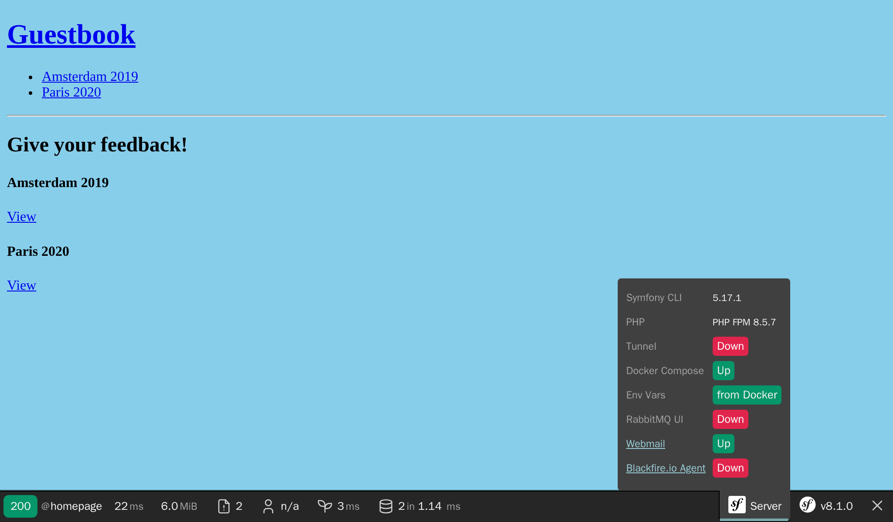

向管理员发送邮件
========================

.. index::
    single: Components;Mailer
    single: Mailer
    single: Emails

为了保证高质量的反馈，管理员必须管理好所有的评论。当一条评论处于 ``ham`` 或 ``potential_spam`` 的状态时，一封带有两个链接的 *邮件* 会发给管理员：一个链接用来接受评论，另一个用来拒绝评论。

首先，安装 Symfony 的 Mailer 组件：

.. code-block:: terminal

    $ symfony composer req mailer

为管理员设置邮箱地址
------------------------------

用一个服务容器参数来存储管理员邮箱。出于演示的目的，我们也允许在环境变量里设置它（在“真实场景”中这并不是必需的）。为了便于在需要管理员邮箱的服务中注入这个参数，我们在容器配置的 ``bind`` 下设置一个值：

.. code-block:: diff
    :caption: patch_file

    --- a/config/services.yaml
    +++ b/config/services.yaml
    @@ -4,6 +4,7 @@
     # Put parameters here that don't need to change on each machine where the app is deployed
     # https://symfony.com/doc/current/best_practices/configuration.html#application-related-configuration
     parameters:
    +    default_admin_email: admin@example.com

     services:
         # default configuration for services in *this* file
    @@ -13,6 +14,7 @@ services:
             bind:
                 $photoDir: "%kernel.project_dir%/public/uploads/photos"
                 $akismetKey: "%env(AKISMET_KEY)%"
    +            $adminEmail: "%env(string:default:default_admin_email:ADMIN_EMAIL)%"

         # makes classes in src/ available to be used as services
         # this creates a service per class whose id is the fully-qualified class name

我们可以先“处理”环境变量后再使用它。这里我们使用 ``default`` 这个处理器，这样的话，如果环境变量 ``ADMIN_EMAIL`` 不存在，就回退到 ``default_admin_email`` 参数的值。

发送一封通知邮件
------------------------

你可以在几个 ``Email`` 类的抽象里选择一个来发送邮件：从最低层的 ``Message`` 类到最高层的 ``NotificationEmail`` 类。很可能你用的最多的是 ``Email`` 类，但 ``NotificationEmail`` 类是发送内部邮件的最佳选择。

在消息处理器中，我们来替换掉自动验证的逻辑：

.. code-block:: diff
    :caption: patch_file

    --- a/src/MessageHandler/CommentMessageHandler.php
    +++ b/src/MessageHandler/CommentMessageHandler.php
    @@ -7,6 +7,8 @@ use App\Repository\CommentRepository;
     use App\SpamChecker;
     use Doctrine\ORM\EntityManagerInterface;
     use Psr\Log\LoggerInterface;
    +use Symfony\Bridge\Twig\Mime\NotificationEmail;
    +use Symfony\Component\Mailer\MailerInterface;
     use Symfony\Component\Messenger\Handler\MessageHandlerInterface;
     use Symfony\Component\Messenger\MessageBusInterface;
     use Symfony\Component\Workflow\WorkflowInterface;
    @@ -18,15 +20,19 @@ class CommentMessageHandler implements MessageHandlerInterface
         private $commentRepository;
         private $bus;
         private $workflow;
    +    private $mailer;
    +    private $adminEmail;
         private $logger;

    -    public function __construct(EntityManagerInterface $entityManager, SpamChecker $spamChecker, CommentRepository $commentRepository, MessageBusInterface $bus, WorkflowInterface $commentStateMachine, LoggerInterface $logger = null)
    +    public function __construct(EntityManagerInterface $entityManager, SpamChecker $spamChecker, CommentRepository $commentRepository, MessageBusInterface $bus, WorkflowInterface $commentStateMachine, MailerInterface $mailer, string $adminEmail, LoggerInterface $logger = null)
         {
             $this->entityManager = $entityManager;
             $this->spamChecker = $spamChecker;
             $this->commentRepository = $commentRepository;
             $this->bus = $bus;
             $this->workflow = $commentStateMachine;
    +        $this->mailer = $mailer;
    +        $this->adminEmail = $adminEmail;
             $this->logger = $logger;
         }

    @@ -51,8 +57,13 @@ class CommentMessageHandler implements MessageHandlerInterface

                 $this->bus->dispatch($message);
             } elseif ($this->workflow->can($comment, 'publish') || $this->workflow->can($comment, 'publish_ham')) {
    -            $this->workflow->apply($comment, $this->workflow->can($comment, 'publish') ? 'publish' : 'publish_ham');
    -            $this->entityManager->flush();
    +            $this->mailer->send((new NotificationEmail())
    +                ->subject('New comment posted')
    +                ->htmlTemplate('emails/comment_notification.html.twig')
    +                ->from($this->adminEmail)
    +                ->to($this->adminEmail)
    +                ->context(['comment' => $comment])
    +            );
             } elseif ($this->logger) {
                 $this->logger->debug('Dropping comment message', ['comment' => $comment->getId(), 'state' => $comment->getState()]);
             }

``MailerInterface`` 接口是主入口，可以用它的 ``send()`` 方法来发送邮件。

要发送邮件，我们需要一个发送者（用在 ``From`` 或 ``Sender`` 头里）。我们来对它进行全局定义，而非在单个 Email 实例里设置它。

.. code-block:: diff
    :caption: patch_file

    --- a/config/packages/mailer.yaml
    +++ b/config/packages/mailer.yaml
    @@ -1,3 +1,5 @@
     framework:
         mailer:
             dsn: '%env(MAILER_DSN)%'
    +        envelope:
    +            sender: "%env(string:default:default_admin_email:ADMIN_EMAIL)%"

扩展通知邮件的模板
---------------------------

.. index::
    single: Twig;extends
    single: Twig;block
    single: Twig;url

通知邮件模板继承自 Symfony 自带的默认通知邮件模板：

.. code-block:: html+twig
    :caption: templates/emails/comment_notification.html.twig

    

    
        Author: {{ comment.author }} 
        Email: {{ comment.email }} 
        State: {{ comment.state }} 

        

            {{ comment.text }}
        

    

    
        <spacer size="16"></spacer>
        <button href="{{ url('review_comment', { id: comment.id }) }}">Accept</button>
        <button href="{{ url('review_comment', { id: comment.id, reject: true }) }}">Reject</button>
    

这个模板通过覆盖一些块来定制邮件内容，也加入了一些链接让管理员可以接受或拒绝一条评论。任何不合规的路由参数都会以查询字符串的形式加在链接中（比如拒绝评论的URL看起来像这样：``/admin/comment/review/42?reject=true``）。

默认的 ``NotificationEmail`` 模板使用 `Inky <https://get.foundation/emails/docs/inky.html>`_ 而非 HTML 来对邮件内容排版。开发兼容所有流行邮件客户端的响应式邮件时，它会很有帮助。

为了最大程度兼容邮件阅读器，通知邮件模板的基础布局默认会使用行内样式（由 CSS inliner 这个包来实现）。

这两个功能都来自可选的 Twig 扩展，我们会安装它：

.. code-block:: terminal

    $ symfony composer req "twig/cssinliner-extra:^3" "twig/inky-extra:^3"

在 Symfony 命令中生成绝对路径
---------------------------------------

.. index::
    single: Twig;Link
    single: Link

在邮件中，要用 ``url()`` 而非 ``path()`` 来生成路径，因为你需要绝对路径（即包含了协议和域名的路径）。

消息处理器在控制台上下文中发出邮件。在 web 上下文中，我们知道当前页面的协议和域名，所以生成绝对路径更加容易。但在控制台上下文中却不是这样。

显式定义要使用的域名和协议：

.. code-block:: diff
    :caption: patch_file

    --- a/config/services.yaml
    +++ b/config/services.yaml
    @@ -5,6 +5,11 @@
     # https://symfony.com/doc/current/best_practices/configuration.html#application-related-configuration
     parameters:
         default_admin_email: admin@example.com
    +    default_domain: '127.0.0.1'
    +    default_scheme: 'http'
    +
    +    router.request_context.host: '%env(default:default_domain:SYMFONY_DEFAULT_ROUTE_HOST)%'
    +    router.request_context.scheme: '%env(default:default_scheme:SYMFONY_DEFAULT_ROUTE_SCHEME)%'

     services:
         # default configuration for services in *this* file

当使用 ``symfony`` 命令时，``SYMFONY_DEFAULT_ROUTE_HOST`` 和 ``SYMFONY_DEFAULT_ROUTE_PORT`` 这两个环境变量会在本地自动设置；在 SymfonyCloud 上，它们的值根据配置项来自动设置。

把路由接入控制器
------------------------

``review_comment`` 路由还不存在，我们创建一个用于管理后台的控制器来处理它：

.. code-block:: php
    :caption: src/Controller/AdminController.php

    namespace App\Controller;

    use App\Entity\Comment;
    use App\Message\CommentMessage;
    use Doctrine\ORM\EntityManagerInterface;
    use Symfony\Bundle\FrameworkBundle\Controller\AbstractController;
    use Symfony\Component\HttpFoundation\Request;
    use Symfony\Component\HttpFoundation\Response;
    use Symfony\Component\Messenger\MessageBusInterface;
    use Symfony\Component\Routing\Annotation\Route;
    use Symfony\Component\Workflow\Registry;
    use Twig\Environment;

    class AdminController extends AbstractController
    {
        private $twig;
        private $entityManager;
        private $bus;

        public function __construct(Environment $twig, EntityManagerInterface $entityManager, MessageBusInterface $bus)
        {
            $this->twig = $twig;
            $this->entityManager = $entityManager;
            $this->bus = $bus;
        }

        #[Route('/admin/comment/review/{id}', name: 'review_comment')]
        public function reviewComment(Request $request, Comment $comment, Registry $registry): Response
        {
            $accepted = !$request->query->get('reject');

            $machine = $registry->get($comment);
            if ($machine->can($comment, 'publish')) {
                $transition = $accepted ? 'publish' : 'reject';
            } elseif ($machine->can($comment, 'publish_ham')) {
                $transition = $accepted ? 'publish_ham' : 'reject_ham';
            } else {
                return new Response('Comment already reviewed or not in the right state.');
            }

            $machine->apply($comment, $transition);
            $this->entityManager->flush();

            if ($accepted) {
                $this->bus->dispatch(new CommentMessage($comment->getId()));
            }

            return $this->render('admin/review.html.twig', [
                'transition' => $transition,
                'comment' => $comment,
            ]);
        }
    }

审核评论的 URL 以 ``/admin/`` 开头，这样之前定义的防火墙可以将它保护起来。管理员需要认证后才能访问这个页面。

我们使用了 ``render()`` 方法，而不是返回一个 ``Response`` 实例。``render()`` 方法是 ``AbstractController`` 控制器基类提供的一个快捷方法。

.. index::
    single: Twig;extends
    single: Twig;block

当审核完成后，为着管理员的辛勤工作，用一个简洁的模板向他们表达感谢：

.. code-block:: html+twig
    :caption: templates/admin/review.html.twig

    

    
        <h2>Comment reviewed, thank you!</h2>

        
Applied transition: <strong>{{ transition }}</strong>

        
New state: <strong>{{ comment.state }}</strong>

    

使用邮件捕获器
---------------------

.. index::
    single: Docker;Mail Catcher

我们用邮件捕获器，而不是用一个“真正的” SMTP 服务器或第三方发送服务商来发邮件。邮件捕获器提供一个 SMTP 服务器，但它并不发送邮件，而是让邮件出现在 web 界面：

.. code-block:: diff

    --- a/docker-compose.yaml
    +++ b/docker-compose.yaml
    @@ -8,3 +8,7 @@ services:
                 POSTGRES_PASSWORD: main
                 POSTGRES_DB: main
             ports: [5432]
    +
    +    mailer:
    +        image: schickling/mailcatcher
    +        ports: [1025, 1080]

关闭并再次启动容器来加入邮件捕获器：

.. code-block:: terminal

    $ docker-compose stop
    $ docker-compose up -d

你也必须终止消息消费者，因为它还不知道邮件捕捉器的存在：

.. code-block:: terminal

    $ symfony console messenger:stop-workers

并且重新启动它。现在 ``MAILER_DSN`` 会被自动暴露出来：

.. code-block:: terminal
    :class: ignore

    $ symfony run -d --watch=config,src,templates,vendor symfony console messenger:consume async

.. code-block:: terminal
    :class: hide

    $ sleep 10

访问网页版邮箱
---------------------

.. index::
    single: Symfony CLI;open:local:webmail

你能在终端里打开网页版邮箱：

.. code-block:: terminal
    :class: ignore

    $ symfony open:local:webmail

或者从 web 调试工具栏中打开：

提交一条评论，然后你应该会在网页版邮箱界面里收到一封邮件：

.. figure:: screenshots/webmail.png
    :alt: /
    :align: center
    :figclass: with-browser

点开界面里的邮件标题，根据你的判断来接受或拒绝这条评论：

.. figure:: screenshots/webmail-rejected.png
    :alt: /
    :align: center
    :figclass: with-browser

如果这没有按预期工作，用 ``server:log`` 来查看日志。

管理长时间运行的脚本
------------------------------

长时间运行的脚本有一些你需要知晓的行为特性。在 HTTP 环境下使用的 PHP 模式里，每个请求都会从一个干净的状态开始，但消息消费者与此不同，它是在后台持续地运行。每次处理消息都会是从当前状态继续，包括内存缓存的状态。为了避免 Doctrine 出现问题，在每次处理完消息后，Doctrine 的实体管理器都需要被清理。你需要去检查下看你自己的服务是否需要这样做。

异步发送邮件
------------------

在消息处理器中的邮件可能会要一点时间才能发出去。它甚至可能会抛出异常。如果在处理消息过程中有异常抛出，还会再次尝试发送。但最好只是重试发送邮件，而不是重试消费掉那个评论的消息。

我们已经知道如何做了：在 bus 中发送邮件的消息。

一个实现了 ``MailerInterface`` 接口的实例完成了实际的工作：当定义了一个 bus 时，它会分发这个邮件消息，而不是直接发送邮件。你的代码不需要改动。

由于现在我们还没配置用来发送邮件的队列，所以 bus 会同步发送邮件。我们再来用 RabbitMQ：

.. code-block:: diff
    :caption: patch_file

    --- a/config/packages/messenger.yaml
    +++ b/config/packages/messenger.yaml
    @@ -20,3 +20,4 @@ framework:
             routing:
                 # Route your messages to the transports
                 App\Message\CommentMessage: async
    +            Symfony\Component\Mailer\Messenger\SendEmailMessage: async

即便我们对评论消息和邮件消息使用了同样的传输（RabbitMQ），但这并不是必须的。比如你可以用不同的传输来管理不同优先级的消息。使用不同的传输可以让你使用不同的服务器来处理不同的消息。它很灵活，控制权在你手里。

对邮件进行测试
---------------------

有很多方式来测试邮件。

如果你为每个邮件写了一个类（继承自 ``Email`` 或 ``TemplatedEmail`` 类），你可以用单元测试。

但你最常写的测试还是功能测试。它们可以用来检查某些动作是否触发了邮件；如果邮件内容是动态生成的话，也可以用来测试这些内容。

Symfony 自带一些断言，让这样的测试变得很容易，这里有一个测试的例子来演示一些可能性：

.. code-block:: php
    :class: ignore

    public function testMailerAssertions()
    {
        $client = static::createClient();
        $client->request('GET', '/');

        $this->assertEmailCount(1);
        $event = $this->getMailerEvent(0);
        $this->assertEmailIsQueued($event);

        $email = $this->getMailerMessage(0);
        $this->assertEmailHeaderSame($email, 'To', 'fabien@example.com');
        $this->assertEmailTextBodyContains($email, 'Bar');
        $this->assertEmailAttachmentCount($email, 1);
    }

不管邮件是同步还是异步发送，都能正常使用这些断言。

在 SymfonyCloud 上发送邮件
--------------------------------

.. index::
    single: SymfonyCloud;Emails
    single: SymfonyCloud;Mailer
    single: SymfonyCloud;SMTP
    single: Emails

SymfonyCloud 上没有特别的配置要做。所有的账户自带一个 SendGrid 账户，它会自动用来发送邮件。

你仍然需要更新 SymfonyCloud 配置，来包含Inky所需的 ``xsl`` PHP 扩展：

.. code-block:: diff
    :caption: patch_file

    --- a/.symfony.cloud.yaml
    +++ b/.symfony.cloud.yaml
    @@ -4,6 +4,7 @@ type: php:8.0

     runtime:
         extensions:
    +        - xsl
             - pdo_pgsql
             - apcu
             - mbstring

.. index::
    single: Symfony CLI;env:setting:set

.. note::

    保险起见，默认情况下邮件 *仅仅* 在 ``master`` 分支上发送。如果你知道你所做的意味着什么，你可以启动 SMTP 服务：

    .. code-block:: terminal

        $ symfony env:setting:set email on

.. sidebar:: 深入学习

    * `SymfonyCasts 的 Mailer 教程 <https://symfonycasts.com/screencast/mailer>`_；

    * `Inky 模板语言文档 <https://get.foundation/emails/docs/inky.html>`_；

    * `环境变量处理器 <https://symfony.com/doc/current/configuration/env_var_processors.html>`_；

    * `Symfony 框架的 Mailer 文档 <https://symfony.com/doc/current/mailer.html>`_；

    * `SymfonyCloud 关于邮件的文档 <https://symfony.com/doc/current/cloud/services/emails.html>`_。
