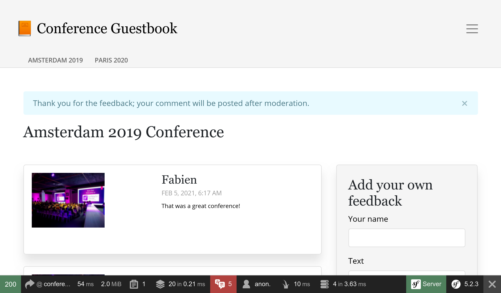

通过各种途径发布通知
==============================

留言本应用程序收集了关于会议的反馈。但在给予用户反馈方面，我们做得还不够好。

因为评论需要经过后台审核，用户很可能会不理解它们为什么没有立刻发布。用户甚至会认为出了技术故障而重新提交评论。在提交评论后给予用户反馈，这样就好很多了。

同理，当评论发布时，我们很可能也应该告知用户。我们向他们要了邮箱，所以最好可以利用这个信息。

通知用户的方式有很多。邮件可能是你想到的第一个媒介，但 web 应用内的通知也是一个。甚至我们可以考虑发送手机短信，以及在 Slack 或 Telegram 上发消息。我们有很多选项。

.. index::
    single: Components;Notifier
    single: Notifier

Symfony 的 Notifier 组件实现了很多通知策略。

在浏览器中发送 web 应用的通知
-----------------------------------------

.. index::
    single: Flash Messages

作为第一步，当用户提交评论后，我们在浏览器里直接通知他们评论会经过审核：

.. code-block:: diff
    :caption: patch_file

    --- i/src/Controller/ConferenceController.php
    +++ w/src/Controller/ConferenceController.php
    @@ -16,6 +16,8 @@ use Symfony\Component\HttpFoundation\Response;
     use Symfony\Component\HttpKernel\Attribute\MapQueryParameter;
     use Symfony\Component\HttpKernel\Attribute\RateLimit;
     use Symfony\Component\Messenger\MessageBusInterface;
    +use Symfony\Component\Notifier\Notification\Notification;
    +use Symfony\Component\Notifier\NotifierInterface;
     use Symfony\Component\Routing\Attribute\Route;

     final class ConferenceController extends AbstractController
    @@ -45,7 +47,8 @@ final class ConferenceController extends AbstractController
             Request $request,
             Conference $conference,
             CommentRepository $commentRepository,
    +        NotifierInterface $notifier,
             #[Autowire('%photo_dir%')] string $photoDir,
             #[MapQueryParameter(options: ['min_range' => 0])] int $offset = 0,
         ): Response {
             $comment = new Comment();
    @@ -69,8 +72,14 @@ final class ConferenceController extends AbstractController
                 ];
                 $this->bus->dispatch(new CommentMessage($comment->getId(), $context));

    +            $notifier->send(new Notification('Thank you for the feedback; your comment will be posted after moderation.', ['browser']));
    +
                 return $this->redirectToRoute('conference', ['slug' => $conference->getSlug()]);
             }

    +        if ($form->isSubmitted()) {
    +            $notifier->send(new Notification('Can you check your submission? There are some problems with it.', ['browser']));
    +        }
    +
             $paginator = $commentRepository->getCommentPaginator($conference, $offset);

通知器会用一个 *通道* 来 *发送* 一个 *通知* 给 *接收者*。

一个通知有一个标题，一个可选的内容，还有一个重要级。

通知会根据它的重要级在一个或多个通道上发送。比如，你可以用手机短信发送紧急通知，用邮件发送常规通知。

对于浏览器内的通知，我们没有接收者。

.. index::
    single: Twig;for

浏览器内的通知在 *通知* 段内使用了 *flash 消息*。我们要更新会议的模板来展示它们：

.. code-block:: diff
    :caption: patch_file

    --- i/templates/conference/show.html.twig
    +++ w/templates/conference/show.html.twig
    @@ -3,6 +3,13 @@
     Conference Guestbook - {{ conference }}

     
    +    
    +        

    +            {{ message }}
    +            <button type="button" class="btn-close" data-bs-dismiss="alert" aria-label="Close">&times;</button>
    +        

    +    
    +
         <h2 class="mb-5">
             {{ conference }} Conference
         </h2>

现在用户会收到通知，知道他们提交的评论会被审核：

一个附加的好处是，当表单出现错误时，我们在网站顶部也会有一个漂亮的通知信息。

.. figure:: screenshots/form-error-notification.png
    :alt: /conference/amsterdam-2019
    :align: center
    :figclass: with-browser

.. tip::

    flash消息使用 *HTTP 会话* 系统来作为存储媒介。这样带来的后果是 HTTP 缓存无法使用了，因为必须开启会话系统来检查消息。

    这也是为什么我们把消息的代码段放在了 ``show.html.twig`` 模板而不是主模板里，不然的话首页里的 HTTP 缓存就不可用了。

用邮件通知管理员
------------------------

之前我们是通过 ``MailerInterface`` 接口来发邮件给管理员，通知他有人提交了评论，现在我们改为在消息处理器中使用 Notifier 组件：

.. code-block:: diff
    :caption: patch_file

    --- i/src/MessageHandler/CommentMessageHandler.php
    +++ w/src/MessageHandler/CommentMessageHandler.php
    @@ -4,15 +4,15 @@ namespace App\MessageHandler;

     use App\ImageOptimizer;
     use App\Message\CommentMessage;
    +use App\Notification\CommentReviewNotification;
     use App\Repository\CommentRepository;
     use App\SpamChecker;
     use Doctrine\ORM\EntityManagerInterface;
     use Psr\Log\LoggerInterface;
    -use Symfony\Bridge\Twig\Mime\NotificationEmail;
     use Symfony\Component\DependencyInjection\Attribute\Autowire;
    -use Symfony\Component\Mailer\MailerInterface;
     use Symfony\Component\Messenger\Attribute\AsMessageHandler;
     use Symfony\Component\Messenger\MessageBusInterface;
    +use Symfony\Component\Notifier\NotifierInterface;
     use Symfony\Component\Workflow\WorkflowInterface;

     #[AsMessageHandler]
    @@ -24,8 +24,7 @@ class CommentMessageHandler
             private CommentRepository $commentRepository,
             private MessageBusInterface $bus,
             private WorkflowInterface $commentStateMachine,
    -        private MailerInterface $mailer,
    -        #[Autowire('%admin_email%')] private string $adminEmail,
    +        private NotifierInterface $notifier,
             private ImageOptimizer $imageOptimizer,
             #[Autowire('%photo_dir%')] private string $photoDir,
             private ?LoggerInterface $logger = null,
    @@ -50,13 +49,7 @@ class CommentMessageHandler
                 $this->entityManager->flush();
                 $this->bus->dispatch($message);
             } elseif ($this->commentStateMachine->can($comment, 'publish') || $this->commentStateMachine->can($comment, 'publish_ham')) {
    -            $this->mailer->send((new NotificationEmail())
    -                ->subject('New comment posted')
    -                ->htmlTemplate('emails/comment_notification.html.twig')
    -                ->from($this->adminEmail)
    -                ->to($this->adminEmail)
    -                ->context(['comment' => $comment])
    -            );
    +            $this->notifier->send(new CommentReviewNotification($comment), ...$this->notifier->getAdminRecipients());
             } elseif ($this->commentStateMachine->can($comment, 'optimize')) {
                 if ($comment->getPhotoFilename()) {
                     $this->imageOptimizer->resize($this->photoDir.'/'.$comment->getPhotoFilename());

``getAdminRecipients()`` 方法会返回通知器配置信息里的管理员接收者邮箱；现在来加入你自己的邮箱：

.. code-block:: diff
    :caption: patch_file

    --- i/config/packages/notifier.yaml
    +++ w/config/packages/notifier.yaml
    @@ -9,4 +9,4 @@ framework:
                 medium: ['email']
                 low: ['email']
             admin_recipients:
    -            - { email: admin@example.com }
    +            - { email: "%env(string:default:default_admin_email:ADMIN_EMAIL)%" }

现在创建 ``CommentReviewNotification`` 类：

.. code-block:: php
    :caption: src/Notification/CommentReviewNotification.php

    namespace App\Notification;

    use App\Entity\Comment;
    use Symfony\Component\Notifier\Message\EmailMessage;
    use Symfony\Component\Notifier\Notification\EmailNotificationInterface;
    use Symfony\Component\Notifier\Notification\Notification;
    use Symfony\Component\Notifier\Recipient\EmailRecipientInterface;

    class CommentReviewNotification extends Notification implements EmailNotificationInterface
    {
        public function __construct(
            private Comment $comment,
        ) {
            parent::__construct('New comment posted');
        }

        public function asEmailMessage(EmailRecipientInterface $recipient, string $transport = null): ?EmailMessage
        {
            $message = EmailMessage::fromNotification($this, $recipient, $transport);
            $message->getMessage()
                ->htmlTemplate('emails/comment_notification.html.twig')
                ->context(['comment' => $this->comment])
            ;

            return $message;
        }
    }

``EmailNotificationInterface`` 接口的 ``asEmailMessage()`` 方法是可选的，但它可以用来定制邮件。

使用消息通知器而非直接使用 mailer 来发送邮件的好处之一，就是它把通知和通知用到的“通道”解耦了。正如你能看到的，代码中没有地方显式地指出通知应该由邮件发送。

通道其实是根据通知的 *重要级* （默认是 ``low``）在 ``config/packages/notifier.yaml`` 中配置的。

.. code-block:: yaml
    :caption: config/packages/notifier.yaml
    :class: ignore

    framework:
    notifier:
        channel_policy:
            # use chat/slack, chat/telegram, sms/twilio or sms/nexmo
            urgent: ['email']
            high: ['email']
            medium: ['email']
            low: ['email']

我们讨论了 ``browser`` 和 ``email`` 通道。我们再来看看几个更好玩的通道。

和管理员聊天
------------------

.. index::
    single: Slack

说实话，我们都在等待积极的反馈，至少是建设性的反馈。如果有人提交的评论里有“很不错”或“很棒”这样的词，我们可能想要比其它评论更快地接受它们。

对于这样的消息，除了常规的邮件通知，我们也想要在类似 Slack 或 Telegram 这样的即时通信系统中收到通知。

.. index::
    single: Components;Notifier
    single: Notifier

为 Symfony 的消息通知器安装 Slack 支持：

.. code-block:: terminal

    $ symfony composer req slack-notifier

作为第一步，用 Slack 访问令牌以及你要发送消息的 Slack 通道的标识来拼接 Slack 的 DSN：``slack://ACCESS_TOKEN@default?channel=CHANNEL``。

.. index::
    single: Command;secrets:set

由于访问令牌是敏感信息，要把 Slack 的 DSN 存储在机密存储中：

.. code-block:: terminal
    :class: answers(slack://ACCESS_TOKEN@default?channel=CHANNEL)

    $ symfony console secrets:set SLACK_DSN

在生产环境中也是一样：

.. code-block:: terminal
    :class: answers(slack://ACCESS_TOKEN@default?channel=CHANNEL)

    $ symfony console secrets:set SLACK_DSN --env=prod

更新 Notification 类，根据评论的文本内容把它发送到不同的通道（一个简单的正则表达式就能胜任）：

.. code-block:: diff
    :caption: patch_file

    --- i/src/Notification/CommentReviewNotification.php
    +++ w/src/Notification/CommentReviewNotification.php
    @@ -7,6 +7,7 @@ use Symfony\Component\Notifier\Message\EmailMessage;
     use Symfony\Component\Notifier\Notification\EmailNotificationInterface;
     use Symfony\Component\Notifier\Notification\Notification;
     use Symfony\Component\Notifier\Recipient\EmailRecipientInterface;
    +use Symfony\Component\Notifier\Recipient\RecipientInterface;

     class CommentReviewNotification extends Notification implements EmailNotificationInterface
     {
    @@ -26,4 +27,15 @@ class CommentReviewNotification extends Notification implements EmailNotificatio

             return $message;
         }
    +
    +    public function getChannels(RecipientInterface $recipient): array
    +    {
    +        if (preg_match('{\b(great|awesome)\b}i', $this->comment->getText())) {
    +            return ['email', 'chat/slack'];
    +        }
    +
    +        $this->importance(Notification::IMPORTANCE_LOW);
    +
    +        return ['email'];
    +    }
     }

由于这稍微调整了邮件的设计，我们也改变了“常规”评论的重要级。

完成！提交一个内容包含 “awesome” 这个词的评论，你应该会在 Slack 里收到一个消息。

在邮件里，你可以实现 ``ChatNotificationInterface`` 接口来覆盖 Slack 消息的默认渲染：

.. code-block:: diff
    :caption: patch_file

    --- i/src/Notification/CommentReviewNotification.php
    +++ w/src/Notification/CommentReviewNotification.php
    @@ -3,13 +3,18 @@
     namespace App\Notification;

     use App\Entity\Comment;
    +use Symfony\Component\Notifier\Bridge\Slack\Block\SlackDividerBlock;
    +use Symfony\Component\Notifier\Bridge\Slack\Block\SlackSectionBlock;
    +use Symfony\Component\Notifier\Bridge\Slack\SlackOptions;
    +use Symfony\Component\Notifier\Message\ChatMessage;
     use Symfony\Component\Notifier\Message\EmailMessage;
    +use Symfony\Component\Notifier\Notification\ChatNotificationInterface;
     use Symfony\Component\Notifier\Notification\EmailNotificationInterface;
     use Symfony\Component\Notifier\Notification\Notification;
     use Symfony\Component\Notifier\Recipient\EmailRecipientInterface;
     use Symfony\Component\Notifier\Recipient\RecipientInterface;

    -class CommentReviewNotification extends Notification implements EmailNotificationInterface
    +class CommentReviewNotification extends Notification implements EmailNotificationInterface, ChatNotificationInterface
     {
         public function __construct(
             private Comment $comment,
    @@ -28,6 +33,28 @@ class CommentReviewNotification extends Notification implements EmailNotificatio
             return $message;
         }

    +    public function asChatMessage(RecipientInterface $recipient, string $transport = null): ?ChatMessage
    +    {
    +        if ('slack' !== $transport) {
    +            return null;
    +        }
    +
    +        $message = ChatMessage::fromNotification($this, $recipient, $transport);
    +        $message->subject($this->getSubject());
    +        $message->options((new SlackOptions())
    +            ->iconEmoji('tada')
    +            ->iconUrl('https://guestbook.example.com')
    +            ->username('Guestbook')
    +            ->block((new SlackSectionBlock())->text($this->getSubject()))
    +            ->block(new SlackDividerBlock())
    +            ->block((new SlackSectionBlock())
    +                ->text(sprintf('%s (%s) says: %s', $this->comment->getAuthor(), $this->comment->getEmail(), $this->comment->getText()))
    +            )
    +        );
    +
    +        return $message;
    +    }
    +
         public function getChannels(RecipientInterface $recipient): array
         {
             if (preg_match('{\b(great|awesome)\b}i', $this->comment->getText())) {

现在好多了，但我们再更进一步。如果可以直接在 Slack 里接受或拒绝一个评论，那岂不是太棒了？

更新通知，让它接受评审 URL，再在 Slack 消息里增加两个按钮：

.. code-block:: diff
    :caption: patch_file

    --- i/src/Notification/CommentReviewNotification.php
    +++ w/src/Notification/CommentReviewNotification.php
    @@ -3,6 +3,7 @@
     namespace App\Notification;

     use App\Entity\Comment;
    +use Symfony\Component\Notifier\Bridge\Slack\Block\SlackActionsBlock;
     use Symfony\Component\Notifier\Bridge\Slack\Block\SlackDividerBlock;
     use Symfony\Component\Notifier\Bridge\Slack\Block\SlackSectionBlock;
     use Symfony\Component\Notifier\Bridge\Slack\SlackOptions;
    @@ -18,6 +19,7 @@ class CommentReviewNotification extends Notification implements EmailNotificatio
     {
         public function __construct(
             private Comment $comment,
    +        private string $reviewUrl,
         ) {
             parent::__construct('New comment posted');
         }
    @@ -50,6 +52,10 @@ class CommentReviewNotification extends Notification implements EmailNotificatio
                 ->block((new SlackSectionBlock())
                     ->text(sprintf('%s (%s) says: %s', $this->comment->getAuthor(), $this->comment->getEmail(), $this->comment->getText()))
                 )
    +            ->block((new SlackActionsBlock())
    +                ->button('Accept', $this->reviewUrl, 'primary')
    +                ->button('Reject', $this->reviewUrl.'?reject=1', 'danger')
    +            )
             );

             return $message;

现在就是来反向跟踪改变了。首先，更新消息处理器来通过评审 URL：

.. code-block:: diff
    :caption: patch_file

    --- i/src/MessageHandler/CommentMessageHandler.php
    +++ w/src/MessageHandler/CommentMessageHandler.php
    @@ -49,7 +49,8 @@ class CommentMessageHandler
                 $this->entityManager->flush();
                 $this->bus->dispatch($message);
             } elseif ($this->commentStateMachine->can($comment, 'publish') || $this->commentStateMachine->can($comment, 'publish_ham')) {
    -            $this->notifier->send(new CommentReviewNotification($comment), ...$this->notifier->getAdminRecipients());
    +            $notification = new CommentReviewNotification($comment, $message->getReviewUrl());
    +            $this->notifier->send($notification, ...$this->notifier->getAdminRecipients());
             } elseif ($this->commentStateMachine->can($comment, 'optimize')) {
                 if ($comment->getPhotoFilename()) {
                     $this->imageOptimizer->resize($this->photoDir.'/'.$comment->getPhotoFilename());

正如你看到的那样，评审 URL 应该是评论消息的一部分，我们现在来加上它：

.. code-block:: diff
    :caption: patch_file

    --- i/src/Message/CommentMessage.php
    +++ w/src/Message/CommentMessage.php
    @@ -6,10 +6,16 @@ class CommentMessage
     {
         public function __construct(
             private int $id,
    +        private string $reviewUrl,
             private array $context = [],
         ) {
         }

    +    public function getReviewUrl(): string
    +    {
    +        return $this->reviewUrl;
    +    }
    +
         public function getId(): int
         {
             return $this->id;

最后，更新控制器，让它生成评审 URL，然后把它传递给评论消息的构造函数：

.. code-block:: diff
    :caption: patch_file

    --- i/src/Controller/AdminController.php
    +++ w/src/Controller/AdminController.php
    @@ -12,6 +12,7 @@ use Symfony\Component\HttpKernel\HttpCache\StoreInterface;
     use Symfony\Component\HttpKernel\KernelInterface;
     use Symfony\Component\Messenger\MessageBusInterface;
     use Symfony\Component\Routing\Attribute\Route;
    +use Symfony\Component\Routing\Generator\UrlGeneratorInterface;
     use Symfony\Component\Workflow\WorkflowInterface;
     use Twig\Environment;

    @@ -42,7 +43,8 @@ class AdminController extends AbstractController
             $this->entityManager->flush();

             if ($accepted) {
    -            $this->bus->dispatch(new CommentMessage($comment->getId()));
    +            $reviewUrl = $this->generateUrl('review_comment', ['id' => $comment->getId()], UrlGeneratorInterface::ABSOLUTE_URL);
    +            $this->bus->dispatch(new CommentMessage($comment->getId(), $reviewUrl));
             }

             return new Response($this->twig->render('admin/review.html.twig', [
    --- i/src/Controller/ConferenceController.php
    +++ w/src/Controller/ConferenceController.php
    @@ -17,6 +17,7 @@ use Symfony\Component\Messenger\MessageBusInterface;
     use Symfony\Component\Notifier\Notification\Notification;
     use Symfony\Component\Notifier\NotifierInterface;
     use Symfony\Component\Routing\Attribute\Route;
    +use Symfony\Component\Routing\Generator\UrlGeneratorInterface;

     final class ConferenceController extends AbstractController
     {
    @@ -70,7 +71,8 @@ final class ConferenceController extends AbstractController
                     'referrer' => $request->headers->get('referer'),
                     'permalink' => $request->getUri(),
                 ];
    -            $this->bus->dispatch(new CommentMessage($comment->getId(), $context));
    +            $reviewUrl = $this->generateUrl('review_comment', ['id' => $comment->getId()], UrlGeneratorInterface::ABSOLUTE_URL);
    +            $this->bus->dispatch(new CommentMessage($comment->getId(), $reviewUrl, $context));

                 $notifier->send(new Notification('Thank you for the feedback; your comment will be posted after moderation.', ['browser']));

解耦代码意味着在多个地方进行改动，但它让测试、理解和重用变得更容易。

再试一次，现在消息的处理已经很完善了：

.. image:: images/slack-message.png
    :align: center

全面使用异步
------------------

按照默认配置，通知和邮件一样会异步发送：

.. code-block:: yaml
    :caption: config/packages/messenger.yaml
    :emphasize-lines: 5,6
    :class: ignore

    framework:
        messenger:
            routing:
                Symfony\Component\Mailer\Messenger\SendEmailMessage: async
                Symfony\Component\Notifier\Message\ChatMessage: async
                Symfony\Component\Notifier\Message\SmsMessage: async

                # Route your messages to the transports
                App\Message\CommentMessage: async

如果我们禁用异步消息，就会有一个小问题。对于每个评论我们都会收到一封邮件和一个 Slack 消息。如果 Slack 消息出错了（错误的通道 id、错误的令牌等等），messenger 发出的消息会在丢弃前重试 3 次。但由于邮件先发出，所以我们会收到 3 封邮件，却没有任何 Slack 消息。

当一切变为异步时，消息就互相独立了。考虑到你可能会想要通过手机接收通知，手机短信也已经配置为异步发送。

用邮件通知用户
---------------------

最后一个任务是当评论通过审核后通知用户。你自己来实现这个功能，怎么样？

.. sidebar:: 深入学习

    * `Symfony 的 flash 消息`_。

.. _`Symfony 的 flash 消息`: https://symfony.com/doc/current/controller.html#flash-messages
