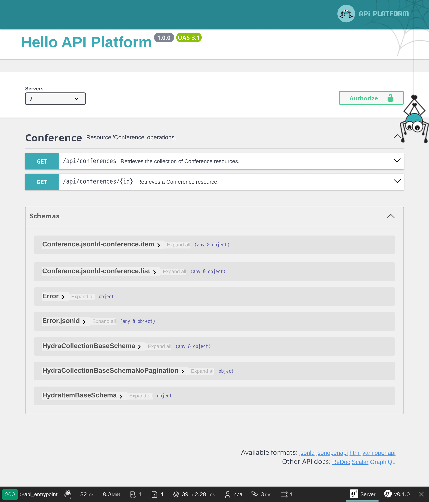

用 API Platform 暴露 API 接口
==================================

.. index::
    single: API
    single: HTTP API
    single: API Platform

我们已经完成了留言本网站的开发。为了让网站数据获得更大范围的使用，现在来让它暴露出一套 API 接口怎么样？API 可以用于在移动应用中展示所有会议和关于它们的评论，或许也可以让参会者提交评论。

在本步骤中，我们会实现一套只读 API。

安装 API Platform
-------------------

通过编写代码来暴露一套 API 是可行的，但如果我们想要利用标准，我们最好可以使用一个已为我们完成了大量繁重工作的方案。比如 API Platform 这个方案：

.. code-block:: terminal

    $ symfony composer req api

为会议暴露一个 API
-------------------------

.. index::
    single: Attributes;ApiResource
    single: Attributes;Groups

我们配置 API 所需要做的就是在 Conference 类里添加一些属性：

.. code-block:: diff
    :caption: patch_file

    --- i/src/Entity/Conference.php
    +++ w/src/Entity/Conference.php
    @@ -2,29 +2,45 @@

     namespace App\Entity;

    +use ApiPlatform\Metadata\ApiResource;
    +use ApiPlatform\Metadata\Get;
    +use ApiPlatform\Metadata\GetCollection;
     use App\Repository\ConferenceRepository;
     use Doctrine\Common\Collections\ArrayCollection;
     use Doctrine\Common\Collections\Collection;
     use Doctrine\ORM\Mapping as ORM;
     use Symfony\Bridge\Doctrine\Validator\Constraints\UniqueEntity;
    +use Symfony\Component\Serializer\Attribute\Groups;
     use Symfony\Component\String\Slugger\SluggerInterface;

     #[ORM\Entity(repositoryClass: ConferenceRepository::class)]
     #[UniqueEntity('slug')]
    +#[ApiResource(
    +    operations: [
    +        new Get(normalizationContext: ['groups' => 'conference:item']),
    +        new GetCollection(normalizationContext: ['groups' => 'conference:list'])
    +    ],
    +    order: ['year' => 'DESC', 'city' => 'ASC'],
    +    paginationEnabled: false,
    +)]
     class Conference
     {
         #[ORM\Id]
         #[ORM\GeneratedValue]
         #[ORM\Column]
    +    #[Groups(['conference:list', 'conference:item'])]
         private ?int $id = null;

         #[ORM\Column(length: 255)]
    +    #[Groups(['conference:list', 'conference:item'])]
         private ?string $city = null;

         #[ORM\Column(length: 4)]
    +    #[Groups(['conference:list', 'conference:item'])]
         private ?string $year = null;

         #[ORM\Column]
    +    #[Groups(['conference:list', 'conference:item'])]
         private ?bool $isInternational = null;

         /**
    @@ -34,6 +50,7 @@ class Conference
         private Collection $comments;

         #[ORM\Column(length: 255, unique: true)]
    +    #[Groups(['conference:list', 'conference:item'])]
         private ?string $slug = null;

         public function __construct()

``ApiResource`` 属性为会议配置了 API。它把允许的操作限制为 ``get``，也配置了各种信息：比如展示哪些字段，以及如何为会议排序。

安装包的 recipe 会添加 ``config/routes/api_platform.yaml`` 文件，根据该文件中的配置，API 的默认主入口是 ``/api`` 路径。

有 web 界面可以让你与 API 进行交互：

用它来测试各种可能性：

.. figure:: screenshots/api-conferences.png
    :alt: /api
    :align: center
    :figclass: with-browser

想象一下从零开始开发所有这些所需要的时间吧！

为评论暴露一个 API
-------------------------

.. index::
    single: Attributes;ApiResource
    single: Attributes;ApiFilter
    single: Attributes;Groups

为评论做同样的修改：

.. code-block:: diff
    :caption: patch_file

    --- i/src/Entity/Comment.php
    +++ w/src/Entity/Comment.php
    @@ -2,41 +2,63 @@

     namespace App\Entity;

    +use ApiPlatform\Doctrine\Orm\Filter\SearchFilter;
    +use ApiPlatform\Metadata\ApiFilter;
    +use ApiPlatform\Metadata\ApiResource;
    +use ApiPlatform\Metadata\Get;
    +use ApiPlatform\Metadata\GetCollection;
     use App\Repository\CommentRepository;
     use Doctrine\DBAL\Types\Types;
     use Doctrine\ORM\Mapping as ORM;
    +use Symfony\Component\Serializer\Attribute\Groups;
     use Symfony\Component\Validator\Constraints as Assert;

     #[ORM\Entity(repositoryClass: CommentRepository::class)]
     #[ORM\HasLifecycleCallbacks]
    +#[ApiResource(
    +    operations: [
    +        new Get(normalizationContext: ['groups' => 'comment:item']),
    +        new GetCollection(normalizationContext: ['groups' => 'comment:list'])
    +    ],
    +    order: ['createdAt' => 'DESC'],
    +    paginationEnabled: false,
    +)]
    +#[ApiFilter(SearchFilter::class, properties: ['conference' => 'exact'])]
     class Comment
     {
         #[ORM\Id]
         #[ORM\GeneratedValue]
         #[ORM\Column]
    +    #[Groups(['comment:list', 'comment:item'])]
         private ?int $id = null;

         #[ORM\Column(length: 255)]
         #[Assert\NotBlank]
    +    #[Groups(['comment:list', 'comment:item'])]
         private ?string $author = null;

         #[ORM\Column(type: Types::TEXT)]
         #[Assert\NotBlank]
    +    #[Groups(['comment:list', 'comment:item'])]
         private ?string $text = null;

         #[ORM\Column(length: 255)]
         #[Assert\NotBlank]
         #[Assert\Email]
    +    #[Groups(['comment:list', 'comment:item'])]
         private ?string $email = null;

         #[ORM\Column]
    +    #[Groups(['comment:list', 'comment:item'])]
         private ?\DateTimeImmutable $createdAt = null;

         #[ORM\ManyToOne(inversedBy: 'comments')]
         #[ORM\JoinColumn(nullable: false)]
    +    #[Groups(['comment:list', 'comment:item'])]
         private ?Conference $conference = null;

         #[ORM\Column(length: 255, nullable: true)]
    +    #[Groups(['comment:list', 'comment:item'])]
         private ?string $photoFilename = null;

         #[ORM\Column(length: 255, options: ['default' => 'submitted'])]

用类似的属性来配置评论类。

限制 API 暴露的评论
--------------------------

默认情况下，API Platform 会暴露数据库里的所有记录。但对于评论，只有发布的那些才应该被 API 暴露。

当你需要限制 API 返回的记录时，创建一个实现了 ``QueryCollectionExtensionInterface`` 接口的服务来控制 Doctrine 查询，这个查询会用于集合和 ``QueryItemExtensionInterface`` 接口中，以此来控制其中的元素：

.. code-block:: php
    :caption: src/Api/FilterPublishedCommentQueryExtension.php
    :emphasize-lines: 14-16,21-23

    namespace App\Api;

    use ApiPlatform\Doctrine\Orm\Extension\QueryCollectionExtensionInterface;
    use ApiPlatform\Doctrine\Orm\Extension\QueryItemExtensionInterface;
    use ApiPlatform\Doctrine\Orm\Util\QueryNameGeneratorInterface;
    use ApiPlatform\Metadata\Operation;
    use App\Entity\Comment;
    use Doctrine\ORM\QueryBuilder;

    class FilterPublishedCommentQueryExtension implements QueryCollectionExtensionInterface, QueryItemExtensionInterface
    {
        public function applyToCollection(QueryBuilder $queryBuilder, QueryNameGeneratorInterface $queryNameGenerator, string $resourceClass, Operation $operation = null, array $context = []): void
        {
            if (Comment::class === $resourceClass) {
                $queryBuilder->andWhere(sprintf("%s.state = 'published'", $queryBuilder->getRootAliases()[0]));
            }
        }

        public function applyToItem(QueryBuilder $queryBuilder, QueryNameGeneratorInterface $queryNameGenerator, string $resourceClass, array $identifiers, Operation $operation = null, array $context = []): void
        {
            if (Comment::class === $resourceClass) {
                $queryBuilder->andWhere(sprintf("%s.state = 'published'", $queryBuilder->getRootAliases()[0]));
            }
        }
    }

这个请求扩展类只针对 ``Comment`` 资源才会应用它的逻辑，它会修改 Doctrine 的请求构建器，让它只查询处于 ``published`` 状态的评论。

配置 CORS
-----------

.. index::
    single: CORS
    single: Cross-Origin Resource Sharing

默认情况下，现代 HTTP 客户端的同源安全策略会禁止调用另一个域名的 API。在执行 ``composer req api`` 时一起安装了 CORS bundle，它会根据 ``CORS_ALLOW_ORIGIN`` 环境变量发送跨域资源共享的 HTTP 头。

默认情况下，它的值定义在 ``.env`` 文件，它允许来自 ``localhost`` 和 ``127.0.0.1`` 任意端口的 HTTP 请求。当某个托管在其它域名上的应用（比如手机应用或外部前端）需要调用这个 API 时，请相应地调整它。

.. sidebar:: 深入学习

    * `SymfonyCasts 里的 API Platform 教程`_；

    * 运行 ``composer require webonyx/graphql-php`` 来启用 GraphQL 支持，然后浏览 ``/api/graphql`` 路径。

.. _`SymfonyCasts 里的 API Platform 教程`: https://symfonycasts.com/screencast/api-platform
